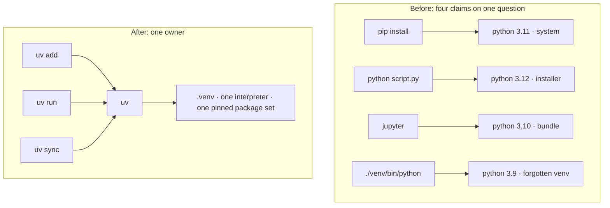

# 1.1 — The four Pythons: why an environment needs exactly one owner

## One-line answer

A machine will happily hold several Pythons and several copies of the same library, and every tool
that installs something picks one of them by a different rule — so unless **one tool owns the
environment**, "it works on my machine" stops being a joke and becomes a description of a bug you
cannot reproduce.

---

## The story

Someone spends an afternoon getting a piece of numerical code running. It finally works. They are
pleased.

The next morning they open a terminal, run the same command, and it fails: the library is not
installed. They install it. It says it is already installed. They install it again, watch it succeed,
run the command again, and it fails again — the library is not installed.

What is actually happening is that there are four Pythons on the machine. One arrived with the
operating system. One arrived from the official installer, eighteen months ago. One is inside a
folder called `venv` in the project, made and forgotten. One arrived with a data-science bundle and
quietly put itself first on the list of places the machine looks for programs.

The install command is talking to the fourth one. The run command is talking to the second one.
Both are behaving perfectly correctly. Neither is doing what the person wanted, and nothing anywhere
prints a warning, because from each tool's point of view nothing has gone wrong.

The afternoon is not lost to a hard problem. It is lost to an **ownership** problem: four things had
a claim on the same question, and nobody had decided which one answered it.

---

## The idea in plain language

Three words are doing a lot of work here, so let us define them before anything else uses them.

An **interpreter** is the program that runs your code — the actual `python.exe` file. A machine can
hold many, of different versions, in different folders, and they know nothing about each other.

A **package** is a library someone else wrote that you install and import — `numpy`, `torch`.
Packages are installed *into a particular interpreter*, not into "the computer". Installing `numpy`
tells you nothing about whether `numpy` is available to the interpreter you are about to run.

An **environment** is one interpreter plus the exact set of packages installed for it. Two
environments on the same machine are as independent as two different computers.

The failure in the story has a shape worth naming, because you will meet it in other costumes for
the rest of this curriculum: **two tools disagreed, and neither had a way to notice.** The install
tool and the run tool each resolved "which Python?" correctly by their own rule, and their rules
differed. There was no error because no single component was wrong.

The fix is not cleverness. It is **ownership**: pick one tool, give it authority over which
interpreter runs and which packages exist, and route every command through it. Not because that tool
is magic, but because a question with one owner cannot be answered two ways.

That is the whole of this section. One tool. Every command goes through it.

---

## Why Akshara needs it

This matters more here than in ordinary software, for a reason specific to what you are about to
build.

Ordinary software with the wrong library version **crashes**. You see a stack trace, you fix it, you
move on. Numerical code with the wrong library version often **runs** — and produces a slightly
different number. A changed default in an optimizer, a changed rounding mode, a changed
normalization step: the model still trains, the loss still goes down, and you have quietly run a
different experiment than the one you think you ran.

Three concrete places this arrives:

- **Day 60** you will overfit a single batch on purpose and demand the loss reach approximately zero.
  That check is only meaningful if the run is reproducible. Reproducible means: same interpreter,
  same package versions, same seed.
- **Day 67** you will pretrain the model in one free notebook session, on a machine that is *not*
  this laptop. Whether that run means anything depends on whether the environment there can be
  reconstructed from what is in this repo.
- **Every training run** gets a row in `docs/RUNS.md` recording the pinned set it ran under
  (Principle 9). A row that cannot identify its environment describes an anecdote, not a result.

The tool this day installs is what makes that row true rather than decorative.

---

## The mechanism

You do not need to fix the four Pythons. You need to stop asking them.

The rule for the rest of this curriculum is one line long:

> **Every Python command in every day document begins with `uv run`.**

Not `python train.py`. Not `pip install torch`. `uv run python train.py` and `uv add torch==<pinned>`.

Here is what that changes, mechanically. First, look at what a machine with an ownership problem
actually reports — run this now, before installing anything:

```bash
# How many Pythons does this machine currently think it has?
where python 2>/dev/null || which -a python python3 2>/dev/null
```

**Line by line:**
- `where python` is the Windows command that lists **every** match on the search path, not just the
  first one. This is the point: `python --version` shows you the winner, `where` shows you the
  election.
- `which -a python python3` is the same question on a POSIX shell. `-a` is what makes it list all
  matches instead of stopping at the first.
- `2>/dev/null` discards the error message when the command does not exist on this platform, so the
  `||` can fall through to the other one. You want the answer, not a complaint about the tool.
- If more than one line comes back, you have the story's problem right now. **That is normal and it
  is not something you need to clean up** — you are about to stop depending on it.

The mental model, drawn:



Nothing about the machine changed between those two pictures. What changed is that every arrow now
passes through one box before it reaches an interpreter, so there is exactly one answer to "which
Python?" and it is written down in a file you can commit.

---

## When it breaks

The loud failure, which is the pleasant one:

```console
$ python -c "import numpy"
Traceback (most recent call last):
  File "<string>", line 1, in <module>
ModuleNotFoundError: No module named 'numpy'
```

You installed it. It is genuinely not there — **for this interpreter**. `ModuleNotFoundError` almost
never means "the package is missing from your computer". It means "the package is missing from the
environment this command resolved to". The fix is not to install it again; installing it again is
what turns twenty minutes into an afternoon. The fix is to ask *which* interpreter answered:

```bash
uv run python -c "import sys; print(sys.executable)"
```

**Line by line:**
- `sys.executable` is the absolute path of the interpreter currently running. It is the only
  answer to "which Python is this?" that cannot be wrong, because the running process is reporting
  on itself rather than a tool reporting on its own search rules.
- `uv run` in front is the whole point of the day: it guarantees the interpreter being reported is
  the one your next command will also use.

**And now the silent failure, which is the one that costs you a week.** Nothing errors. Two machines
— or the same machine on two days — resolve to interpreters with different package versions, both
run your training script successfully, and produce different models. No traceback, no warning, no
red anywhere. You compare "before" and "after" and attribute a difference to your change that was
actually caused by the environment.

That is **Silent Failure #4** from the plan's §6: *noise mistaken for improvement*. It is the
failure this whole day exists to make impossible, and the detection is not clever — it is that the
environment is pinned in a committed file, so "same environment" is a checkable claim instead of an
assumption.

---

## In production

**What a research engineer does instead of the teaching version.** They do not fix the environment;
they make it disposable. The environment is described in a file, rebuilt from scratch on demand, and
never repaired in place. When something is wrong with it the response is to delete it and re-sync,
which takes seconds, rather than to debug it, which takes an afternoon. `.venv` is treated the way
you treat a build directory: an output, not an asset.

**What degrades at scale.** On one laptop, an ownership problem costs you an afternoon. In a team it
costs you the ability to compare results at all: two engineers report different numbers for the same
config and there is no way to tell whether the difference is the change or the environment. On a
free notebook GPU (Day 67) it is worse, because that machine is **rebuilt from nothing every
session** — an environment that only exists as history in your shell is an environment that does not
exist. This is why the pinned file has to be committed, not just present.

**The review comment.** *"This says `pip install transformers` — is that the same interpreter `uv
run` uses? And what version did you actually get?"* Both halves of that question are the same
question, and a document that cannot answer it has not specified an experiment.

**The interview question.** *"You get a bug report saying your training script crashes on a
colleague's machine but works on yours. What do you ask for first?"* The answer that shows
experience is not "the stack trace" — it is `sys.executable` and the resolved package versions,
because the overwhelmingly likely cause is that their command resolved to a different environment
than yours. The answer that shows more experience is the follow-up: *"and I'd worry more about the
case where it doesn't crash."*

**Compute tier: T0.** Everything on this page runs on a laptop CPU with no GPU and no network beyond
one download. There is no T1 version of this idea, and nothing here is deferred to bigger hardware.

---

## Check yourself

Run this now. It prints a **number** — how many Pythons currently claim the name:

```bash
{ where python 2>/dev/null || which -a python python3 2>/dev/null; } | wc -l
```

**Line by line:**
- `{ ...; }` groups the two alternatives so the pipe applies to whichever one produced output,
  rather than only to the second.
- `wc -l` counts the lines, turning "a list of paths" into the number this part is about. Write the
  number down; you will compare against it in part 1.2 after `uv` takes ownership.
- A `0` is a valid and interesting answer: it means nothing on your search path is called `python`
  at all, which is *safer* than four and is exactly the state `uv` is happy with.

**Say this out loud, without scrolling up:** why does `ModuleNotFoundError` almost never mean the
package is missing from the computer — and why is the *silent* version of this problem worse than
the traceback?
