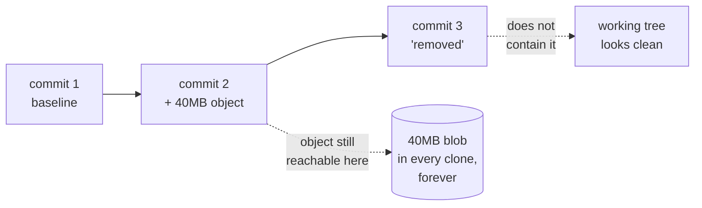

# 3.2 — 💥 The checkpoint that cannot be removed: commit one on purpose, then try

## One-line answer

Deleting a large file from a git repository does not make the repository smaller — the object stays
in history, in every clone, forever — and the only way to learn that at a survivable cost is to do it
deliberately today, on a repository with nothing in it.

---

## The story

🎬 **The scene.** A training run finally works. It took the whole evening and most of the free GPU
session, and there is a file on disk that is the result: the thing that did not exist this morning.
Everything gets committed and pushed, because that is what you do with work you do not want to lose.

😬 **The naive fix.** Someone points out the next morning that the checkpoint should not be in the
repository. Fine — `git rm`, commit, push. The file disappears from the listing. The problem looks
solved, and by every visible signal it is: the file is gone, `git status` is clean, the folder no
longer shows it.

💥 **Why it fails.** Git does not store the current state of your files. It stores every state they
have ever been in, as immutable objects addressed by their contents. Committing the checkpoint added
a 400 MB object to the object database. Deleting the file added a *new commit that does not mention
it* — and changed nothing about the object, which is still there, still reachable from the earlier
commit, still transferred in full to anyone who clones. The repository will be 400 MB larger than its
contents for the rest of its life. Six months later a new colleague waits four minutes for a clone of
a project containing eleven megabytes of text.

💡 **The insight.** The `git rm` gesture is *correct for source code and useless for artifacts*,
because for source code you only ever care about the current state, and for artifacts you care about
the total. **In an append-only store, "delete" is a word that means "stop showing".** The only moment
that reliably controls repository size is the moment before the first commit — which is why
`.gitignore` was written in part [3.1](3.1-ignore-before-it-exists.md) on an empty repository, and
why this failure is scheduled for Day 0 rather than encountered on Day 67.

---

## The idea in plain language

Three git concepts, defined before they are used.

An **object** is an immutable blob of content stored under a hash of itself. Every version of every
file you have ever committed is one. Nothing overwrites an object; new content makes a new object.

**History** is the chain of commits, each pointing at a tree of objects. Cloning copies **all
reachable objects**, not just the current ones — this is why clones are complete and offline-capable,
and it is exactly why deletion does not shrink anything.

**Rewriting history** is producing a *different* chain of commits that omits something. It is the
only real removal. It changes every commit hash from the rewrite point onward, which means anybody
who already has a copy now has a divergent history that will not merge — and every open branch, tag
and pull request is built on commits that no longer exist.

So the honest summary is: a committed artifact is **permanent by default**, and removable only at a
cost paid by everyone who has the repository. That asymmetry is the whole reason Principle 9 is a
principle rather than a preference.

---

## Why Akshara needs it

Because the temptation arrives on a specific, predictable day, in its strongest possible form.

**Day 67** is the pretraining run. It consumes a free notebook session that can be revoked, it is the
culmination of eight days of data work, and it produces a checkpoint. The natural instinct — *this
was expensive, put it somewhere safe* — is exactly wrong here, and it arrives at the end of a long
session when judgement is at its worst.

The same instinct recurs on **Day 80** (the 4-bit `.gguf`), **Day 89** (the LoRA adapter — small
enough that it feels harmless, and adapters accumulate), and **Day 134** (the diffusion checkpoint).

The plan's answer is not vigilance. It is three mechanisms, in increasing order of reliability:

1. `.gitignore`, written first — part [3.1](3.1-ignore-before-it-exists.md).
2. `./m done` refusing to commit when an artifact is staged — part
   [4.3](../04-the-driver/4.3-the-gate-that-refuses.md).
3. Artifacts written **outside the repository tree** entirely, via `AKSHARA_CHECKPOINT_DIR`.

This part supplies the motivation those three mechanisms need in order to feel worth their cost.
Nobody follows a rule whose failure they have not seen.

---

## The mechanism

Do it on purpose. This is safe **only** because the repository has no history worth keeping yet, and
that is precisely why it is Day 0's job.

```bash
git init -q 2>/dev/null; git add -A; git commit -qm "day 0: baseline" 2>/dev/null
git count-objects -vH | grep size-pack
```

**Line by line:**
- `git init -q` is harmless if the repository already exists. The `;` rather than `&&` lets the chain
  continue either way.
- The commit gives you a **baseline** to compare against. Without a before-number, the after-number
  means nothing — a habit worth forming now, since every measurement in this curriculum works this
  way.
- `git count-objects -vH` reports the object database size; `-H` prints human-readable units.
  `size-pack` is the number that matters. Write it down.

Now manufacture the mistake:

```bash
mkdir -p checkpoints
uv run python -c "open('checkpoints/model.safetensors','wb').write(b'\0'*40_000_000)"
git add -f checkpoints/model.safetensors
git commit -qm "the mistake"
git count-objects -vH | grep size-pack
```

**Line by line:**
- 40 MB of zero bytes stands in for a real checkpoint. Zeros compress extremely well, so this
  **understates** the damage a real checkpoint does — a real one is high-entropy and compresses badly.
  Understating is the right direction for a demonstration you want people to believe.
- `git add -f` is the whole point: `-f` **forces** past `.gitignore`. This is not exotic — it is one
  character, and it is what people type when git refuses and they are in a hurry. Your protection
  from part 3.1 is one flag deep.
- The second `size-pack` reading is the damage. Compare it against your baseline.

Now try to undo it the way everyone tries first:

```bash
git rm --cached -q checkpoints/model.safetensors
git commit -qm "remove the checkpoint"
git count-objects -vH | grep size-pack
git log --oneline
```

**Line by line:**
- `git rm --cached` untracks the file while leaving it on disk. This is the correct command for the
  job people think they are doing, and it works: the file is no longer tracked.
- The third `size-pack` reading is the lesson. **It has not gone down.** It may have gone slightly
  *up*, because you added another commit.
- `git log --oneline` shows three commits. The middle one still contains the object, and always will.

The shape of it, drawn:



Now reset, because you do not want this in your real history:

```bash
git reset --hard -q HEAD~2
rm -rf checkpoints
git count-objects -vH | grep size-pack
git gc --prune=now -q
git count-objects -vH | grep size-pack
```

**Line by line:**
- `git reset --hard HEAD~2` moves the branch back two commits, making the mistake **unreachable**.
  This is safe here only because those two commits are the ones you just made on purpose. On a real
  repository `--hard` discards work.
- The first reading after the reset is the second half of the lesson: **still large.** Unreachable is
  not the same as gone — the object is still in the database, just no longer pointed at.
- `git gc --prune=now` is what actually collects unreachable objects. Only now does the size drop.
- And this only worked because nothing was pushed and nobody had a copy. Once a commit is shared,
  `reset` is not available and the equivalent operation rewrites everyone's history.

---

## When it breaks

The loud failure — what a hosting provider says when the file is large enough:

```console
$ git push
remote: error: File checkpoints/model.safetensors is 412.83 MB; this exceeds the file size limit of 100.00 MB
remote: error: GH006: Protected branch update failed
error: failed to push some refs
```

This is the **good** outcome. The push is refused, nothing is shared, and `reset` plus `gc` is still
available. A hard limit that stops you is worth more than a soft warning that does not.

The bad outcome is a file just under the limit. It goes through, it is now in everyone's clone, and
there is no error at any point.

**The silent version — and it is the one that gets you.** The repository grows a little at a time.
Each individual commit is unremarkable: a 30 MB adapter here, a small `.npy` shard there, a
notebook with an embedded image. Nothing exceeds any limit, nothing warns, and every commit is
defensible on its own. Six months later the clone takes minutes and no single commit is to blame.

Detect it by measuring the trend rather than any one commit:

```bash
git count-objects -vH | grep size-pack
git rev-list --objects --all \
  | git cat-file --batch-check='%(objecttype) %(objectname) %(objectsize) %(rest)' \
  | awk '$1=="blob" && $3>1000000 {printf "%.1f MB  %s\n", $3/1048576, $4}' \
  | sort -rn | head -5
```

**Line by line:**
- `git rev-list --objects --all` lists every object in **all** history, not just the current tree —
  which is the only view that can see the problem.
- `git cat-file --batch-check` turns each into `type hash size path`.
- The `awk` keeps blobs over 1 MB and formats them in megabytes; `sort -rn | head -5` shows the five
  largest things your repository has *ever* contained.
- **Run this on any repository you inherit.** It answers "why is this clone so slow?" in one command,
  and the answer is almost always a file somebody deleted long ago and believed was gone.

---

## In production

**What a research engineer does instead of the teaching version.** They make the mistake structurally
impossible rather than merely forbidden. Checkpoints are written to a path outside the repository —
`AKSHARA_CHECKPOINT_DIR`, defaulting somewhere else entirely — so `git add -A` cannot reach them even
with `-f`. What lives in git is the **pointer**: the `docs/RUNS.md` row naming the config, the seed,
the hardware and where the checkpoint went. That row is a few hundred bytes and reproduces the
checkpoint; the checkpoint is 400 MB and reproduces nothing.

**What degrades at scale.** Two things, both about people. Git LFS is the usual answer and it moves
the problem rather than removing it — the objects live elsewhere, the quota is finite and metered,
and this project's §4 forbids depending on a paid quota. The second is coordination: rewriting shared
history requires every person with a clone to act, and on a team of five that is an afternoon and an
apology. The cost of removal scales with the number of copies, which is the number that grows fastest
as a project succeeds.

**The failure that only shows with real traffic.** CI. Every pipeline run clones the repository. A
history bloated by one long-deleted checkpoint adds that download to every job forever, and it shows
up as "CI got slow" — a symptom nobody traces back to a commit from four months ago.

**The review comment.** *"This is under the size limit, but does it belong in history at all?"* The
limit is not the rule; the rule is whether the file is an output. An output belongs wherever outputs
go, and that is never here.

**The interview question.** *"Someone committed a 2GB dataset three months ago and deleted it last
week. What do you tell them?"* The answer that shows experience: it is still there, in every clone,
and the fix is a history rewrite that invalidates every open branch and every existing clone — so the
question is whether the cost of that rewrite is worth paying versus living with it, and that decision
depends on how many people have copies. What is being probed is whether you know that "deleted" and
"gone" are different words in a content-addressed store.

**Compute tier: T0.** Laptop CPU, no network, no GPU. A 40 MB file of zeros is enough to demonstrate
a property that holds at any size — and doing it at 40 MB rather than 400 MB is the point of a
deliberate failure: the mechanism is identical and the cleanup is cheap.

---

## Check yourself

Run this. It prints the **number of megabytes** your object database holds and the largest blob ever
committed — both of which should be tiny on a Day 0 repository:

```bash
git count-objects -vH | grep size-pack
git rev-list --objects --all \
  | git cat-file --batch-check='%(objecttype) %(objectname) %(objectsize) %(rest)' \
  | awk '$1=="blob" {print $3}' | sort -rn | head -1
```

**Line by line:**
- The first number is the whole repository's object store. Note it now: it is the baseline you will
  compare against on Day 67, and a baseline recorded before it matters is worth more than one
  reconstructed after.
- The second is the largest single blob in all of history, in bytes. On a repository containing only
  text it should be well under a megabyte.
- If either number surprises you after the reset in *The mechanism*, run `git gc --prune=now` and
  read them again — unreachable is not gone until it is collected.

**Say this out loud, without scrolling up:** why does `git rm` not shrink a repository — and name the
three mechanisms this project uses to stop a checkpoint being committed, in order of how much they
rely on you remembering anything.
