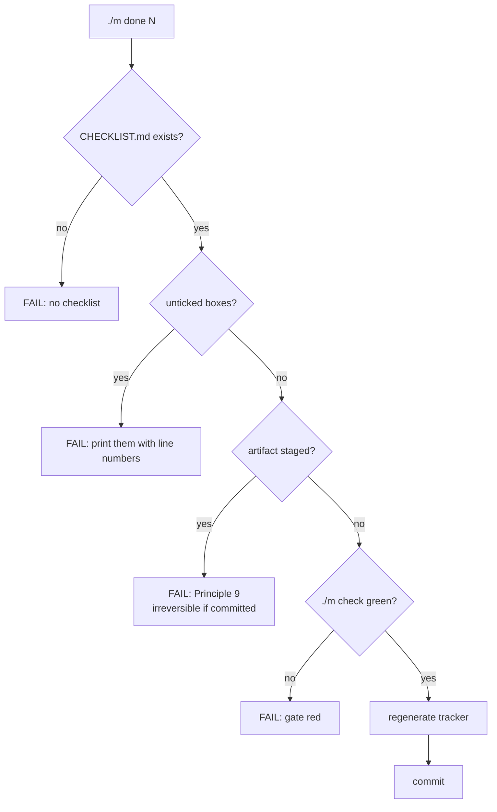

# 4.3 — `./m done`: the gate that refuses, and why refusal is the whole point

## One-line answer

`./m done N` will not commit a day while its checklist has an unticked box, an artifact is staged, or
the project gate is red — because a rule that depends on somebody remembering it at the end of a long
evening is not a rule, it is a hope.

---

## The story

🎬 **The scene.** It is late. The thing works. The last part of the day has been read, the code has
been typed, and there is a real result on screen — the first one. Everything gets committed, because
that is what you do when work finally comes together.

😬 **The naive fix.** There is a checklist for the day. It has fifteen boxes. Eleven are ticked. The
other four are the ones about verifying — running the check that goes red, confirming a number,
reading back an explanation out loud. Those get skipped, not out of laziness but because the *work*
is finished and the boxes feel like paperwork about work that is finished.

💥 **Why it fails.** The four skipped boxes were not paperwork. They were the only evidence that the
eleven were true. Weeks later something behaves oddly and the investigation walks backwards through
the days, looking for where the assumption entered — and every day looks complete, because every day
was committed. The commit history says a hundred and sixty-two days were done properly. It is
evidence of nothing, because the thing that produced it never checked.

💡 **The insight.** The problem is not discipline; the person in this story is working hard and doing
well. The problem is that **the moment of least judgement is the moment of highest authority** — at
the end, tired, with something that works, you are exactly the person deciding what enters history.
A gate is how you delegate that decision to a version of yourself that was thinking clearly, which
was this morning, when you wrote the checklist.

---

## The idea in plain language

A **gate** is a check that runs before an irreversible action and can stop it.

The two properties that make it a gate rather than a reminder:

- **It runs automatically**, as part of the action, not as a separate step somebody chooses.
- **It can say no** — and when it says no, the action does not happen.

A reminder that prints a warning and proceeds is not a gate. It is a log line, and log lines are read
by nobody at eleven at night.

What `./m done N` refuses on, in order of how expensive the mistake is to undo:

| Refusal | Why it is checked here | Reversible? |
| --- | --- | --- |
| An artifact is staged | A committed checkpoint is permanent (part [3.2](../03-gitignore-first/3.2-the-checkpoint-that-cannot-be-removed.md)) | **No** — history rewrite |
| The checklist has unticked boxes | The day is not actually finished | Yes, but the false record is not |
| `./m check` is red | Lint, tests, depth contract or traceability is broken | Yes |

The ordering is the design. The **irreversible** check runs first, before anything else has a chance
to succeed and create momentum.

And one thing a gate explicitly cannot do, which the file says out loud: it cannot tell whether you
were honest. It can confirm that a box has an `x` in it. Whether you actually ran the command and
answered the question out loud is yours. The gate's job is not to make cheating impossible — it is to
make the default path the correct one, so that skipping a step requires a decision instead of an
omission.

---

## Why Akshara needs it

- **Principle 9** — weights and data never enter git. The `.gitignore` from part
  [3.1](../03-gitignore-first/3.1-ignore-before-it-exists.md) is one `git add -f` deep, and the
  temptation peaks on **Day 67** at the end of a metered GPU session. This is the backstop.
- **Principle 11** — every day ends with at least one check that can go red. A day committed with a
  red check has broken the only guarantee the curriculum makes about itself.
- **Plan §26** — a phase gate is green only when every day in it has a `PROGRESS.md` row with green
  gates. Those rows are written by the day's own hub §11 and pasted before `./m done` will commit,
  which is what keeps the ledger and the history describing the same events.
- **A hundred and sixty-two repetitions.** Any manual step in a ritual repeated that many times will
  be skipped on the days when it matters most — which are, reliably, the hard ones.

---

## The mechanism

The whole command, in the order its checks run:

```bash
done)
  [ -z "$DAY" ] && { echo "usage: ./m done <day>"; exit 1; }
  D="$(daydir "$DAY")"
  [ -n "$D" ] || { echo "no day folder for $DAY"; exit 1; }
  C="$D/CHECKLIST.md"
  [ -f "$C" ] || { echo "FAIL no $C"; exit 1; }

  if grep -q '^- \[ \]' "$C"; then
    echo "FAIL unticked boxes remain in $C"; grep -n '^- \[ \]' "$C"; exit 1
  fi

  if git diff --cached --name-only 2>/dev/null | grep -Eq '\.(safetensors|gguf|bin|pt|pth|ckpt|npy)$|^data/|^checkpoints/'; then
    echo "FAIL a weight/dataset file is staged - Principle 9"
    git diff --cached --name-only | grep -E '\.(safetensors|gguf|bin|pt|pth|ckpt|npy)$|^data/|^checkpoints/'
    exit 1
  fi

  "$0" check
  uv run python scripts/tracker.py
  git add -A && git commit -m "day-$(pad "$DAY"): complete"
  echo "OK day $DAY committed"
  ;;
```

**Line by line:**
- `[ -f "$C" ] || { echo "FAIL no $C"; exit 1; }` — a **missing** checklist fails rather than passing
  vacuously. This matters more than it looks: the naive implementation greps a file that does not
  exist, finds no unticked boxes, and concludes everything is ticked. Absence must never read as
  success.
- `grep -q '^- \[ \]'` looks for the literal markdown unchecked box at the start of a line. `-q` is
  quiet — it sets the exit code without printing, so the `if` can branch before you decide what to
  show.
- The anchor `^` matters: without it, a line *describing* a checkbox inside a code sample would count
  as an unticked box, and the gate would refuse forever for reasons nobody could find.
- `grep -n '^- \[ \]' "$C"` on the failure path prints the offending lines **with line numbers**. A
  gate that refuses without saying what to fix is a gate people work around.
- `git diff --cached --name-only` lists **staged** files — the ones about to be committed. Checking
  staged rather than modified is the point: this is the last moment before the irreversible step.
- The extension list mirrors `.gitignore`, and the check exists **because `git add -f` bypasses
  `.gitignore`**. Belt and braces, deliberately, since one of the two is one character deep and the
  other is the last line of defence.
- `^data/|^checkpoints/` catches whole directories, which is what a `git add -A` after a training run
  actually stages.
- `"$0" check` re-invokes this same script's gate. Using `$0` rather than repeating the commands
  means there is exactly one definition of "the checks pass" (part
  [4.1](4.1-why-a-driver.md)) — and `set -e` means a red gate stops the script before the commit.
- `tracker.py` regenerates `docs/TRACKER.md` **before** the commit, so the generated ledger and the
  history agree. Regenerating after would leave the repository dirty immediately after a "complete"
  commit.
- `git add -A && git commit` is last. Everything above it is a reason not to reach this line.

The order, drawn — note that the irreversible check is first:



---

## When it breaks

The refusal you will see most often, and it is the gate working:

```console
$ ./m done 0
FAIL unticked boxes remain in days/day-000-toolchain-skeleton-driver/CHECKLIST.md
34:- [ ] Ran `git check-ignore -v` and saw the rule and line number that matched
41:- [ ] Broke the gate on purpose and watched it refuse
```

Two boxes, both about verifying rather than building. That is not a coincidence — verification is
what gets dropped, which is why it is what the gate checks.

The refusal that will save you at least once:

```console
$ ./m done 67
FAIL a weight/dataset file is staged - Principle 9
checkpoints/akshara-base-step12000.safetensors
```

This is the whole day's purpose, arriving on Day 67 at the end of a GPU session, at exactly the
moment when part [3.2](../03-gitignore-first/3.2-the-checkpoint-that-cannot-be-removed.md)'s lesson
is furthest from mind.

**The silent version — and this one is subtle enough to be worth building deliberately in part
[6.1](../06-the-failure-lab/6.1-four-ways-to-break-the-gate.md).** Suppose the staged-file check is
written without `set -euo pipefail` in force, or as a pipeline whose exit code comes from the wrong
stage:

```console
$ ./m done 67
OK day 67 committed
```

No failure printed, because the `grep` in the middle of a pipeline returned non-zero and, without
`pipefail`, the pipeline's status came from the last command instead. The checkpoint is committed. The
message says the opposite of what happened, and there is nothing red anywhere.

Detect it the only way that works — by **testing the gate itself** rather than trusting it:

```bash
mkdir -p checkpoints && uv run python -c "open('checkpoints/x.pt','wb').write(b'0'*1024)"
git add -f checkpoints/x.pt
./m done 0; echo "exit=$?"
git reset -q HEAD checkpoints/x.pt && rm -rf checkpoints
```

**Line by line:**
- Stage an artifact on purpose, with `-f` to get past `.gitignore` — reproducing the real mistake
  rather than a polite imitation of it.
- `./m done 0` must print `FAIL` and `exit=1`. **An `exit=0` here means your gate is decorative**,
  and you have found that out on Day 0 with a file of zeros rather than on Day 67 with a checkpoint.
- The last line unstages and removes the bait. Run this whenever you change the gate — a guard that
  is never tested is a guard whose failure you will discover from its absence.

---

## In production

**What a research engineer does instead of the teaching version.** The same checks move to a
pre-commit hook and to CI, so they apply regardless of which command somebody typed. `./m done` is
the local, friendly version; a server-side hook is the version that does not care how tired anyone
is. The principle underneath is the one worth carrying: **put the check where the irreversible action
happens, not where the polite path is.** A rule enforced only on the polite path is enforced only on
the days it was not needed.

**What degrades at scale.** Gates get bypassed. `--no-verify` exists, `git commit` directly exists,
and once bypassing becomes routine the gate is decoration. Two things keep that from happening: the
gate has to be **fast**, and its refusals have to be **specific**. A gate that takes minutes or says
only `FAIL` teaches people to route around it. Printing the offending line numbers is not a nicety —
it is what keeps the gate credible.

**The failure that only shows with real data.** The extension list is a denylist and denylists lag. A
new format arrives — a new quantization container, an index file — and it is not in the list. The
size-based backstop is the honest complement: refuse to commit any file over a few megabytes
regardless of extension, on the grounds that source files are not that large. Denylists catch what
you predicted; a size rule catches what you did not.

**The review comment.** *"What happens if I `git commit` directly instead of `./m done`?"* The honest
answer today is: nothing stops you. That is a real limitation of a driver-level gate, and the
mitigation is a hook. Naming the limitation is better than pretending the gate is airtight.

**The interview question.** *"How do you stop somebody committing a secret or a large binary?"* The
weak answer is `.gitignore`. The strong answer distinguishes the layers — ignore rules, a pre-commit
check, a server-side hook, and writing artifacts outside the tree entirely — and observes that only
the last one is not bypassable by a person in a hurry.

**Compute tier: T0.** Laptop CPU. The gate must stay fast enough to run before every commit, which is
why `./m check` excludes GPU tests and why the test suite is required to be offline.

---

## Check yourself

Run this. It prints the **exit code** of a gate that should refuse — the number that proves your
guard is real:

```bash
mkdir -p checkpoints && uv run python -c "open('checkpoints/probe.pt','wb').write(b'0'*1024)"
git add -f checkpoints/probe.pt
./m done 0 > /dev/null 2>&1; echo "refused with exit=$?"
git reset -q HEAD checkpoints/probe.pt; rm -rf checkpoints
```

**Line by line:**
- The output is discarded on purpose, so you are judging by the exit code alone — which is how every
  automated caller judges it.
- **`refused with exit=1` is the passing result.** A `0` means the artifact would have been committed,
  and the gate needs fixing before any real day is finished.
- The final line cleans up regardless, using `;` rather than `&&` so the reset running or not does not
  leave the probe file behind.

**Say this out loud, without scrolling up:** why is the staged-artifact check ordered *before* the
checklist and the project gate — and what is the one thing `./m done` fundamentally cannot verify
about your day?
