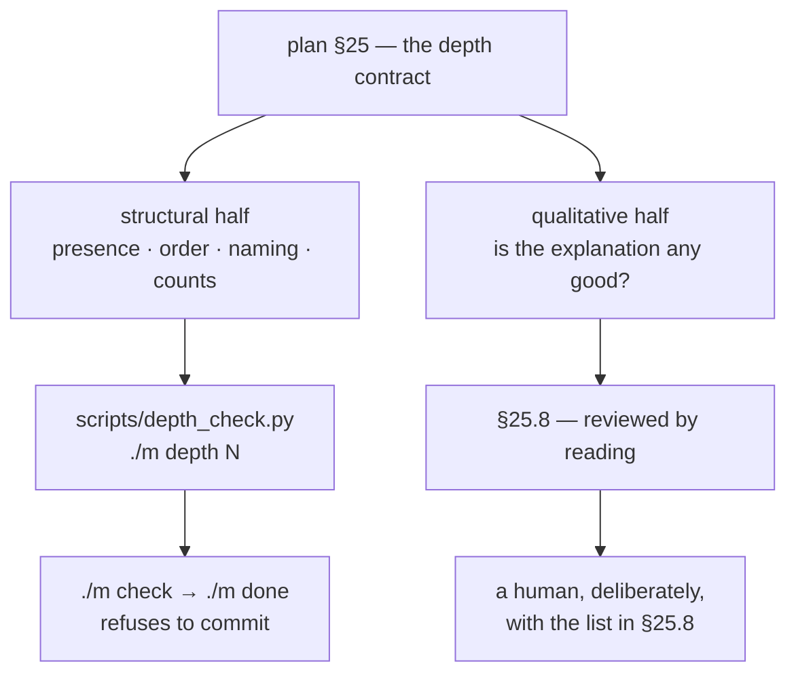

# 5.1 — A contract nobody checks is a preference

## One-line answer

The plan's §25 says what a day document must contain, and a rule stated in prose decays quietly under
deadline pressure — so the mechanically checkable half of it is a script that fails, which converts a
statement of intent into a statement of fact.

---

## The story

A team agrees on a standard for their documents. It is a good standard, written down carefully,
agreed by everyone. For a few weeks every document meets it.

Then a document is needed urgently. It meets most of the standard. One section is thin, because the
section was hard and the deadline was real. Nobody objects, because objecting would mean holding up
something needed, over a section that is *present* — just brief.

The next document has two thin sections, and now there is a precedent: the previous one was accepted.
A month later the standard describes documents that no longer exist. Nobody decided to abandon it. It
was never voted down. It simply lost, once, to a deadline, and every subsequent loss was justified by
the previous one.

The uncomfortable part is that no individual decision was wrong. Each one traded a small amount of
quality for a real, immediate need. **The standard was not defeated by disagreement — it was defeated
by a hundred reasonable exceptions**, and there was never a moment where refusing was obviously
correct.

---

## The idea in plain language

There is a difference between a rule and a **constraint**.

A rule is a sentence people agree to follow. Its enforcement is attention, and attention is exactly
the resource that is scarce when it matters.

A constraint is something that **stops you**. Its enforcement costs nothing, applies equally on good
days and bad ones, and cannot be talked out of it by an argument about deadlines.

Turning a rule into a constraint is not about distrust. It is about which version of you is making
the decision. A rule is enforced by the person at the end of a long day; a constraint is enforced by
the person who wrote it while thinking clearly. Delegating to the second one is not a loss of freedom
— it is the point of writing things down at all.

Applied to documents, this splits any standard into two halves, and being honest about the split is
what makes it work:

| Half | Example from plan §25 | Enforced by |
| --- | --- | --- |
| **Structural** — presence, order, naming, counts | every part has an `In production` section; sections appear in contract order; a part with tensors has a `Shapes` table | **a script** |
| **Qualitative** — is the explanation any good? | does the story actually hook the definition; is the production section real or decorative | **reading** |

The mistake in both directions is instructive. Trying to script the qualitative half produces a
document that games a word count. Leaving the structural half to reading produces the story above —
because "this section is missing" is exactly the kind of thing a reader under time pressure does not
notice, and a script notices for free.

---

## Why Akshara needs it

The plan's §25 is unusually demanding. Every part carries eleven sections; two are conditional; every
code block needs a walkthrough; every tensor needs a shape table; no time estimate may appear
anywhere; a hub must link every part on disk; section numbering must have no gaps.

That is a lot of rules, applied a hundred and sixty-two times, across what will be well over a
thousand documents. Reading is not going to hold that line, and the plan says so directly in §25.9 —
which is why `scripts/depth_check.py` exists and why `./m depth` is part of `./m check`.

Two specific failure modes it is built to prevent, both named in §25.8:

- **Splitting without deepening.** Cutting one long page into six shorter ones satisfies "one idea per
  document" and teaches nothing new. The script cannot detect this. What it *can* detect is that each
  of the six is missing its `In production` section — which is what splitting-without-deepening
  actually looks like on disk.
- **Trimming to fit.** The plan forbids cutting an explanation because a day is getting long, and
  bans time estimates precisely because a clock at the top of a document authorises the trim. The
  script fails on any reader-directed duration, which removes the mechanism that makes trimming feel
  reasonable.

And a third that is specific to this subject: **shapes left to the reader**. A part that writes
`x.view(B, T, H, hs).transpose(1, 2)` and moves on has handed you a line you can copy and cannot
debug. That one is detectable — a code block doing tensor work in a part with no `## Shapes` heading
is a checkable state — and Principle 20 exists because it is the most common way a transformer
tutorial fails.

---

## The mechanism

Run it. The script already exists in `scripts/`, and today's job is to understand what it is doing
rather than to write it:

```bash
uv run python scripts/depth_check.py
```

**Line by line:**
- With no argument it checks **every** written day. With a number — `./m depth 43` — it checks one.
- On a repository with no days written it prints `no days written yet` and exits `0`. An empty
  repository is not a violation, and a check that failed on emptiness would be disabled by lunchtime.
- The exit code is what `./m check` reads (part [4.2](../04-the-driver/4.2-building-the-driver.md)):
  `0` green, `1` at least one failure.

What it inspects, and the plan section each rule comes from:

| Check | Plan § | Catches |
| --- | --- | --- |
| `parts/` exists | §25.2 | a day that is a stub |
| folder is `day-NNN-<slug>`, three digits | §25.2 | sorting bugs, addresses without answers |
| every part inside a section folder | §25.2 | loose files |
| filename `<section>.<subtopic>-<slug>.md`, no gaps | §25.3 | a part that was deleted and left a hole |
| the nine unconditional sections, in order | §25.4 | the missing `In production` |
| every code block followed by `**Line by line:**` | §25.4 | an unexplained line |
| a tensor-touching part has `## Shapes` | §25.4, P20 | shapes left to the reader |
| `level` is one of three values | §25.6 | a day that does not climb |
| no reader-directed time estimate | §25.9, P17 | the clock that authorises trimming |
| hub links every part on disk | §25.9 | a part nobody can navigate to |
| `parts:` count matches the directory | §25.9 | a hub that has drifted |

The shape of the thing, and note where the line is drawn:



The important property is that the script's rules are **all mechanical**. Not one of them asks whether
something is well written. That restraint is what keeps it trustworthy: a check that sometimes fails
for taste is a check people argue with, and a check people argue with is a check people disable.

---

## When it breaks

The failure you will meet most often when writing a day:

```console
$ uv run python scripts/depth_check.py 12
depth: FAIL — 2 problem(s) across 1 day(s)

  days/day-012-bpe-from-scratch/parts/02-merges/2.1-the-merge-loop.md: missing required section(s): In production (§25.4)
  days/day-012-bpe-from-scratch/parts/02-merges/2.1-the-merge-loop.md: line ~88: a `python` code block is not followed by `**Line by line:**` (§25.4 section 8 — an unexplained line is a bug in the doc)

Plan §25 is the contract. Never hand-wave past a depth failure.
```

Both messages name the file, the rule and the plan section. That is deliberate: a failure that tells
you *which agreement you broke* is one you fix, and a failure that says only `invalid` is one you work
around.

The one that catches a smuggled clock:

```console
  days/day-012-bpe-from-scratch/LESSON.md: line 40: a 'should take N' estimate — 'should take about 2' (Principle 17)
```

**The silent version — and it is the reason this part is `foundation` rather than a footnote.** The
script passes and the document is still bad. Every section header is present. `In production` exists
and contains one sentence saying "this is used in production systems". The `Shapes` table lists a
tensor and describes its axes as "the dimensions". Nothing fails, because nothing checkable is
missing.

This is the structural half succeeding and the qualitative half failing, and **no script will ever
catch it.** The detection is a human with the §25.8 list, asking of each part: did it gain a story, a
mechanism, a real failure text and a production face — or did it gain headings?

A cheap proxy that will not catch everything but is worth running:

```bash
uv run python scripts/tracker.py && grep -n "thin" docs/TRACKER.md | head
```

**Line by line:**
- `tracker.py` regenerates `docs/TRACKER.md`, which reports the part count of every written day next
  to the number of curriculum IDs it closes.
- It marks a day `⚠️ thin` when it has fewer parts than roughly two per ID. That is a crude heuristic
  and it is not a quality judgement — but a day closing four IDs in three parts is worth a second
  look, and the table surfaces it without anyone opening the day.

---

## In production

**What a research engineer does instead of the teaching version.** They put the check in CI so it runs
on every change, not only when somebody remembers — the same argument as part
[4.3](../04-the-driver/4.3-the-gate-that-refuses.md), applied to documents. And they are careful about
what they automate: rules that are objective and cheap get scripted, rules that require judgement get
a **checklist for the reviewer** instead. The failure mode of over-automating a style guide is a
codebase optimised for the linter, and it is a real cost, not a hypothetical one.

**What degrades at scale.** The check becomes something to satisfy rather than something that helps —
sections written because the script wants them, with content that exists to fill space. The defence is
that the script only ever checks **presence and order**, never length or wording, so there is no
number to game. The moment a rule counts words, that rule starts producing padding.

**The failure that only shows with real data.** Rules interact. Requiring `Shapes` whenever a code
block touches tensors is right for a part explaining attention and wrong for one that mentions
`.shape` in an error message it is quoting. Every mechanical rule has a false-positive class, and the
honest response is a documented exemption — an explicit list of exempt code-block languages, in this
script — rather than a rule that is quietly ignored. An unenforced exception is how a check loses
credibility.

**The review comment.** *"`./m depth` passes — did you also read §25.8?"* Passing the script is
necessary and not sufficient, and the two halves have to be asked about separately or the second one
stops being asked.

**The interview question.** *"How do you enforce a documentation standard on a large codebase?"* The
answer that shows experience splits the standard: script the objective half, review the subjective
half, and — the part people miss — **be explicit about which is which**, so that passing the script
never gets mistaken for meeting the standard.

**Compute tier: T0.** Laptop CPU. The check reads markdown files and touches nothing else, which is
why it can run inside every `./m check` without anyone noticing the cost.

---

## Check yourself

Run this. It prints the **number** of rules the script enforces and the number of days currently
passing:

```bash
grep -c 'rep.fail(' scripts/depth_check.py
uv run python scripts/depth_check.py; echo "exit=$?"
```

**Line by line:**
- Each `rep.fail(` call site is one distinct way a day can be rejected. The number is the size of the
  structural half of the contract — and it is a useful thing to know, because it tells you how much
  of §25 is *not* being checked mechanically.
- `exit=0` today with no days written is correct. From the moment Day 0 has a hub and parts, this
  becomes a real check with something to say.

**Say this out loud, without scrolling up:** which half of the depth contract can a script enforce,
which half cannot — and why would a rule that counted words be worse than no rule at all?
