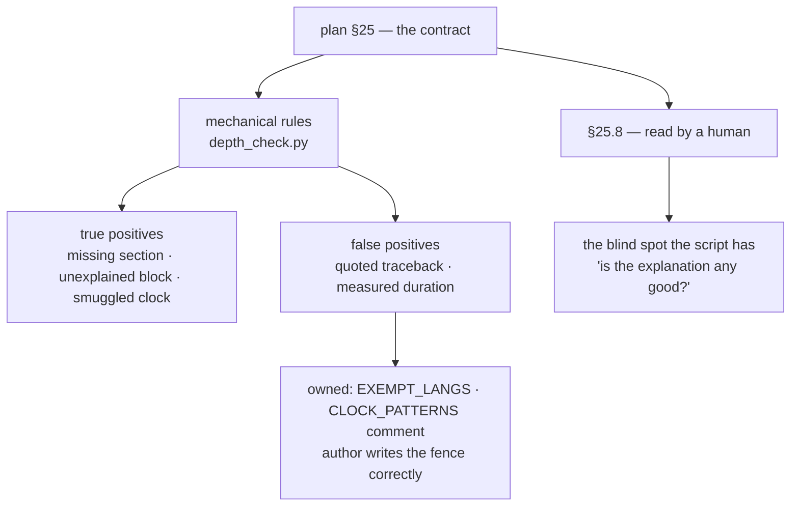

# 5.2 — What the depth check cannot catch, and the false positive it must own

## One-line answer

Every mechanical rule has a class of cases it gets wrong, and the difference between a check people
trust and a check people disable is whether those cases are **documented and exempted on purpose** or
quietly worked around.

---

## The story

A check is introduced to catch a real problem. It works. It catches the problem several times in the
first week and everybody is glad it exists.

Then it fires on something that is fine. Not a borderline case — genuinely fine, correct code that
happens to look like the pattern the check searches for. The author looks at the message, decides the
check is wrong, and adds a suppression comment. Reasonable: the code is correct and the deadline is
real.

The suppression comment gets copied. Somebody in a hurry sees the pattern — check fires, add
suppression — and applies it without evaluating whether their case is the same. Within a few months
the suppression appears in places where the check was right, and the check is now firing only on the
code that has not learned to ignore it.

Nobody disabled the check. It is still in the pipeline, still green, still catching nothing. **It was
not defeated by being wrong once — it was defeated by being wrong once and nobody deciding what to do
about it.** An unowned false positive turns into a habit, and habits do not distinguish cases.

---

## The idea in plain language

Any automated check has four possible outcomes, and only two of them are the ones people talk about:

|  | Actually a problem | Actually fine |
| --- | --- | --- |
| **Check fires** | true positive — the point | **false positive** — the credibility cost |
| **Check silent** | **false negative** — the blind spot | true negative — most of life |

The two interesting boxes are the off-diagonal ones, and they fail differently.

A **false negative** is a blind spot. It is invisible by construction: nothing reports the thing it
missed. You only find out from the consequence, later, and you will not connect the two. The defence
is to know your blind spots in advance and cover them another way.

A **false positive** is visible and therefore feels worse, but it is the more dangerous of the two,
because it spends the check's credibility. Each one buys a suppression, and suppressions do not stay
where they were put. A check with a documented, deliberate exemption stays trusted. A check whose
false positives are handled ad hoc becomes noise, and noise gets filtered.

The rule that follows: **own your false positives explicitly.** Write the exemption into the check,
in code, with a comment saying why. That way the exception is one decision made once, rather than a
hundred decisions made under pressure by whoever happened to be blocked.

---

## Why Akshara needs it

`scripts/depth_check.py` has both kinds, and both are already visible in the plan.

**Its false negatives — stated plainly in §25.9:** *"What it cannot check is whether an explanation is
any good."* A part can carry all eleven sections, in order, with a `Shapes` table and a walkthrough
after every code block, and be worthless. `In production` can say "this is used in production
systems". The story can be a definition with an anecdote bolted on. The script sees headings; it does
not see teaching. That gap is covered by §25.8 and a human reading — and the coverage only happens if
the gap is **named**, which is what this part is for.

**Its false positives — and this one is real, today.** The `Shapes` rule fires when a part contains a
code block that looks like tensor work. It searches for `.view(`, `.transpose(`, `.shape`, `torch.*`
constructors and shape comments. That heuristic is right almost always and wrong in a specific,
predictable case: a part that **quotes an error message** containing a shape, or mentions `.shape` in
prose about debugging, without ever introducing a tensor of its own.

If that fired unhandled, the author's options would be to add a meaningless `Shapes` table or to stop
trusting the check. Both are bad, and the second is worse.

The same is true of the clock rule. Principle 17 bans reader-directed time estimates. But a
**measured** duration is data — "the run took 43 minutes on a T4, seed 1337" is exactly what
Principle 8 asks for, and Day 67's `RUNS.md` row will contain one. A naive rule matching the word
"minutes" would fire on the project's own required output.

---

## The mechanism

Look at how each exemption is written, because the shape of it is the transferable lesson.

The clock rule, from `scripts/depth_check.py`:

```python
#: Reader-directed pace and duration phrasing (§25.9, Principle 17).
#:
#: NOT banned: measured wall-clock ("the run took 43 min on a T4"), GPU-minutes in a compute
#: budget, latency figures, tokens/s. Those are data (Principle 8), not a clock telling the
#: reader how fast to go. The ban is on estimates aimed at the reader's schedule.
CLOCK_PATTERNS: tuple[tuple[str, str], ...] = (
    (r"estimated[ _-]?(hours|time|duration)", "an estimated-time field"),
    (r"(should|will|might|may|can)\s+take\s+(you\s+)?(about\s+|around\s+|~\s*)?\d",
     "a 'should take N' estimate"),
    (r"\b(a\s+)?(quick|short|brief)\s+(detour|aside|note|read|section|day)\b",
     "a pace adjective"),
)
```

**Line by line:**
- The comment above the constant is the most important part of it. It states **what is not banned**,
  which is the half a future reader needs in order to extend the list without breaking Day 67.
- The patterns match *phrases aimed at the reader* — `should take about 2`, `a quick aside` — rather
  than the word "minutes". That is the distinction between a schedule and a measurement, expressed as
  a regex. (Note that those two examples are written as inline code. That is not decoration: the
  checker blanks quoted material before scanning prose, which is the author-controlled exemption this
  part is about — a document may quote the rule it is teaching.)
- Each pattern is paired with a **human-readable description**, so the failure message says "a
  'should take N' estimate" rather than printing a regex at somebody. A check that explains itself in
  its own vocabulary is a check people fix rather than fight.
- Extending this list is a deliberate act with a comment attached, not an afternoon's improvisation.

The `Shapes` rule and its exemption:

```python
#: Signals that a code block is doing tensor work, which makes `## Shapes` mandatory.
TENSOR_SIGNALS = re.compile(r"(\#\s*\(\s*B\s*,|\.shape\b|\.view\(|\.transpose\(|torch\.zeros\()")

#: A code block is exempt from needing a walkthrough when it is a diagram, pure output,
#: or a bare command (§25.4 / §28.3 rule 7).
EXEMPT_LANGS = frozenset({"mermaid", "text", "txt", "", "output", "console", "traceback", "diff"})
```

**Line by line:**
- `TENSOR_SIGNALS` is the heuristic. It is not a parser and does not pretend to be — it is a list of
  things that mean "a tensor is being handled here" often enough to be worth a rule.
- `EXEMPT_LANGS` is the owned false positive, and the mechanism is worth noticing: the exemption is
  keyed on the **code fence's language tag**, which the author controls. A quoted traceback is written
  as ```` ```console ```` or ```` ```traceback ````, and it is then exempt — from the walkthrough rule
  and, because it is not analysed as code, from spurious tensor detection too.
- That is the design move to remember: **give the author a legitimate way to say "this block is not
  code"**, and the false positive disappears without anybody needing a suppression comment. The
  exemption is expressed by writing the document correctly rather than by silencing the check.
- Every part of this day uses it. The error messages quoted in *When it breaks* sections are fenced
  as `console`, which is why none of them demanded a walkthrough or a `Shapes` table.

The full picture of what is covered by what:



---

## When it breaks

The false positive, if you fence a quoted error as `python` instead of `console`:

```console
$ uv run python scripts/depth_check.py 39
depth: FAIL — 1 problem(s) across 1 day(s)

  days/day-039-akshara-v0/parts/03-counting/3.1-parameters-by-hand.md: code transforms tensors but there is no `## Shapes` section (§25.4 section 7 · Principle 20)
```

The part quotes a `RuntimeError` that happens to mention `.shape`. The fix is **not** to add an empty
`Shapes` table and it is **not** to weaken the rule — it is to fence the quoted output as `console`,
which is what it is. The check was arguably right to look, and the document was wrong to claim that
block was Python.

The false negative has no error message at all, which is the entire problem:

```console
$ uv run python scripts/depth_check.py 39
depth: OK — 1 day(s), 12 part(s), contract green
```

Green, on a day whose `In production` sections each contain one vague sentence. There is nothing to
print, because nothing checkable is missing.

**The silent version is therefore the default state of this tool**, and the honest response is to stop
treating green as an answer to a question it was never asked. The proxy that helps:

```bash
uv run python scripts/tracker.py
grep -c "⚠️ thin" docs/TRACKER.md
```

**Line by line:**
- The tracker marks a day `⚠️ thin` when its part count is low relative to the IDs it closes. That is
  a crude signal and it is explicitly **not** a quality judgement — it is a prompt to look.
- A `0` here means no day is structurally suspicious. It does **not** mean the days are good, and the
  distance between those two statements is exactly the blind spot this part is about.

---

## In production

**What a research engineer does instead of the teaching version.** They track the check's own error
rate. When a rule produces false positives repeatedly, it gets fixed or removed rather than
suppressed case by case — because the alternative is a rule that everybody knows to ignore, which is
worse than no rule, since it occupies the space where a working rule would go. The habit worth
carrying: **a suppression is a bug report about the check.** One is fine. Three of the same kind means
the rule is wrong.

**What degrades at scale.** Two directions, and they pull against each other. Tighten the rules and
false positives rise until people route around them; loosen them and the false negatives grow until
the check stops earning its runtime. The escape from that trade-off is not a cleverer regex — it is
to keep the mechanical rules **narrow and objective** and to put the judgement somewhere a human is
already looking, which is what §25.8 is. A check that tries to have taste ends up with neither
precision nor trust.

**The failure that only shows with real data.** The tensor heuristic is a regex, and this project's
later days will write tensor code the regex does not recognise — an `einsum` string, a bare
`@` matmul, an in-place op. Those parts will pass without a `Shapes` table and will be worse for it.
The mitigation is not a better regex; it is that **§25.8 stays a reading item** and Principle 20 stays
something the author believes rather than something the script enforces. The script raises the floor;
it does not set the ceiling.

**The review comment.** *"The depth check passes — but does part 3.2's `In production` section say
anything that would change what I write?"* That is the qualitative half being asked about explicitly,
and it has to be asked explicitly or it stops being asked at all.

**The interview question.** *"Your linter has a rule that keeps firing on correct code. What do you
do?"* The weak answer adds a suppression. The strong answer treats it as evidence about the rule —
fix it, narrow it, or delete it — and names the real cost of the alternative: suppressions spread by
copy-paste into cases the rule was right about, and the check dies without anyone deciding to kill it.

**Compute tier: T0.** Laptop CPU, reading markdown. The reason it stays inside `./m check` is that it
costs nothing to run.

---

## Check yourself

Run this. It prints two **numbers**: how many code-fence languages are exempted, and how many
distinct clock patterns are banned:

```bash
uv run python -c "import sys; sys.path.insert(0,'scripts'); import depth_check as d; print('exempt langs:', len(d.EXEMPT_LANGS)); print('clock patterns:', len(d.CLOCK_PATTERNS))"
```

**Line by line:**
- Importing the module and reading its constants asks the **code** what the rules are, rather than
  trusting this document — the observation habit from
  [1.3](../01-the-toolchain/1.3-observed-is-not-available.md) applied to your own tooling.
- The first number is the size of the owned false-positive exemption. Every entry in it is a
  deliberate decision someone made once so nobody would have to make it again in a hurry.
- The second is the size of the clock ban. If you ever add to it, add the human description too — the
  message is what makes the rule survivable.

**Say this out loud, without scrolling up:** why is a false positive more dangerous to a check's
survival than a false negative — and what is the one thing `depth_check.py` will never be able to tell
you about a day?
