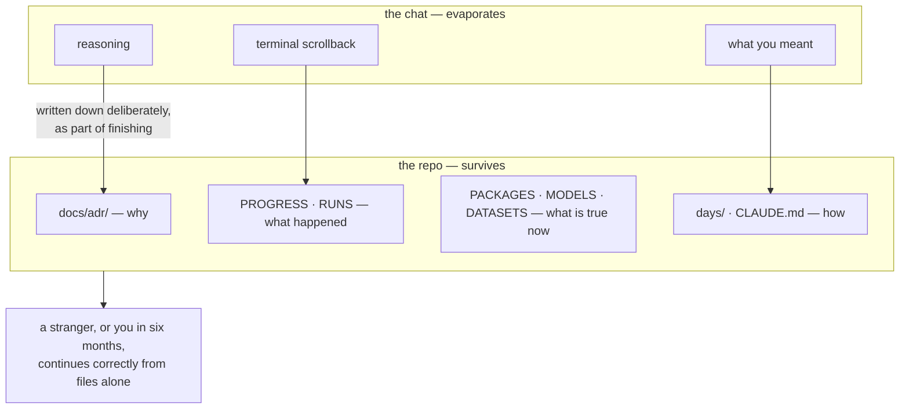

# 1.1 — The repo is the memory, not the chat

## One-line answer

Everything you will need to pick this project up again — what was decided, what was tried, what
failed, and why — has to live in files that are committed, because the conversation in which you
learned it does not survive, and neither does your memory of it.

---

## The story

Somebody works through a long problem with an assistant — a colleague, a chat window, a notebook of
their own thinking. It goes well. Decisions get made, dead ends get ruled out, a rationale gets
worked through carefully.

Then the session ends. What remains is the code: correct, working, and completely silent about why it
is the way it is. There is a constant set to 8. There is a step that looks redundant and is not. There
is a whole approach that was tried and abandoned for an excellent reason nobody can now recall.

Three months later the same person returns and changes the constant to 16, because 8 looks arbitrary.
It was not arbitrary. It was the outcome of an afternoon of careful work whose only record was a
conversation that no longer exists.

The loss is not the code — the code was fine. **The loss is the reasoning**, and reasoning is the
expensive part. Code can be re-derived from reasoning in an hour. Reasoning cannot be re-derived from
code at all.

---

## The idea in plain language

There are two places a project's knowledge can live, and only one of them persists.

**The chat** is everything ephemeral: the conversation, the terminal scrollback, the reasoning you
did in your head, what you meant. It is where the work actually happens, and it is gone. Not
degraded — gone. A new session, a new machine, a new assistant, or simply three months, and none of
it is available.

**The repo** is what is committed. It survives everything and it is the *only* thing that does.

The design decision that follows is uncomfortable but simple: **if a piece of knowledge matters, it
must end up in a file, deliberately, as part of finishing the work.** Not as documentation written
afterwards when there is time — there is never time afterwards — but as a step in the ritual of being
done.

This is why the plan (§27) has nine ledgers, and why every day document ends with a §11 section
containing the exact rows to paste. The ritual is the point. A habit that depends on remembering to
write things down will hold for a week; one that is a required step in the command that finishes a
day will hold for a hundred and sixty-two.

The test for whether the repository is genuinely the memory is a single question:

> Could a competent stranger — or you, in six months, having forgotten everything — pick this up from
> the files alone and continue correctly?

If the answer requires "well, you'd also need to know that…", then that thing is currently living in
the chat, and it is already lost.

---

## Why Akshara needs it

This project has a specific reason beyond the general one, and it is worth being blunt about.

The plan runs to a hundred and sixty-two days. **Day 30 will be genuinely forgotten by Day 121.** Not
half-remembered — forgotten. The plan says so directly in §28.1 and builds it into the writing rules:
every term is defined on first use *including terms from earlier days*, with a link back, because "as
we saw earlier" is not a link and the reader it is addressed to does not exist.

Then there is the part specific to generative work. On **Day 67** you will pretrain a model. The
output is a checkpoint and a loss curve. Six weeks later somebody — you — will ask why the learning
rate was what it was, whether the corpus was decontaminated, and what the seed was. If those answers
live in a terminal scrollback, the run is an **anecdote**. If they live in `docs/RUNS.md`, it is a
**result**. That single distinction is Principle 9, and it is the reason this project has a run
ledger at all (part [3.2](../03-the-ledgers/3.2-runs-md-turns-anecdote-into-result.md)).

And one more, which is the reason this is Day 1 rather than Day 100: any capable command-line agent
should be able to open this repository and continue from the last row of `docs/PROGRESS.md`, with no
context beyond the files. That is not a nice property. It is the *definition* of the repository being
the memory, and it is testable — which is what makes it a real requirement rather than a slogan.

---

## The mechanism

The repository holds four kinds of memory, and they are different enough that conflating them is how
projects lose things.

| Kind | Where | Answers | Written when |
| --- | --- | --- | --- |
| **What was decided, and why** | `docs/adr/` | "Why is it built this way?" | at the decision |
| **What happened** | `docs/PROGRESS.md`, `docs/RUNS.md` | "What has been done, and what came out?" | at the end of a day or run |
| **What is true right now** | `docs/PACKAGES.md`, `MODELS.md`, `DATASETS.md` | "What version, which revision, what licence?" | before first use |
| **How to do it** | `days/`, `CLAUDE.md`, `README.md` | "How does this work, and how do I run it?" | as it is built |

The first row is the one that gets skipped, and it is the one the story at the top of this part is
about. A decision record is short and its value is entirely in the rejected alternatives:

```text
# ADR-0006 — <the decision, as a sentence>

- **Date:** 2026-08-26
- **Day:** 1
- **Status:** accepted

## Context
<what forced a choice — the constraint, not the background>

## Decision
<what was chosen>

## Consequences
**Good.** <what this buys>
**Costly, accepted.** <what it costs, stated honestly>

**Rejected alternatives.**
| Alternative | Why not |
| --- | --- |
| <the obvious other option> | <the actual reason> |
```

**Line by line:**
- The **Context** section records the *constraint*, not the history. "We needed to choose X" is
  useless; "free notebook sessions are pre-empted, so anything unrecoverable is a bug" is the fact
  that made the decision inevitable.
- **Consequences** has two halves on purpose. An ADR listing only benefits is marketing. The
  *"costly, accepted"* half is what tells a future reader that the cost was known and priced, so they
  do not re-litigate it as though it had been overlooked.
- **Rejected alternatives** is the single most valuable table in the document. Six months later the
  obvious question is always *"why didn't you just…?"* — and this table answers it without anyone
  having to reconstruct the afternoon.
- The date and day tie it to the state of the world when it was made, which is what lets a later
  reader notice that the constraint has since changed.

Now the shape of the whole thing:



The arrows crossing that boundary are all **manual**. Nothing moves from the top box to the bottom one
by itself, which is precisely why it is a ritual with a command attached rather than a good intention.

---

## When it breaks

There is no traceback for this failure. That is what makes it worth a part of its own.

The loud version, such as it is, is a question you cannot answer:

```console
$ git log --oneline -3
a1b2c3d day-067: complete
e4f5g6h day-066: complete
i7j8k9l day-065: complete
```

Three commits, no information. Every day was "completed". Which learning rate did day 67 use? What
was the seed? Was the corpus decontaminated first? The history records that work happened and
nothing about what it decided.

**The silent version, which is the normal state of most projects.** Everything looks fine. The code
runs, the tests pass, the repository is tidy. The knowledge is simply not there, and its absence is
invisible because absence has no shape — you do not notice a missing rationale until you need it, and
by then the person who had it is gone or has forgotten.

The detection is a deliberate exercise, and it is worth actually doing rather than reading:

```bash
git log --oneline | wc -l
ls docs/adr/*.md 2>/dev/null | wc -l
grep -c '^| [0-9]' docs/PROGRESS.md
```

**Line by line:**
- Three numbers: commits, recorded decisions, recorded days. A project with many commits, few ADRs
  and a stale progress ledger has been doing its thinking in the chat.
- The ratio is the signal, not any single number. Not every commit deserves an ADR — most do not. But
  a repository where the second number never grows is one where decisions are being made and not
  recorded, and that is a claim you can check on any repository you inherit.
- **Run this on somebody else's project too.** It is the fastest read of whether the knowledge is in
  the repository or in somebody's head.

The stronger test, which takes longer and is the real one:

```bash
./m status
tail -1 docs/PROGRESS.md
```

**Line by line:**
- Read only those two outputs and ask: *do I know what to do next?* If yes, the repository is the
  memory. If you need to remember something not on screen, that something is currently in the chat
  and is already at risk.
- This is the exact test a fresh agent session performs when it opens this project, which is why
  `CLAUDE.md` names those two files as the first things to read.

---

## In production

**What a research engineer does instead of the teaching version.** They make the record a *by-product*
of the work rather than a separate chore. The training script writes its own config, seed, git commit
and hardware into the output directory at launch, so the run cannot happen without recording itself.
A human pasting a row is a step that gets skipped under pressure; a script that refuses to start
without recording what it is has no such failure mode. `docs/RUNS.md` here is the hand-operated
version of that, and it is deliberately small enough to survive being written by a tired person —
which is a real design constraint, not a compromise.

**What degrades at scale.** Hand-written ledgers rot. Rows stop being added, and the rows that are
there stop being trusted, and an untrusted ledger is worse than none because it invites confident
wrong conclusions. Two things slow the rot: **dates on every row**, so staleness is detectable rather
than invisible; and generated ledgers alongside the hand-written ones, so at least part of the picture
cannot drift. That is why three of this project's ten are regenerated
(part [3.3](../03-the-ledgers/3.3-the-generated-three.md)).

**The failure that only shows with real data.** The knowledge that matters most is almost always about
something that *did not* work — the approach abandoned, the hyperparameter that diverged, the dataset
that turned out to be contaminated. Those never get written down, because nothing shipped and there
is no artifact to attach the note to. This is why `docs/RUNS.md` records failed runs with an
`Outcome` of `diverged` or `oom` (Principle 10): **a ledger with no failures in it is a ledger someone
has been editing**, and the failures are the expensive knowledge.

**The review comment.** *"This changes a constant from 8 to 16 — where is the record of why it was 8?"*
If nobody can answer, the project has been running on chat memory, and this change is a coin flip
dressed as an improvement.

**The interview question.** *"You join a team and inherit a model that works. What do you read first?"*
The answer that shows experience is not the code. It is the decision records and the run history —
because the code tells you what is happening and those tell you what was tried, and the second one is
what stops you spending a fortnight rediscovering a dead end somebody already mapped.

**Compute tier: T0.** Laptop CPU, no GPU, no network. Nothing about recording knowledge needs
hardware, and that is worth noticing: the cheapest activity in this entire curriculum is also the one
with the longest-lived payoff.

---

## Check yourself

Run this. It prints three **numbers** — commits, recorded decisions, recorded days — and the ratio
between them is the health of your project's memory:

```bash
echo "commits: $(git log --oneline 2>/dev/null | wc -l)"
echo "ADRs:    $(ls docs/adr/*.md 2>/dev/null | wc -l)"
echo "days:    $(grep -c '^| [0-9]' docs/PROGRESS.md)"
```

**Line by line:**
- Today those numbers are small, and one of them may be `0`. That is correct on Day 1 and it is
  still worth recording, because this is the **baseline** — the comparison that makes the number
  meaningful on Day 67.
- The number that matters is not any one of them. It is whether the second and third keep growing
  alongside the first over the next hundred and sixty days. A repository whose commit count climbs
  while its decision count stays flat is one whose reasoning is evaporating in real time.

**Say this out loud, without scrolling up:** what is the one question that decides whether the
repository is genuinely the memory — and why is a ledger containing no failed runs a warning sign
rather than a good sign?
