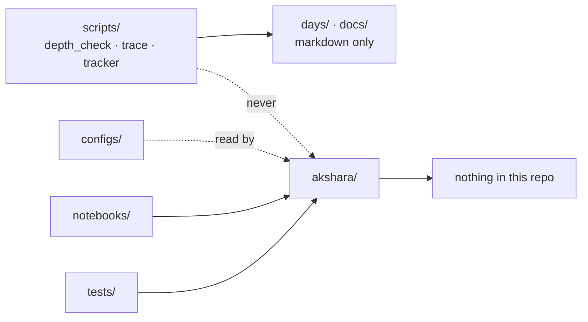

# 1.2 — The layout as an argument: what each directory refuses to hold

## One-line answer

Day 0 created the directories; today each one gets a **rule about what it refuses to hold**, because
a folder that accepts anything provides no information and a project's structure is only as strong as
its most permissive corner.

---

## The story

Two projects have identical folder structures. Same names, same nesting, same everything on a
diagram.

In the first, a new person asks where something goes and gets an answer in four seconds, because
each folder has a rule and the rules do not overlap. The question has one answer and everyone gives
the same one.

In the second, the same question produces a pause, then "probably here, I suppose", then a different
answer from the next person. Six months later the same kind of file lives in three places.

The diagrams are identical. What differs is that in the first project somebody wrote down, for each
directory, **what would be wrong to put in it** — and in the second they wrote down what each folder
was *for*, which sounds like the same thing and is not.

"This folder is for utilities" accepts everything, because everything is a utility to somebody.
"Nothing in this folder may import from the model package" rejects things, and a rule that rejects
is a rule that decides.

---

## The idea in plain language

A directory carries information only in proportion to what it **excludes**. `misc/` tells you
nothing. `tests/` tells you a lot — not because of what is inside, but because you know several
things that are *not*: production code, anything imported by the model, anything that needs a GPU
without a marker.

The useful way to specify a layout is therefore inverted from the usual one. Instead of a purpose,
each directory gets a **refusal**:

| Directory | Refuses to hold | Which is really a rule about |
| --- | --- | --- |
| `akshara/` | anything generated; anything that runs once | the difference between a library and a script |
| `configs/` | outputs of the configs | the commit boundary (Principle 9) |
| `scripts/` | anything that imports `akshara` | dependency direction |
| `tests/` | anything requiring GPU or network without a marker | what the gate can promise |
| `notebooks/` | the only copy of any logic | where the source of truth lives |
| `days/` | project code the learner should type | who does the reps |
| `docs/` | anything a script regenerates *and* a human edits | generated vs hand-written |

Every one of those refusals is a **dependency or lifecycle constraint** wearing a folder's costume.
That is the real content of a layout, and it is why the layout is Day 1's business rather than Day 0's:
Day 0 made the directories, today they acquire meaning.

One refusal deserves special notice because it is the one that decides whether the others hold:
**`scripts/` may not import `akshara/`.** That sets the arrow. Tooling knows about the project;
the project knows nothing about its tooling. Reverse it once and `depth_check.py` cannot run until
the model imports cleanly, which means the check that is supposed to catch a broken repository stops
working precisely when the repository is broken.

---

## Why Akshara needs it

Three concrete places these refusals get load-bearing.

- **Day 39** builds the model, and the day document says *"create `akshara/model/attention.py`"*.
  That instruction is only unambiguous because `akshara/` has a rule. Without one, half the code ends
  up in a notebook and the other half in `scripts/`, and Day 83 — which optimises attention — has two
  places to look.
- **Day 59** introduces unit tests, and the gate promises CPU-only, offline, deterministic
  (`CLAUDE.md`). That promise is exactly the `tests/` refusal. A single unmarked GPU test breaks the
  guarantee for every subsequent day, on the laptop where it matters.
- **Day 67** runs in a notebook. The `notebooks/` refusal — *never the only copy of any logic* — is
  what stops the pretraining loop existing solely inside a cell that gets lost when the session is
  reclaimed. Part [4.3](../04-free-compute/4.3-notebook-module-discipline.md) is that rule in full.

And the reason this is worth a day rather than a paragraph: these constraints only work if they are
written where somebody about to break them will look. A rule in a document nobody opens is a rule
that exists once.

---

## The mechanism

Write the refusals into the repository itself, next to what they govern. A `README.md` per directory
is one line long and is read by the person standing in that directory:

```bash
cat > akshara/README.md <<'EOF'
# akshara/ — the model package

Every line here is typed by you, from a day document. Nothing is pre-written.

**Refuses to hold:** anything generated; anything that runs once and exits (that is `scripts/`);
anything that cannot be imported without side effects.

Subpackages are pipeline stages, in the order the curriculum builds them:
tokenizer → model → train → infer → eval → serve.
EOF

cat > scripts/README.md <<'EOF'
# scripts/ — repo tooling

**Refuses to hold:** anything that imports `akshara`.

The arrow points one way: tooling knows about the project, the project knows nothing about its
tooling. If `depth_check.py` needed the model to import cleanly, it would stop working exactly when
the repository is broken — which is when it is needed.
EOF
```

**Line by line:**
- The quoted here-document (`<<'EOF'`) stops the shell expanding `$` or backticks inside, which
  matters because these files describe code.
- Each file leads with the **refusal**, not the purpose. That is the whole argument of this part
  expressed as a document convention.
- `scripts/README.md` states the *consequence* of the rule rather than just the rule. A constraint
  whose reason is written down survives the first person who finds it inconvenient; one stated
  without a reason gets overridden by whoever is in a hurry.

Now make the important refusal checkable rather than aspirational:

```bash
grep -rn "^from akshara\|^import akshara" scripts/ || echo "OK scripts/ does not import akshara"
```

**Line by line:**
- `grep -rn` searches recursively and prints line numbers. Anchoring with `^` matches imports at the
  start of a line, which is where real imports live — a mention inside a docstring does not count.
- `|| echo` turns "grep found nothing" into an affirmative message. `grep` exits `1` when it finds no
  matches, which is success here, and a command whose success prints nothing is a command whose
  meaning you have to remember.
- This is one line and it encodes the dependency direction that everything else depends on. It is a
  candidate for the `TODO(me)` in today's build brief: wire it into `./m check` so the refusal is
  enforced rather than merely stated.

The dependency arrows, drawn — note there are no cycles, which is the property being protected:



---

## When it breaks

The loud failure, the first time the dependency arrow gets reversed:

```console
$ uv run python scripts/depth_check.py
Traceback (most recent call last):
  File "scripts/depth_check.py", line 12, in <module>
    from akshara.model import GPT
  File "akshara/model/__init__.py", line 3, in <module>
    import torch
ModuleNotFoundError: No module named 'torch'
```

Read what actually happened: the **depth checker** — a script that reads markdown files and has no
business knowing what a model is — failed because `torch` is not installed. The check that exists to
tell you the repository is healthy cannot run because the repository is unhealthy. That is the
circularity the `scripts/` refusal prevents, and it is why the refusal is about imports rather than
about topic.

**The silent version, and it is the one that actually happens.** No error at all. The same logic
exists in two places — `akshara/train/loop.py` and a cell in `notebooks/pretrain.ipynb` — because
pasting was faster than importing on the day it was written. Both run. They drift. A fix lands in one
of them, and the run that produced your reported number used the other.

Nothing is red. The loss curve looks fine. You cannot tell from the output which copy ran.

Detect it by looking for duplicate definitions across the boundary:

```bash
grep -rn "^def \|^class " --include=*.py akshara/ \
  | sed 's/.*\(def\|class\) //; s/(.*//' | sort | uniq -d
```

**Line by line:**
- The `grep` collects every top-level function and class in the package; the `sed` strips everything
  but the name; `sort | uniq -d` prints only names that appear **more than once**.
- Any output is a duplicate definition, which is either a deliberate override or a fork nobody
  decided to create. Both are worth knowing about.
- Extend it with `--include=*.ipynb` once notebooks exist. That is where the second copy lives,
  because a notebook is the easiest place in any project to paste rather than import — which is
  exactly why `notebooks/` has the refusal it has.

---

## In production

**What a research engineer does instead of the teaching version.** They enforce the arrows with a
tool rather than a README. Import-linters exist for precisely this: a config declaring which package
may import which, failing CI on a violation. On a small project a README plus one `grep` in the gate
is proportionate; on a large one, layering rules that depend on everyone remembering them decay at
exactly the rate the team grows. The principle is unchanged either way — **the layout is a
dependency graph**, and a dependency graph that nothing checks is a diagram.

**What degrades at scale.** `utils/` appears. It always does, and it always starts as two functions
with no obvious home. It cannot state a refusal — that is its defining property — so it accumulates,
and because everything imports it, it becomes a circular-dependency generator with a friendly name.
The defence is the question this part opened with: if a proposed directory cannot say what would be
**wrong** to put in it, it is not a directory, it is a shrug.

**The failure that only shows with real data.** The `tests/` refusal — no GPU, no network — is
invisible until somebody runs the suite on a machine without a GPU, which is the laptop, which is
where the gate runs before every commit. One unmarked test and `./m check` fails for reasons unrelated
to the change being checked, and the standard response to that is to stop running the gate locally.
A single violated refusal takes the whole gate down with it, which is why it is enforced by
`--strict-markers` rather than by care.

**The review comment.** *"This adds an import from `akshara` into `scripts/` — is that intentional?"*
Almost always the answer is that something in `scripts/` wanted a helper, and the right fix is to
duplicate ten lines rather than reverse an arrow. Cheap duplication beats a cycle.

**The interview question.** *"How do you keep a codebase from turning into a ball of mud?"* The weak
answer is "good folder structure". The strong answer names **dependency direction** as the thing
folders are a proxy for, and mentions that the rule has to be checkable or it is decoration — with
the observation that `utils/` is the canonical place where such rules go to die.

**Compute tier: T0.** Laptop CPU. Two `grep` invocations and some markdown; the point is that the
refusals cost nothing to state and nothing to check, which is why there is no excuse for leaving them
implicit.

---

## Check yourself

Run this. It prints two **numbers**: how many directories carry a written refusal, and how many
violations of the most important one exist:

```bash
ls */README.md 2>/dev/null | wc -l
grep -rn "^from akshara\|^import akshara" scripts/ 2>/dev/null | wc -l
```

**Line by line:**
- The first counts directory-level READMEs — the number of places where the rule is written down
  where somebody would actually see it.
- The second must be **`0`**. It is the dependency arrow that all the others rest on, and it is one
  `grep` away from being a fact rather than an intention.
- If the second is ever above zero, fix it by duplicating a few lines into `scripts/` rather than by
  relaxing the rule. A cycle costs more than the duplication ever will.

**Say this out loud, without scrolling up:** why does a directory carry information in proportion to
what it **excludes** — and what specifically goes wrong if `scripts/` is allowed to import `akshara/`?
