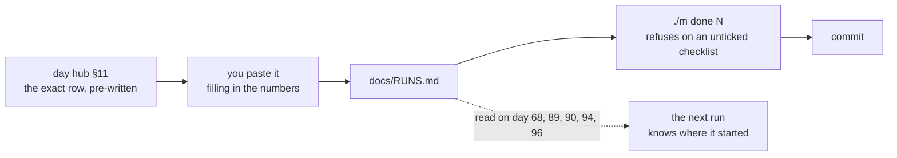

# 3.2 — `RUNS.md`: the row that turns an anecdote into a result

## One-line answer

Six weeks after a training run, the only difference between a result and an anecdote is a row
recording the seed, the config hash, the hardware and the outcome — because a checkpoint contains
none of that and cannot be asked.

---

## The story

Two people report the same thing: a change improved their model.

The first can say what the change was, what the baseline was, which seed each ran under, which
config file, on what hardware, and how many steps. They can point at three seeds and a spread. When
somebody asks whether the gain is bigger than the noise, they answer with a number.

The second remembers it was better. There was a run last month, the loss curve looked good, and they
are fairly sure the learning rate was lower. The checkpoint is on a disk somewhere. They cannot say
which corpus revision it used because they downloaded it that week and it has been updated since.

Both people did the same amount of work. Both are equally competent and equally honest. The
difference is a few hundred bytes written at the end of a session — and the second person's month of
work is not *worse*, it is **unusable**, because nobody can act on a claim they cannot check, least
of all the person who made it.

---

## The idea in plain language

A trained model is a file of numbers. It does not record how it was made. Open a checkpoint and you
can recover the architecture and the weights; you cannot recover the seed, the data, the schedule,
the library versions, or the hardware. **None of it is in there**, and there is nothing to ask.

So everything needed to reproduce or interpret a run has to be captured *at the time*, by a
deliberate act. What has to be captured is exactly the set of things that change the result and are
not in the code:

| Column | Why it is not optional |
| --- | --- |
| `Config` + `Hash` | the parameters. The hash makes "same config" checkable rather than remembered |
| `Seed` | initialization, shuffling and dropout all depend on it. Without it, two runs of the same config are different experiments |
| `Hardware` | changes numerics, batch size, and therefore results — a T4 and a laptop CPU are not the same machine |
| `Steps` / `Tokens` | "trained for a while" is not a quantity |
| `Train/Val loss` | the number that gets quoted later, next to the conditions that produced it |
| `Outcome` | **including failures** — `diverged`, `oom`, `preempted` (Principle 10) |
| `Silent failure ruled out` | which of the plan's §6 traps this run could have hit, and how you checked |

That last column is the one this project adds and most do not, and it is the one that makes the
ledger worth more than a tracking dashboard. A loss number with no note about contamination or
padding is a number that might be measuring memorization or measuring `<pad>` prediction. Recording
*what you ruled out* is what makes the row a claim rather than an observation.

And the discipline that makes the whole thing work: **every run gets a row, including the ones that
failed.** A run that diverged at step 400 is a fact about your learning rate. A run pre-empted at step
4100 and resumed is a fact about your checkpointing. A ledger containing only successes is not a
record of your project; it is a highlight reel, and it will mislead you specifically when you are
trying to work out why something is not working.

---

## Why Akshara needs it

**Day 67** is the first real run, and it is the scenario this ledger is designed for: a free notebook
GPU, pre-emptible, rebuilt from nothing, producing a checkpoint that lives outside the repository.
Everything about that run is unrecoverable afterwards unless it was written down at the time.

Then it compounds:

- **Day 68** is the phase gate where you defend the loss curve and the model size. The defence is the
  row.
- **Day 89** fine-tunes with LoRA, starting **from the Day 67 checkpoint**. Which one? There will be
  several, some of them failures. The row names it.
- **Day 90** asks whether the fine-tune learned the task or the format (Silent Failure #5), which is a
  comparison against the base model — and a comparison is only meaningful if both sides have rows.
- **Day 94** runs DPO and **Day 96** measures the alignment tax, which is explicitly a
  before-and-after number across three runs.

By Day 96 there is a chain of four runs, each starting from the output of another. If any link has no
row, the chain cannot be reconstructed, and every conclusion downstream of it becomes an anecdote.

---

## The mechanism

The row. Written at the end of a run, from the hub's §11 section, so it needs no thought:

```text
| Run | Day | Config | Hash | Seed | Hardware | Steps | Tokens | Train loss | Val loss | Wall | Checkpoint | Outcome | Silent failure ruled out |
| --- | --- | ------ | ---- | ---- | -------- | ----- | ------ | ---------- | -------- | ---- | ---------- | ------- | ------------------------ |
| 001 | 67 | configs/base-12m.yaml | 4f2a9c1 | 1337 | T4 16GB (Colab) | 12000 | 240M | 3.41 | 3.58 | 71 min | $CKPT/akshara-base-s12000 | ok | #1 contamination: eval n-grams checked vs corpus, 0 hits. #3 padding: label tensor inspected, 412 of 2048 are -100. overfit-1-batch passed first. |
| 002 | 67 | configs/base-12m.yaml | 4f2a9c1 | 1338 | T4 16GB (Colab) | 12000 | 240M | 3.44 | 3.61 | 69 min | $CKPT/akshara-base-s12000-s1338 | ok | as run 001. **Second seed: val spread 3.58-3.61, so a later change must beat 0.03 to mean anything.** |
| 003 | 67 | configs/base-24m.yaml | 8b1e7d2 | 1337 | T4 16GB (Colab) | 3100 | 62M | 6.02 | — | 22 min | — | diverged | LR 6e-4 too high at this width; loss spiked at ~2900 then NaN. Not a data problem — run 001 shares the corpus. |
```

**Line by line:**
- `Run` is a short id that later rows refer to. Run 003's note points at run 001, which is how a
  reader knows the corpus was not the cause.
- `Hash` is of the **config file**, so "same config" is verifiable rather than remembered. Two rows
  with the same hash genuinely ran the same parameters; two with the same filename may not, because
  files get edited.
- `Seed` differs between runs 001 and 002 **on purpose**. That is the whole point of run 002: it
  establishes the noise band. Without it, a later run scoring 3.55 looks like an improvement; with
  it, 3.55 is inside the spread and means nothing. This is Silent Failure #4 being pre-empted rather
  than discovered.
- `Hardware` says `T4 16GB (Colab)` — the actual device, not the plan. A row saying "GPU" cannot
  explain why the numbers differ from a rerun.
- `Checkpoint` is a path **outside the repository** (`$CKPT` is `AKSHARA_CHECKPOINT_DIR` from part
  [2.1](../02-secrets-and-tokens/2.1-the-token-in-one-place.md)). The ledger points at the artifact;
  it never contains it (Principle 9).
- **Run 003 is a failure and it has a row.** Its `Val loss` and `Checkpoint` are `—` because neither
  exists. Its note does the real work: it says what the cause was *and* what it was not, citing
  another run as the control.
- The `Silent failure ruled out` column names traps from the plan's §6 **by number** and says how each
  was checked. "#3 padding: label tensor inspected, 412 of 2048 are -100" is a claim somebody can
  re-run. "checked padding" is not.

Getting the hash — one command, so there is no excuse:

```bash
git hash-object configs/base-12m.yaml | cut -c1-7
```

**Line by line:**
- `git hash-object` computes the same content hash git uses, without needing the file to be committed
  or staged. It is content-addressed, so an edited config produces a different hash automatically.
- `cut -c1-7` shortens it to fit a table. Seven characters is ample for distinguishing a few dozen
  configs and short enough that the row stays readable.
- Run this **at launch**, not afterwards — the file may be edited between the run starting and you
  writing the row, and then the hash describes a config that never ran.

Where the row comes from, and why it is the last thing in every day:



---

## When it breaks

There is no error message. A missing row produces a question you cannot answer, weeks later:

```console
$ grep "day 67" docs/RUNS.md
$ echo $?
1
```

The checkpoint exists. Nothing records what made it. Day 89 needs to fine-tune *from* it and cannot
say which corpus it saw, so anything Day 90 concludes about task-versus-format is unfounded.

**The silent version, which is the one that produces wrong science.** Every run has a row and the
`Seed` column is always the same value. Every row looks complete and disciplined. Then a change is
evaluated: baseline 3.58, new version 3.55, and the change ships.

Nothing is red. Every row is filled in. But with one seed per configuration there is **no noise
estimate**, so 0.03 is indistinguishable from a coin flip. That is Silent Failure #4 from the plan's
§6 — noise mistaken for improvement — and a fully-populated ledger did nothing to prevent it, because
the ledger recorded the number and not the *uncertainty*.

Detect it by asking how many seeds each configuration has been run under:

```bash
awk -F'|' 'NR>2 && NF>5 {gsub(/ /,"",$5); gsub(/ /,"",$6); print $5, $6}' docs/RUNS.md \
  | sort | uniq -c | sort -rn | head
```

**Line by line:**
- Pulls the `Hash` and `Seed` columns from every data row, then counts distinct seeds per config
  hash.
- **A config that appears with only one seed cannot support a comparison.** Before quoting any
  improvement, this command tells you whether you have earned the right to.
- Day 119 (EVAL-16, statistical significance) is where this becomes a formal method. The habit starts
  here, on Day 1, because by Day 67 it is too late to retrofit a second seed onto a run that has
  already consumed a session.

---

## In production

**What a research engineer does instead of the teaching version.** The run writes its own row. At
launch the script captures the config hash, the seed, the git commit, the hardware string and the
library versions into a metadata file next to the outputs; at exit it appends the losses and the
outcome. A human pasting a row is a step that gets skipped at the end of a long session — precisely
when the session was most expensive. Hosted experiment trackers automate the same thing with a nicer
interface. What must not be given up in the switch is the **outcome column including failures**: most
tools quietly record only runs that completed, and the diverged ones are where the learning is.

**What degrades at scale.** Hundreds of runs make a markdown table unreadable, and the response is a
database or a tracker. What does not change is the *schema* — the columns above are the minimum
regardless of the storage — and the discipline of a **noise estimate before a claim**. Teams that
skip the second seed do not discover the problem gradually; they discover it when a result fails to
replicate, having already built three months of work on top of it.

**The failure that only shows with real data.** Pre-emption. A free session dies at step 4100. The
honest response is a row with `Outcome: preempted` and a second row for the resumed run, cross-
referencing it. The tempting response is to resume and record one row as though it were continuous —
which hides the fact that the run was interrupted, and interruptions can change results when the
dataloader's shuffle state is not perfectly restored. That is a real reproducibility bug, and the
ledger is where it becomes visible.

**The review comment.** *"This claims a 0.03 improvement — how many seeds, and what was the spread?"*
The single most useful question to ask about any reported gain, and it is unanswerable without this
ledger.

**The interview question.** *"How do you know a change actually improved your model?"* The weak answer
compares two numbers. The strong answer names the noise band first, then says the change has to beat
it — and mentions that the noise band costs a second run, which is why it has to be planned for
rather than wished for.

**Compute tier: T0** to write, **T1** for the runs it records. The row itself is a few hundred bytes
of typing; the discipline is what makes a hundred and fifty GPU-minutes on Day 67 worth having spent.

---

## Check yourself

Run this. It prints two **numbers**: how many runs are recorded, and how many of them are failures:

```bash
echo "runs recorded: $(grep -c '^| [0-9]' docs/RUNS.md)"
echo "failures:      $(grep -cE '^\| [0-9].*\|(diverged|oom|preempted|abandoned)' docs/RUNS.md)"
```

**Line by line:**
- Today both are `0`, because nothing has been trained. That is the baseline, and recording a baseline
  before it matters is the habit from Day 0 part
  [3.2](../../../day-000-toolchain-skeleton-driver/parts/03-gitignore-first/3.2-the-checkpoint-that-cannot-be-removed.md).
- Re-run it after Day 67. **If the second number is still `0` after a dozen runs, that is a warning,
  not an achievement** — it means failures are not being recorded, and the failures are where the
  expensive knowledge is.

**Say this out loud, without scrolling up:** name three things that change a training result and are
recoverable from **neither** the checkpoint nor the code — and say why a ledger where every config
has exactly one seed cannot support a claim of improvement.
