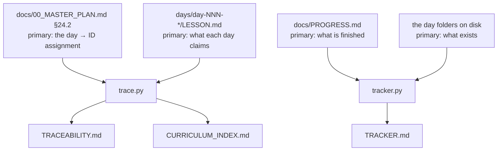

# 3.3 — The generated three: `trace.py`, `tracker.py`, and why they are not written by hand

## One-line answer

Three of the ten ledgers are **derived** from the plan and the day folders rather than written, which
means they cannot drift — and the useful skill is recognising which facts are derivable, because a
derivable fact recorded by hand is a fact that will eventually be wrong.

---

## The story

A project keeps an index: a table mapping each requirement to the document that satisfies it. It is
maintained by hand, carefully, and for a while it is genuinely useful.

Then a document is renamed. The index is not updated, because the rename happened during other work
and nobody connected the two. A requirement moves from one document to another; the index still shows
the old one. A requirement is deleted; its row stays.

None of this is visible. The index is a table of plausible-looking rows, and a wrong row looks
exactly like a right one. Six months later somebody uses it to check coverage, concludes everything is
covered, and is wrong in three places.

The index was not neglected. **It was maintained until it silently stopped being maintained**, and
there was no moment where that happened — just a slow accumulation of changes elsewhere that it did
not hear about.

The information in that index was never independent. Every row was a **restatement** of a fact that
lived somewhere else. Restated facts drift from their sources, always, and the drift is invisible
because both copies remain syntactically fine.

---

## The idea in plain language

Facts come in two kinds, and the distinction decides how they should be stored.

**Primary facts** exist only because somebody observed or decided them. The version you saw. The
seed you chose. The licence on a dataset. Nothing can derive these; they must be written down, and
they belong in a hand-written ledger (part [3.1](3.1-what-a-ledger-is-for.md)).

**Derived facts** are computable from primary ones. "Which day teaches `ARCH-28`?" is derivable from
the plan's day map. "How many parts does day 43 have?" is derivable by counting files. Nobody needs
to record these, and recording them creates a **second copy that can disagree with the first**.

The rule that follows:

> If a fact can be computed, compute it. Never store it.

A stored derived fact is not a record — it is a cache, and a cache with no invalidation is a bug
waiting for someone to trust it.

This project's ten ledgers split accordingly:

| | Ledgers | Source of truth |
| --- | --- | --- |
| **Hand-written** (7) | `PROGRESS` · `PACKAGES` · `DATASETS` · `MODELS` · `RUNS` · `PAPERS` · `CHANGELOG_PLAN` | observation and decision — nothing else has them |
| **Generated** (3) | `TRACEABILITY` · `TRACKER` · `CURRICULUM_INDEX` | the plan's §24 and the day folders on disk |

And because a generated file *looks* exactly like a hand-written one, each carries a line at the top
saying **Do not edit by hand** — which is necessary and, as part
[3.4](3.4-editing-a-generated-ledger.md) shows, not sufficient.

---

## Why Akshara needs it

The plan assigns 309 concept IDs across 162 days. Three questions follow immediately, and all three
are derivable:

- *Which day teaches `ARCH-28`?* — the reverse of the day map. Needed constantly from Day 40 onward,
  when parts start citing IDs from earlier days.
- *Are any IDs unclosed in a phase that is finished?* — the plan's §26 says an open ID in a completed
  phase is a bug, which is only enforceable if something computes it.
- *Which days are written, and how thinly?* — needed to spot a day that closed four IDs in three
  parts.

Maintaining any of those by hand across 162 days would guarantee the story above. Worse, the specific
failure would be **silent**: a traceability table that is wrong in three rows looks identical to one
that is right, and its whole purpose is to be trusted.

So they are computed, on every `./m check`, from two sources that cannot drift from themselves: the
plan file and the directory tree.

---

## The mechanism

`scripts/trace.py` reads the plan's §24.2 day map and every day hub's frontmatter, compares them, and
writes two files. The core of it:

```python
def parse_plan() -> tuple[dict[int, list[str]], dict[int, str]]:
    """Return (day -> [ids], day -> title) read from plan §24.2."""
    text = PLAN.read_text(encoding="utf-8")
    # Slice §24.2 exactly, not all of §24. §24.1 (phases) and §24.3 (the paper roster) are
    # also tables keyed by a day number, and parsing them as day-map rows silently clobbers
    # real ID assignments with empty lists.
    start = text.index("### 24.2 The map")
    end = text.index("### 24.3 The Paper Roster")
    body = text[start:end]
    ...
```

**Line by line:**
- The **plan file itself** is the source of truth. Not a copy of the day map, not a database — the
  document a human reads. That is what makes drift impossible: there is one statement of the
  assignment and everything else is computed from it.
- `text.index("### 24.2 The map")` slices by section heading rather than by line number, so the plan
  can grow without breaking the parser.
- The comment is doing real work and is worth reading twice. §24 contains **three** tables keyed by a
  day number — the phase summary, the day map, and the paper roster — and parsing all of §24 would
  read paper rows as day rows and overwrite real ID assignments with empty lists. That is a genuine
  bug that occurred while building this project, and the comment is there so it does not recur.
- This is the general hazard with derived data: **the derivation itself can be wrong**, and it fails
  quietly. Generated ledgers remove the drift problem and replace it with a correctness problem in
  one place — which is a good trade, because one place can be tested.

What each generated file answers:

| File | Question | Derived from |
| --- | --- | --- |
| `TRACEABILITY.md` | which IDs are closed; is any phase leaving IDs open? | plan §24.2 vs each hub's `ids:` |
| `CURRICULUM_INDEX.md` | where do I learn `ARCH-28`? | plan §24.2, inverted |
| `TRACKER.md` | what is written, how many parts, what is thin? | `docs/PROGRESS.md` + the day folders |

Run them and read the output:

```bash
uv run python scripts/trace.py
uv run python scripts/tracker.py
head -12 docs/TRACEABILITY.md
```

**Line by line:**
- `trace.py` prints a one-line summary — closed count and problem count — and writes the two files.
  **The exit code is what `./m check` reads**: non-zero when a day claims an ID the plan does not
  assign it, or a finished phase leaves an ID open.
- `tracker.py` writes the progress table with a part count per day.
- `head` shows the generated header, which states the generation date and the do-not-edit rule. That
  header is written by the script, so it cannot fall out of date either.

The dependency picture — note that every arrow points **away** from a primary source:



---

## When it breaks

The loud failure, when a hub claims an ID the plan did not give it:

```console
$ uv run python scripts/trace.py
traceability: 4/309 closed, 1 problem(s)
  ! days/day-002-tensors/LESSON.md: claims MATH-04, which plan §24 does not assign to day 2
```

The day and the plan disagree, and the script says which. This is the check earning its runtime:
without it, a day quietly closing an ID belonging to a later day would leave that later day's ID
double-counted and nobody would notice until a phase gate.

The other loud one, at a phase boundary:

```console
  ! phase 1 (The ground: tensors, gradients, information) is fully written but leaves open: MATH-12
```

Every day in the phase exists, and one ID is unclaimed. Plan §26 calls that a bug, and the generated
ledger is what makes it detectable.

**The silent version, which is specific to derived data.** The *generator* is wrong. It parses the
wrong section, or a regex misses a row, and it produces a confident, well-formatted, entirely wrong
table. Nothing errors. `./m check` is green. The ledger says 309 IDs are accounted for and it is
counting something else.

Detect it by checking the derivation against a fact you know independently:

```bash
uv run python -c "
import sys; sys.path.insert(0,'scripts')
from trace import parse_plan
d, t = parse_plan()
ids = [i for v in d.values() for i in v]
print('days parsed:', len(d), '(plan says 162)')
print('ids parsed: ', len(ids), 'unique:', len(set(ids)), '(plan says 309)')
print('missing days:', [x for x in range(162) if x not in d] or 'none')
"
```

**Line by line:**
- Importing the parser and calling it directly tests the **derivation** rather than its output — the
  same observation habit as Day 0 part
  [1.3](../../../day-000-toolchain-skeleton-driver/parts/01-the-toolchain/1.3-observed-is-not-available.md),
  applied to your own tooling.
- The three printed numbers are checked against the plan's own frontmatter, which states `days: 162`
  and `ids: 309`. **A generated ledger that disagrees with the document it was generated from is the
  failure this command exists to catch**, and it is invisible from the output file.
- `missing days` catches the subtle case: a parser that silently skips rows produces a table that is
  right about everything it contains and wrong about what it omits.

---

## In production

**What a research engineer does instead of the teaching version.** They test the generator. A derived
artifact is only as trustworthy as its derivation, so the derivation gets unit tests with a small
fixture — a five-line fake plan with two days — asserting the parse. That is more valuable than
eyeballing the output, because a wrong generator produces output that *looks* right by construction.
They also regenerate in CI and **fail if the result differs from what is committed**, which catches
the case where somebody edited a generated file (part [3.4](3.4-editing-a-generated-ledger.md)).

**What degrades at scale.** Generation gets slow and people stop running it, at which point the
generated files are stale in the repository while claiming a generation date — worse than no file,
because the header asserts freshness. The mitigations are to keep generation fast enough to sit inside
`./m check` unnoticed, and to put the generation date **in the file**, so staleness is visible rather
than assumed. Both are used here.

**The failure that only shows with real data.** Parsers meet inputs their author did not imagine. This
one nearly shipped a bug where three days vanished from the map because a filter keyed on a dash
character, and three day titles legitimately contain an en-dash — `Encoder–decoder`,
`Vision–language`. The result was a traceability table that was correct about 159 days and silently
silent about three. **Heuristics over human-written text are the standard hazard of derived data**,
and the defence is to test the derivation against a count you know independently, which is exactly
what the command above does.

**The review comment.** *"Is `TRACEABILITY.md` in this diff because it regenerated, or because
somebody edited it?"* A generated file appearing in a commit that did not change its inputs is a
signal worth chasing.

**The interview question.** *"When should a value be stored versus computed?"* The answer that shows
experience: store what was **observed or decided**, compute everything else — and note that a stored
derived value is a cache, so the real question is whether you have an invalidation strategy. Usually
you do not, which is the argument for computing.

**Compute tier: T0.** Laptop CPU. Both scripts read text files and finish quickly, which is what lets
them run inside every `./m check` without anyone noticing.

---

## Check yourself

Run this. It prints three **numbers** and they must agree with the plan's own frontmatter:

```bash
grep -E '^(days|ids):' docs/00_MASTER_PLAN.md
uv run python -c "
import sys; sys.path.insert(0,'scripts')
from trace import parse_plan
d, _ = parse_plan()
ids = [i for v in d.values() for i in v]
print('parsed days:', len(d), '| parsed ids:', len(set(ids)))
"
```

**Line by line:**
- The first command prints what the plan **claims** about itself: `days: 162`, `ids: 309`.
- The second prints what the parser **actually extracted**.
- **They must match.** A disagreement means every generated ledger in this repository is confidently
  describing something other than the plan — and no other check in the project would tell you.

**Say this out loud, without scrolling up:** what is the difference between a primary fact and a
derived fact — and what new failure mode do you accept when you replace a hand-written ledger with a
generated one?
