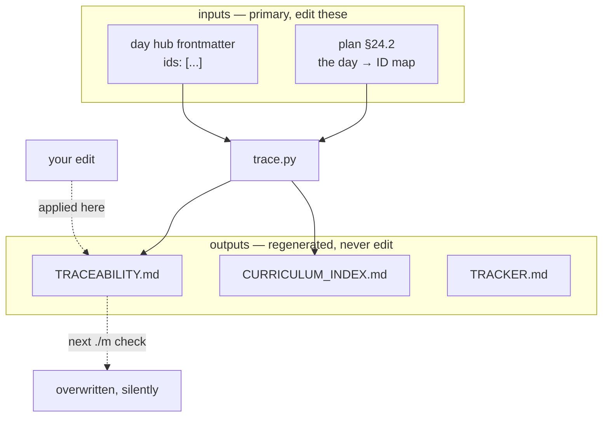

# 3.4 — 💥 Editing a generated ledger: the edit that disappears without a trace

## One-line answer

A generated file looks exactly like a hand-written one, so somebody will eventually correct a wrong
line in it — and that correction is destroyed by the next `./m check` with no message, no conflict
and no record that anybody ever tried.

---

## The story

🎬 **The scene.** Somebody is reading a status table and spots an error: a row says a piece of work is
incomplete when they know it is finished. It is a small, obvious, factual mistake. They fix the line,
commit, and move on. It takes twenty seconds and it is the right instinct — you found a wrong thing,
you fixed the wrong thing.

😬 **The naive fix.** That *is* the naive fix, and it is what makes this failure worth its own part:
there is no bad judgement involved. The file is markdown, it is in the repository, it is tracked by
git, and it contains a wrong statement. Every property of it says "editable document".

💥 **Why it fails.** The file is an **output**. The next time anybody runs the checks, the generator
overwrites it from its inputs, and the correction is gone. No conflict — git sees a file changed by a
process, which is what generators do. No error — the generator does not know or care what was there
before. And crucially: **the underlying wrong fact is still wrong**, because it lives in the input the
generator reads, which nobody touched. The table goes back to saying the same wrong thing, and the
person who fixed it is no longer looking.

💡 **The insight.** The correction was applied to the **reflection instead of the object**. This is not
really about generated files; it is about a class of mistake where feedback goes to the wrong layer —
fixing a symptom in a rendered view, patching a dashboard rather than the metric, editing a compiled
artifact. The tell is always the same: **the fix works, and then quietly stops working**, which is
worse than a fix that fails immediately, because you have already stopped watching.

---

## The idea in plain language

Three of this project's ten ledgers are generated (part [3.3](3.3-the-generated-three.md)). They are
markdown, tracked, and indistinguishable at a glance from the seven that are written by hand.

That indistinguishability is the whole hazard. A `.pyc` file nobody edits, because it does not look
editable. A generated markdown table looks exactly like the thing you are supposed to maintain.

Three defences, in increasing order of how much they actually work:

| Defence | What it does | Why it is not enough |
| --- | --- | --- |
| A **header** saying "do not edit" | tells a reader who is looking at the top of the file | somebody editing line 240 never saw line 3 |
| **Regenerate in CI**, fail on a diff | catches the edit before it merges | needs the pipeline; still after the fact |
| **Fix the input** | makes the correction survive | requires knowing which input — which is the real skill |

The third one is the actual lesson, and it generalises well past ledgers. When you find a wrong fact
in a derived artifact, the useful question is not "how do I correct this?" but **"what would have to
be true for the generator to produce the right thing?"** That question leads to the input; the first
one leads to a twenty-second fix that evaporates.

There is a related failure worth naming now, because it is the same shape in reverse: a generated file
that is **stale** — committed at some point and not regenerated since. It carries a generation date in
its header, which makes it look freshly derived while describing a state of the world that no longer
exists. A stale generated file is more misleading than a stale hand-written one, precisely because
its header asserts provenance.

---

## Why Akshara needs it

The three generated ledgers are exactly the ones somebody will want to correct, because they are the
ones that make claims about progress:

- **`TRACEABILITY.md`** says which IDs are closed. If it shows an ID open on a day you know you
  finished, the instinct to tick it is very strong — and the real cause is that the day's hub does
  not claim that ID, which is a genuine bug the ledger is *correctly reporting*.
- **`TRACKER.md`** marks days `⚠️ thin`. If a day you are proud of gets flagged, deleting the flag is
  tempting. The input is the part count on disk.
- **`CURRICULUM_INDEX.md`** maps ID to day. A wrong row means the **plan's §24.2** is wrong, which is
  a much more serious finding than a wrong table — and one that an edit to the table would conceal.

That last case is the argument for this part in one sentence. **Editing a generated file does not
just lose your change; it hides a real defect** in the source it was derived from, which is the
opposite of what a correction is supposed to do.

---

## The mechanism

Do it on purpose and watch the edit vanish.

```bash
uv run python scripts/trace.py
cp docs/TRACEABILITY.md /tmp/traceability-before.md
grep -n "IDs closed" docs/TRACEABILITY.md | head -2
```

**Line by line:**
- Regenerate first so you are starting from a known state rather than whatever was last committed.
- The copy to `/tmp` is the baseline. Every experiment in this curriculum takes a before-reading;
  without one, the after-reading means nothing.

Now make a plausible, well-intentioned correction:

```bash
sed -i 's/\*\*0 \/ 309 IDs closed\*\*/**4 \/ 309 IDs closed**/' docs/TRACEABILITY.md
grep -n "IDs closed" docs/TRACEABILITY.md | head -1
diff /tmp/traceability-before.md docs/TRACEABILITY.md | head -4
```

**Line by line:**
- The edit claims four IDs are closed. This is exactly the shape of a real correction: somebody
  finished Day 1, which closes `OPS-01..04`, and the table has not caught up.
- The `grep` confirms the edit landed — the file now says what you wanted.
- `diff` against the baseline shows a real, committed-if-you-commit-it change. **At this moment
  everything looks like a successful fix**, and that is the state the failure depends on.

Now do the most ordinary thing in the project:

```bash
./m check > /dev/null 2>&1
grep -n "IDs closed" docs/TRACEABILITY.md | head -1
diff /tmp/traceability-before.md docs/TRACEABILITY.md && echo "IDENTICAL to before your edit"
```

**Line by line:**
- `./m check` runs `trace.py` as its last step (Day 0, part
  [4.2](../../../day-000-toolchain-skeleton-driver/parts/04-the-driver/4.2-building-the-driver.md)).
  It is not a special command — it is the gate everybody runs before every commit.
- The `grep` now shows the original number. Your edit is gone.
- `diff` prints nothing and the `&&` fires: the file is byte-identical to before you touched it.
  **No warning was printed at any point.** The check reported green, because from its point of view
  nothing unusual happened.

The two layers, and where a correction has to land:



Now fix it properly — at the input:

```bash
grep -n '^ids:' days/day-001-bootstrap-and-map/LESSON.md
./m check > /dev/null 2>&1; grep -n "IDs closed" docs/TRACEABILITY.md | head -1
```

**Line by line:**
- The hub's `ids:` frontmatter is the input. When Day 1 genuinely claims `OPS-01..04`, the generator
  reports four closed without anybody editing a table.
- The second line regenerates and reads the number. **This correction survives**, because it changed
  the fact rather than the report of the fact.

---

## When it breaks

There is no error. That is the defining property and the reason this is a `production` part rather
than a footnote.

What you see is a green gate:

```console
$ ./m check
traceability: 0/309 closed, 0 problem(s)
OK all green
```

Zero problems, on a run that just discarded somebody's work. The generator is behaving exactly as
designed; it has no concept of an edit it should preserve.

The closest thing to a loud version is the CI check that most projects add after being bitten once:

```console
$ git diff --exit-code docs/TRACEABILITY.md
diff --git a/docs/TRACEABILITY.md b/docs/TRACEABILITY.md
-**4 / 309 IDs closed**
+**0 / 309 IDs closed**
error: generated file differs from committed version — regenerate and commit
```

That is the mechanical defence and it belongs in the pipeline. It catches the edit *before* it is
merged, though it still does not stop somebody making it.

**The silent version has a second form that is worse**, and it is worth knowing about: a generated
file that is committed and then never regenerated. It sits there with a header saying
*"Generated 2026-08-25"* while describing a repository that has moved on for months. Nothing is wrong
with any individual line, and the file asserts its own freshness.

Detect both by regenerating and asking whether anything changed:

```bash
./m trace > /dev/null 2>&1
git diff --stat -- docs/TRACEABILITY.md docs/TRACKER.md docs/CURRICULUM_INDEX.md
```

**Line by line:**
- Regenerate, then diff the generated files against what is committed.
- **Any output means the committed copies were stale or hand-edited** — and you cannot tell which
  from the diff alone, which is precisely why both failures need the same fix: regenerate, inspect,
  commit.
- No output means the repository and its derived views agree. This is a good line to run before
  finishing any day, and a good candidate for the `TODO(me)` that wires it into `./m check`.

---

## In production

**What a research engineer does instead of the teaching version.** They make the file
unmistakably an output. Generated artifacts go in a directory whose name says so — `build/`,
`generated/` — or carry an extension nobody edits, and CI fails on any diff after regeneration. The
strongest version is to not commit them at all and render them on demand; this project commits them
because a cloned repository should be readable without running anything, and that convenience is paid
for with the risk this part is about. **That is a real trade, made deliberately** — which is the
difference between accepting a hazard and not noticing one.

**What degrades at scale.** Generated files multiply and it stops being obvious which is which. Two
things help, and neither is a policy: a **naming convention** so the answer is visible in the path,
and a **regeneration check in CI** so being wrong is loud rather than silent. A "do not edit" header
alone has a well-known failure rate, because people arrive at line 240 without passing line 3.

**The failure that only shows with real data.** The most damaging version is not a lost edit — it is a
**concealed defect**. Somebody notices `CURRICULUM_INDEX.md` maps an ID to the wrong day, fixes the
table, and the actual bug in the plan's §24.2 survives. The table is right for one commit and the
plan stays wrong for a hundred days. **Correcting a symptom can be worse than leaving it**, because a
visible wrong number attracts attention and a silently-restored one does not.

**The review comment.** *"`TRACKER.md` changed in this diff but no day folder did — did you edit a
generated file?"* A generated artifact moving without its inputs moving is a reliable signal, and it
is visible from the diff stat without reading the content.

**The interview question.** *"You find an error in an auto-generated report. What do you do?"* The weak
answer fixes the report. The strong answer traces it to the input, fixes that, regenerates, and then
asks the more interesting question: *why did the generator produce something wrong, and what else has
it been wrong about?* One wrong row is rarely alone.

**Compute tier: T0.** Laptop CPU. The whole demonstration is a `sed`, a `./m check` and a `diff` — and
doing it on Day 1 is what stops it happening for real on Day 68, when the traceability table is what
a phase gate depends on.

---

## Check yourself

Run this. It prints the **number of lines that differ** between the committed generated ledgers and a
fresh regeneration — and it must be `0`:

```bash
./m trace > /dev/null 2>&1
./m tracker > /dev/null 2>&1
git diff --numstat -- docs/TRACEABILITY.md docs/TRACKER.md docs/CURRICULUM_INDEX.md | awk '{s+=$1+$2} END {print "differing lines:", s+0}'
```

**Line by line:**
- Regenerate both sets, then count added plus removed lines against what is committed.
- **`0` means the committed views agree with reality.** Anything else means they were stale, or
  somebody hand-edited them, and the fix is the same either way: regenerate, read the diff to
  understand *why* it changed, then commit.
- Run this as the last thing before `./m done` on any day. A generated ledger that disagrees with its
  inputs is a lie that the repository is telling on your behalf.

**Say this out loud, without scrolling up:** why is editing a generated ledger worse than leaving the
wrong number visible — and what is the question to ask instead of "how do I correct this?"
