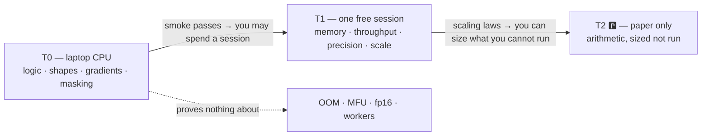

# 4.1 — Three tiers, and exactly what a CPU run proves

## One-line answer

Every day in this plan runs on a laptop CPU (T0), one free notebook GPU session (T1), or is
deliberately parked with its arithmetic worked but not run (T2) — and knowing precisely **what a T0
run proves and what it cannot** is the difference between a cheap check and a false reassurance.

---

## The story

Somebody tests a system at small scale before committing to an expensive run. The small test passes.
Everything looks correct.

The expensive run fails, in a way the small test could never have detected — not because the small
test was badly done, but because the thing that broke does not exist at small scale. There was no
memory pressure, so nothing ran out of memory. There was one worker, so no race. The data fitted in
a single batch, so the batching was never exercised.

Afterwards it seems obvious. At the time it was not, because the small test was *genuinely testing
something* and passing, and there is no signal that distinguishes "this passed and covers the risk"
from "this passed and does not".

The mistake was never running the small test. The mistake was not writing down **what the small test
was evidence of** — so its silence on everything else got read as reassurance.

---

## The idea in plain language

Three tiers, and each answers a different question:

| Tier | Hardware | Costs | Answers |
| --- | --- | --- | --- |
| **T0** | your laptop CPU | nothing | *Is the logic right?* |
| **T1** | one free notebook GPU session, pre-emptible | a session you cannot get back | *Does it work at a scale where the result means something?* |
| **T2** 🅿️ | cannot be done at $0 | — | *Can you size and defend it on paper?* |

The important content is not the table. It is the **boundary** — what T0 evidence covers and where
it goes silent.

A T0 run genuinely proves:

- the code executes end to end, and the shapes line up;
- the loss decreases on a tiny sample, so gradients flow and the sign is right;
- one batch can be overfitted (Principle 12) — the model has enough capacity to memorise sixteen
  examples, which means the wiring is correct;
- the data pipeline yields what you think it yields, and the labels are masked where you think.

A T0 run proves **nothing at all** about:

- memory at scale — no OOM can occur when nothing is large;
- throughput, and therefore whether a run fits in a session;
- numerical behaviour in reduced precision — fp16 and bf16 do not behave like fp32, and a laptop CPU
  is usually running fp32;
- anything that only appears with many workers, many steps, or a real corpus.

That second list is why the discipline is not "test small then go big". It is: **say, in words, which
list each check belongs to.** A T0 check that is described as proving the run will work is worse than
no check, because it converts a genuine partial result into a false whole one.

---

## Why Akshara needs it

The $0 constraint (plan §4) is not a limitation to work around here — it is what forces the
curriculum's most useful content. A researcher with eight GPUs never learns the memory equation
because they never have to. You will, on Day 78, and it will be load-bearing on Day 66 when
Akshara's parameter count is derived from a T4's actual VRAM.

The concrete schedule this tiering has to survive:

- **Days 2–66** are almost entirely T0. Every hand-rolled mechanism — BPE, autograd, attention, the
  block, samplers, the KV cache, quantization arithmetic — runs on a laptop.
- **Day 67** is the first real T1 run: pretraining, inside one pre-emptible session.
- **Days 89, 94, 123, 134** are the other T1 days: the LoRA fine-tune, DPO, the vision–language
  projector, the diffusion model.
- **T2 🅿️** covers what genuinely cannot be done at $0 — frontier-scale pretraining, multi-node FSDP,
  full-parameter 7B fine-tuning, PPO at scale. These are taught **with the arithmetic worked**, so a
  run you cannot afford is still a run you can size, staff and defend.

And the rule that makes all of it safe: **no day may silently require a GPU.** Every training script
runs on CPU at a toy scale, and the day says what the toy scale proves. A learner without a working
notebook session can still complete every day's understanding, which is what makes the plan
finishable rather than aspirational.

---

## The mechanism

Make the tier a property of the code, not of a comment. One helper, in `akshara/config.py` next to
`load_env` from part [2.2](../02-secrets-and-tokens/2.2-reading-env-without-a-dependency.md):

```python
import os


def device() -> str:
    """Return the device to run on: 'cuda' when available and not overridden, else 'cpu'.

    AKSHARA_FORCE_CPU=1 forces CPU even on a GPU machine. That switch exists so the T0
    path can be exercised deliberately on hardware that would otherwise hide it —
    a CPU path that is never run is a CPU path that has quietly rotted.
    """
    if os.environ.get("AKSHARA_FORCE_CPU") == "1":
        return "cpu"
    try:
        import torch
    except ImportError:
        return "cpu"
    return "cuda" if torch.cuda.is_available() else "cpu"
```

**Line by line:**
- `AKSHARA_FORCE_CPU` is checked **first**, before anything else, so the override always wins. It
  comes from `.env` (part [2.1](../02-secrets-and-tokens/2.1-the-token-in-one-place.md)) and its job
  is to let you run the T0 path on purpose. Without it, the CPU branch is only exercised by people
  who lack a GPU — which means it breaks and nobody notices until Day 67, on the machine where you
  cannot debug comfortably.
- `except ImportError: return "cpu"` — torch is not installed until Day 51. A helper written on Day 1
  that crashes for fifty days is a helper nobody keeps.
- The function returns a **string**, not a torch object, so it can be called before torch exists and
  logged into a `RUNS.md` row without importing anything.
- What is deliberately absent: any automatic scaling of batch size or model size by device. That
  would make a T0 run and a T1 run silently different experiments, and the whole point of the tier
  boundary is to know **which** experiment you ran.

Now the part that turns a tier into evidence. Every training entry point states what its small run
proves:

```python
SMOKE = dict(steps=20, batch=2, block=32, n_layer=2, n_head=2, n_embd=64)

SMOKE_PROVES = """T0 smoke run. PROVES: shapes line up, loss decreases, one batch overfits,
labels masked as expected. PROVES NOTHING about: memory at scale, throughput, fp16/bf16
numerics, dataloader behaviour with many workers. Do not read a green smoke run as
evidence the T1 run will fit."""
```

**Line by line:**
- `SMOKE` is a config small enough to run in seconds on a CPU. The values are deliberately tiny —
  two layers, two heads — because the point is coverage of the code path, not of the model.
- `SMOKE_PROVES` is the unusual part and it is the entire lesson of this document, written where
  somebody will read it. It is printed at the start of the smoke run and pasted into the
  `docs/RUNS.md` note.
- Writing the **negative** list is what stops a green smoke run being quoted as reassurance later.
  This is the same discipline as the `Silent failure ruled out` column in part
  [3.2](../03-the-ledgers/3.2-runs-md-turns-anecdote-into-result.md): stating what you did *not*
  establish is what makes the claim honest.

Where each day sits, and what carries across the boundary:



---

## When it breaks

The loud failure, and it is the one that costs a session:

```console
torch.OutOfMemoryError: CUDA out of memory. Tried to allocate 1.50 GiB. GPU 0 has a total
capacity of 14.74 GiB of which 84.19 MiB is free. Process 1 has 14.66 GiB memory in use.
```

Nothing on a laptop can produce this, which is exactly the point. The T0 smoke run was green and had
no opinion about memory. The defence is not a better smoke test — it is the memory equation on Day 78
and the sizing arithmetic on Day 66, which let you predict this number **before** spending the
session rather than discovering it inside one.

**The silent version, which is worse.** The code has a branch that only runs on GPU — a `.cuda()`
call, an autocast context, a fused kernel path — and the CPU run takes the other branch. Everything
passes on the laptop for weeks. On Day 67 the GPU path executes for the first time, in a metered
session, and it is subtly different: a dtype changes, a reduction happens in a different order, a
mask is applied in the wrong place. Nothing errors. The loss curve looks plausible. **You have
trained a different model than the one you tested**, and no output says so.

Detect it by running the GPU-shaped path on CPU on purpose:

```bash
AKSHARA_FORCE_CPU=1 uv run python -c "
from akshara.config import device
print('device:', device())
"
```

**Line by line:**
- Forcing CPU on a machine that has a GPU is the only way to exercise the T0 branch deliberately.
  Somebody must run this, or the CPU path is tested only by accident.
- The deeper version of the check, from Day 51 onward, is to run the smoke config **both ways** and
  compare the loss after a fixed number of steps with a fixed seed. They will not match exactly —
  different hardware, different reduction order — but they must be **close**, and "close" is a number
  you decide in advance rather than after seeing the result.
- Any large divergence means the two devices are running different logic, which is a bug you want to
  find on Day 51 and not on Day 67.

---

## In production

**What a research engineer does instead of the teaching version.** They run a **scaled ladder**, not
a binary. Smoke on CPU, a short run on one GPU, a longer run at a fraction of the target, then the
real thing — with the loss at each rung predicted before it is run. That prediction is what makes
scaling laws practical rather than decorative (Days 65–66): a rung that lands far from prediction is
a bug, and finding it at rung two costs minutes instead of a session. The habit is the same one this
part is about, applied repeatedly: **know what each rung proves, and check the prediction rather than
the vibe.**

**What degrades at scale.** The CPU path rots. Once a team has reliable GPUs, nobody runs the CPU
branch, and it breaks silently — which then blocks the next person who does not have a GPU, usually a
new joiner on their first day. The `AKSHARA_FORCE_CPU` switch plus a CPU-only test gate (Day 0, part
[4.2](../../../day-000-toolchain-skeleton-driver/parts/04-the-driver/4.2-building-the-driver.md)) is
what keeps it alive. This is not charity toward laptop users: **the CPU path is the only path you can
debug with a debugger**, and you will want it on the day something is wrong.

**The failure that only shows with real data.** Pre-emption. A free session is reclaimed mid-run, and
no amount of T0 testing prepares for it because a laptop is never pre-empted. That is why
checkpoint-and-resume is taught on Day 58, **before** the first real run on Day 67 — and why part
[4.4](4.4-the-session-that-vanished.md) is a failure lab rather than a footnote.

**The review comment.** *"This says the smoke test passes — what does the smoke test cover, and what
does it not?"* If the second half is unanswerable, the test is being used as reassurance rather than
as evidence.

**The interview question.** *"You can't afford to run the full job. How do you gain confidence?"* The
weak answer says "test on a subset". The strong answer separates what a subset can establish
(correctness, gradient flow, data handling) from what only scale can (memory, throughput, precision,
convergence), and names the arithmetic used to predict the second group — because the honest position
is not "I tested it", it is "I know what I did not test, and here is my estimate for it."

**Compute tier: T0**, and the whole point of the part. Everything here runs on a laptop, including
the deliberate exercise of the CPU branch on a machine that has a GPU.

---

## Check yourself

Run this. It prints your **device** and the number of days at each tier in the plan:

```bash
uv run python -c "
import os
os.environ.setdefault('AKSHARA_FORCE_CPU','0')
try:
    from akshara.config import device; print('device:', device())
except ImportError: print('device: cpu (akshara.config not written yet)')
"
grep -c 'T1' docs/00_MASTER_PLAN.md
```

**Line by line:**
- The first tells you what your machine will actually use — the observation habit from Day 0 part
  [1.3](../../../day-000-toolchain-skeleton-driver/parts/01-the-toolchain/1.3-observed-is-not-available.md),
  applied to hardware. On most laptops it prints `cpu`, and **that is the expected answer for
  approximately a hundred and fifty of the hundred and sixty-two days.**
- The second is a rough count of T1 mentions in the plan. The precise number matters less than the
  ratio: this is a curriculum that runs on the machine you already own.

**Say this out loud, without scrolling up:** name two things a T0 smoke run genuinely proves and two
it proves nothing about — and say why the CPU path needs to be run deliberately on a machine that has
a GPU.
