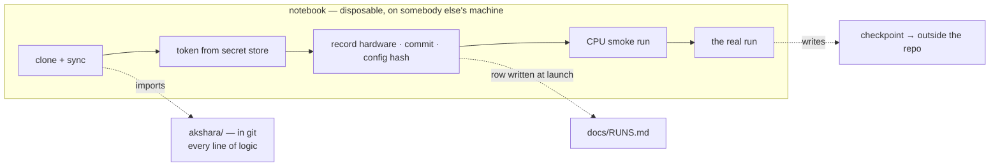

# 4.3 — The notebook ↔ module discipline: the notebook is a remote control

## One-line answer

A notebook clones the repository, imports the code, and calls it — it never *contains* the logic —
because a notebook cell is the one place in this project where work can be simultaneously essential,
uncommitted, and destroyed without warning.

---

## The story

Somebody works in a notebook because a notebook is genuinely the right tool: the feedback loop is
immediate, state persists between cells, and you can look at intermediate results without
instrumenting anything.

The work goes well. A function gets written in a cell and improved over an afternoon. Another cell
uses it. Then a third, with a small variation, because editing the first one would mean re-running
everything that depends on it.

At the end of the day the notebook is saved and committed. It works — as long as the cells are run in
the order they were written, which is not the order they appear, because two of them were edited
after the fact and one is dead.

Weeks later somebody needs that function somewhere else. It cannot be imported, because it is not in
a module. They copy it. Now there are two, and the notebook's copy is the one that produced the
result everybody is quoting, and the module's copy is the one that gets maintained.

Nothing broke. **Notebooks are excellent at exploration and terrible at being the place things live**,
and the transition from the first to the second happens without anybody deciding it has.

---

## The idea in plain language

A notebook has three properties that make it a good scratchpad and a bad home.

**Execution order is not file order.** Cells can be run in any sequence, and the saved file records
their *position*, not their *history*. A notebook that works in your session may not work top to
bottom, and there is no signal distinguishing the two states.

**It carries its outputs** (part [2.3](../02-secrets-and-tokens/2.3-the-token-that-leaked.md)), so
diffs are unreadable and the file grows.

**It cannot be imported.** Code inside a notebook is unavailable to tests, to scripts, and to other
notebooks — which means any logic living there is either duplicated or unreachable.

The discipline that follows is one sentence:

> **The notebook is a remote control. The logic lives in `akshara/`.**

A cell may: clone the repository, install dependencies, set environment variables, call a function,
and display a result. A cell may not: define the training loop, define the model, or contain any
logic somebody would want to reuse, test, or fix.

The test for whether you are complying is sharper than it sounds: **if the session vanished right
now, what would be lost?** If the answer is anything other than output you can regenerate by running
the notebook again, the discipline has already slipped.

---

## Why Akshara needs it

Five T1 days — **67, 89, 94, 123, 134** — run on a machine that is not yours and is rebuilt from
nothing. That combination is what makes this a correctness rule rather than a style preference:

- **The session is pre-emptible.** Logic in a cell is logic that can be destroyed mid-edit, with no
  local copy (part [4.4](4.4-the-session-that-vanished.md)).
- **The environment is rebuilt every time.** A notebook that depends on state established by a cell
  somebody ran once, four sessions ago, is not reproducible.
- **`tests/` cannot reach it.** Day 59's unit tests import from `akshara/`. A training loop defined
  in a cell is untested, permanently, and it is the code you least want untested.
- **Day 90 compares a fine-tune against a base model**, which requires that both runs used the same
  data pipeline. If the pipeline lives in two notebooks, "the same" is a hope.

And the plan's own rule from Day 0, part
[2.1](../../../day-000-toolchain-skeleton-driver/parts/02-the-skeleton/2.1-directories-as-argument.md):
`notebooks/` refuses to hold **the only copy of any logic**. Today that refusal becomes a procedure.

---

## The mechanism

Every T1 notebook in this project has the same five cells, in this order, and nothing else structural.

**Cell 1 — get the code.**

```python
!git clone --depth 1 https://github.com/<you>/genai.git
%cd genai
!pip -q install uv && uv sync --quiet
```

**Line by line:**
- `--depth 1` fetches only the latest commit. The history is not needed on a throwaway machine, and
  a shallow clone is faster — which matters when it is the first thing burning a metered session.
- `%cd` is a notebook magic that changes the **kernel's** working directory, not just a subprocess's.
  A plain `!cd genai` would change directory inside a shell that exits immediately, and every
  subsequent cell would be in the wrong place.
- `uv sync` rebuilds the exact environment from the committed lockfile (Day 0, part
  [1.2](../../../day-000-toolchain-skeleton-driver/parts/01-the-toolchain/1.2-uv-owns-the-environment.md)).
  **This is the payoff for pinning on Day 0**: the environment here is the environment on your
  laptop, not an approximation of it.

**Cell 2 — the token, from the platform's secret store.**

```python
from google.colab import userdata
import os
os.environ["HF_TOKEN"] = userdata.get("HF_TOKEN")
print("token present:", bool(os.environ.get("HF_TOKEN")))
```

**Line by line:**
- The token comes from the platform's secret store, never a literal. It is set into `os.environ`, so
  the package's `load_env` (part
  [2.2](../02-secrets-and-tokens/2.2-reading-env-without-a-dependency.md)) sees it and — because the
  real environment wins — does not overwrite it with anything from a file.
- `print(bool(...))` prints a **boolean, never the value**.

**Cell 3 — record the hardware, before anything is spent.**

```python
!nvidia-smi --query-gpu=name,memory.total --format=csv,noheader
!git rev-parse --short HEAD
!git hash-object configs/base-12m.yaml | cut -c1-7
```

**Line by line:**
- Three facts that a `docs/RUNS.md` row needs and that are unavailable afterwards: the device, the
  code version, and the config hash.
- `git rev-parse --short HEAD` pins **which commit** produced the run. Without it, "the code at the
  time" is unrecoverable — the repository moves on.
- Running this in cell 3, before training starts, means the row can be written at launch rather than
  at exit, which is what makes a pre-empted run recoverable as information (part
  [4.2](4.2-the-accounts-and-what-they-cost.md)).

**Cell 4 — the smoke run, on CPU.**

```python
!AKSHARA_FORCE_CPU=1 uv run python -m akshara.train.run --config configs/smoke.yaml
```

**Line by line:**
- The tiny CPU configuration from part [4.1](4.1-three-tiers-and-what-cpu-proves.md), run **before**
  spending GPU-minutes. It proves the code path executes end to end on this machine with this
  environment.
- `AKSHARA_FORCE_CPU=1` forces the CPU branch so the smoke test exercises the same path your laptop
  does. Without it the smoke run would use the GPU and prove something different from what it proves
  at home.
- `python -m akshara.train.run` — a **module**, not a cell. This is the discipline in one line: the
  notebook invokes, the package implements.

**Cell 5 — the real run.**

```python
!uv run python -m akshara.train.run --config configs/base-12m.yaml --seed 1337
```

**Line by line:**
- One command. Every parameter is in a committed config file and a seed on the command line, both of
  which appear in the `RUNS.md` row.
- **No logic in this cell.** If the session dies here, nothing is lost that is not in git or in a
  checkpoint — which is precisely the property being engineered.

The shape of it:



---

## When it breaks

The loud failure, on a fresh session where somebody relied on out-of-order state:

```console
NameError: name 'train_step' is not defined
```

A cell used something defined in a cell that has not been run yet — or was deleted. The notebook
worked in the session where it was written and does not work top to bottom, and there was no signal
distinguishing the two.

The other loud one, and it is a good failure:

```console
ModuleNotFoundError: No module named 'akshara'
```

`uv sync` did not run, or `%cd` did not take effect and you are in the wrong directory. It stops
immediately rather than silently importing a stale copy from somewhere else.

**The silent version, which is the one this discipline exists to prevent.** A function is defined in
a cell **and** exists in `akshara/`. The notebook's copy shadows the imported one — it was defined
later in the session — so the run uses the cell version. Everything works. The loss curve is
plausible. The checkpoint is real.

And it was trained by code that is not in the repository. Day 90 then compares that model against one
trained by the module version, attributes the difference to the fine-tuning, and is wrong.

Detect it by asking where a function **actually came from**, not whether it exists:

```python
import inspect
from akshara.train import loop
print(inspect.getsourcefile(loop.train_step))
```

**Line by line:**
- `inspect.getsourcefile` reports the file an object was defined in. A path under `akshara/` means
  the imported version is what will run.
- `None`, or an error about a built-in, means it was defined **in the notebook** and is shadowing the
  package — the failure above, caught before it produces a checkpoint.
- This is the observation habit from Day 0's part
  [1.3](../../../day-000-toolchain-skeleton-driver/parts/01-the-toolchain/1.3-observed-is-not-available.md)
  again: ask the object where it came from rather than trusting that the name resolves to what you
  meant. Run it in cell 4, before the expensive cell.

---

## In production

**What a research engineer does instead of the teaching version.** They remove the notebook from the
critical path entirely. Experiments are launched by a job submission — a script, a queue, a
container — and the notebook, if it survives at all, becomes a place to *look at results* rather than
to produce them. The intermediate step used here (notebook as remote control, logic in a package) is
the practical version for a single person on free compute, and it keeps the property that matters:
**everything that runs is in version control.**

**What degrades at scale.** Notebooks stop being reviewable long before they stop being useful. A
diff of a notebook with outputs is unreadable, so changes go unreviewed, so the notebook accumulates
things nobody has looked at. `nbstripout` (part
[2.3](../02-secrets-and-tokens/2.3-the-token-that-leaked.md)) makes diffs legible; keeping cells to
invocations keeps them short enough to read. Both are needed — a stripped notebook full of logic is
reviewable and still wrong.

**The failure that only shows with real data.** Long-running work makes this discipline *harder*
exactly when it matters most. Halfway through a session something needs a small change, and editing
a cell is thirty seconds while editing the module, committing and re-cloning is several minutes of a
metered resource. The pressure is real. The honest answer is a middle path: edit the module **on the
mounted clone**, run it, and commit before the session ends — never edit a cell. That preserves the
invariant that everything which ran is in a file that can be committed, which is the only invariant
that matters here.

**The review comment.** *"This notebook defines a function — should it be in `akshara/`?"* Almost
always yes, and the test is whether anything else would ever want it: a test, another notebook, a
script. If yes, it is a module.

**The interview question.** *"How do you keep notebook-based research reproducible?"* The weak answer
is "commit the notebook". The strong answer distinguishes exploration from execution: notebooks
explore, modules execute, and the notebook's job is to invoke committed code with committed
parameters — plus the observation that out-of-order execution means a notebook that works is not
evidence that it works.

**Compute tier: T1** for the notebook, **T0** for everything it calls before cell 5. That split is the
whole design: the expensive cell does nothing that has not already been proven cheaply.

---

## Check yourself

Run this on your laptop. It prints the **number of lines of logic** in your notebooks — which should
stay near zero for the whole project:

```bash
find notebooks -name '*.ipynb' 2>/dev/null | while read -r f; do
  python -c "
import json,sys
nb=json.load(open(sys.argv[1],encoding='utf-8'))
src=[l for c in nb.get('cells',[]) for l in c.get('source',[])]
logic=[l for l in src if l.lstrip().startswith(('def ','class '))]
print(f'{sys.argv[1]}: {len(src)} lines, {len(logic)} definitions')
" "$f"
done
echo "(no notebooks yet is the correct Day 1 answer)"
```

**Line by line:**
- Counts total source lines and, separately, **`def` and `class` definitions** in every notebook.
- The second number is the one that matters. **Any definition in a notebook is logic that is not
  importable, not testable, and not safe from a reclaimed session.**
- Re-run it after Day 67. A notebook with five cells and zero definitions is the discipline holding;
  a notebook with a `def` in it is a copy of something that should live in `akshara/`.

**Say this out loud, without scrolling up:** why is "it ran in my session" not evidence that a
notebook works — and what is the one question that tells you whether the discipline has slipped?
