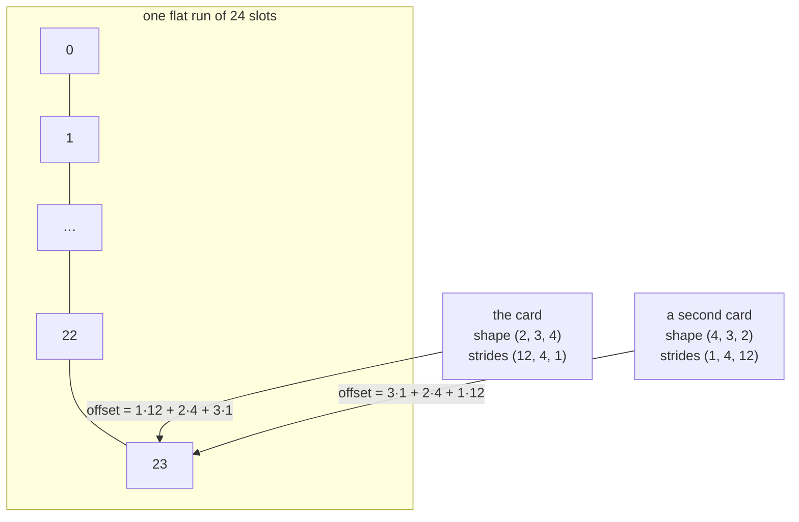

# 1.1 — The array that is actually flat

## One-line answer

A tensor is not a box of boxes: it is **one flat run of numbers** plus a small set of instructions —
shape, strides and dtype — that tell you which position in that flat run any coordinate refers to.

---

## The story

A school corridor has 24 lockers. They stand in one straight line along the wall, numbered 0 to 23.

The warden has to hand them out to two classes. Each class has three groups, and each group has four
students. That is 2 x 3 x 4 = 24, so there are exactly enough lockers. But nobody is going to unscrew
anything and rebuild the wall. Instead, a small card goes up on the wall beside the first locker:

> Class 1 starts at locker 12. Inside a class, each new group starts 4 lockers later. Inside a group,
> each new student is the next locker along.

Now anyone can find "class 1, group 2, student 3". You add it up on the card: 12 for the class, plus
8 for the two groups, plus 3 for the student. That is locker 23. You walk to locker 23, and it is
yours.

Not one locker moved. They are still one straight line on one wall. The card is the only thing that
turned them into classes and groups.

A week later the office asks for the same lockers listed the other way round: student first, then
group, then class. The warden does not touch the wall. A second card goes up, with the three numbers
read in the opposite order. Two ways of reading, one row of lockers, nothing moved.

That card is the whole idea of this document.
---

## The idea in plain language

Computer memory is one long line of numbered slots. There is no second dimension in it and no third.
When a program says it is holding "a 2×3×4 block of numbers", the numbers are still sitting in a
straight line; what makes them a block is a small description carried alongside them.

The description has three parts, and every one of them is a separate idea:

**Shape.** How many numbers along each axis. `(2, 3, 4)` means: two of the outermost thing, each
containing three of the next thing, each containing four numbers. Shape says nothing about where the
numbers are — only how many there are and how they are grouped.

**Strides.** How far to walk in the flat line when you take one step along an axis. If the strides
are `(12, 4, 1)` then moving one step along the first axis skips 12 numbers, one step along the
second skips 4, and one step along the last skips 1. Strides are the card on the wall beside the
lockers.

**dtype.** What kind of number each slot holds, and therefore **how many bytes wide** each slot is.
A slot holding a whole number in 8 bits and a slot holding a decimal in 64 bits are not the same
size, so the same shape can occupy very different amounts of memory. That is the subject of the next
part, [1.2](1.2-dtype-the-width-of-a-number.md).

Given those three things, finding an element is one line of arithmetic:

> **offset = sum over axes of (index along that axis × stride for that axis)**

That is it. No nesting, no pointer-chasing, no lists inside lists. One multiply-and-add per axis, and
you have the position in the flat run.

Two words that will be used constantly from here on:

- **Axis** (also called a *dimension*): one of the numbers in the shape. A shape of `(2, 3, 4)` has
  three axes. Axis 0 is the leftmost.
- **Rank**: how many axes there are. `(2, 3, 4)` has rank 3. A single number has rank 0, a list of
  numbers rank 1, a table rank 2.

And the word being defined: a **tensor** is a flat buffer of numbers of one dtype, plus a shape and
strides describing how to read it as a rank-*n* grid. "Array", "ndarray" and "tensor" all mean this;
the word changes with the library, not the idea.

---

## Why Akshara needs it

Three concrete places, all of them later in this repository:

- **Day 30** builds scaled dot-product attention, whose central operation reshapes a tensor of shape
  `(B, T, C)` into `(B, T, H, hs)` and then swaps two axes to get `(B, H, T, hs)`. That swap is
  *purely a strides edit*. If you believe a tensor is nested lists, that operation looks like it must
  copy and rebuild the whole buffer, and you will write it defensively and slowly. If you know it is
  a card pinned beside a row of lockers, you know it is free — and you also know exactly when it stops being
  free, which is [1.3](1.3-strides-and-the-free-transpose.md).
- **Day 39** counts every parameter of Akshara v0 by hand and checks the count against the model. A
  parameter count is a sum of `shape` products; a memory figure is that sum times the dtype width.
  Neither number is available to someone who has not separated shape from dtype.
- **Day 78** onward quantizes the model — the same shapes with a narrower dtype. The entire
  efficiency phase is the observation that shape and dtype are independent knobs, and that you can
  turn one without turning the other.

Every tensor bug you will hit between here and Day 161 is a shape bug, a stride bug or a dtype bug.
Today is where those three become separate words in your head instead of one blurry one.

---

## The mechanism

Build the card first. This is a tensor, in plain Python, with no library at all — because the point
is that *you* do the arithmetic (Principle 3: build first, compare after).

```python
from __future__ import annotations

from dataclasses import dataclass


def strides_for(shape: tuple[int, ...]) -> tuple[int, ...]:
    """Row-major strides: the last axis moves one slot at a time."""
    strides, acc = [], 1
    for dim in reversed(shape):
        strides.append(acc)
        acc *= dim
    return tuple(reversed(strides))


@dataclass
class FlatTensor:
    """A flat list of numbers, plus the card that makes it a grid."""

    data: list[float]              # the row of lockers: one straight line of numbers
    shape: tuple[int, ...]         # how many along each axis
    strides: tuple[int, ...]       # how far to walk per step along each axis

    @classmethod
    def zeros(cls, shape: tuple[int, ...]) -> FlatTensor:
        n = 1
        for dim in shape:
            n *= dim
        return cls([0.0] * n, shape, strides_for(shape))

    def offset(self, index: tuple[int, ...]) -> int:
        return sum(i * s for i, s in zip(index, self.strides, strict=True))

    def __getitem__(self, index: tuple[int, ...]) -> float:
        return self.data[self.offset(index)]

    def __setitem__(self, index: tuple[int, ...], value: float) -> None:
        self.data[self.offset(index)] = value
```

**Line by line:**
- `strides_for` walks the shape **backwards** and multiplies as it goes. That is the definition of
  *row-major* (also called *C-order*) layout: the **last** axis is the one whose neighbours sit next
  to each other in memory, so its stride is `1`. Walking backwards is not a trick — it is the only
  order in which each stride is the product of everything to its right, which is what the layout
  means. For `(2, 3, 4)` it returns `(12, 4, 1)`: stepping one block skips a whole 3×4 = 12-number
  block, stepping one row skips 4, stepping one seat skips 1.
- `acc` starts at `1`, not at `0`. The innermost stride is one slot, and a stride of zero would mean
  "stepping along this axis does not move" — which is a real and useful thing, but it is broadcasting
  ([2.1](../02-broadcasting-and-indexing/2.1-broadcasting-the-rule.md)), not layout.
- `data` is `list[float]`, one flat list. **There is no nesting anywhere in this class**, and that is
  the entire point. If you find yourself wanting `list[list[float]]`, you have gone back to the box
  of boxes.
- `zeros` computes the element count as the product of the shape, because that is exactly how many
  slots a shape of that size needs. `math.prod(shape)` would do the same in one call; the loop is
  written out so the arithmetic is visible.
- `offset` is the formula from above, and it is the only interesting method here.
  `zip(..., strict=True)` makes a rank mismatch raise immediately: indexing a rank-3 tensor with two
  coordinates is a bug, and `strict=True` says so instead of silently ignoring the missing axis.
  Without it, `zip` stops at the shorter argument and you get a wrong-but-plausible offset — the
  worst kind of failure.
- `__getitem__` and `__setitem__` do nothing except call `offset`. **All the structure lives in the
  arithmetic**; the storage is a straight line either way.

Run it and watch the card do its work:

```python
t = FlatTensor.zeros((2, 3, 4))
print(t.shape)                  # (2, 3, 4)
print(t.strides)                # (12, 4, 1)
print(len(t.data))              # 24  - one flat list, not 2 lists of 3 lists of 4

t[1, 2, 3] = 23.0
print(t.offset((1, 2, 3)))      # 23  = 1*12 + 2*4 + 3*1
print(t.data[23])               # 23.0 - the element really is at flat position 23
```

**Line by line:**
- `t.strides` prints `(12, 4, 1)` without anyone storing those numbers by hand: they are derived from
  the shape. Shape is the input; strides are a **consequence** of shape *and* of the chosen layout.
- `len(t.data)` is `24`, a single number, because there is one list. Nothing in this object is a list
  of lists. A `24` here and a `(2, 3, 4)` above are the same information seen from two sides.
- `t.offset((1, 2, 3))` prints `23`, and `t.data[23]` prints the value that was written through the
  three-coordinate interface. Those two lines are the proof that the coordinates were never real:
  they were arithmetic that resolved to a position in a straight line.

Measured on Intel Core i3-1115G4 (2 cores / 4 threads), 11.7 GB RAM, Windows 11, CPython 3.12.10,
2026-08-26. Every number in the block above is this file's own output, not a recollection.

And here is the same object as the library sees it. This is the compare half of Principle 3 — it
comes **after** you have written `offset` yourself, never before:

```python
import numpy as np

a = np.arange(24, dtype=np.int32).reshape(2, 3, 4)   # (2, 3, 4)
print(a.shape)          # (2, 3, 4)
print(a.strides)        # (48, 16, 4)
print(a.itemsize)       # 4
print(a.nbytes)         # 96
print(a[1, 2, 3])       # 23
print(a.ravel()[23])    # 23
```

**Line by line:**
- `np.arange(24)` makes the flat run directly — the row of lockers — and `.reshape(2, 3, 4)` pins a
  card to it. `reshape` on a contiguous array **copies nothing**; it returns a new description of the same
  bytes.
- `a.strides` is `(48, 16, 4)`, not `(12, 4, 1)`. NumPy counts strides in **bytes**, and each `int32`
  is 4 bytes wide, so every stride is the element-stride times 4. Both conventions are in use across
  libraries; the only thing that matters is knowing which one you are reading, because a
  byte-strides number looks like an element-strides number and there is nothing in the output to warn
  you.
- `a.itemsize` is `4` — that is the dtype width, and it is what converts one convention to the other.
- `a.nbytes` is `96` = 24 elements × 4 bytes. This is the number that decides whether a model fits in
  memory, and it is a shape fact times a dtype fact, never one of them alone.
- `a.ravel()[23]` prints the same `23` as `a[1, 2, 3]`, which is the library agreeing with the
  arithmetic you just wrote by hand. `ravel` returns the flat view — the lockers without the card.

Verified against `numpy` 2.5.2, attributes `numpy.ndarray.strides` and `numpy.ndarray.itemsize`
(doc pages `reference/generated/numpy.ndarray.strides.html` and `numpy.ndarray.itemsize.html`), read
2026-08-26. The version was resolved live from `https://pypi.org/pypi/numpy/json`, not written from
memory (Principle 6).

The picture, once, because this is a spatial idea:



Two cards, one row of lockers, the same slot reached by both — which is exactly what a transpose is, and it
is [1.3](1.3-strides-and-the-free-transpose.md).

---

## Shapes

| Tensor | Symbolic shape | Concrete here | What each axis means |
| --- | --- | --- | --- |
| `t.data` | `(N,)` | `(24,)` | the flat run; `N` is the product of the shape |
| `t` | `(D0, D1, D2)` | `(2, 3, 4)` | block · row within block · seat within row |
| `t.strides` | `(D1·D2, D2, 1)` | `(12, 4, 1)` | elements skipped per step along axis 0, 1, 2 |
| `a` (numpy) | `(D0, D1, D2)` | `(2, 3, 4)` | the same grid, `int32` |
| `a.strides` | bytes | `(48, 16, 4)` | **bytes** skipped per step — element strides × `itemsize` |
| `a.ravel()` | `(N,)` | `(24,)` | the same bytes with the card removed |

Curriculum-wide symbols start here and never change: `B` batch · `T` sequence position · `C`
channels (`d_model`) · `H` heads · `hs` head size · `V` vocabulary. A tensor written `(B, T, C)` on
Day 39 is read with exactly the arithmetic above.

---

## When it breaks

The loud failure — a shape whose element count does not match the buffer:

```console
>>> import numpy as np
>>> np.arange(10).reshape(3, 4)
Traceback (most recent call last):
  File "<stdin>", line 1, in <module>
ValueError: cannot reshape array of size 10 into shape (3,4)
```

What it means: `reshape` only ever re-tapes the card, so the new shape must describe **exactly** the
same number of slots. 3 × 4 is 12 and there are 10. The smallest fix is to work out which of the two
numbers you actually believe — the 10 or the 12 — because one of them came from somewhere wrong, and
reshaping to something that happens to fit will hide that rather than solve it.

The rank failure, which the hand-rolled class raises because of `strict=True`:

```console
>>> t = FlatTensor.zeros((2, 3, 4))
>>> t[1, 2]
Traceback (most recent call last):
  File "<stdin>", line 1, in <module>
  File "<stdin>", line 24, in __getitem__
  File "<stdin>", line 21, in offset
ValueError: zip() argument 2 is longer than argument 1
```

Without `strict=True` this returns `t.data[20]` — a real number, from the wrong place, with no
complaint. That difference is the whole reason the flag is there.

**The silent version, which is the one that costs a day.** Nothing raises. You have a rank-3 tensor
and you build a second one with the axes in a different order — say you meant `(B, T, C)` and
produced `(B, C, T)` — and both have the same element count, so every `reshape`, every sum and every
print works. The numbers are wrong and the program is healthy.

The check that catches it costs one line and is worth writing on every tensor you did not create
yourself:

```python
assert x.shape == (B, T, C), f"expected (B, T, C) = {(B, T, C)}, got {x.shape}"
```

**Line by line:**
- The message repeats the **expected** shape as well as the actual one. `assert x.shape == (B, T, C)`
  alone prints nothing useful when it fires; the interesting half of a shape bug is what you thought
  it was.
- Assert on the shape at the **boundary** — where a tensor arrives from another function, a file or a
  library — rather than everywhere. Inside a function you wrote, the shape is a consequence of lines
  you can read. Coming in from outside, it is a claim.
- This is Principle 20 in one line: *shapes are stated, never inferred*. Every part of this
  curriculum that touches a tensor carries the `## Shapes` table above for the same reason.

---

## In production

**What a research engineer writes instead of the teaching version.** Nobody hand-rolls
`FlatTensor` — they call the library. What they *do* carry is the model of it. Two habits give it
away. First, they say "that's a view" or "that's a copy" about a line of code, without running it,
because they are reading the strides in their head. Second, they annotate shapes in comments on every
line that changes one — `x = x.transpose(1, 2)  # (B, H, T, hs)` — which is not documentation, it is
how the next shape bug gets caught while typing rather than in a stack trace.

**What degrades at scale.** At 24 elements the card is a curiosity. At an embedding table of 32,000
rows by 768 channels it is the whole budget: that is 24,576,000 numbers, which is 93.8 MiB in 32-bit
floats and 46.9 MiB in 16-bit floats — computed by multiplying it out on this machine, 2026-08-26,
not quoted from anywhere. One tensor, two dtypes, a 47 MiB difference, and **the shape did not
change**. Every "will this fit on a free T4" question from Day 66 onward is this arithmetic, and it
is the reason shape and dtype must be separate ideas rather than one vague sense of "how big is it".

**The failure that only shows with real data.** Strides go wrong in the direction of *silently
correct-looking output* when a tensor arrives from outside your code — a memory-mapped file, a
`.npy` written by another process, a batch assembled by a data loader. The shape prints as expected
and the strides do not match the layout the consumer assumes, so a routine written for contiguous
input reads scattered memory. It does not crash; it gets slower, or wrong, or both. This is why
production data-loading code calls `np.ascontiguousarray` at the boundary and why the extra copy is
paid deliberately rather than avoided cleverly.

**The review comment.** *"You reshaped here — is that a view or a copy? If it's a copy, that's the
peak memory of this function, and it isn't in the budget."* A reviewer asking this is not being
pedantic: it is the single question that separates a function that fits on the device from one that
does not.

**The interview question.** *"A tensor has shape `(2, 3, 4)`. What is at flat position 23, and how do
you know?"* The weak answer describes nested lists. The strong answer gives the arithmetic —
`1×12 + 2×4 + 3×1` — and then, unprompted, says "in row-major layout; column-major would give a
different answer for the same shape", because the layout is a choice and knowing it is a choice is
the actual content of the question.

**Compute tier: T0.** Everything above runs on a laptop CPU. The T0 version proves the *arithmetic* —
that offsets, shapes and strides relate exactly as claimed. It proves nothing about throughput, cache
behaviour or what a GPU does with the same layout; those need measurement, and the first honest
measurement in this day is [3.2](../03-matmul/3.2-three-loops-then-one-call.md).

---

## Check yourself

Run this. It prints **four numbers**, and the third and fourth must be equal:

```python
import numpy as np

a = np.arange(24, dtype=np.int32).reshape(2, 3, 4)
print("nbytes         :", a.nbytes)
print("itemsize       :", a.itemsize)
print("hand offset    :", 1 * (3 * 4) + 2 * 4 + 3 * 1)
print("numpy flat idx :", (1 * a.strides[0] + 2 * a.strides[1] + 3 * a.strides[2]) // a.itemsize)
```

**Line by line:**
- The third line is your own arithmetic from the shape alone: no library involved.
- The fourth divides numpy's **byte** strides by `itemsize` to convert them into element strides, and
  then applies the identical formula. If the two disagree, one of your three ideas — shape, strides,
  dtype width — is still fused to another.
- On this machine it prints `96`, `4`, `23`, `23`. Change the dtype to `np.int8` and re-run: `nbytes`
  and `itemsize` change, the last two numbers do not. That invariance is the point.

**Say this out loud, without scrolling up:** why does a transpose not have to move any numbers — and
what would have to be true for it to become expensive?
