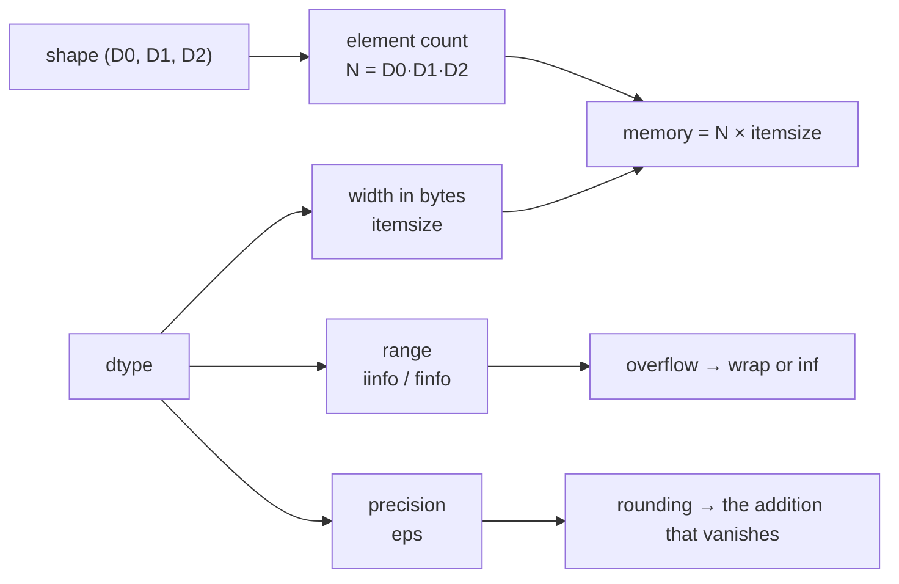

# 1.2 — dtype: the width of a number, and the ceiling it puts on you

## One-line answer

A dtype is a promise about **how many bytes each slot takes and what those bytes mean** — which fixes
both the memory the tensor occupies and the largest and smallest numbers it can hold, and a value
that does not fit does not raise: it wraps or rounds.

---

## The story

Two ordinary things go wrong, and neither of them makes a sound.

The first is a paper form. The "roll number" row has three little boxes, one digit each. That was
fine for years, because roll numbers only went up to 999. Then the school grew, and a student with
roll number 1284 sits down to fill it in. Three boxes, four digits. The student writes 1, 2, 8, and
the last digit has nowhere to go. The form is handed in, and nobody rejects it. It now says roll
number 128, which is a real student, and every list of student 128 from that day on is wrong.

The second is a kitchen scale that shows whole grams only. You put a pinch of saffron on it and it
reads 0 g. So you weigh another pinch. Still 0 g. You do this ten times, weighing each pinch on its
own and writing 0 in your notebook each time, and the notebook says the saffron weighs nothing at
all. Then you tip all ten pinches on together, and the scale reads 4 g.

Nobody was careless here. In both cases somebody decided, once and quietly, **how much room a number
gets**: three boxes, or whole grams only. Every number that did not fit was then rewritten without a
word of warning.

Choosing a dtype is making exactly that decision.
---

## The idea in plain language

Every slot in a tensor's flat run is the same size, and the dtype is what says how big and how to
read it. Two families matter here.

**Integers** store whole numbers exactly, using all their bits for the value (and one for the sign).
An 8-bit signed integer has 256 possible values, spread from −128 to 127. There is nothing else it
can hold. When arithmetic produces 128, the bit pattern that results is read back as −128 — this is
called **wrapping** (or *overflow*), and it is not an error condition in the hardware, it is just
what those bits mean.

**Floating-point numbers** store a value in three pieces: a sign, an **exponent** (roughly, how big
the number is) and a **mantissa** (roughly, the digits of the number). This buys enormous range at the
cost of exactness: the representable values are spread out, densely near zero and sparsely far from
it, and any value between two representable ones gets **rounded** to the nearer. `0.1` is not
representable in binary at any width, so what a tensor holds is always a nearby number.

Three consequences, and they are the whole subject:

1. **Memory is shape × width.** A tensor of 24,576,000 numbers costs 93.8 MiB at 4 bytes each and
   46.9 MiB at 2 bytes each. Same shape, same meaning, half the memory. (Both figures computed on
   this machine on 2026-08-26, not quoted.)
2. **The ceiling is real and it is silent.** Exceeding an integer's range wraps. Exceeding a float's
   range gives `inf`. Falling below a float's smallest normal value gives `0.0`. None of these stop
   the program.
3. **Mixing dtypes changes the dtype.** Arithmetic between two different dtypes produces a third,
   chosen by a set of promotion rules — and the result is not always the one you expect, which is the
   trap in *When it breaks*.

Two terms defined here and used for the rest of the curriculum:

- **Precision**: how finely spaced the representable values are. Governed by the mantissa bits.
- **Range**: how large and how small a value can be before it becomes `inf` or `0`. Governed by the
  exponent bits.

Precision and range are traded against each other inside a fixed width, and Day 7 (MATH-13) is
entirely about that trade for the 16-bit formats. Today's job is only to make dtype a *separate knob*
from shape in your head.

---

## Why Akshara needs it

- **Day 7** is `fp32 / fp16 / bf16` and the softmax that returns `NaN`. That day is unreadable
  without today: it is precisely the observation that two formats of the *same width* can differ in
  where they put the exponent/mantissa split, and therefore in which of your numbers survive.
- **Day 66** sizes Akshara against a free notebook GPU's actual VRAM. That calculation is
  `parameters × bytes-per-parameter`, plus the optimizer's own copies (Day 8,
  [2.4](../../../day-008-gradient-descent-and-adam/parts/02-adam/2.4-the-optimizers-memory.md)).
  A model that fits in one dtype and not another is the normal case, not an edge case.
- **Days 78–85** are the efficiency phase, whose entire content is *narrow the dtype, then measure
  what it cost*. Quantization to 8 or 4 bits is this part's idea taken to its limit, and the
  measurement of the damage is the part people skip.
- **Every token id in the tokenizer** from Day 12 onward is an integer, and the vocabulary size
  decides which integer width is honest. This is not hypothetical: a vocabulary above 32,767 does not
  fit in `int16`.

---

## The mechanism

The widths, printed rather than remembered:

```python
import numpy as np

for dtype in (np.int8, np.int32, np.int64, np.float16, np.float32, np.float64):
    dt = np.dtype(dtype)
    print(f"{dt.name:9s} itemsize={dt.itemsize}  1e6 elements = {dt.itemsize * 10**6 / 1e6:.1f} MB")
```

**Line by line:**
- `np.dtype(dtype)` turns the type object into a dtype descriptor, whose `.itemsize` is the width in
  **bytes**. That is the number that multiplies the shape.
- The last column is deliberately in decimal megabytes (`1e6` bytes), because that is the unit a
  capacity planner uses. `nbytes` in the previous part was raw bytes and the MiB figures elsewhere in
  this day are 1024-based; mixing the two conventions without saying which is a real source of
  disagreement in memory budgets, so every figure in this curriculum names its unit.
- On this machine (Intel Core i3-1115G4, CPython 3.12.10, numpy 2.5.2, 2026-08-26) it prints
  `int8 1`, `int32 4`, `int64 8`, `float16 2`, `float32 4`, `float64 8` — and therefore 1.0, 4.0,
  8.0, 2.0, 4.0 and 8.0 MB per million elements.

The ceilings, asked rather than assumed:

```python
for dtype in (np.int8, np.int16, np.int32, np.int64):
    info = np.iinfo(dtype)
    print(f"{np.dtype(dtype).name:6s} min={info.min:<21} max={info.max}")

for dtype in (np.float16, np.float32, np.float64):
    info = np.finfo(dtype)
    print(f"{np.dtype(dtype).name:8s} eps={info.eps:<24} max={info.max:<24} tiny={info.tiny}")
```

**Line by line:**
- `np.iinfo` is for integer types and `np.finfo` for floating types. Calling the wrong one raises,
  which is useful: it forces you to know which family you are in.
- `info.eps` is the **machine epsilon**: the gap between `1.0` and the next representable value above
  it. It is the single most useful number for reasoning about precision, because it tells you the
  relative resolution — roughly, how many significant digits you have.
- `info.tiny` is the smallest *normal* positive value. Below it, floats degrade into a reduced-
  precision range and then to zero. Day 7 uses this directly.
- Verified against `numpy` 2.5.2 (`numpy.iinfo` and `numpy.finfo`, doc pages
  `reference/generated/numpy.iinfo.html` and `numpy.finfo.html`), read 2026-08-26.

Its actual output on this machine, 2026-08-26 — these are measured, not recalled:

```text
int8   min=-128                  max=127
int16  min=-32768                max=32767
int32  min=-2147483648           max=2147483647
int64  min=-9223372036854775808  max=9223372036854775807
float16  eps=0.0009765625            max=65504.0                 tiny=6.103515625e-05
float32  eps=1.1920928955078125e-07  max=3.4028234663852886e+38  tiny=1.1754943508222875e-38
float64  eps=2.220446049250313e-16   max=1.7976931348623157e+308 tiny=2.2250738585072014e-308
```

Read the `float16` row slowly, because it is the one that surprises people: its largest value is
**65504**. Not 65504 thousand — 65504. A sum of activations in a wide layer can pass that, and when
it does the result is `inf` and everything downstream is `NaN`. That is Day 7's subject and it starts
here.

What the exponent/mantissa split costs, seen in one value:

```python
print(f"float32(0.1) = {float(np.float32(0.1)):.20f}")
print(f"float64(0.1) = {0.1:.20f}")
print("float32(1.0) + float32(1e-8) == 1.0 :", (np.float32(1.0) + np.float32(1e-8)) == np.float32(1.0))
```

**Line by line:**
- `float(np.float32(0.1))` widens the 32-bit value back to 64 bits **without changing it**, so
  printing 20 decimals shows what the 32-bit slot actually holds. It prints
  `0.10000000149011611938` on this machine, 2026-08-26.
- The 64-bit line prints `0.10000000000000000555`. Neither is `0.1`. The 64-bit one is merely wrong
  much later in the digits.
- The third line prints `True`: adding `1e-8` to `1.0` in 32-bit float **changes nothing at all**,
  because `1e-8` is far smaller than `eps` for that type (`1.19e-07`). The addition is not
  approximately ignored; it is exactly ignored. This is the mechanism behind a learning rate that
  stops having any effect, which is Day 8's problem.

The picture of what a dtype fixes:



---

## Shapes

| Tensor | Symbolic shape | Concrete here | What each axis means |
| --- | --- | --- | --- |
| the width table | `(6,)` | `(6,)` | one row per dtype examined; no tensor axes involved |
| a hypothetical embedding | `(V, C)` | `(32000, 768)` | vocabulary entry · channel |
| its memory, `float32` | scalar | 93.8 MiB | `V × C × 4` bytes, computed 2026-08-26 |
| its memory, `float16` | scalar | 46.9 MiB | `V × C × 2` bytes — **same shape**, half the bytes |
| its memory, `int8` | scalar | 23.4 MiB | `V × C × 1` byte — the Day 78 quantization target |

The shape is identical in all three rows. Only the width changed. That is the separation this part
exists to install.

---

## When it breaks

The loud one — an in-place operation that would need a wider output than the destination:

```console
>>> import numpy as np
>>> a = np.ones(3, dtype=np.int64)
>>> b = np.ones(3, dtype=np.float64)
>>> np.add(a, b, out=a)
Traceback (most recent call last):
  File "<stdin>", line 1, in <module>
numpy._core._exceptions._UFuncOutputCastingError: Cannot cast ufunc 'add' output from dtype('float64') to dtype('int64') with casting rule 'same_kind'
```

What it means: `a + b` is a `float64` result, and you asked for it to be stored in an `int64` buffer.
NumPy refuses because that would lose the fractional part. The smallest fix is to decide which dtype
this quantity really is and allocate accordingly — never to add `casting="unsafe"`, which converts a
caught bug into an uncaught one.

The half-loud one — a scalar integer overflow does warn:

```console
>>> np.int8(127) + np.int8(1)
RuntimeWarning: overflow encountered in scalar add
np.int8(-128)
```

**The silent versions, which is why this part is `working` and not `foundation`.** There are three,
and all three run perfectly:

```console
>>> np.array([127], dtype=np.int8) + np.array([1], dtype=np.int8)
array([-128], dtype=int8)

>>> x = np.zeros(3, dtype=np.int64); x[0] = 3.7; x
array([3, 0, 0])

>>> a = np.ones(3, dtype=np.int32); b = np.ones(3, dtype=np.float32); (a + b).dtype
dtype('float64')
```

- **The array overflow does not warn at all** — only the scalar form did. `127 + 1` becomes `-128`
  and the program continues. If those were token counts, your counts are now negative.
- **Assigning `3.7` into an integer array stores `3`**, silently, truncating toward zero. Not
  rounding: truncating. `np.array([1.9, -1.9, 2.5]).astype(np.int64)` gives `[1, -1, 2]` on this
  machine, 2026-08-26 — note that `-1.9` became `-1` and not `-2`.
- **`int32 + float32` produces `float64`**, not `float32`. The result is *twice as wide as either
  input*. In a training loop this is the line that quietly doubles your activation memory and halves
  your throughput, and nothing about it looks wrong. (Measured on numpy 2.5.2, 2026-08-26. Promotion
  rules are version-specific and were checked live, not recalled — see the note below.)

The check that catches all three, and costs one line at the boundary:

```python
assert x.dtype == np.float32, f"expected float32, got {x.dtype}"
```

**Line by line:**
- Assert the dtype in the same place you assert the shape, from part
  [1.1](1.1-the-array-that-is-flat.md) — at a function boundary, on tensors you did not build.
- The message prints the actual dtype. `dtype('float64')` where you expected `float32` names the
  promotion that happened; a bare `AssertionError` does not.
- For integer tensors that count things, the stronger check is on the *value*, not the type:
  `assert x.max() < np.iinfo(x.dtype).max`, run once after the counting loop. Wrapping is invisible
  afterwards, so the check has to happen while the true value is still known.

**Which silent failure this part is avoiding.** None of the plan's five directly — but the dtype
promotion above is the mechanism behind a whole class of "the numbers changed and nothing else did"
bugs, and the discipline it teaches (assert the dtype at the boundary) is the same discipline that
catches Silent Failure #2 on Day 16, where a tokenizer's output dtype and a model's embedding index
dtype must agree.

---

## In production

**What a research engineer writes instead of the teaching version.** They pick the dtype at
allocation and never let promotion decide it. Model weights are created in an explicit dtype; the
data loader casts once, at the boundary; and mixed-precision training pins which operations run in
16-bit and which are forced back to 32-bit, because some — the loss reduction, the optimizer update,
the normalization statistics — genuinely need the range. The teaching version says "float32". The
production version says "float32 here, bfloat16 there, and here is the line that says so".

**What degrades at scale.** Two things, in opposite directions. Memory: at 24 million parameters the
fp32-versus-fp16 difference is 47 MiB and you would not notice. At a billion parameters the same
ratio is measured in gigabytes and decides whether the model loads at all. Throughput: narrow dtypes
move fewer bytes per element, and on hardware where memory bandwidth is the binding constraint
(which is most hardware, for most of what a transformer does —
[3.4](../03-matmul/3.4-why-hardware-loves-matmul.md) works this out), halving the width nearly
doubles the speed of a bandwidth-bound operation. Neither effect is visible on a laptop at toy sizes,
which is why this part states the arithmetic rather than claiming a measurement it did not take.

**The failure that only shows with real data.** Integer overflow in counting. During tokenizer
training on a real corpus (Day 12), pair frequencies are accumulated over hundreds of millions of
tokens. A counter chosen as `int32` holds up to 2,147,483,647 — a number that looks unreachable until
the corpus is large enough, at which point the count wraps to negative and the merge ordering
silently changes. The vocabulary still trains. It is just a different vocabulary, and nothing in the
output says so. This is why the counting code in that day uses Python integers (unbounded) or
`int64`, deliberately, with the reason written down.

**The review comment.** *"This tensor is `float64` — was that chosen, or did it get promoted? If it
was promoted, where?"* On a CPU-only laptop `float64` is the comfortable default and costs little; on
a GPU it is typically a large throughput penalty and is almost never what was intended. The reviewer
is asking whether a dtype appeared by decision or by accident.

**The interview question.** *"You halve the dtype width of your model weights. What exactly do you
get, and what exactly do you risk?"* The weak answer says "it's faster and smaller". The strong answer
separates the two axes this part separated: you get half the bytes and, on bandwidth-bound work,
close to twice the throughput; you risk **range** (an fp16 maximum of 65504, which activations in a
wide layer can exceed) and **precision** (an epsilon large enough that small updates vanish into
large weights). Then it says which of the two you would check first, and how.

**Compute tier: T0.** Every measurement here is a laptop CPU measurement. The T0 version proves the
*ranges, the widths and the promotion rules* exactly — those are properties of the format, not of the
hardware, and they are identical on a GPU. It proves nothing about the *speed* consequences, which
are hardware-specific and are measured on Day 7 and Day 78 rather than asserted here.

---

## Check yourself

Run this. It prints **three numbers and one dtype**, and the third number must be `0`:

```python
import numpy as np

counts = np.array([2_000_000_000], dtype=np.int32)
print("int32 ceiling  :", np.iinfo(np.int32).max)
print("after +2e9     :", (counts + np.int32(2_000_000_000))[0])
print("still positive?:", int((counts + np.int32(2_000_000_000))[0] > 0))
print("promoted dtype :", (np.ones(3, dtype=np.int32) + np.ones(3, dtype=np.float32)).dtype)
```

**Line by line:**
- The second line adds two values that each fit comfortably in `int32` and whose **sum does not**.
  The printed result is negative, with no exception raised.
- The third line prints `0`, and `0` is the failure: it is the count that has just become a negative
  number in a variable everything downstream will treat as a size. If your corpus statistics ever go
  negative, this is why.
- The fourth line prints `float64` — a width neither input had. Say why before you run it, then
  check.

**Say this out loud, without scrolling up:** name the two independent things a dtype fixes, and give
one failure caused by each — one that raises, and one that does not.
