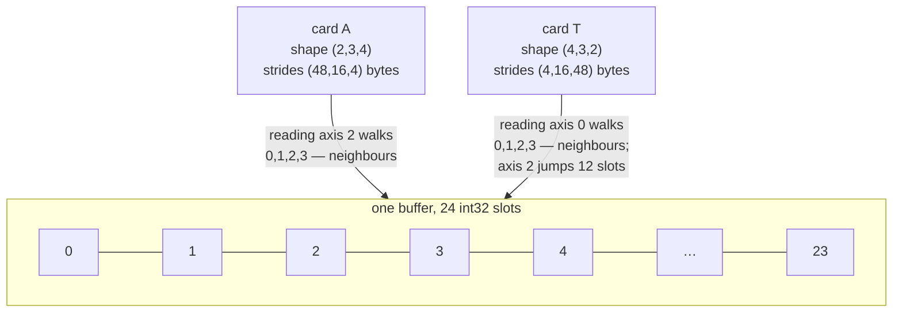

# 1.3 — Strides: why a transpose is free, and what it costs later

## One-line answer

A transpose only rewrites the strides, so it moves no data and takes no time — but it leaves behind a
tensor whose neighbours in memory are no longer its neighbours on the page, and **that** is what the
next operation pays for.

---

## The story

Your phone stores photos in one long line, in the order you took them.

The gallery app never moves them. It only offers you different ways to read that same line. Tap "By
date" and you see them day by day. Tap "People" and you see them grouped by face. Tap "Albums" and you
see the folders you made. Each of those took the app a little thinking to work out, and it copied
nothing at all. The photo files sat exactly where they always were.

But the two ways are not equally fast. Scrolling last Tuesday's photos is quick, because you took them
one after another, so they sit right next to each other in the line. Scrolling every photo of one
friend is slower, because those photos are scattered over four years, and the phone has to jump around
the line to collect them.

Then you decide you want that friend's photos offline, on a flight, again and again. So you make a
real folder and copy them into it. That copy takes a while, and it eats real space on the phone. You
do it once, on purpose. After that, every single time you open the folder, it opens instantly.

Those different ways of reading are strides. The folder is a copy. Knowing which of the two you are
doing, and when the second one is worth paying for, is what this part is about.
---

## The idea in plain language

From part [1.1](1.1-the-array-that-is-flat.md): a tensor is a flat run of numbers plus a card giving
its shape and strides. Nothing in the card says the strides have to be the row-major ones. They can
be anything, and every interesting operation in a tensor library is "return a new card over the same
numbers".

Some vocabulary, all of it defined here:

- A **view** is a new card over the same buffer. Making one is nearly free — a handful of integers
  are written. Writing through a view changes the original, because there is only one buffer.
- A **copy** is a new buffer with the numbers rearranged into it. It costs time proportional to the
  data, and memory equal to it. Writing to a copy does not touch the original.
- **Contiguous** (specifically **C-contiguous**, or row-major) means the strides are exactly the
  ones part 1.1 derived: each stride is the product of the shape entries to its right, and the last
  is 1. In a contiguous tensor, walking the flat buffer from start to end visits the elements in
  exactly the order the shape says they come in.
- **Fortran-contiguous** (column-major) is the mirror image: the **first** axis has stride 1. A
  transposed 2-D C-contiguous array is exactly this.

A **transpose** reverses (or permutes) the axes. It does so by reversing the shape and reversing the
strides — nothing else. Given shape `(2, 3, 4)` with strides `(48, 16, 4)` in bytes, the transpose has
shape `(4, 3, 2)` and strides `(4, 16, 48)`. Same buffer. Same bytes. Different card.

Here is the part people miss. The transpose is free. **The operation after it may not be.** Hardware
reads memory in blocks, not in single numbers, and it guesses ahead: when you read address *n* it
fetches the neighbouring addresses too, on the assumption that you will want them next. A contiguous
walk makes that guess right every time. A strided walk makes it wrong, and every element becomes a
separate trip. That is not a small constant factor — it is measured below, on this machine, and it is
6×.

But — and this is why the part is `working` and not `foundation` — **"non-contiguous is slower" is not
a law**, and the measurement below shows a case where the strided direction is the *faster* one. Which
is why the section after it exists at all.

---

## Why Akshara needs it

- **Day 32** builds multi-head attention, and its central line is a reshape followed by a
  `transpose(1, 2)` taking `(B, T, H, hs)` to `(B, H, T, hs)`. That is a strides edit. Then attention
  does a matmul on the result, and *that* is where the layout bill arrives. The reason multi-head
  attention implementations call `.contiguous()` in a specific place — and only there — is exactly
  this part.
- **Day 34** is the attention failure lab, which includes the O(n²) wall. Reasoning about that wall
  requires being able to say, for a given line, whether it allocates a new buffer or re-labels an old
  one. A reader who cannot tell views from copies cannot count peak memory.
- **Day 78 onward**, quantized and packed weights are stored in layouts chosen for the kernel that
  reads them. "Repack the weights for this kernel" is a copy made deliberately, once, exactly like
  copying those scattered photos into one offline folder.

---

## The mechanism

The transpose, with its card printed before and after:

```python
import numpy as np

a = np.arange(24, dtype=np.int32).reshape(2, 3, 4)   # (2, 3, 4)
t = a.T                                              # (4, 3, 2)

print("a.shape  ", a.shape,   "a.strides  ", a.strides)
print("t.shape  ", t.shape,   "t.strides  ", t.strides)
print("same buffer? ", np.shares_memory(a, t))
print("a flags C/F  ", a.flags["C_CONTIGUOUS"], a.flags["F_CONTIGUOUS"])
print("t flags C/F  ", t.flags["C_CONTIGUOUS"], t.flags["F_CONTIGUOUS"])
```

**Line by line:**
- `a.T` reverses the axis order. For rank 2 it is the familiar matrix transpose; for rank 3 it
  reverses all three. To swap only two axes, `a.transpose(0, 2, 1)` or `a.swapaxes(1, 2)` — those are
  the forms Day 32 uses, and they are the same kind of operation.
- `a.strides` prints `(48, 16, 4)` and `t.strides` prints `(4, 16, 48)` on this machine, 2026-08-26.
  The tuple is **reversed**, and nothing else happened. That is the entire implementation of
  transpose.
- `np.shares_memory(a, t)` prints `True`. This is the test for "view or copy" that always works.
  `t.base is a` is *not* a reliable test here, because `a` is itself a view of the `arange` buffer, so
  `t.base` is that original buffer rather than `a`. The habit worth forming is `np.shares_memory`, not
  `.base`.
- `a` is C-contiguous and not F-contiguous; `t` is the exact reverse. A transposed C-contiguous array
  is F-contiguous, which is why libraries that came from Fortran (and every BLAS routine underneath
  numpy) take a "transposed?" flag instead of demanding a copy.
- Verified against `numpy` 2.5.2: `numpy.ndarray.T`, `numpy.shares_memory`, `numpy.ndarray.flags`
  (doc pages `reference/generated/numpy.ndarray.T.html`, `numpy.shares_memory.html`,
  `numpy.ndarray.flags.html`), read 2026-08-26.

What the card does to a walk, drawn:



Now measure what the layout costs. Two operations, both on 8.0 MiB of `float64`, `N = 1024`, seed
1337, 20 repetitions each, on Intel Core i3-1115G4 (2 cores / 4 threads), 11.7 GB RAM, Windows 11,
CPython 3.12.10, numpy 2.5.2, 2026-08-26:

```python
import time

import numpy as np

rng = np.random.default_rng(1337)
N = 1024
A = rng.standard_normal((N, N))     # (N, N) C-contiguous
B = rng.standard_normal((N, N))     # (N, N)
At = A.T                            # (N, N) view, F-contiguous


def bench(label: str, fn, reps: int = 20) -> float:
    fn()                                     # warm up once, outside the timing
    t0 = time.perf_counter()
    for _ in range(reps):
        fn()
    ms = (time.perf_counter() - t0) / reps * 1000
    print(f"{label:42s} {ms:8.3f} ms")
    return ms


e1 = bench("C-order    A + B    (elementwise)", lambda: A + B)
e2 = bench("transposed A.T + B  (elementwise)", lambda: At + B)
print(f"  ratio: {e2 / e1:.2f}x")

s1 = bench("A.sum(axis=1)  [last axis, stride 8]", lambda: A.sum(axis=1))
s2 = bench("A.sum(axis=0)  [first axis, stride 8N]", lambda: A.sum(axis=0))
print(f"  ratio: {s2 / s1:.2f}x")
```

**Line by line:**
- `rng = np.random.default_rng(1337)` seeds the generator explicitly. An unseeded benchmark is not
  reproducible, and a number nobody can reproduce is not a measurement (Principle 9). `default_rng` is
  the current generator API; the legacy `np.random.seed` sets a global, which is exactly the "output
  depends on an unseeded global" pattern this repository bans.
- `fn()` is called **once before** the timer starts. The first call pays for lazy allocation and for
  bringing the arrays into cache; including it measures the setup rather than the operation.
- `time.perf_counter()` is the monotonic high-resolution clock. `time.time()` can move backwards when
  the system clock is adjusted, which quietly produces negative durations.
- Dividing by `reps` reports a mean. It does **not** report the spread, and a single mean with no
  spread is exactly the shape of Silent Failure #4 (noise mistaken for a difference). The ratios below
  are large enough — 6× and 3.6× — that the conclusion survives, but a 5% difference measured this
  way would mean nothing, and Day 119 makes that formal.
- `A.sum(axis=1)` reduces along the **last** axis, whose stride is 8 bytes — the contiguous direction.
  `A.sum(axis=0)` reduces along the first, whose stride is 8192 bytes.

Its actual output on this machine, 2026-08-26:

```text
N=1024, float64, 8.0 MiB per array
A.strides    (8192, 8)
A.T.strides  (8, 8192)

C-order    A + B    (elementwise)              2.783 ms
transposed A.T + B  (elementwise)             16.996 ms
  ratio: 6.11x

A.sum(axis=1)  [last axis, stride 8]           1.460 ms
A.sum(axis=0)  [first axis, stride 8N]         0.406 ms
  ratio: 0.28x
```

Read those two ratios together, because they disagree and both are real.

**The first is the expected result.** Adding two arrays elementwise touches every element once and
writes every result once. When one input is transposed, the walk through it jumps 8192 bytes at a
time while the output is written contiguously, and the hardware's read-ahead guess is wrong on nearly
every element. It costs 6.11× on this machine.

**The second contradicts the naive rule and it is the more useful measurement.** Summing along the
*stride-8192* axis is 3.6× **faster** than summing along the stride-8 axis. The reason is that a
reduction over axis 0 can be done as a running total: read row 0 into an accumulator vector, add row 1
to it, add row 2 to it — every read is a contiguous row and every write goes to the same small,
cache-resident output. Reducing along axis 1 instead has to collapse each row down to a single number,
which is a different and less friendly shape of work. **The stride numbers alone did not predict
this.** Only the measurement did.

That is why this curriculum measures rather than asserts (Principle 8), and it is worth internalising
now, because "obviously the contiguous one is faster" is the kind of confident sentence that survives
a whole project unchallenged.

The offline folder — paying for a copy on purpose:

```python
c = np.ascontiguousarray(At)          # (N, N) — a real copy
print("shares memory with A? ", np.shares_memory(A, c))
print("c flags C/F           ", c.flags["C_CONTIGUOUS"], c.flags["F_CONTIGUOUS"])
```

**Line by line:**
- `np.ascontiguousarray` returns the input unchanged if it is already C-contiguous — measured at
  0.000 ms on this machine — and makes a full copy if it is not, measured at 11.749 ms for 8.0 MiB,
  2026-08-26. The function is cheap when it is a no-op and honest about the cost when it is not.
- `np.shares_memory(A, c)` prints `False`: this is a different buffer. Writing to `c` no longer
  touches `A`, which is sometimes the actual reason to call it.
- The decision rule is arithmetic, and on this machine the numbers above already settle it. Doing the
  strided add directly costs 16.996 ms. Copying first and then adding costs 11.749 + 2.783 = 14.532
  ms. So even **one** transposed add is slightly cheaper if you copy, and every further pass is nearly
  free after that. Change the sizes and the answer changes — which is the point: the rule is *do this
  subtraction*, not *always copy* or *never copy*. It is why `.contiguous()` in a transformer appears
  in one specific place rather than everywhere.

---

## Shapes

| Tensor | Symbolic shape | Concrete here | What each axis means |
| --- | --- | --- | --- |
| `a` | `(D0, D1, D2)` | `(2, 3, 4)` | the original grid, C-contiguous, `int32` |
| `a.strides` | bytes | `(48, 16, 4)` | bytes skipped per step along axis 0, 1, 2 |
| `t = a.T` | `(D2, D1, D0)` | `(4, 3, 2)` | the same buffer, axes reversed |
| `t.strides` | bytes | `(4, 16, 48)` | the same tuple, reversed — the entire implementation |
| `A` | `(N, N)` | `(1024, 1024)` | benchmark matrix, `float64`, 8.0 MiB |
| `A.strides` | bytes | `(8192, 8)` | row step · column step |
| `A.T.strides` | bytes | `(8, 8192)` | reversed; F-contiguous |
| `A.sum(axis=0)` | `(N,)` | `(1024,)` | one total per column |
| `A.sum(axis=1)` | `(N,)` | `(1024,)` | one total per row — same shape, different work |

---

## When it breaks

The loud one — asking for a view that the strides cannot express:

```console
>>> import numpy as np
>>> a = np.arange(24, dtype=np.int32).reshape(2, 3, 4)
>>> t = a.T
>>> t.view(np.int16)
Traceback (most recent call last):
  File "<stdin>", line 1, in <module>
ValueError: To change to a dtype of a different size, the last axis must be contiguous
```

What it means: reinterpreting 4-byte slots as pairs of 2-byte slots only makes sense if the 4-byte
slots are adjacent. In `t` the last axis has a stride of 48 bytes, so there is nothing adjacent to
reinterpret. The smallest fix is `np.ascontiguousarray(t).view(np.int16)` — and note that you have
just paid for a copy, deliberately, which is the correct outcome: the error made a hidden cost
explicit.

The other loud one, from writing to a view that has a zero stride:

```console
>>> y = np.ones(4)
>>> bx = np.broadcast_to(y, (3, 4))
>>> bx.strides
(0, 8)
>>> bx[0, 0] = 5.0
Traceback (most recent call last):
  File "<stdin>", line 1, in <module>
ValueError: assignment destination is read-only
```

A stride of `0` means "stepping along this axis does not move in memory" — the three rows are the same
four numbers seen three times. Writing to one would write to all three, so numpy marks the view
read-only rather than let you discover that by accident. This is broadcasting, and it is
[2.1](../02-broadcasting-and-indexing/2.1-broadcasting-the-rule.md).

**The silent version, and it has two faces.**

*Face one: a copy you did not ask for.* `reshape` on a non-contiguous tensor cannot re-tape the card,
so it quietly allocates a new buffer and copies:

```console
>>> np.shares_memory(a, t.reshape(24))
False
```

Nothing warns. The program is correct. It has just doubled its peak memory at that line, and in a
training loop that runs thousands of times per epoch, that is the allocation that shows up as an
out-of-memory error much later, in a different function, with a traceback pointing somewhere
innocent. The check is `np.shares_memory(before, after)` at the line you suspect — and the habit that
prevents it is knowing that `reshape` *may* copy while `transpose` never does.

*Face two: `nbytes` lies about a broadcast view.* `bx.nbytes` above reports `96`, because it reports
`shape product × itemsize`. The real buffer is `y`, which is 32 bytes. A memory audit that sums
`nbytes` over live tensors will over-count broadcast views threefold here and by the broadcast factor
in general. The honest measurement asks the base buffer, not the view.

---

## In production

**What a research engineer writes instead of the teaching version.** They never call `.contiguous()`
(or `ascontiguousarray`) "just in case". They call it in exactly one place — immediately before the
operation that demands it — and they leave a comment saying which operation and why. A codebase with
scattered defensive `.contiguous()` calls is a codebase that has stopped knowing where its copies
are, and its memory profile is a mystery to everyone including its authors.

**What degrades at scale.** The 6.11× measured above is on 8 MiB, where most of the array still lives
in cache between passes. As the tensor grows past the last level of cache the penalty grows, because
every strided access becomes a full trip to main memory rather than a partial one. And on a GPU the
same idea has a sharper name — *coalescing*: neighbouring threads reading neighbouring addresses get
one memory transaction, and neighbouring threads reading scattered addresses get one transaction
each. The direction of the effect is the same as the direction measured here; the magnitude is
hardware-specific and this part deliberately does not quote a GPU number it did not measure.

**The failure that only shows with real data.** A data loader that assembles batches by slicing a
large memory-mapped array along a non-contiguous axis. On a small development set the array fits in
page cache and everything is instant. On the real corpus the same code produces a batch by touching
one number per page across gigabytes, and training becomes input-bound with the GPU idle — while
every profiler line looks reasonable and no single function is obviously slow. The fix is to change
the *storage layout* so the batch axis is the contiguous one, which is a decision made when the data
is written, not when it is read.

**The review comment.** *"This `.reshape()` is on a transposed tensor, so it's a copy. Is that
intentional? If it is, say so in a comment — otherwise the next person will assume it's free."* The
review is not asking you to remove the copy. It is asking you to make it visible.

**The interview question.** *"Transposing a large matrix takes no time. Why, and when does that stop
being good news?"* The weak answer stops at "it's just a view". The strong answer continues: the cost
is deferred to the next operation, whose access pattern is now strided; whether that actually costs
anything depends on the operation, and — as the second measurement here shows — for some reductions
the strided direction is faster, so the only reliable answer is to measure the pair.

**Compute tier: T0.** Every number in this part was measured on a laptop CPU. The T0 measurement
proves that *layout changes cost*, and gives a real ratio for this machine and this size. It does
**not** transfer: 6.11× is this CPU, this cache, this array size, this numpy build. Quoting it as a
general fact would be exactly the rumour Principle 8 forbids. What transfers is the method — time both
layouts, print both numbers — and Day 78 applies that same method where the stakes are larger.

---

## Check yourself

Run this. It prints **two ratios**, and they must point in opposite directions:

```python
import time

import numpy as np

rng = np.random.default_rng(1337)
A = rng.standard_normal((1024, 1024))
B = rng.standard_normal((1024, 1024))


def ms(fn, reps=20):
    fn()
    t0 = time.perf_counter()
    for _ in range(reps):
        fn()
    return (time.perf_counter() - t0) / reps * 1000


print("elementwise transposed / contiguous:", round(ms(lambda: A.T + B) / ms(lambda: A + B), 2))
print("reduction axis0 / axis1            :", round(ms(lambda: A.sum(axis=0)) / ms(lambda: A.sum(axis=1)), 2))
print("shares_memory(A, A.T)              :", np.shares_memory(A, A.T))
print("shares_memory(A, A.T.reshape(-1))  :", np.shares_memory(A, A.T.reshape(-1)))
```

**Line by line:**
- The first ratio is above 1 on this machine (6.11) and the second is below 1 (0.28). Your machine
  will print different numbers; the *signs* are the finding, not the magnitudes.
- The last two lines print `True` then `False`: the transpose shares the buffer, and the reshape of
  the transpose does not — that `False` is a copy you did not write down anywhere.
- If your first ratio comes out near 1.0, your array is small enough to sit in cache; raise `1024` to
  `4096` and re-run, and say what changed before you look.

**Say this out loud, without scrolling up:** a transpose costs nothing — so where does the cost
actually appear, and name one operation for which the transposed layout is the *faster* one.
