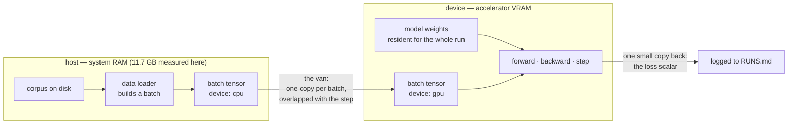

# 1.4 — Device: where the bytes physically live

## One-line answer

A tensor's **device** is the physical memory its flat buffer sits in, it is a fourth independent
property alongside shape, strides and dtype, and moving between devices is always a copy across a
slow link — which is why a device mismatch is an error rather than an automatic conversion.

---

## The story

You are cooking dinner. Everything you need is on the kitchen counter: the rice, the oil, the onions,
the salt.

Anything on that counter is instant. You reach out, and it is in your hand. Anything still at the shop
two kilometres away is not "a bit slower" — it stops the cooking completely, because you have to take
off your apron, walk down, buy it, and walk back.

So nobody cooks by fetching one item at a time. You write a list, you go to the shop once, you come
back with everything, and then you cook without leaving the kitchen again.

There is one more rule, and it is the strict one: **the pan can only cook what is actually on the
counter.** If the salt is missing, a good cook stops and says "there is no salt". A cook who instead
guesses, and reaches for the sugar because it is white and sitting nearby, produces a dish that looks
perfectly finished and is inedible. The stopping is the useful part. It is annoying at the moment it
happens, and it is the only reason you find out about the missing salt now, rather than at the table.
---

## The idea in plain language

Part [1.1](1.1-the-array-that-is-flat.md) said a tensor is a flat buffer plus a card. It did not say
*which* memory the buffer is in, because until now there has only been one.

A computer with an accelerator has at least two separate memories:

- **Host memory** (system RAM), which the CPU reads and writes directly. On this machine that is
  11.7 GB, measured 2026-08-26.
- **Device memory** (for example a GPU's VRAM), which the accelerator reads and writes directly, and
  which the CPU cannot address as ordinary memory.

They are physically different chips, connected by a link that is far slower than either. A tensor
lives in exactly one of them. The **device** of a tensor is the answer to "which memory is this
buffer in", and it is independent of shape, strides and dtype in the same way those three are
independent of each other: you can change the device without changing any of the others, and the
number of bytes moved is `shape product × itemsize` — the exact figure part
[1.2](1.2-dtype-the-width-of-a-number.md) taught you to compute.

Three consequences that shape every line of accelerator code you will ever write:

1. **Moving is copying.** There is no "make this tensor be on the GPU" that does not transfer bytes.
   A move is an allocation on the destination plus a transfer plus (usually) a free on the source.
2. **Operations require agreement.** An operation between a host tensor and a device tensor cannot be
   performed by either processor. Libraries raise rather than transfer silently — because a silent
   transfer inside a training loop is a correctness-preserving change that destroys throughput, and a
   bug you cannot see in the output is the worst kind (this repository's Principle 10).
3. **The link is the bottleneck you design around.** The whole shape of a training loop — big
   batches, data prefetched ahead of the step, the model resident on the device for the entire run
   rather than sent per step — is the van, not the studio and not the shop.

One more term, because it appears in every accelerator API: an operation is **asynchronous** when the
call returns before the work finishes. Accelerator work is usually queued rather than executed, which
means a timing measurement that does not force a wait is measuring how long it took to *ask*. This is
the single most common way people report a GPU speedup that is not real, and it is the Principle 8
trap of this part.

---

## Why Akshara needs it

- **Day 67** is the first real training run, on a free notebook GPU. Every tensor in that run must be
  on the device before the step, and the data loader must have the next batch on its way while the
  current step computes. A run that transfers per operation does not fail — it just takes so long the
  session is reclaimed first, which on free compute looks exactly like bad luck.
- **Day 66** sizes Akshara against the VRAM you measured on Day 1
  ([4.2](../../../day-001-bootstrap-and-map/parts/04-free-compute/4.2-the-accounts-and-what-they-cost.md)).
  That calculation is entirely "how many bytes must be resident on the device at once", which is this
  part plus part 1.2.
- **Day 85** offloads a model larger than available memory — deliberately paying the transfer to run
  something that does not fit. That trade is only expressible if device is a first-class property in
  your head rather than a flag you copy from an example.
- **Day 12**'s tokenizer training and Day 64's corpus preparation are host work, CPU-bound and
  disk-bound. Knowing which side of the link a workload lives on is how you know which resource to
  spend.

---

## The mechanism

NumPy is a host-only library, and it says so — which makes it an honest place to meet the concept.
Since numpy 2.x it exposes the array-API device interface, so the property is real and inspectable
rather than a story about some other library:

```python
import numpy as np

a = np.arange(24, dtype=np.int32).reshape(2, 3, 4)   # (2, 3, 4)
print("shape  :", a.shape)
print("dtype  :", a.dtype)
print("strides:", a.strides)
print("device :", a.device)
```

**Line by line:**
- The four prints are the four independent properties of a tensor, and this is the only place in the
  curriculum they appear together. Shape says how many, strides say where, dtype says how wide, and
  device says **which memory**.
- `a.device` prints `cpu` on this machine, 2026-08-26 — in numpy it is literally the string `'cpu'`,
  and it is the only value numpy will ever return. Other libraries return a richer object with an
  index on it, because they have more than one device to distinguish.
- Verified against `numpy` 2.5.2: `numpy.ndarray.device` and `numpy.ndarray.to_device`, doc pages
  `reference/generated/numpy.ndarray.device.html` and `numpy.ndarray.to_device.html`, read
  2026-08-26. The version was resolved live from `https://pypi.org/pypi/numpy/json` (Principle 6).

And the refusal, which is the interesting half:

```python
a.to_device("cuda")
```

**Line by line:**
- `to_device` is the array-API standard's move operation. NumPy implements it and accepts exactly one
  destination.
- On this machine it raises `ValueError: Unsupported device: cuda. Only 'cpu' is accepted.` — the
  verbatim text is in *When it breaks* below.
- The refusal is the design: the library does not pretend, does not fall back, does not emulate. A
  library that quietly ran your CUDA code on the CPU would give you correct numbers and a hundredfold
  slowdown, and you would not find out from the output.

Where the two memories sit, and what crosses between them:



The picture contains the whole design rule. Big things (weights) cross **once**. Medium things
(batches) cross once each and are prefetched so the crossing overlaps with compute. Small things (a
loss value to print) cross often and are tiny. Anything else crossing is a bug in the loop.

The arithmetic you can do today, without any accelerator:

```python
V, C = 32000, 768                        # a hypothetical embedding table (V, C)
bytes_fp32 = V * C * 4
bytes_fp16 = V * C * 2
print(f"embedding (V, C) = ({V}, {C})")
print(f"  fp32: {bytes_fp32 / 1024 / 1024:.1f} MiB must be resident on the device")
print(f"  fp16: {bytes_fp16 / 1024 / 1024:.1f} MiB")
print(f"  crossing the link at G GB/s takes {bytes_fp32} / (G * 1e9) seconds — fill in G on Day 66")
```

**Line by line:**
- The first two lines are part 1.2's arithmetic, reused. This is the number that has to fit in device
  memory, and it is a shape fact times a dtype fact.
- On this machine it prints 93.8 MiB and 46.9 MiB, 2026-08-26.
- The third line deliberately leaves the transfer rate as a symbol. **This document does not know
  your link's bandwidth and will not guess it** (Principle 8). It is a measurement you take on the
  actual hardware, and Day 66 takes it. A number for "typical PCIe bandwidth" recalled from memory
  would be a rumour with a unit attached.
- `TODO(measure: on a T1 notebook session, time a host-to-device copy of a known number of bytes and
  divide — record the result in docs/PACKAGES.md as an observed row, the way Day 1 part 4.2 records
  the GPU name and VRAM.)`

---

## Shapes

| Tensor | Symbolic shape | Concrete here | What each axis means |
| --- | --- | --- | --- |
| `a` | `(D0, D1, D2)` | `(2, 3, 4)` | the grid from part 1.1; `device: cpu` |
| a batch, host side | `(B, T)` | `(B, T)` | batch item · token position — built on the host |
| the same batch, device side | `(B, T)` | `(B, T)` | **identical shape, strides and dtype**; only the device differs |
| an embedding table | `(V, C)` | `(32000, 768)` | vocabulary entry · channel — 93.8 MiB in fp32 |
| the loss | `()` | `()` | rank 0 — the one thing worth copying back often |

The second and third rows are the point of the table: a device move is the one transformation in this
entire day that changes **nothing** about shape, strides or dtype, and costs the most.

---

## When it breaks

The loud one, verbatim on this machine, 2026-08-26:

```console
>>> import numpy as np
>>> a = np.arange(24, dtype=np.int32).reshape(2, 3, 4)
>>> a.device
'cpu'
>>> a.to_device("cuda")
Traceback (most recent call last):
  File "<stdin>", line 1, in <module>
ValueError: Unsupported device: cuda. Only 'cpu' is accepted.
```

What it means exactly what it says: this library has one memory. The smallest fix is not to reach for
a different library reflexively — it is to ask whether this work belongs on an accelerator at all.
Tokenizer training, corpus statistics and most data preparation are host work, and moving them is a
loss.

The other loud one you will meet from Day 67: an operation whose two arguments are on different
devices. The exact text depends on the library and the version, so this document does not quote one
it has not run. What is true of all of them is the *shape* of the message — it names both devices —
and the fix is never to add a conversion at the line that raised. **The line that raised is where you
found out, not where it went wrong.** The real question is which of the two tensors was created in
the wrong place, and that is usually several functions earlier.

**The silent version, and it is the expensive one.** Nothing raises. Every tensor is on the device.
The loop is correct and the results are right — and one line inside the step reads a value back to
the host to make a Python decision with it, on every iteration. Each read is small, so no memory
figure looks wrong. But reading a value back forces the queue to drain: the host must wait for all
outstanding device work to finish before it can be told the answer. The accelerator sits idle at that
line, every step, and the loop runs at a fraction of its speed with no error, no warning and a
perfectly normal loss curve.

The detection is a habit rather than an assertion: in the step function, **count the lines that turn a
device tensor into a Python number** — printing it, comparing it, putting it in an `if`, appending it
to a list. In a well-written loop that count is zero during the step and one at logging time, on a
schedule. This is the same instinct as Silent Failure #4 from the plan's §6: a number that looks fine
is not evidence, and here the number really is fine — it is the *clock* that is wrong.

---

## In production

**What a research engineer writes instead of the teaching version.** The device is chosen **once**, at
the top, from configuration — never hard-coded and never inferred per tensor. Everything the model
owns is moved at construction and never moved again. The data pipeline produces batches on the host
and hands them over with the transfer overlapped against the previous step's compute, so the link is
busy while the accelerator is busy. And every timing measurement around device work explicitly
synchronises before stopping the clock, because otherwise the measurement is of the queueing, not the
work.

**What degrades at scale.** Two ways. First, resident memory: weights, gradients, optimizer state and
activations must all fit at once, and each is a shape times a dtype (Day 8's
[2.4](../../../day-008-gradient-descent-and-adam/parts/02-adam/2.4-the-optimizers-memory.md) works out
the optimizer's share). Second, the link: as the accelerator gets faster, the time to compute a batch
falls while the time to ship one does not, so a pipeline that was compute-bound on modest hardware
becomes transfer-bound on better hardware — the same code, now spending its life waiting for the van.

**The failure that only shows with real data.** A development run uses a small in-memory dataset and
is compute-bound; the real corpus does not fit in RAM, so batches now come from disk, and the loader
becomes the slow stage. Device utilisation collapses, and every profiler view of the *device* looks
healthy, because the device is not the problem — it is idle. This is why Day 67's checklist asks for
the utilisation number and not only the loss.

**The review comment.** *"This `.item()` is inside the inner loop — that's a synchronisation point
every step. Can it move to the logging branch?"* Almost always yes, and the change is one line for a
throughput gain that no algorithmic improvement would have delivered.

**The interview question.** *"Your GPU utilisation is 30%. Name three things it could be, and how you
would tell them apart."* A strong answer separates the three sides of this part: the data pipeline is
too slow (the host cannot fill the van), the transfer is not overlapped (the van runs while everyone
waits), or the loop synchronises inside the step (the shop keeps phoning the studio). And then it says
which one is cheapest to test first — usually the third, because it is a code read rather than a
measurement.

**Compute tier: T0 today, T1 from Day 67.** Everything in this part ran on a laptop CPU, and the T0
version proves the *structure*: that device is a real, separate property, that numpy has exactly one
value for it, and that a mismatch is refused rather than papered over. It proves nothing at all about
transfer rates, overlap or utilisation — every one of those is a T1 measurement, and this document
leaves them as `TODO(measure:)` rather than quoting figures it has not taken.

---

## Check yourself

Run this. It prints **three facts and one number**, and the number is the one you will need on Day 66:

```python
import numpy as np

a = np.arange(24, dtype=np.int32).reshape(2, 3, 4)
print("device      :", a.device)
try:
    a.to_device("cuda")
except ValueError as exc:
    print("refusal     :", exc)
print("moving changes shape/dtype?:", a.to_device("cpu").shape == a.shape, a.to_device("cpu").dtype == a.dtype)
print("bytes to move a (32000, 768) fp32 table:", 32000 * 768 * 4)
```

**Line by line:**
- The first line prints `cpu` — the property exists and is inspectable, which is the point of using a
  host-only library to teach it.
- The `except ValueError` prints the refusal text as a value rather than a traceback, so the check
  runs to completion. Catching it deliberately is also the honest way to write code that *asks* what
  is available instead of assuming.
- The third line prints `True True`: a device move leaves shape and dtype untouched. That invariance
  is exactly why device is a separate property.
- The last line prints `98304000` — 98.3 MB of traffic for one embedding table. Write that number
  down; Day 66 divides it by a bandwidth you will have measured by then.

**Say this out loud, without scrolling up:** why does a library refuse an operation between tensors on
two devices instead of moving one of them for you — and name the failure that produces a completely
correct loss curve at a fraction of the expected speed.
