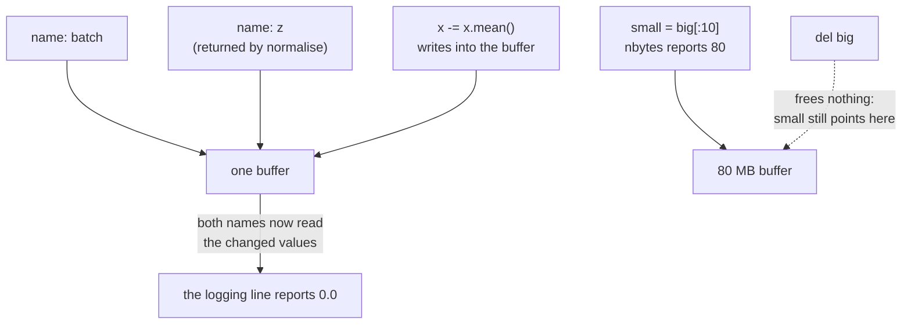

# 1.5 — 💥 The view that changed the original

## One-line answer

Because a view is a second card over the **same** buffer, an in-place operation through the view
rewrites the original — and the two most common ways this happens, an in-place `-=` inside a helper
function and a small slice that keeps a huge buffer alive, both produce programs that run perfectly
and report the wrong thing.

---

## The story

There is a shopping list stuck to the fridge at home. Twelve items, with quantities, for Sunday's
dinner for eight people.

Someone in the house is cooking a smaller version of the same meal, for four. They need half of
everything. So they walk to the fridge, take a pen, and next to each quantity they cross out the
number and write half of it. Then they copy the halved list onto their phone and go shopping. Their
list is correct, and their dinner comes out perfectly.

On Saturday, somebody else goes to the fridge to shop for the dinner for eight. The list now says half
of everything. Nobody threw the list away, and nobody meant any harm. The first person simply did the
arithmetic **on the shared list** instead of copying the numbers onto their own paper first.

They are not asked to redo their cooking, because their cooking was right. They are asked one
question: **who else was going to read that list?**

In a program, the answer is always "somebody", and usually "you, four lines later".
---

## The idea in plain language

Part [1.3](1.3-strides-and-the-free-transpose.md) established that a view is a second card over one
buffer. This part is the consequence, and it is a consequence about **writing**, not reading.

Reading through two cards is harmless: two people reading the same list. Writing through one card
is visible through the other, immediately, with no notification. In a language where passing an
argument passes a reference rather than a copy — which is Python, and every tensor library —
"writing through one card" happens inside functions you did not think of as destructive.

The distinction that decides everything is the one between an operation that **rebinds a name** and
one that **mutates a buffer**:

- `x = x - 1` computes a brand-new array and points the local name `x` at it. The caller's array is
  untouched, because the caller's name still points at the old buffer.
- `x -= 1` writes into the existing buffer. Every name, every view and every caller that refers to
  that buffer now sees the new values.

They look like the same statement. In Python they are `__sub__` and `__isub__`, and for a tensor
library the second one is deliberately in-place — because avoiding an allocation is exactly what you
want in a training loop, right up until it is not.

The second failure in this part is quieter still and is about memory rather than values. A view keeps
its buffer alive. Take a ten-element slice of an eighty-megabyte array, throw the array away, and you
are still holding eighty megabytes — because the ten-element view's card points into it, and nothing
can free a buffer that something still refers to.

---

## Why Akshara needs it

- **Day 8** implements the optimizer step, whose whole design is in-place update: `w -= lr * g`. The
  in-place form is *correct there and chosen deliberately*, because allocating a fresh copy of every
  parameter every step is the thing you are avoiding. A reader who has not separated "in-place is a
  bug" from "in-place is the point" will either write a slow optimizer or a wrong one.
- **Day 51 onward**, the training loop keeps running statistics, and the classic version of this bug
  is normalising a batch in a helper and then logging its raw mean afterwards — which is the exact
  scenario measured below.
- **Day 34** counts peak memory for attention. Views that retain large buffers are invisible to a
  naive "sum the tensor sizes" audit and are a normal cause of a process whose memory only ever goes
  up.
- **Day 67** runs on a session that gets reclaimed if it exhausts memory. A retained buffer is not a
  slow leak there; it is a dead run.

---

## The mechanism

**Failure one: the helper that ate its argument.** This is the fridge list, in code:

```python
import numpy as np

rng = np.random.default_rng(1337)


def normalise(x: np.ndarray) -> np.ndarray:
    """Standardise to zero mean, unit variance. Looks pure. Is not."""
    x -= x.mean()          # (4, 5) — in place
    x /= x.std()           # (4, 5) — in place
    return x


batch = rng.standard_normal((4, 5)) * 10 + 50     # (4, 5) raw measurements
print("raw mean before:", round(float(batch.mean()), 4))
z = normalise(batch)                              # (4, 5)
print("raw mean after :", round(float(batch.mean()), 4))
print("shares_memory  :", np.shares_memory(batch, z))
```

**Line by line:**
- `rng = np.random.default_rng(1337)` seeds explicitly, so the numbers below are reproducible by
  anyone (Principle 9). `* 10 + 50` moves the data away from zero mean so that "the mean was
  destroyed" is visible rather than a rounding argument.
- `x -= x.mean()` is the whole bug, and it is one character away from correct. `-=` on an ndarray
  calls `__isub__`, which writes into the existing buffer. The function has no `copy()` anywhere, so
  `x` is the caller's array, not a local one.
- `x.mean()` is computed **before** the subtraction on that line, so the arithmetic is right. This is
  what makes the bug survive review: nothing about the calculation is wrong.
- `return x` returns the same object it was given. The caller now has two names for one buffer and no
  reason to suspect it.
- `np.shares_memory(batch, z)` is the test that settles it, and it prints `True`.

Its actual output on Intel Core i3-1115G4, 11.7 GB RAM, Windows 11, CPython 3.12.10, numpy 2.5.2,
seed 1337, 2026-08-26:

```text
raw mean before: 51.9418
raw mean after : 0.0
shares_memory  : True
```

The raw batch had a mean of 51.9418. After a call to a function whose name says "normalise" and whose
return value was assigned to a different variable, the raw batch has a mean of **exactly zero** — and
any logging line that reports the batch's real scale now reports the normalised one. No exception, no
warning, and a plausible number.

The fix is two characters, and it changes the meaning of every line in the function:

```python
def normalise_safe(x: np.ndarray) -> np.ndarray:
    x = x - x.mean()       # (4, 5) — rebinds x to a NEW array
    x = x / x.std()        # (4, 5) — rebinds again
    return x
```

**Line by line:**
- `x = x - x.mean()` allocates. The local name `x` now points at a different buffer, and the caller's
  buffer is untouched from the first line onward.
- The second line operates on the already-local array, so it allocates again — two allocations where
  the in-place version had none. **That cost is real and it is the price of the guarantee.** In a
  training loop where the caller genuinely does not need the input afterwards, the in-place version is
  the right one; the rule is not "never mutate", it is "mutate only when the function's name and
  documentation say it does".
- Measured with the same seed and machine: raw mean before 48.9579, raw mean after 48.9579,
  `shares_memory` `False`.

**Failure two: the slice that would not let go.**

```python
big = np.zeros(10_000_000, dtype=np.float64)      # (10000000,) — 80 MB
small = big[:10]                                   # (10,)
print("small.nbytes      :", small.nbytes)
print("small.base.nbytes :", small.base.nbytes)
print("shares_memory     :", np.shares_memory(big, small))

smallc = big[:10].copy()                           # (10,)
print("copy .base        :", smallc.base)
```

**Line by line:**
- `small` is a slice, so it is a view. Its `nbytes` reports `80` — that is the *logical* size of what
  you can see through the card, and it is the number a memory audit would add up.
- `small.base` is the array the view points into, and its `nbytes` is `80000000`. **That is what is
  actually being kept alive.** Deleting `big` changes nothing: `small` still holds the reference.
- Measured on this machine, 2026-08-26: `80`, `80000000`, `True`, and `None` for the copy's `.base`.
- `.copy()` allocates a new 80-byte buffer with no base, and the 80 MB becomes collectable. One method
  call, a factor of a million in retained memory.
- The general rule: **a view you intend to keep for a long time, taken from a buffer you intend to
  drop, should be a copy.** A view you are about to consume in the next three lines should not be —
  copying it would be the waste.

The two cases side by side, which is the shape of the whole idea:



---

## Shapes

| Tensor | Symbolic shape | Concrete here | What each axis means |
| --- | --- | --- | --- |
| `batch` | `(B, F)` | `(4, 5)` | batch item · feature — the caller's raw data |
| `z` | `(B, F)` | `(4, 5)` | the "normalised" result — **the same buffer as `batch`** |
| `x.mean()` | `()` | `()` | rank 0: one number over all elements |
| `big` | `(N,)` | `(10000000,)` | 80 MB of `float64` |
| `small` | `(K,)` | `(10,)` | a view; `nbytes` 80, retained 80,000,000 |
| `small.base` | `(N,)` | `(10000000,)` | what the view actually pins in memory |
| `smallc` | `(K,)` | `(10,)` | a copy; `base` is `None`, retains nothing |

The `small` and `small.base` rows are the entire second failure: two shapes for one object, and the
memory audit reads the wrong one.

---

## When it breaks

There is no traceback for either failure. That is the point of the part, and it is why it sits at
`production` level. What you get instead is this:

```text
raw mean before: 51.9418
raw mean after : 0.0
```

and this:

```text
small.nbytes      : 80
small.base.nbytes : 80000000
```

Both programs are healthy. Both are wrong about something a human will later rely on.

The loud cousin does exist, and it is worth provoking on purpose, because it tells you the rule is
real:

```console
>>> import numpy as np
>>> y = np.ones(4)
>>> bx = np.broadcast_to(y, (3, 4))
>>> bx[0, 0] = 5.0
Traceback (most recent call last):
  File "<stdin>", line 1, in <module>
ValueError: assignment destination is read-only
```

NumPy marks a zero-stride view read-only precisely because writing through it would change three rows
at once. Where the library can prove the write is ambiguous, it refuses. Where it cannot — an
ordinary slice — it lets you.

**The checks that catch both, and they are one line each:**

```python
assert not np.shares_memory(caller_input, result), "normalise() mutated its argument"
assert result.base is None, "this long-lived array is a view and pins its base buffer"
```

**Line by line:**
- `np.shares_memory` does an exact overlap analysis rather than a guess. Its cheaper sibling
  `np.may_share_memory` can return `True` for arrays that do not actually overlap, because it only
  compares address ranges; use it in a hot path, use `shares_memory` in a test.
- The first assertion belongs in a **test**, not in the function — the function is allowed to be
  in-place if that is what it advertises. What must never happen silently is a *caller* assuming
  otherwise.
- `result.base is None` is the retention check: `None` means this array owns its buffer. It belongs
  wherever you are about to store something for a long time — a cache, a list that accumulates across
  steps, an attribute on a long-lived object.
- Neither check costs anything at test time and neither exists in most codebases, which is why both
  failures in this part are common rather than exotic.

---

## In production

**What a research engineer writes instead of the teaching version.** Two conventions, applied without
thinking about them. First, **in-place operations are named**: a function that mutates has a name
that says so (`normalise_`, `add_`, `apply_` — the trailing underscore is a widespread convention for
exactly this) or it does not mutate. Second, **the boundary copies**. Data arriving from a loader, a
file or another team's code is copied once at the edge if it will outlive the call, and after that
everything inside is free to be in-place because ownership is clear. The expensive mistake is not
mutation; it is mutation with unclear ownership.

**What degrades at scale.** Retention. A view-into-a-large-buffer pattern that costs 80 MB on a
laptop costs whatever the buffer is on the real corpus, and the process's memory graph rises in steps
and never falls. Because the visible tensors are all small, every "sum the sizes of my tensors" audit
comes back clean, and the diagnosis is `.base` chasing — which nobody does unless they know this part.
On a free notebook session (Day 67) it does not present as a memory problem at all: it presents as the
session dying.

**The failure that only shows with real data.** In-place normalisation inside a data pipeline where
batches are drawn from a memory-mapped corpus. On a small in-memory dataset each batch is freshly
allocated, so mutating it is harmless and the tests pass. On the real corpus batches are views into a
mapped file, and the in-place normalisation writes back through the map — silently corrupting the
dataset on disk, one batch at a time, in a way that only becomes visible on the *second* epoch when
already-normalised data is normalised again. This is a real class of bug, it is why data loaders
copy at the boundary, and it is the reason the plan's Principle 9 keeps datasets out of the repo where
a corrupted one could be committed.

**The review comment.** *"This helper takes an array and returns one — does it mutate the input? The
name says no; the `-=` says yes. Pick one."* A reviewer who asks this has saved a day of someone
else's life.

**The interview question.** *"What's the difference between `x = x - 1` and `x -= 1` on a tensor, and
when does it matter?"* The weak answer says "one is shorthand". The strong answer says the second is
in-place and therefore visible to every other reference to that buffer; that this is a bug when the
function is supposed to be pure and *the correct choice* in an optimizer step where the whole point is
not to allocate; and that the way to tell which one a piece of code did is `shares_memory`, not
reading it.

**Compute tier: T0.** Every failure here is reproduced on a laptop CPU, at sizes of twenty and ten
million elements, in under a second. That is the good news about aliasing bugs: they are exactly
reproducible on the smallest hardware, because they are about *reference semantics* rather than about
scale. What T0 does not show is the consequence — a reclaimed T1 session or a corrupted corpus — and
those are the reason to fix them now.

---

## Check yourself

Run this. It prints **two numbers and two booleans**, and the second number must not be `0.0`:

```python
import numpy as np

rng = np.random.default_rng(1337)


def normalise(x):
    x = x - x.mean()
    x = x / x.std()
    return x


batch = rng.standard_normal((4, 5)) * 10 + 50
before = float(batch.mean())
z = normalise(batch)
print("raw mean before        :", round(before, 4))
print("raw mean after         :", round(float(batch.mean()), 4))
print("shares_memory(batch, z):", np.shares_memory(batch, z))
print("z is batch             :", z is batch)
```

**Line by line:**
- As written, `normalise` uses the rebinding form. On this machine with seed 1337 it prints
  `51.9418`, `51.9418`, `False`, `False`: the caller's data survived and the result is a different
  object.
- Now change the two lines in `normalise` to `x -= x.mean()` and `x /= x.std()` and re-run. It prints
  `51.9418`, `0.0`, `True`, `True`. **You have just watched a function destroy its caller's data with
  a two-character edit and no error.**
- `z is batch` and `np.shares_memory(batch, z)` answer different questions and you want both in your
  head. The first asks whether they are the *same object*; the second asks whether they overlap in
  *memory*, which is also `True` for a slice, a transpose or any other view — cases where `is` would
  say `False` and mislead you. Note that `z.base is None` is `True` under **both** versions here and
  is therefore useless for this particular check: `base` tells you whether an array is a view, not
  whether it is somebody else's.

**Say this out loud, without scrolling up:** name the one-line check that tells you whether a function
mutated its argument — and say why the in-place form, which is the bug here, is the *correct* choice
inside an optimizer step.
