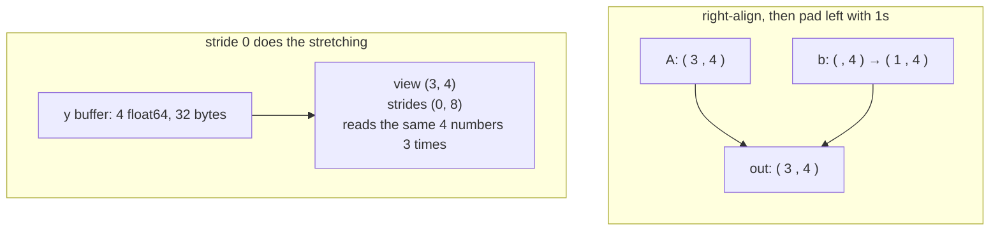

# 2.1 — Broadcasting: the rule in three lines

## One-line answer

Broadcasting lets tensors of different shapes combine by **pretending** a length-1 axis repeats — and
it does the pretending with a stride of zero, so no data is copied, which is why it is both the most
useful and the most dangerous convenience in the library.

---

## The story

A juice shop has a board with four juices and four prices. It also sells three glass sizes — small,
medium and large — and each size has its own multiplier, written on a card by the till.

A customer asks what everything costs in every size. That is twelve numbers. Nobody writes the price
list out three times. You hold the list of four prices next to the row of three sizes and read across:
this price, that size. Twelve answers, one board, one card, no rewriting.

The next week, the shop starts a discount scheme: one discount per juice, four discounts for four
juices. The owner wants the four discounted prices. Same trick, same person, same reading across.

Out come sixteen numbers.

Nothing went wrong at the counter. The prices run **down** the board, and the discounts were written
**across** the card, so reading across paired every price with every discount, instead of each price
with its own. Sixteen prices look exactly as sensible as four. They are all in rupees, they are all
roughly the right size, and nothing anywhere says "you have answered a different question".
---

## The idea in plain language

Two tensors can be combined elementwise — added, multiplied, subtracted — only if they have the same
shape. Broadcasting is a set of rules for treating certain *different* shapes as if they were the
same, without copying anything.

The rule has exactly three lines, and it is applied to the shapes **right-aligned**:

1. Line the two shapes up from the **right**. If one is shorter, pad it on the **left** with 1s.
2. For each position: the sizes are compatible if they are **equal**, or if **one of them is 1**.
3. The output size at that position is the **larger** of the two.

If any position has two different sizes and neither is 1, the operation fails. That is the whole rule
and there is nothing else to it.

Worked, right-aligned, on the first example in the table below:

```text
    A.shape      3   4
    b.shape          4        <- shorter: pad on the left with 1
    padded       1   4
    compatible?  1 vs 3 -> ok (one is 1)
                 4 vs 4 -> ok (equal)
    result       3   4
```

The word being defined: an axis of size 1 is called a **singleton** axis, and broadcasting is the
rule that a singleton axis may be *stretched* to any size. It is stretched by setting its stride to
zero — from part [1.3](../01-what-a-tensor-is/1.3-strides-and-the-free-transpose.md), a stride is how
far to walk when you step along an axis, so a stride of **zero** means "stepping along this axis does
not move". The same four numbers are read three times and the tensor behaves as if it had three rows.

Two consequences follow immediately, and they are opposite in sign:

- **It is free in memory.** Broadcasting an input costs no allocation. This is why it is everywhere.
- **The output is not free.** The *result* of the operation is a real tensor at the broadcast shape.
  Adding a `(10000, 1)` to a `(1, 10000)` allocates a `(10000, 10000)` result — measured below at
  762.9 MiB from two inputs of 80 kilobytes each.

---

## Why Akshara needs it

- **Day 5** applies a softmax over a vocabulary, which is a division of a `(B, T, V)` tensor by a
  `(B, T, 1)` tensor of sums. That `1` is a singleton axis and the division is a broadcast. Get the
  axis wrong and the probabilities still come out looking like probabilities.
- **Day 31** builds the causal mask: a `(T, T)` triangle broadcast against a `(B, H, T, T)` attention
  score tensor. One mask, every batch item, every head, no copies. That is a 4-D broadcast and it is
  the reason masks are cheap.
- **Day 37** implements LayerNorm, which subtracts a `(B, T, 1)` mean and divides by a `(B, T, 1)`
  standard deviation. The `keepdims=True` in those lines is not a style preference — part
  [2.3](2.3-the-n1-versus-n-bug.md) shows what happens without it.
- **Day 4** derives the gradient of a bias, which is a sum over exactly the axes that were broadcast
  in the forward pass. Backpropagation through a broadcast *is* a sum, and you cannot derive that
  without knowing which axes were stretched.

Broadcasting is not a convenience feature in a transformer. It is load-bearing in the mask, the
normalisation, the bias and the softmax — four of the six things a block does.

---

## The mechanism

The rule, checked rather than trusted:

```python
import numpy as np

pairs = [((3, 4), (4,)), ((3, 4), (3, 1)), ((3, 4), (1, 4)),
         ((2, 1, 4), (3, 4)), ((5,), (5, 1)), ((8, 1, 6, 1), (7, 1, 5))]
for s1, s2 in pairs:
    print(f"{str(s1):12s} + {str(s2):12s} -> {np.broadcast_shapes(s1, s2)}")
```

**Line by line:**
- `np.broadcast_shapes` answers the question without allocating anything: it takes shapes, returns a
  shape, and raises if they are incompatible. Reach for it whenever you are unsure — it is far
  cheaper than building two arrays to find out.
- Verified against `numpy` 2.5.2, `numpy.broadcast_shapes` (doc page
  `reference/generated/numpy.broadcast_shapes.html`), read 2026-08-26.
- Its actual output on this machine, 2026-08-26, is the table below. Read the last row carefully — it
  is the one that shows the rule is per-position and not global.

```text
(3, 4)       + (4,)         -> (3, 4)
(3, 4)       + (3, 1)       -> (3, 4)
(3, 4)       + (1, 4)       -> (3, 4)
(2, 1, 4)    + (3, 4)       -> (2, 3, 4)
(5,)         + (5, 1)       -> (5, 5)
(8, 1, 6, 1) + (7, 1, 5)    -> (8, 7, 6, 5)
```

Row 5 is the juice shop's discount card. `(5,)` and `(5, 1)` are both "five numbers", and combining them gives
**twenty-five**, because right-alignment pads the first to `(1, 5)` and then both singletons stretch.
That row is part [2.3](2.3-the-n1-versus-n-bug.md) in miniature, and it is the single most expensive
shape confusion in machine-learning code.

Row 6 shows that each position is decided independently: 8 against nothing (padded to 1) gives 8, 1
against 7 gives 7, 6 against 1 gives 6, 1 against 5 gives 5.

Now watch the stride-zero mechanism directly, because this is what "pretending" means:

```python
y = np.ones(4)                          # (4,)
bx = np.broadcast_to(y, (3, 4))         # (3, 4) — a view
print("bx.shape          :", bx.shape)
print("bx.strides        :", bx.strides)
print("bx.nbytes reports :", bx.nbytes)
print("y.nbytes actually :", y.nbytes)
print("shares memory     :", np.shares_memory(y, bx))
print("writeable         :", bx.flags["WRITEABLE"])
```

**Line by line:**
- `np.broadcast_to` performs the stretch explicitly, so you can inspect it. Normally it happens
  invisibly inside `+`, and this is the only way to look at it.
- `bx.strides` prints `(0, 8)` on this machine, 2026-08-26. The **zero** is the whole mechanism:
  stepping down a row moves nowhere, so all three rows are the same four `float64` values.
- `bx.nbytes` reports `96` (3 × 4 × 8) and `y.nbytes` is `32`. The view reports its *logical* size, not
  its real one — the same over-reporting part
  [1.3](../01-what-a-tensor-is/1.3-strides-and-the-free-transpose.md) warned about, now with an
  obvious cause.
- `bx.flags["WRITEABLE"]` prints `False`. NumPy refuses writes through a zero-stride view, because
  one write would silently change three rows. Where the library can prove the ambiguity, it refuses.
- Verified against `numpy` 2.5.2, `numpy.broadcast_to` (doc page
  `reference/generated/numpy.broadcast_to.html`), read 2026-08-26.

The alignment, drawn, because right-alignment is the part people get wrong:



And the cost that is *not* free — the output:

```python
n = 10_000
x = np.arange(n, dtype=np.float64)       # (10000,) — 80,000 bytes
d = x[:, None] - x[None, :]              # (10000, 10000)
print("x.nbytes :", x.nbytes)
print("d.shape  :", d.shape)
print("d.nbytes :", d.nbytes, f"= {d.nbytes / 1024 / 1024:.1f} MiB")
```

**Line by line:**
- `x[:, None]` inserts a new axis of size 1 at the end, giving `(10000, 1)`. `None` here is
  `np.newaxis` — the same object, and the shorter spelling is the common one. It is a **view**:
  measured strides `(8, 0)`, sharing memory with `x`.
- `x[None, :]` inserts the singleton at the front, giving `(1, 10000)`, strides `(0, 8)`.
- The subtraction broadcasts `(10000, 1)` against `(1, 10000)`. Both singletons stretch, and the
  output is `(10000, 10000)` — every pairwise difference.
- Measured on Intel Core i3-1115G4, 11.7 GB RAM, CPython 3.12.10, numpy 2.5.2, 2026-08-26: the inputs
  are 80,000 bytes each and the output is **800,000,000 bytes — 762.9 MiB**, a factor of 10,000. Two
  small arrays and one operator produced three quarters of a gigabyte.
- This pattern is not exotic: it is how you compute a pairwise distance matrix, an attention score
  matrix, or any "every-i against every-j" quantity. It is also exactly the O(n²) wall that Day 34
  measures for attention. **The inputs being small is not evidence that the operation is small.**

---

## Shapes

| Tensor | Symbolic shape | Concrete here | What each axis means |
| --- | --- | --- | --- |
| `A` | `(D0, D1)` | `(3, 4)` | rows · columns |
| `b` | `(D1,)` | `(4,)` | one value per column; padded to `(1, 4)` before alignment |
| `A + b` | `(D0, D1)` | `(3, 4)` | the same grid; `b` stretched down the rows |
| `y` | `(D1,)` | `(4,)` | the buffer that actually exists — 32 bytes |
| `broadcast_to(y, (3, 4))` | `(D0, D1)` | `(3, 4)` | strides `(0, 8)`; reports 96 bytes, occupies 32 |
| `x[:, None]` | `(N, 1)` | `(10000, 1)` | a column; strides `(8, 0)`, a view |
| `x[None, :]` | `(1, N)` | `(1, 10000)` | a row; strides `(0, 8)`, a view |
| `x[:, None] - x[None, :]` | `(N, N)` | `(10000, 10000)` | every pairwise difference — **762.9 MiB, allocated** |

The last three rows are the lesson: two views costing nothing produce one real tensor costing 10,000×
the inputs.

---

## When it breaks

The loud one, verbatim on this machine, 2026-08-26:

```console
>>> import numpy as np
>>> x = np.ones((3, 4))
>>> y = np.ones((3, 5))
>>> x + y
Traceback (most recent call last):
  File "<stdin>", line 1, in <module>
ValueError: operands could not be broadcast together with shapes (3,4) (3,5)
```

What it means: right-aligned, the last position is 4 against 5, and neither is 1. The message prints
both shapes, which is unusually helpful — read it as a right-aligned comparison and the offending
position is immediately visible. The smallest fix is *not* to reshape one of them until it fits;
it is to work out which of the two is the wrong shape, because one of them came from a line that
produced something you did not intend.

The other loud one, and the reason `keepdims` exists:

```console
>>> A = np.arange(12, dtype=np.float64).reshape(3, 4)
>>> A / A.sum(axis=1)
Traceback (most recent call last):
  File "<stdin>", line 1, in <module>
ValueError: operands could not be broadcast together with shapes (3,4) (3,)
```

`A.sum(axis=1)` removes the axis it summed, giving `(3,)`. Right-aligned against `(3, 4)`, that pads
to `(1, 3)` and fails against 4. `A.sum(axis=1, keepdims=True)` gives `(3, 1)` instead, which aligns
correctly and stretches across the columns.

**The silent version, which is why the next two parts exist.** Make `A` square and the identical bug
stops raising:

```console
>>> rng = np.random.default_rng(1337)
>>> A = rng.random((4, 4)) + 0.1
>>> right = A / A.sum(axis=1, keepdims=True)
>>> wrong = A / A.sum(axis=1)
>>> right.shape == wrong.shape
True
>>> right.sum(axis=1).round(6)
array([1., 1., 1., 1.])
>>> wrong.sum(axis=1).round(6)
array([1.44752 , 0.761398, 0.90691 , 0.862123])
```

Both results are `(4, 4)` arrays of finite positive numbers. One has rows summing to 1 and the other
does not, because the second divided each **column** by a row sum instead of each row. The maximum
difference between them is 0.2135 (measured, seed 1337, 2026-08-26) — large enough to change every
downstream answer, small enough that no value looks absurd.

The check that catches it, and it is the one to reach for every single time you normalise:

```python
np.testing.assert_allclose(p.sum(axis=-1), 1.0, rtol=1e-6)
```

**Line by line:**
- Assert the **invariant**, not the shape. Both candidates above have the right shape; only one has
  rows that sum to 1.
- `axis=-1` names the last axis rather than a number, which keeps the check correct when a batch axis
  is added later. Writing `axis=1` here is a bug waiting for the day the tensor becomes `(B, T, V)`.
- `rtol=1e-6` rather than exact equality, because floating-point summation does not give exactly 1.0 —
  that is Day 7's subject, and part
  [1.2](../01-what-a-tensor-is/1.2-dtype-the-width-of-a-number.md) already showed why.
- On a square matrix this assertion is the *only* thing standing between you and a silently wrong
  normalisation. Write it on Day 5, and every day after that has a softmax in it.

---

## In production

**What a research engineer writes instead of the teaching version.** They make the broadcast
explicit. `keepdims=True` on every reduction whose result is about to be broadcast back; `None` /
`np.newaxis` written deliberately rather than relying on right-alignment to pad; and a shape comment
on the line — `x = x - mu  # (B, T, C) - (B, T, 1)`. The rule is not "avoid broadcasting" — that would
throw away the mask, the bias and the norm. The rule is that **no reader should have to run the rule
in their head to know what shape came out.**

**What degrades at scale.** The output allocation. On a laptop, a broadcast that produces a `(10000,
10000)` intermediate is 762.9 MiB and merely slow; inside a training step on a device with a fixed
memory budget it is the difference between a run and an out-of-memory error. And the pattern hides:
the *inputs* to the offending line are small, so a reviewer scanning for large tensors will not stop
there. This is exactly the shape of attention's O(n²) memory, which is why Day 34 is a whole day and
why the entire flash-attention line of work exists — to never materialise that intermediate at all.

**The failure that only shows with real data.** A batch axis that is sometimes 1. Code written and
tested with `B = 8` broadcasts a `(B, 1, T)` mask correctly; the same code with the final, ragged
batch of size 1 makes `B` a singleton too, and an axis you never intended to stretch starts
stretching. Everything runs. The last batch of every epoch computes something different from the rest,
and the effect is a small, seed-dependent wobble in the loss that looks exactly like noise —
Silent Failure #4 from the plan's §6, arriving through a shape rather than a random number.

**The review comment.** *"`sum(axis=1)` here without `keepdims` — the tensor is square, so this will
broadcast rather than raise. Is that the axis you meant?"* This is the highest-value review comment in
this entire document, and it is worth learning to make it on sight.

**The interview question.** *"You divide a `(B, T, V)` tensor of scores by its sum over the vocabulary
and the model trains, but badly. Where do you look?"* The strong answer goes straight to the axis and
the `keepdims`, then says how it would *prove* the direction rather than guess: assert that the
probabilities sum to one along the last axis. The weak answer starts tuning the learning rate.

**Compute tier: T0.** Everything here is a laptop CPU measurement and every claim is structural: the
alignment rule, the zero stride, the read-only flag and the output size are properties of the library,
identical on any hardware. The 762.9 MiB figure is arithmetic on shapes and dtypes, not a benchmark,
so it too transfers exactly. What T0 does not show is the *consequence* of that allocation on a device
with 16 GB of memory and a model already resident in it — that arrives on Day 66.

---

## Check yourself

Run this. It prints **three shapes and one size in MiB**, and the third shape is the one to explain:

```python
import numpy as np

print("(3, 4) with (4,)   ->", np.broadcast_shapes((3, 4), (4,)))
print("(3, 4) with (3, 1) ->", np.broadcast_shapes((3, 4), (3, 1)))
print("(5,)   with (5, 1) ->", np.broadcast_shapes((5,), (5, 1)))
x = np.arange(10_000, dtype=np.float64)
print("pairwise output    :", round((x[:, None] - x[None, :]).nbytes / 1024 / 1024, 1), "MiB")
```

**Line by line:**
- The first two print `(3, 4)` and are the everyday cases.
- The third prints `(5, 5)`. **Say why out loud before you run it.** Five numbers combined with five
  numbers giving twenty-five is the juice shop's discount card, and it is the bug in part
  [2.3](2.3-the-n1-versus-n-bug.md).
- The last prints `762.9` on this machine. If your machine has little free memory this line may be
  slow or may fail — that is the finding, not an inconvenience, and it is worth causing once.

**Say this out loud, without scrolling up:** state the three-line rule with the word *right-aligned*
in it — and say why a `(5,)` combined with a `(5, 1)` gives twenty-five numbers rather than five.
