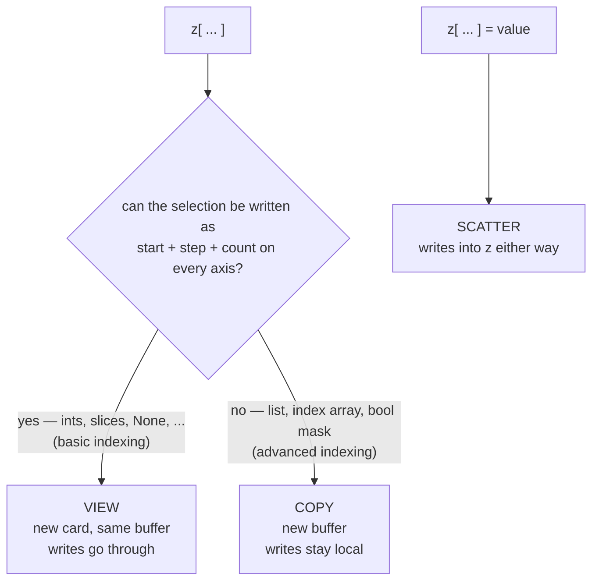

# 2.2 — Indexing: which forms give a view and which give a copy

## One-line answer

Slicing with colons returns a **view** — a new card over the same buffer — while indexing with a list,
an array or a boolean mask returns a **copy**, and the dividing line is whether the selection can be
expressed as a start, a step and a count.

---

## The story

You borrow a textbook from the library.

A friend asks you to check pages 40 to 60. You do not do anything clever: you open the book at page 40
and read to page 60. If you underline a sentence on page 45, that sentence is underlined in the
library's book, for everybody who borrows it after you.

Then your friend asks for pages 3, 17, 40 and 91. There is no single stretch of the book that means
"those four". So you go to the photocopier and copy those four pages onto loose sheets. Now there are
four sheets on your desk. Scribble on them, spill tea on them, throw them away — the book on the shelf
is untouched.

Both requests were reasonable, and you handled both of them correctly. But if someone asks "did the
library's book change?", the answer is yes for the first and no for the second. And **nothing in the
way the request was phrased tells you which kind it was.** You have to look at the shape of what was
asked for: one unbroken run, or a scattered list.
---

## The idea in plain language

From part [1.1](../01-what-a-tensor-is/1.1-the-array-that-is-flat.md), a tensor is a buffer plus a
card giving shape and strides. A view is possible exactly when the elements you asked for can be
described by *another card* — that is, by a starting offset, a stride per axis, and a count per axis.

That gives a rule you can apply by eye:

**Basic indexing** — integers, slices with `:`, `np.newaxis` / `None`, and `...` — always produces a
view. Every one of these selects a regularly spaced run, which is precisely what strides express.
`z[0:2, 1:3]` starts at a different offset and keeps the same strides. `z[::2]` doubles a stride.
`z[::-1]` **negates** one — a measured stride of `-32` bytes on this machine — and walks backwards
through the same buffer.

**Advanced indexing** (also called *fancy indexing*) — a list, an integer array, or a boolean mask —
always produces a copy. `z[[0, 2]]` picks rows 0 and 2 and skips row 1; there is no single stride that
does that in general, so the only way to hand you a rank-2 tensor is to build one.

The exception that trips everyone: **assignment is different from reading.** `f = z[[0, 2]]` copies,
so writing to `f` does nothing to `z`. But `z[[0, 2]] = -1` writes *into* `z`, because the fancy index
is on the left of the assignment and numpy scatters the values back. Reading through a fancy index
copies; assigning through one does not.

Two more terms, defined here because they are used constantly from Day 18 onward:

- A **gather** is indexing a table with an array of indices — `emb[ids]`. It is the operation an
  embedding lookup *is*, and it is a copy by necessity.
- A **scatter** is the assignment form — `table[ids] = values`. It writes into the table.

---

## Why Akshara needs it

- **Day 18–19** implement the embedding lookup, which is exactly `emb[ids]`: a `(V, C)` table indexed
  by a `(B, T)` array of token ids, producing `(B, T, C)`. It is a gather, it copies, and the copy is
  the whole memory cost of the embedding output. That shape transformation is worked below.
- **Day 31** builds the causal mask with `np.tril`, then applies it with a boolean selection. Whether
  that line writes into the scores or builds a new tensor determines whether attention can be done in
  place.
- **Day 51 onward**, every batch is `corpus[i : i + block_size]`. That is basic indexing, so it is a
  view — which is why a batch can be assembled cheaply from a large in-memory corpus, and also why
  part [1.5](../01-what-a-tensor-is/1.5-the-view-that-changed-the-original.md)'s retention trap is
  live in the data loader.
- **Day 69 onward**, sampling selects the top-k logits, which is fancy indexing on a sorted index
  array. Knowing it copies is how you know what the decode loop allocates per token.

---

## The mechanism

The dividing line, measured rather than remembered:

```python
import numpy as np

z = np.arange(12).reshape(3, 4)                          # (3, 4)
print("basic slice z[0:2, 1:3] :", np.shares_memory(z, z[0:2, 1:3]), z[0:2, 1:3].strides)
print("stepped     z[::2]      :", np.shares_memory(z, z[::2]), z[::2].strides)
print("reversed    z[::-1]     :", np.shares_memory(z, z[::-1]), z[::-1].strides)
print("fancy rows  z[[0, 2], :]:", np.shares_memory(z, z[[0, 2], :]))
print("boolean     z[z % 2 == 0]:", np.shares_memory(z, z[z % 2 == 0]))
```

**Line by line:**
- `np.shares_memory` is the only reliable test, for the reason part
  [1.3](../01-what-a-tensor-is/1.3-strides-and-the-free-transpose.md) gave: `.base` can point past the
  array you are comparing against when that array is itself a view.
- Its actual output on Intel Core i3-1115G4, CPython 3.12.10, numpy 2.5.2, 2026-08-26:
  `True (32, 8)`, `True (64, 8)`, `True (-32, 8)`, `False`, `False`.
- `z[0:2, 1:3]` keeps the strides `(32, 8)` and changes only the starting offset. Same card shape,
  different start.
- `z[::2]` **doubles** the row stride to 64 bytes: take every other row by walking twice as far each
  step. That is a card edit, not a copy.
- `z[::-1]` sets the row stride to `-32`. A negative stride is legal and means "walk backwards". This
  is why reversing a tensor is free, and it is the mechanism behind reversing a sequence without
  touching data.
- The last two print `False`. Neither an arbitrary row list nor a boolean mask can be written as a
  start-plus-stride, so numpy allocates.

Where a write lands — the same three forms, with the consequence:

```python
z2 = np.arange(12).reshape(3, 4)      # (3, 4)
s = z2[0:2, 1:3]                      # (2, 2) view
s[:] = -1
print("after writing through the slice:\n", z2)

z3 = np.arange(12).reshape(3, 4)      # (3, 4)
f = z3[[0, 2], :]                     # (2, 4) copy
f[:] = -1
print("after writing to the fancy copy:\n", z3)

z4 = np.arange(12).reshape(3, 4)      # (3, 4)
z4[[0, 2], :] = -1                    # fancy ASSIGNMENT — writes into z4
print("after fancy assignment:\n", z4)
```

**Line by line:**
- `s[:] = -1` uses `[:]` on the left, which means *fill this view*. Writing `s = -1` instead would
  rebind the name and change nothing — the same rebinding-versus-mutating distinction as part
  [1.5](../01-what-a-tensor-is/1.5-the-view-that-changed-the-original.md).
- The first print shows `z2` with a 2×2 block of `-1` in the middle. The write went through the card
  into the original buffer.
- The second print shows `z3` **completely unchanged**. `f` was a copy; scribbling on it marked the
  photocopies, not the library's book.
- The third print shows rows 0 and 2 of `z4` filled with `-1`. Identical index expression, opposite
  effect, because it is on the left-hand side. This asymmetry is not a quirk to memorise for its own
  sake — it is the reason a scatter update works at all.
- All three outputs measured on this machine, 2026-08-26.

The rule as a decision, drawn:



**The gather, because it is the one you will write a hundred times.** This is the embedding lookup,
three days early, so that when Day 18 writes it the shape change is already familiar:

```python
emb = np.arange(20, dtype=np.float64).reshape(5, 4)   # (V, C) = (5, 4)
ids = np.array([[0, 3, 3], [2, 1, 0]])                # (B, T) = (2, 3)
out = emb[ids]                                        # (B, T, C) = (2, 3, 4)
print("emb.shape", emb.shape, "ids.shape", ids.shape, "-> out.shape", out.shape)
print("shares memory:", np.shares_memory(emb, out))
```

**Line by line:**
- `emb` is a table with one row per vocabulary entry. `ids` is a batch of token id sequences.
- `emb[ids]` replaces **each id with the row it names**. The index array's shape `(B, T)` is
  substituted for the axis being indexed, and the table's remaining axis `C` is appended — giving
  `(B, T, C)`. Measured: `(2, 3, 4)` on this machine, 2026-08-26.
- **This is the single most important shape rule in advanced indexing** and it is worth saying in
  words: indexing axis 0 of a `(V, C)` table with an index array of shape `S` gives a result of shape
  `S + (C,)`.
- `shares_memory` prints `False`. The gather copies, and it must: id `3` appears twice in the first
  row, and one buffer cannot hold the same element at two positions with a single card.
- Note in the printed values that rows 1 and 2 of the first batch item are identical (`12 13 14 15`),
  because both ids were `3`. Repetition in the index is exactly what makes the view impossible.
- Verified against `numpy` 2.5.2 advanced-indexing rules, doc page
  `reference/arrays.indexing.html` (sections *Basic indexing* and *Advanced indexing*), read
  2026-08-26.

---

## Shapes

| Tensor | Symbolic shape | Concrete here | What each axis means |
| --- | --- | --- | --- |
| `z` | `(D0, D1)` | `(3, 4)` | rows · columns, `int64`, strides `(32, 8)` |
| `z[0:2, 1:3]` | `(2, 2)` | `(2, 2)` | a view; strides unchanged `(32, 8)`, offset moved |
| `z[::2]` | `(2, D1)` | `(2, 4)` | a view; row stride doubled to `64` |
| `z[::-1]` | `(D0, D1)` | `(3, 4)` | a view; row stride **negated** to `-32` |
| `z[[0, 2], :]` | `(2, D1)` | `(2, 4)` | a **copy** — no single stride skips row 1 |
| `z[z % 2 == 0]` | `(K,)` | `(6,)` | a **copy**, always rank 1; `K` is the number of `True`s |
| `emb` | `(V, C)` | `(5, 4)` | vocabulary entry · channel |
| `ids` | `(B, T)` | `(2, 3)` | batch item · token position, integer ids |
| `emb[ids]` | `(B, T, C)` | `(2, 3, 4)` | the gather: index shape, then the table's trailing axes |

The last three rows are the shape rule of the embedding lookup, and they are worth memorising as a
group: **`(V, C)` indexed by `(B, T)` gives `(B, T, C)`.**

---

## When it breaks

The two loud ones, verbatim on this machine, 2026-08-26:

```console
>>> import numpy as np
>>> x = np.arange(6).reshape(2, 3)
>>> x[2, 0]
Traceback (most recent call last):
  File "<stdin>", line 1, in <module>
IndexError: index 2 is out of bounds for axis 0 with size 2
>>> x[0, 0, 0]
Traceback (most recent call last):
  File "<stdin>", line 1, in <module>
IndexError: too many indices for array: array is 2-dimensional, but 3 were indexed
```

The first names **which axis** and **its size**, which is usually enough to find the bug without a
debugger: an index of 2 on an axis of size 2 is an off-by-one, and off-by-one on a sequence axis is
the mask bug Day 34 hunts. The second is a rank error and almost always means a tensor lost or gained
an axis several lines earlier — the fix belongs there, not here.

**The silent version, and it has two faces.**

*Face one: a boolean mask flattens.* Selecting with a mask always returns rank 1, whatever the input
rank:

```console
>>> z = np.arange(12).reshape(3, 4)
>>> z[z % 2 == 0].shape
(6,)
```

The `(3, 4)` structure is gone, and nothing said so. Code that then does `.reshape(3, -1)` on the
result is asserting that exactly two elements per row matched — a claim that happens to be true for
this data and is not true in general. When it stops being true, the reshape either raises far from
the cause or, worse, succeeds with a different row length.

*Face two: the copy you paid for and did not want.* A fancy index inside a training loop allocates a
new buffer every iteration. Nothing is wrong with the numbers. The loop simply allocates and frees a
tensor per step, which on a device with a caching allocator shows up as memory pressure and
fragmentation rather than as an obvious slow line.

The check for both is to state what you expect and let it fail:

```python
sel = z[mask]
assert sel.ndim == 1, f"boolean selection is always rank 1, got {sel.ndim}"
assert not np.shares_memory(z, sel), "expected a copy here"
```

**Line by line:**
- The first assertion documents the flattening at the point it happens, so nobody downstream has to
  rediscover it.
- The second is the one to write when a copy is *intended* — it turns an assumption into a checked
  fact, and it fails the day someone "optimises" the line into a slice.
- Neither belongs in a hot loop. Both belong in the test that covers the function, which is what
  Principle 11 means by *every day ends with at least one check that can go red*.

**Which silent failure this touches.** Not one of the plan's five directly — but the boolean-mask
flatten is a common route into Silent Failure #3 (the loss counted padding). A mask built to select
real tokens, applied with `logits[mask]`, silently produces a rank-1 tensor whose length depends on
the batch's padding; average over it without thinking and the denominator is right, but concatenate
it with something shaped per-batch and the alignment is quietly wrong. Day 6
([2.5](../../../day-006-entropy-cross-entropy-perplexity/parts/02-cross-entropy/2.5-the-loss-that-counted-padding.md))
is where that becomes the day's subject.

---

## In production

**What a research engineer writes instead of the teaching version.** They separate the two intents.
When the point is a *cheap slice* of a large buffer — a batch out of a corpus — they use basic
indexing and know it is a view, and they copy explicitly if the slice will outlive the buffer. When
the point is a *gather* — an embedding lookup, a top-k selection, a re-ordering — they use the
library's named operation (`take`, `take_along_axis`, `gather`) rather than bracket syntax, because
the named form makes the axis explicit and cannot be misread as a slice. Bracket indexing that mixes
slices and index arrays in one expression is the form they avoid entirely, for the reason in the next
paragraph.

**What degrades at scale.** Two things. First, the gather itself: an embedding lookup on a `(B, T)`
batch touches `B × T` scattered rows of a table that may be hundreds of megabytes, and scattered reads
are the access pattern hardware is worst at (part
[1.3](../01-what-a-tensor-is/1.3-strides-and-the-free-transpose.md) measured a 6.11× penalty for a far
milder scatter on this CPU). It is why the embedding layer is a measurable cost rather than a free
table read. Second, the intermediate: `z[mask]` on a large tensor allocates a buffer sized by the
number of `True`s, which is data-dependent — so peak memory now depends on the *content* of a batch,
not just its shape. That is the kind of memory profile that is fine for a thousand steps and fails on
step 1001.

**The failure that only shows with real data.** Mixed indexing that moves an axis. When index arrays
are separated by a slice — `a[[0, 1], :, [0, 1]]` — numpy moves the resulting axis to the **front**.
Measured on this machine, 2026-08-26: `a` of shape `(2, 3, 4)` indexed that way gives `(2, 3)`, not
`(2, 3, 2)` and not `(3, 2)`. Code written against a square-ish test tensor can pass while the axis
order is wrong, and the mistake only becomes visible when a downstream operation has an axis that is
not interchangeable. The defence is the one from part
[1.1](../01-what-a-tensor-is/1.1-the-array-that-is-flat.md): assert the shape after any indexing
expression you had to think about.

**The review comment.** *"`batch = corpus[i : i + T]` is a view into the corpus — if this batch is
stored anywhere that outlives the step, it pins the whole corpus. Copy it or consume it."* That is
part 1.5's retention trap arriving through the data loader, which is where it actually happens.

**The interview question.** *"You index a tensor two different ways and one of them is 50× slower.
What would you check first?"* The strong answer names view-versus-copy before anything else: one form
returned a card and the other allocated and filled a buffer. Then it says how to tell —
`np.shares_memory` — rather than reasoning about it. The weak answer talks about caching.

**Compute tier: T0.** Everything here is a laptop CPU measurement, and every claim is structural — the
view/copy rule, the strides, the gather's output shape and the axis-moving behaviour are properties of
the library and are identical on any device. What T0 does not show is the *cost* of a scattered gather
on accelerator memory, which is a different constant and is measured on Day 19 when the embedding
layer is real.

---

## Check yourself

Run this. It prints **two booleans and two shapes**, and the last shape is the one to say out loud
before you look:

```python
import numpy as np

z = np.arange(12).reshape(3, 4)
print("slice is a view :", np.shares_memory(z, z[0:2, 1:3]))
print("fancy is a view :", np.shares_memory(z, z[[0, 2], :]))
print("mask result rank:", z[z % 2 == 0].shape)

emb = np.arange(20, dtype=np.float64).reshape(5, 4)
ids = np.array([[0, 3, 3], [2, 1, 0]])
print("emb[ids].shape  :", emb[ids].shape)
```

**Line by line:**
- The first two print `True` then `False`, and that pair is the whole part.
- The third prints `(6,)` — rank 1 from a rank-2 input, with no warning that structure was lost.
- The fourth prints `(2, 3, 4)`. Say the rule out loud first: a `(5, 4)` table indexed by a `(2, 3)`
  index array gives *index shape, then the table's trailing axes*.

**Say this out loud, without scrolling up:** state the one property of a selection that decides
whether you get a view or a copy — and explain why `z[[0, 2]] = -1` changes `z` even though
`z[[0, 2]]` is a copy.
