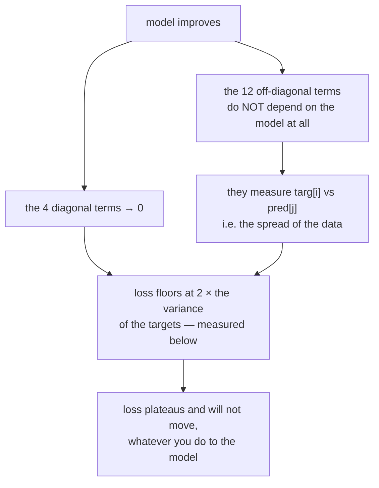

# 2.3 — 💥 The `(N, 1)` that should have been `(N,)`

## One-line answer

Subtracting a `(N, 1)` from a `(N,)` does not give `N` differences — it gives `N × N` of them, and
because the result is still a finite array of plausible numbers, the only symptom is a loss that
refuses to go below a floor no matter what you do to the model.

---

## The story

Two teachers write down the marks of the same four students.

The first writes them across one line of a page: 34, 51, 47, 62. The second writes them down a column
on a clipboard, one under the other: 34, 51, 47, 62. Same four students, same four marks. The only
difference is which way the numbers run on the paper.

At the end of term, someone wants to know how far each student is from the pass mark of 40. They type
both lists into a spreadsheet and subtract one from the other.

Four students should give four numbers. The spreadsheet gives sixteen.

Nobody notices, because sixteen differences look exactly like four differences. They are small, some
positive, some negative, and the average is a perfectly believable figure. The report goes out saying
the class is 12 marks below target. The real answer is 3.

Both teachers recorded **the same four marks**. The only thing that differed was whether the numbers
ran across the page or down it.
---

## The idea in plain language

Part [2.1](2.1-broadcasting-the-rule.md) gave the rule: shapes are right-aligned, shorter ones are
padded on the left with 1s, and a size of 1 stretches.

Apply it to `(4,)` and `(4, 1)`:

```text
    pred.shape         4        <- shorter: pad on the left
    padded         1   4
    targ.shape     4   1
    compatible?    1 vs 4 -> ok (one is 1)
                   4 vs 1 -> ok (one is 1)
    result         4   4
```

**Both** singletons stretch. The output is every prediction paired with every target — an outer
operation, when what was wanted was an elementwise one.

Why this is *the* shape bug rather than one of many:

- Both operands genuinely hold `N` numbers. Nothing was lost or duplicated at the source.
- `(N,)` and `(N, 1)` arise from ordinary, correct-looking code all the time. A column read from a
  file, a `keepdims=True` reduction, a target array shaped for a matrix operation, an index that took
  a slice instead of an element — every one of these produces `(N, 1)` where the neighbouring code
  produces `(N,)`.
- The broadcast **succeeds**, so there is no error. The result is finite, real-valued and the right
  order of magnitude.
- The consequence is a *statistic*, and statistics do not look wrong. A mean over N² numbers is still
  a mean.

The term for what happened: an operation between a column and a row produces an **outer** result —
every pair — rather than an **elementwise** one. Broadcasting makes the two indistinguishable at the
call site, and that is the price of the convenience.

---

## Why Akshara needs it

- **Day 25** trains the first model and reports "the loss went down". A loss computed with this bug
  goes down too — just to a floor it never passes. That day's entire claim rests on the loss meaning
  what it says.
- **Day 51** builds the training loop, and the label tensor's shape versus the prediction tensor's
  shape is the first thing that goes wrong in every from-scratch training loop ever written.
- **Day 5** and **Day 6** compute a softmax and a cross-entropy over `(B, T, V)`. Both involve a
  reduction over the last axis followed by a broadcast back. A missing `keepdims=True` there is this
  bug wearing a different shape, and on a tensor whose `V` happens to equal `T` it does not even
  raise.
- **Day 119** is where statistical significance becomes formal, and its whole premise is that a
  number needs a reason to be believed. This part is the cheapest possible demonstration of why.

---

## The mechanism

Reproduce it. This is four predictions and four targets, and the model is *good* — every prediction
is within 0.2 of its target:

```python
import numpy as np

pred = np.array([1.0, 2.0, 3.0, 4.0])              # (4,)   — one prediction per item
targ = np.array([[1.1], [1.9], [3.2], [3.8]])      # (4, 1) — one target per item, as a column

diff = pred - targ                                  # (4, 4) — NOT (4,)
print("pred.shape", pred.shape, " targ.shape", targ.shape, " diff.shape", diff.shape)
print("mse WRONG :", round(float((diff ** 2).mean()), 6))
print("mse RIGHT :", round(float(((pred - targ.ravel()) ** 2).mean()), 6))
print("ratio     :", round(float((diff ** 2).mean() / ((pred - targ.ravel()) ** 2).mean()), 1))
```

**Line by line:**
- `pred` is written as a flat list, so its shape is `(4,)`. This is what a model that returns one
  number per item naturally produces.
- `targ` is written as a list of one-element lists, so its shape is `(4, 1)`. This is what reading a
  single column out of a table naturally produces — and it is the *only* difference between the two.
- `pred - targ` right-aligns `(4,)` against `(4, 1)`, pads the first to `(1, 4)`, and stretches both
  singletons. The comment says `(4, 4)` because that is what it is, and writing the shape in the
  comment is the habit (Principle 20) that catches this before the run.
- `targ.ravel()` flattens `(4, 1)` to `(4,)`. `.ravel()` returns a view when it can, so this is free.
  `targ.squeeze(-1)` says the same thing more precisely — *remove the last axis, and fail if it is not
  size 1* — and is the better choice when you want the assertion.
- `(diff ** 2).mean()` averages over **all** elements of whatever it is given. It does not know or care
  that there are sixteen instead of four, which is exactly why nothing complains.

Its actual output on Intel Core i3-1115G4, 11.7 GB RAM, Windows 11, CPython 3.12.10, numpy 2.5.2,
2026-08-26:

```text
pred.shape (4,)  targ.shape (4, 1)  diff.shape (4, 4)
mse WRONG : 2.375
mse RIGHT : 0.025
ratio     : 95.0
```

**The right answer is 0.025 and the reported answer is 2.375 — ninety-five times too large.** And it
is too large in a very specific, very misleading way: the wrong MSE is dominated by the fifteen
comparisons between *unrelated* pairs, and those do not involve the model at all.

That is the real cruelty of this bug. It puts a **floor** under the loss:



A perfect model — `pred` exactly equal to `targ.ravel()` — still reports a large loss under this bug,
because only 4 of the 16 terms are ever zero. No learning rate, no architecture change and no amount
of data will move it, and every hour spent tuning those is spent on the wrong thing.

**And here is why it is worse than it looks: with a bad model it hides completely.** The same
comparison at three sizes, with *random* predictions rather than good ones — same machine, seed 1337,
2026-08-26:

```text
n=  4  wrong=1.4012  right=2.7940  ratio=0.50
n= 16  wrong=2.3625  right=2.8389  ratio=0.83
n= 64  wrong=1.6965  right=1.5633  ratio=1.09
```

When the predictions are random, the wrong loss and the right loss are the **same order of
magnitude** — the ratio hovers around 1. So at the start of training, when you would most plausibly
notice something, there is nothing to notice. The discrepancy only opens up as the model gets good,
which is precisely when you have stopped looking at the loss with fresh eyes.

**The check, and it is one line.** Assert the shape of the difference, not of the inputs:

```python
diff = pred - targ.reshape(pred.shape)
assert diff.shape == pred.shape, f"elementwise op broadcast to {diff.shape}, expected {pred.shape}"
```

**Line by line:**
- `targ.reshape(pred.shape)` states the intent — *these two have the same shape* — and **raises** if
  the element counts disagree, which is the loud failure you want. `ravel()` would silently accept a
  `(2, 2)` target as well.
- The assertion is on the **output**, and that is the point. Asserting `pred.shape == (4,)` and
  `targ.shape == (4,)` separately catches the same bug, but the output assertion also catches the
  cases where the two inputs are individually fine and the operation between them was not — which is
  the general form of the problem.
- The message prints both shapes. `(4, 4), expected (4,)` names the bug in full; a bare
  `AssertionError` sends you looking.
- Put this in the loss function, once. It costs nothing measurable and it is live for every step of
  every run from Day 25 to Day 161.

---

## Shapes

| Tensor | Symbolic shape | Concrete here | What each axis means |
| --- | --- | --- | --- |
| `pred` | `(N,)` | `(4,)` | one prediction per item |
| `targ` | `(N, 1)` | `(4, 1)` | one target per item — **as a column** |
| `pred` padded | `(1, N)` | `(1, 4)` | what right-alignment does to `pred` before comparing |
| `pred - targ` | `(N, N)` | `(4, 4)` | every target against every prediction — the bug |
| `pred - targ.ravel()` | `(N,)` | `(4,)` | the intended elementwise difference |
| the wrong MSE | `()` | `2.375` | a mean over `N²` terms, only `N` of which are meaningful |
| the right MSE | `()` | `0.025` | a mean over `N` terms |

The fourth row is the entire bug, and it is visible in a `## Shapes` table and invisible in the
output. That is why Principle 20 exists.

---

## When it breaks

**It does not break. That is the subject.**

There is no traceback to reproduce here, so what follows is the *wrong-but-running* output, verbatim,
which is what the plan's §25.4 asks for in the silent case:

```text
pred.shape (4,)  targ.shape (4, 1)  diff.shape (4, 4)
mse WRONG : 2.375
mse RIGHT : 0.025
```

Both numbers are finite. Both are positive. Both would look entirely reasonable in a log line reading
`step 400  loss 2.375`.

The *loud* cousin exists and it is the lucky case — when the two lengths differ, the broadcast fails:

```console
>>> import numpy as np
>>> pred = np.array([1.0, 2.0, 3.0, 4.0])
>>> targ = np.array([[1.1], [1.9], [3.2], [3.8], [5.0]])
>>> pred - targ
array([[-0.1,  0.9,  1.9,  2.9],
       [-0.9,  0.1,  1.1,  2.1],
       [-2.2, -1.2, -0.2,  0.8],
       [-2.8, -1.8, -0.8,  0.2],
       [-4. , -3. , -2. , -1. ]])
```

— except it does not fail, because `(4,)` against `(5, 1)` right-aligns to `(1, 4)` against `(5, 1)`
and gives `(5, 4)`. **Even a length mismatch does not raise here**, because both mismatched positions
have a 1 opposite them. The only way to get an exception out of this shape pair is to force it, which
is what `reshape(pred.shape)` in the check above does.

**The symptom you will actually see, and how to read it.** A training loss that:

1. falls normally for the first while, then
2. flattens at a value well above zero, and
3. does not respond to the learning rate, the model size, or more data.

That plateau is **exactly twice the variance of your targets**. Set `pred` equal to `targ.ravel()` —
a perfect model — and the wrong MSE measures `2.25` while `2 * targ.ravel().var()` also measures
`2.25`, on this machine, 2026-08-26. It is a property of the data, not of the model, which is precisely
why nothing you do to the model moves it. The diagnosis takes ten seconds:
print the shape of the difference inside the loss function. If it is not the shape of one prediction
per item, stop tuning and fix the shape.

**Which silent failure this is.** The plan's §6 lists five. This one feeds **#4 — noise mistaken for
improvement** — from an unusual direction: the loss is not noisy, it is *inflated by a constant that
does not depend on the model*, so genuine improvements are compressed into a small fraction of the
reported number and become indistinguishable from run-to-run variation. Two seeds would not reveal
it. Only the shape check does.

---

## In production

**What a research engineer writes instead of the teaching version.** The loss function asserts its
input shapes on entry, once, and the assertion names both tensors. Beyond that, the deeper habit is
**never letting a `(N, 1)` exist without a reason**: a reduction that will be broadcast back keeps
`keepdims=True` and stays `(N, 1)` deliberately; anything else is squeezed at the point it is
produced, not at the point it is consumed. The bug is not really about broadcasting — it is about a
shape travelling several functions away from the line that chose it.

**What degrades at scale.** Memory, catastrophically, and this is the version that at least announces
itself. At `N = 4` the bug costs 16 elements instead of 4. At a batch of 10,000 it costs 100,000,000
instead of 10,000 — measured in part [2.1](2.1-broadcasting-the-rule.md) at **762.9 MiB** for exactly
that shape pair in `float64`. On a device with a fixed budget the same bug that is silent at small
scale becomes an out-of-memory error at real scale, and the traceback points at a subtraction, which
is confusing until you have met this part. An out-of-memory error in a loss function is almost always
this.

**The failure that only shows with real data.** A target column loaded from a file. A CSV reader, a
dataframe column, an `.npy` written by a preprocessing script — all of these naturally hand you
`(N, 1)`. Synthetic test data written by hand in the test file is naturally `(N,)`. So the unit tests
pass on the shape the test author typed, and the real pipeline runs on the shape the loader produced.
This is why the shape assertion belongs in the *function*, where both paths meet, and not in the test.

**The review comment.** *"`pred` is `(N,)` and `targ` is `(N, 1)` — this subtraction is `(N, N)`. Add
a shape assertion to the loss and squeeze the target where it's loaded."* Two changes, and the second
one is the real fix: the assertion catches it, but the squeeze at the boundary prevents it.

**The interview question.** *"Your training loss drops for a while and then plateaus well above zero,
and nothing you change to the model moves it. Name three causes and say how you'd distinguish them."*
A strong answer includes this shape bug alongside the genuine ones (the model has too little capacity;
the learning rate has collapsed) and — the part that distinguishes experience from reading — says how
to tell them apart cheaply: print the shape of the loss's intermediate first, because it is a
ten-second check that either eliminates a whole class of causes or solves the problem outright.

**Compute tier: T0.** Every number here was measured on a laptop CPU with four elements. That is the
useful thing about this failure: it is exactly reproducible at the smallest possible scale, because it
is a rule about shapes and not about hardware, data or randomness. What T0 cannot show you is the
version that costs a T1 session — the 762.9 MiB allocation on a device that had 200 MiB free — and
that is the one to have this part in mind for.

---

## Check yourself

Run this. It prints **one shape and two numbers**, and the shape is the finding:

```python
import numpy as np

pred = np.array([1.0, 2.0, 3.0, 4.0])
targ = np.array([[1.1], [1.9], [3.2], [3.8]])
print("diff shape:", (pred - targ).shape)
print("mse as written :", round(float(((pred - targ) ** 2).mean()), 6))
print("mse intended   :", round(float(((pred - targ.ravel()) ** 2).mean()), 6))
```

**Line by line:**
- The shape prints `(4, 4)`. **Predict it out loud before running**, using the three-line rule from
  part [2.1](2.1-broadcasting-the-rule.md), and check whether you predicted `(4,)`.
- The two numbers print `2.375` and `0.025` on this machine, 2026-08-26 — a factor of 95.
- Now add `assert (pred - targ.reshape(pred.shape)).shape == pred.shape` above them and watch it pass;
  then change `targ` to have five rows and watch it raise. Both outcomes are the check working.

**Say this out loud, without scrolling up:** why does this bug hide at the *start* of training and
appear only once the model is good — and what single line, placed where, would have made it
impossible?
