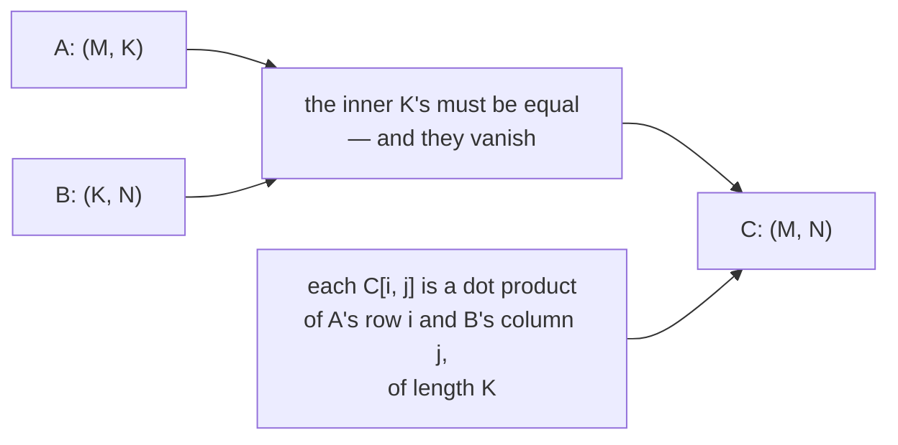

# 3.1 — Matrix multiplication is the primitive

## One-line answer

A matrix multiply is "every row of one thing measured against every column of the other", it is the
single operation that a transformer spends almost all of its time inside, and its one rule is that the
**inner dimensions must match while the outer two survive**.

---

## The story

You cook three dishes regularly. Each one uses some amount of four things: rice, oil, onion and salt.

You write two lists on the back of an envelope. The first has one line per dish and one column per
ingredient: how much of each ingredient one plate of each dish needs. The second has one line per
ingredient and one column per shop: what a kilogram of each ingredient costs at the two shops near
you.

What you want is one number for each dish at each shop: how much does this dish cost if I buy
everything from that shop?

Here is how anyone would actually do it. Take the line for dish one. Take the column for shop one.
Walk down them together — rice amount times rice price, plus oil amount times oil price, plus onion,
plus salt — and write the total into a new little grid. Then take the same line against shop two's
column. Then move on to dish two.

Three dishes, two shops, six totals. Each total is four multiplications and three additions, walked
down the shared list of **ingredients**.

That shared list is the entire rule. It sits along the columns of the first sheet and along the rows
of the second, and if the two sheets do not name the same four ingredients in the same order, the walk
gives you a number that is complete nonsense — while the arithmetic itself stays perfectly correct.
---

## The idea in plain language

A **matrix** is a rank-2 tensor: a grid with rows and columns
(part [1.1](../01-what-a-tensor-is/1.1-the-array-that-is-flat.md)).

Matrix multiplication takes an `(M, K)` and a `(K, N)` and produces an `(M, N)`. The definition of the
element at row *i*, column *j* of the output is:

> multiply `A[i, 0]` by `B[0, j]`, `A[i, 1]` by `B[1, j]`, … all the way to `K − 1`, and add up the `K`
> products.

Three things to hold onto, and they are the whole part:

**The inner dimensions must match, and they disappear.** The `K` in `(M, K) @ (K, N)` appears in both
inputs and in neither output. It is the shared list — the materials. `M` and `N` are the *outer*
dimensions, and they survive into the output. This is the rule you check by eye before you run
anything: write the two shapes next to each other and see whether the two touching numbers are equal.

**Each output element is a dot product.** A **dot product** of two lists of the same length is
"multiply pairwise, then add" — a single number that is large when the two lists point the same way
and near zero when they are unrelated. So a matrix multiply is `M × N` independent dot products, each
of length `K`. Every one of them can be computed without knowing any of the others, which is why this
operation parallelises so well and is the subject of
[3.4](3.4-why-hardware-loves-matmul.md).

**It is not elementwise multiplication.** `A * B` multiplies matching positions and needs both shapes
to be the same (or broadcastable). `A @ B` walks the shared axis and needs the *inner* shapes to match.
They are different operations that both take two matrices and return one, and confusing them is the
first thing that goes wrong.

The count of arithmetic, which will be used repeatedly from here to Day 161: an `(M, K) @ (K, N)`
performs `M × N × K` multiplications and about the same number of additions, so it is conventionally
counted as **`2 × M × N × K` floating-point operations** (flops). For a square `N × N` matmul that is
`2N³`, and the cube is the reason everything about scaling is about this operation.

---

## Why Akshara needs it

Everything from Day 25 onward is matmuls with names on them:

- **Day 26** is a multi-layer perceptron: `x @ W1 + b1`, then `x @ W2 + b2`. Two matmuls.
- **Day 30** is scaled dot-product attention: `Q @ K.T` produces the score matrix, and `scores @ V`
  produces the output. Two more matmuls, and the first one is where the `(T, T)` cost of attention
  comes from.
- **Day 35** is the feed-forward block, which is two matmuls that are usually the *largest* two in the
  whole model.
- **Day 39** counts Akshara v0's parameters, and every one of them lives in a matrix that is one side
  of a matmul.
- **Day 78 onward** quantizes those matrices, and the only reason quantization pays is that the matmul
  dominates the time.

If you can say what shape comes out of a matmul without running it, you can read a transformer. If you
cannot, every shape error in the next hundred and fifty days is a mystery rather than an arithmetic
slip.

---

## The mechanism

The definition, done by hand on the factory's numbers, before any library:

```python
A = [[2.0, 1.0, 3.0, 0.5],      # product 1: steel, plastic, wire, paint   (M=3, K=4)
     [1.0, 4.0, 0.0, 1.0],      # product 2
     [0.0, 2.0, 5.0, 0.0]]      # product 3

B = [[1.5, 1.6],                # steel   price at supplier 1, supplier 2  (K=4, N=2)
     [0.8, 0.7],                # plastic
     [0.3, 0.4],                # wire
     [2.0, 1.9]]                # paint

M, K, N = len(A), len(B), len(B[0])
C = [[0.0] * N for _ in range(M)]                      # (M, N) = (3, 2)
for i in range(M):                                     # each product
    for j in range(N):                                 # each supplier
        total = 0.0
        for k in range(K):                             # walk the shared list: materials
            total += A[i][k] * B[k][j]
        C[i][j] = total

for row in C:
    print([round(v, 3) for v in row])
```

**Line by line:**
- `M, K, N = len(A), len(B), len(B[0])` reads the three sizes off the data. `K` is taken from `len(B)`
  — the number of **rows** of `B` — because that is the shared axis. Taking it from `len(A[0])` would
  be equally valid *and would not check anything*; taking it from `B` and letting an `IndexError`
  happen if `A`'s rows are shorter is the cheap version of a shape check.
- The three nested loops are, in order: which output row, which output column, and the walk down the
  shared axis. **That order is the definition**, and the innermost loop is the dot product.
- `total` accumulates in a fresh local for each output element, starting at `0.0` and not at `0` — a
  float accumulator, so the additions stay in floating point rather than starting as integers.
- `C = [[0.0] * N for _ in range(M)]` builds `M` **separate** lists. Writing `[[0.0] * N] * M` would
  build one list referenced `M` times, and every row would alias every other — exactly the aliasing
  trap of part [1.5](../01-what-a-tensor-is/1.5-the-view-that-changed-the-original.md), in plain
  Python.
- The output has one row per product and one column per supplier, and the materials axis is gone. It
  was consumed by the walk.

Now the same thing with the operator, which is the compare half of Principle 3:

```python
import numpy as np

An = np.array(A)      # (3, 4)
Bn = np.array(B)      # (4, 2)
Cn = An @ Bn          # (3, 2)
print(Cn.shape)
print(np.allclose(Cn, np.array(C)))
```

**Line by line:**
- `@` is Python's matrix-multiplication operator. It is not a numpy invention — it is language syntax
  (`__matmul__`), which is why it reads the same for every array library you will meet.
- `Cn.shape` prints `(3, 2)`: `(3, 4) @ (4, 2)`, inner `4`s cancel, outer `3` and `2` survive.
- `np.allclose` rather than `==`. Two floating-point computations of the same quantity in a different
  order do not give bit-identical answers, and Day 7 is entirely about why. `allclose` asks whether
  they agree to a tolerance, which is the only question worth asking about floats.
- Verified against `numpy` 2.5.2, `numpy.matmul` (doc page
  `reference/generated/numpy.matmul.html`), read 2026-08-26.

**The one rule, drawn:**



**And the operation it is constantly confused with.** These are two different functions of the same
two matrices:

```python
A2 = np.arange(4, dtype=np.float64).reshape(2, 2)      # (2, 2)
B2 = np.arange(4, 8, dtype=np.float64).reshape(2, 2)   # (2, 2)
print("A2 * B2  (elementwise)\n", A2 * B2)
print("A2 @ B2  (matmul)\n", A2 @ B2)
```

**Line by line:**
- Both inputs are `(2, 2)`, so **both operations are legal** and both return `(2, 2)`. There is no
  shape error to protect you, and this is why the confusion survives.
- On this machine, 2026-08-26, `A2 * B2` gives `[[0, 5], [12, 21]]` and `A2 @ B2` gives
  `[[6, 7], [26, 31]]`. Different numbers, same shape, no warning.
- `*` is elementwise and follows the broadcasting rules of part
  [2.1](../02-broadcasting-and-indexing/2.1-broadcasting-the-rule.md). `@` walks the shared axis and
  follows the inner-dimension rule. They have nothing in common except their spelling.

**What happens when one side is a vector**, because this is where the shape rules feel arbitrary until
you know they are not:

```python
M3 = np.arange(12, dtype=np.float64).reshape(3, 4)     # (3, 4)
v = np.ones(4)                                          # (4,)
u = np.ones(3)                                          # (3,)
print("(3, 4) @ (4,)  ->", (M3 @ v).shape)
print("(3,)   @ (3, 4)->", (u @ M3).shape)
print("(4,)   @ (4,)  ->", np.shape(v @ v))
```

**Line by line:**
- `(3, 4) @ (4,)` gives `(3,)`. A rank-1 operand on the **right** is treated as a column: it is
  temporarily promoted to `(4, 1)`, the matmul gives `(3, 1)`, and the added axis is removed again.
- `(3,) @ (3, 4)` gives `(4,)`. A rank-1 operand on the **left** is treated as a row: promoted to
  `(1, 3)`, result `(1, 4)`, axis removed.
- `(4,) @ (4,)` gives `()` — rank 0, a single number. That is the plain dot product, and it is the
  same operation with both promotions applied at once.
- The rule underneath all three: **a rank-1 operand gets a temporary axis on the side facing the other
  operand, and that axis is stripped from the result.** Knowing it stops these three cases from being
  three things to memorise. Measured on this machine, 2026-08-26.

---

## Shapes

| Tensor | Symbolic shape | Concrete here | What each axis means |
| --- | --- | --- | --- |
| `A` | `(M, K)` | `(3, 4)` | product · material |
| `B` | `(K, N)` | `(4, 2)` | material · supplier |
| `A @ B` | `(M, N)` | `(3, 2)` | product · supplier — **the material axis is gone** |
| one output element | `()` | `()` | a dot product of length `K` |
| `M3 @ v` | `(M,)` | `(3,)` | rank-1 right operand: promoted to `(K, 1)`, then stripped |
| `u @ M3` | `(N,)` | `(4,)` | rank-1 left operand: promoted to `(1, M)`, then stripped |
| `v @ v` | `()` | `()` | both promoted — the plain dot product |
| `v[:, None] @ v[None, :]` | `(K, K)` | `(4, 4)` | the **outer** product: no axis is shared, so none vanishes |

The last row is worth a second look next to part
[2.3](../02-broadcasting-and-indexing/2.3-the-n1-versus-n-bug.md): the same `(N, 1)` against `(1, N)`
pattern that was a bug there is the *definition* of an outer product here. The shapes do not know
which one you meant.

---

## When it breaks

The loud one, verbatim on this machine, 2026-08-26:

```console
>>> import numpy as np
>>> A = np.ones((2, 3))
>>> B = np.ones((4, 5))
>>> A @ B
Traceback (most recent call last):
  File "<stdin>", line 1, in <module>
ValueError: matmul: Input operand 1 has a mismatch in its core dimension 0, with gufunc signature (n?,k),(k,m?)->(n?,m?) (size 4 is different from 3)
```

That message repays reading slowly, because you will see it hundreds of times:

- **"Input operand 1"** means the second argument, counting from zero.
- **"core dimension 0"** means that operand's first axis — the `k` in the signature.
- **`(n?,k),(k,m?)->(n?,m?)`** is the rule written formally. The `?` marks an axis that may be absent,
  which is exactly the rank-1 promotion above.
- **"size 4 is different from 3"** names the two numbers that failed to match.

The smallest fix is almost never `.T` on whichever operand is nearer your cursor. The message tells you
`A`'s inner axis is 3 and `B`'s is 4 — those are different *quantities*, not the same quantity written
sideways, and transposing will silently produce a legal matmul of the wrong thing whenever the other
dimensions happen to line up.

The near-identical message from a rank-1 operand:

```console
>>> A = np.ones((3, 4))
>>> v = np.ones(3)
>>> A @ v
Traceback (most recent call last):
  File "<stdin>", line 1, in <module>
ValueError: matmul: Input operand 1 has a mismatch in its core dimension 0, with gufunc signature (n?,k),(k,m?)->(n?,m?) (size 3 is different from 4)
```

`A @ v` promotes `v` to a **column** of length 3, but `A`'s inner axis is 4. `v @ A` would have worked
— *if* that is what you meant. It usually is not.

**The silent version, and it is the reason this part insists on `*` versus `@`.** When both matrices
are square, both operators are legal and both return the same shape:

```text
A2 * B2  (elementwise)     A2 @ B2  (matmul)
[[ 0.  5.]                 [[ 6.  7.]
 [12. 21.]]                 [26. 31.]]
```

Nothing raises. A model built with `*` where `@` was meant still runs, still has a loss, and still
trains — to something that is not the model you designed. The detection is not a runtime check but a
shape prediction: **say the output shape out loud before you write the line.** If the answer for `@`
and for `*` is the same, you are in the square case and the line needs a comment saying which you
meant.

---

## In production

**What a research engineer writes instead of the teaching version.** They never write the triple loop
— but they *do* write the shape comment on every matmul line, and they read a model's architecture as
a sequence of shapes rather than a sequence of layers. Given `(B, T, C) @ (C, 4C)` they say "that's the
first feed-forward projection, and it's `B·T·C·4C·2` flops" without pausing. That fluency is the point
of this part, and it is why the day makes you do the arithmetic once by hand.

**What degrades at scale — and it degrades cubically.** A square matmul is `2N³` flops on `3N²` numbers.
Double `N` and the memory triples-ish while the work goes up **eightfold**. Every capacity decision in
this curriculum rests on that exponent: why width is expensive, why depth is cheaper than width per
unit of capability, why the feed-forward block dominates the parameter count, and why attention's
`(T, T)` score matrix is the thing that limits context length.

**The failure that only shows with real data — the association order.** Matrix multiplication is
associative in exact arithmetic: `(X @ Y) @ Z` and `X @ (Y @ Z)` give the same answer. They do *not*
cost the same. Measured on this machine, 2026-08-26, seed 1337, with `X` at `(512, 512)`, `Y` at
`(512, 4)` and `Z` at `(4, 512)`:

```text
(X@Y)@Z :    1.598 ms   flops=4,194,304
X@(Y@Z) :    8.754 ms   flops=270,532,608
ratio   : 5.5x
```

The left grouping does **64× fewer flops** because it keeps the small inner dimension small; the right
grouping first builds a full `(512, 512)` matrix out of two thin ones. The measured time ratio is 5.5×
rather than 64×, and the gap between those two ratios is itself informative: at this size the smaller
computation is limited by memory traffic and threading overhead rather than by arithmetic, so it does
not get the full benefit. **Both numbers are reported because reporting only the flop ratio would be a
prediction dressed as a measurement.** This exact trade is why low-rank adapters (Day 89, LoRA) are
cheap: they are the left grouping, deliberately.

**The review comment.** *"This is `x @ W.T` — is `W` stored transposed, or is this a transpose per
step? If it's per step, hoist it."* From part
[1.3](../01-what-a-tensor-is/1.3-strides-and-the-free-transpose.md) you know the transpose itself is
free; what is not free is the layout it hands to the matmul, and doing it once outside the loop is
usually the whole fix.

**The interview question.** *"What shape do you get from `(B, T, C) @ (C, V)`, and how many flops is
it?"* The strong answer is immediate — `(B, T, V)`, and `2·B·T·C·V` — and then adds the thing that
shows real use: that this is the language-model output head, that `V` is large, and that it is
therefore one of the two biggest matmuls in the model despite looking like a footnote in the diagram.

**Compute tier: T0.** Every number here was measured on a laptop CPU. The T0 measurement proves the
*definition*, the *shape rule* and the *flop count* — all three are exact and hardware-independent. It
proves nothing about achievable throughput; the GFLOP/s figures in
[3.2](3.2-three-loops-then-one-call.md) are this machine's and belong to it alone.

---

## Check yourself

Run this. It prints **three shapes and one boolean**, and the boolean must be `True`:

```python
import numpy as np

A = np.arange(12, dtype=np.float64).reshape(3, 4)     # (M, K)
B = np.arange(8, dtype=np.float64).reshape(4, 2)      # (K, N)
print("(3, 4) @ (4, 2) ->", (A @ B).shape)
print("(3, 4) @ (4,)   ->", (A @ np.ones(4)).shape)
print("(4,)   @ (4,)   ->", np.shape(np.ones(4) @ np.ones(4)))
print("matches the hand loop:", np.allclose(
    A @ B,
    [[sum(A[i, k] * B[k, j] for k in range(4)) for j in range(2)] for i in range(3)],
))
```

**Line by line:**
- Predict all three shapes before running: `(3, 2)`, `(3,)`, `()`. Getting the third one wrong is
  normal the first time and is the rank-1 promotion rule.
- The last expression is the triple loop written as a comprehension, so the boolean is a real
  comparison between your definition and the library's implementation. It prints `True`.
- Now change `B` to `reshape(2, 4)` and re-run. Read the error message and say which operand and which
  axis it is naming, without looking at the explanation above.

**Say this out loud, without scrolling up:** state the shape rule for `@` in one sentence using the
words *inner* and *outer* — and say how many floating-point operations a `(B, T, C) @ (C, V)` costs.
