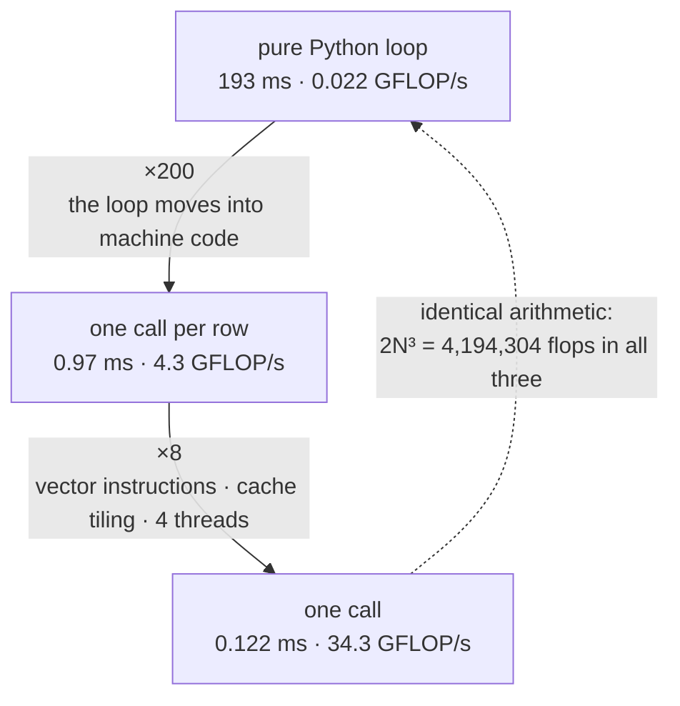

# 3.2 — 🔍 Three loops, then one call: what the library is actually buying you

## One-line answer

Your hand-written triple loop and `A @ B` compute the same matrix — measured here to within
1.776 × 10⁻¹⁴ — and the library's version is **1579 times faster** on this laptop, which is the
difference between an idea you own and a tool you can afford to use.

---

## The story

The first few times you cook rice, you stand over the pot.

You measure the water, you watch it come to the boil, you lift the lid, you taste a grain. Once, you
burn the bottom. Once, it comes out wet and sticky. By the end of that week you have eaten a lot of
mediocre rice, and you have learned exactly what "too much water" looks like at minute four, and what
the smell is a minute before it catches.

Then you buy a rice cooker. One button, perfect rice every time, while you do something else.

You could have bought the cooker at the start. Plenty of people do, and their rice is fine. What you
have that they do not is this: when a batch does come out wrong — a new bag of rice, a different
stove, a lid that no longer seals — you can look at it and say **which** thing went wrong, because you
have personally made every mistake the machine now prevents, and you can name each one.

That is the whole argument for Principle 3, and this document is where it gets paid.
---

## The idea in plain language

Part [3.1](3.1-matmul-is-the-primitive.md) gave the definition and you wrote it as three nested loops.
This part runs it, times it against the library, and asks precisely what the difference consists of.

The answer has four ingredients, and none of them is "the library uses a cleverer algorithm". For the
sizes here, `A @ B` does exactly the same `2N³` arithmetic operations your loop does. What it does
differently:

1. **The loop is in machine code, not in Python.** Every iteration of a Python loop does work that has
   nothing to do with your arithmetic: looking up names, checking types, allocating a float object for
   the intermediate. At `N = 128` that is 2,097,152 multiply-adds, each carrying that overhead.
2. **It uses vector instructions.** The processor can multiply several pairs of numbers in one
   instruction. A Python loop cannot express that; a compiled kernel is written to.
3. **It blocks for cache.** Rather than walking whole rows and columns, an optimised kernel works on
   small tiles that fit in fast memory and reuses each loaded value many times — the reuse that part
   [3.4](3.4-why-hardware-loves-matmul.md) quantifies.
4. **It uses more than one core.** This machine has 2 cores and 4 threads, measured 2026-08-26.

The point of writing the loop first is not that the loop is useful. It is that after writing it, none
of those four ingredients is magic — each one is a specific thing you can name, and when a matmul is
unexpectedly slow later you will look for the specific one that is missing.

The word for what you are doing when you compare: this part is marked 🔍 in the plan, meaning
*build first, compare after*. The rule for a 🔍 part is that it must name **at least one thing the
library does that yours does not, and why** — and this one names four, plus a fifth in *When it
breaks* that is about correctness rather than speed.

---

## Why Akshara needs it

- **Day 30** hand-writes attention and then compares against a reference. That comparison uses the
  same tolerance argument as this part — `allclose`, not `==` — and the phase gate for Phase 5 is
  literally "matches a reference within tolerance". Today is where "within tolerance" stops being a
  hedge and becomes a number.
- **Day 39** runs Akshara v0's forward pass. Its speed is the sum of its matmuls, and the reason it is
  usable on a laptop at all is that every one of them is a library call.
- **Day 28** measures why recurrence lost to attention, and the measurement is exactly this shape: a
  sequential loop against a batched matmul, timed.
- **Day 78–85** is the efficiency phase, where the question is always "what is this kernel doing that
  the naive version is not". Having written the naive version once makes that a concrete question.

---

## The mechanism

Three implementations of the same function, timed side by side. `N = 128`, `float64`, seed 1337:

```python
import time

import numpy as np

rng = np.random.default_rng(1337)
N = 128
A = rng.standard_normal((N, N))     # (N, N)
B = rng.standard_normal((N, N))     # (N, N)
Al, Bl = A.tolist(), B.tolist()     # plain nested lists, for the pure-Python versions


def naive_ijk(Al, Bl, n):
    """The definition, exactly as written in part 3.1."""
    C = [[0.0] * n for _ in range(n)]
    for i in range(n):
        for j in range(n):
            total = 0.0
            for k in range(n):
                total += Al[i][k] * Bl[k][j]
            C[i][j] = total
    return C


def naive_ikj(Al, Bl, n):
    """The same arithmetic, with the two inner loops swapped."""
    C = [[0.0] * n for _ in range(n)]
    for i in range(n):
        Ai, Ci = Al[i], C[i]
        for k in range(n):
            a, Bk = Ai[k], Bl[k]
            for j in range(n):
                Ci[j] += a * Bk[j]
    return C


def rowwise(A, B, n):
    """One library call per output row — a halfway house."""
    C = np.empty((n, n))            # (N, N)
    for i in range(n):
        C[i] = A[i] @ B             # (N,) @ (N, N) -> (N,)
    return C
```

**Line by line:**
- `naive_ijk` is part 3.1's definition unchanged. `total` accumulates the dot product for one output
  element, and the element is written once at the end.
- `naive_ikj` swaps the `j` and `k` loops. It is **not** a different algorithm — the same products are
  formed and the same sums result — but now the innermost loop walks `Ci` and `Bk` **along rows**,
  which are contiguous in a Python list of lists, instead of walking `Bl[k][j]` down a column. This is
  part [1.3](../01-what-a-tensor-is/1.3-strides-and-the-free-transpose.md)'s locality argument applied
  by hand.
- `Ai, Ci = Al[i], C[i]` hoists two list lookups out of the inner loops. In Python every `Al[i][k]` is
  two indexing operations; doing one of them once per row instead of once per element is the cheapest
  available saving.
- `Ci[j] += a * Bk[j]` accumulates **into the output row** rather than into a scalar. That is the
  structural consequence of the loop swap: with `k` outside `j`, no single output element is finished
  until the `k` loop ends.
- `rowwise` calls the library once per row: a `(N,)` against a `(N, N)`, which by part 3.1's rank-1
  rule gives `(N,)`. It is included because it isolates *loop overhead* from *kernel quality* — the
  arithmetic is now in compiled code, but there are still 128 Python-level calls.
- `np.empty` rather than `np.zeros`: every element is written before it is read, so zeroing first is
  pure waste. `np.empty` returns uninitialised memory, which is a bug if you forget to fill it — a
  deliberate trade, and the kind of thing to do only where the fill is one line away and visible.

Timed on Intel Core i3-1115G4 (2 cores / 4 threads), 11.7 GB RAM, Windows 11, CPython 3.12.10,
numpy 2.5.2, seed 1337, 2026-08-26. `2N³ = 4,194,304` flops in every row:

```text
pure python i-j-k           221.165 ms    0.0190 GFLOP/s   max|err| 1.776e-14
pure python i-k-j           193.345 ms    0.0217 GFLOP/s   max|err| 1.776e-14
numpy, row at a time          0.971 ms    4.3195 GFLOP/s   max|err| 4.974e-14
numpy, one call               0.122 ms   34.2588 GFLOP/s   max|err| 0.000e+00

speedup one-call vs pure-python-ijk : 1806x
speedup one-call vs pure-python-ikj : 1579x
speedup i-k-j vs i-j-k              : 1.14x
```

Four readings, and each one answers a different question:

**The loop-order swap bought 1.14×, not 10×.** In a compiled language, that swap is one of the largest
single wins available for a naive matmul. In Python it barely moves, because the interpreter's
per-operation overhead dwarfs the memory-access difference — the thing being optimised is not the
thing that is slow. This is a genuinely useful negative result and it is exactly why the plan measures
rather than asserts: a rule that is true in C is not automatically true one layer up.

**Going from Python loops to one call per row bought about 200×.** That is ingredient 1 — the loop
moving into machine code — nearly on its own.

**Going from one call per row to one call total bought a further 8×.** That is ingredients 2, 3 and 4:
vectorisation, cache blocking and threads, none of which a 128-row Python loop lets the library reach
for.

**And the whole distance is 1579×.** Not 15×. This is the number that makes the difference between an
idea and a tool.

Where the time goes, as a picture:



---

## Shapes

| Tensor | Symbolic shape | Concrete here | What each axis means |
| --- | --- | --- | --- |
| `A` | `(N, N)` | `(128, 128)` | rows · shared axis, `float64` |
| `B` | `(N, N)` | `(128, 128)` | shared axis · columns |
| `A @ B` | `(N, N)` | `(128, 128)` | rows · columns |
| `Al`, `Bl` | list of lists | `128 × 128` | the same numbers as Python objects, no strides |
| `A[i]` | `(N,)` | `(128,)` | one row — rank 1, so `A[i] @ B` gives `(128,)` |
| `C` in `rowwise` | `(N, N)` | `(128, 128)` | filled one row at a time |

Work: `2N³` = 4,194,304 flops. Bytes touched: `3N² × 8` = 393,216. Both figures are used in
[3.4](3.4-why-hardware-loves-matmul.md).

---

## When it breaks

The loud one is part [3.1](3.1-matmul-is-the-primitive.md)'s shape error, and it is not what this
document is about. What breaks *here* is the comparison itself.

**The silent one, and it is the fifth thing the library does differently.** Look again at the error
column:

```text
pure python i-j-k     max|err| 1.776e-14
pure python i-k-j     max|err| 1.776e-14
numpy, row at a time  max|err| 4.974e-14
numpy, one call       max|err| 0.000e+00
```

Every implementation computes the same matrix and **not one of them agrees exactly** with any other
except the one being used as the reference. Checked directly on this machine, 2026-08-26:

```console
>>> np.allclose(np.array(C_ikj), A @ B)
True
>>> np.array_equal(np.array(C_ikj), A @ B)
False
```

`allclose` says yes, `array_equal` says no. Nothing is wrong with any of the four implementations.
Floating-point addition is **not associative** — `(a + b) + c` and `a + (b + c)` can differ in the last
bits — and the four versions add the same `K` products in different orders because they tile, thread
and vectorise differently. Day 7 (MATH-13, MATH-14) is where this becomes the day's whole subject.

Two consequences, and both matter more than they look:

- **Never compare tensors with `==` or `array_equal`.** Use `np.allclose` or
  `np.testing.assert_allclose`, and state the tolerance. A test that demands bit equality between two
  correct implementations is a test that fails for a reason that is not a bug — and a flaky test in
  this repository is indistinguishable from Silent Failure #4 and must be fixed rather than re-run.
- **A "reproducible" run is reproducible on the same hardware and library build, not universally.**
  Change the thread count and the reduction order changes with it. This is why `docs/RUNS.md` has a
  `Hardware` column (Day 1,
  [3.2](../../../day-001-bootstrap-and-map/parts/03-the-ledgers/3.2-runs-md-turns-anecdote-into-result.md))
  and why "same seed, different machine, different number" is expected rather than alarming.

The check that makes this concrete, and it is the one to write in every comparison test from here to
Day 161:

```python
np.testing.assert_allclose(mine, reference, rtol=1e-10, atol=1e-12)
```

**Line by line:**
- `assert_allclose` rather than `assert np.allclose(...)`: on failure it prints the mismatch count, the
  maximum absolute difference and the maximum relative difference. The bare `assert` prints nothing,
  and the whole value of the test is in what it says when it fails.
- `rtol` is the **relative** tolerance and does the real work — it scales with the magnitude of the
  values, which is what floating-point error does too.
- `atol` is the **absolute** floor, and it exists for entries near zero, where a relative tolerance is
  meaningless. Omitting it makes the test fail on any output element that happens to land near zero.
- These particular values suit `float64`. In `float32` the usable tolerances are roughly a million
  times looser, because `eps` is — part
  [1.2](../01-what-a-tensor-is/1.2-dtype-the-width-of-a-number.md) measured `1.19e-07` against
  `2.22e-16`. Copying a `float64` tolerance onto a `float32` comparison is a test that fails for no
  reason; copying it the other way is a test that passes for no reason.

---

## In production

**What a research engineer writes instead of the teaching version.** They write `A @ B` — and they can
tell you which of the four ingredients is missing when it is slow. The diagnostic sequence is
recognisable: is the operation actually reaching the optimised kernel (or has a dtype promotion, a
non-contiguous input or an unusual shape pushed it onto a fallback path)? Is it thread-bound? Is the
shape so thin that the matmul is memory-bound rather than compute-bound
([3.4](3.4-why-hardware-loves-matmul.md))? None of those questions is available to someone for whom
`@` is a black box.

**What degrades at scale.** The pure-Python version does not merely get slower; it becomes impossible.
At `N = 128` it takes 193 ms. The cost is `2N³`, so at `N = 4096` — a modest transformer width — it is
32,768 times more work, which on the measured rate of 0.0217 GFLOP/s is over an hour and a half for
**one** matmul, of which a forward pass has dozens per layer. The library version at 34.3 GFLOP/s
would do the same work in about four seconds. The gap is not a tuning difference; it is the difference
between a field that exists and one that does not.

**The failure that only shows with real data.** A matmul that silently leaves the optimised path. The
most common causes are an unexpected dtype (part
[1.2](../01-what-a-tensor-is/1.2-dtype-the-width-of-a-number.md) measured `int32 + float32` promoting
all the way to `float64`), a non-contiguous operand, or an object-dtype array created by accident from
ragged input. Throughput drops by an order of magnitude, nothing raises, and the profiler points at a
line that looks like every other matmul in the file. The check is to assert the dtype and the
contiguity flags at the boundary — the same one-line habits from parts 1.2 and 1.3.

**The review comment.** *"This comparison uses `==` on floats. Use `assert_allclose` with an explicit
tolerance, and say in the message what tolerance you expect and why."* A test that cannot say why its
tolerance is what it is has not been thought about.

**The interview question.** *"You wrote a matmul in Python and it's a thousand times slower than
numpy's. Where does that factor come from?"* The weak answer says "numpy is written in C". The strong
answer breaks the factor apart the way the measurements above do — the interpreter loop, then
vectorisation, cache blocking and threads — and, if it is very strong, notes that the *algorithm* is
the same, so this is entirely an implementation gap and not an asymptotic one.

**Compute tier: T0.** Every number here is this laptop's. The **ratios** are the finding and even they
are machine-specific: a machine with more cores would show a larger gap between rowwise and one-call,
and a machine with a different Python build would shift the 1.14×. What transfers is the *method* —
write the naive version, time both, compare with `allclose` and report the spread — and it is the
method Day 30 uses to validate hand-written attention.

---

## Check yourself

Run this. It prints **one ratio, one difference and two booleans**, and the two booleans must disagree:

```python
import time

import numpy as np

rng = np.random.default_rng(1337)
N = 128
A = rng.standard_normal((N, N))
B = rng.standard_normal((N, N))
Al, Bl = A.tolist(), B.tolist()

t0 = time.perf_counter()
C = [[sum(Al[i][k] * Bl[k][j] for k in range(N)) for j in range(N)] for i in range(N)]
t_naive = time.perf_counter() - t0

A @ B
t0 = time.perf_counter()
for _ in range(50):
    A @ B
t_np = (time.perf_counter() - t0) / 50

print("speedup        :", round(t_naive / t_np))
print("max abs diff   :", float(np.abs(np.array(C) - (A @ B)).max()))
print("allclose       :", np.allclose(np.array(C), A @ B))
print("exactly equal  :", np.array_equal(np.array(C), A @ B))
```

**Line by line:**
- The speedup measured `1788` on this machine, 2026-08-26. Write yours down — it is the number you
  quote when someone asks why you use a library, and it is *yours*, not a recalled figure.
- The maximum difference measured `4.263256414560601e-14` here. Note that this is a **different**
  value from the `1.776e-14` in the table above, from the same seed and the same machine: `sum()` over
  a generator adds the `K` products in yet another order again. That is the point of the section above
  restated as a surprise — the size of the disagreement is around `eps` for `float64` times the
  magnitude of the sums, and its exact value is a property of the summation order, not of
  correctness.
- `allclose` prints `True` and `array_equal` prints `False`. **If they agreed, the second one would be
  luck.** Say why before you run it.

**Say this out loud, without scrolling up:** name the four things the library's matmul does that your
loop does not — and say why two correct implementations of the same matmul do not produce identical
bits.
