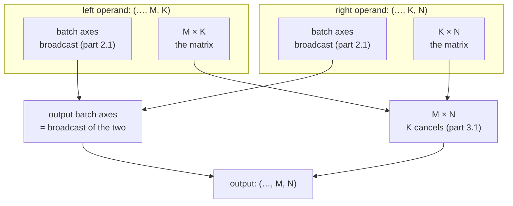

# 3.3 — Batched matmul: the last two axes are the matrix, the rest is bookkeeping

## One-line answer

For tensors of rank 3 or more, `@` treats the **last two axes** as the matrix and **broadcasts every
axis in front of them** — so one call does a whole batch of independent matrix multiplies, and the
leading axes follow part 2.1's rules exactly.

---

## The story

A school canteen collects lunch slips.

Each slip is a small grid: what one student wants, crossed against portion sizes. Behind the counter
hangs a price chart: portion sizes crossed against the day of the week. For any one slip, the person
at the till lays the slip beside the chart and works out the totals. That is one grid multiplied by
another, done by hand.

Then two hundred students hand in their slips.

Nobody invents a new method. The same pairing happens two hundred times, and the only thing that has
to be kept straight is **which slip goes with which chart**. Two arrangements come up in real life:

- Every class has negotiated **its own** chart. Two hundred slips, two hundred charts, paired one to
  one.
- Everybody shares **one** chart, the canteen's standard list. Two hundred slips, one chart, used two
  hundred times.

The arithmetic inside is identical either way. What changes is how much paper is on the counter — and
the second arrangement is not a special case that needs its own method. It is the first arrangement
with the single chart stretched to cover everybody, which is exactly the stretching that
[2.1](../02-broadcasting-and-indexing/2.1-broadcasting-the-rule.md) described.
---

## The idea in plain language

Part [3.1](3.1-matmul-is-the-primitive.md) defined `@` for two matrices. For higher-rank tensors the
rule is stated in two clauses, and they are applied in this order:

1. **The last two axes are the matrix.** They must satisfy the inner-dimension rule: `(…, M, K)` with
   `(…, K, N)` gives `(…, M, N)`.
2. **Everything in front is a batch axis, and batch axes broadcast.** They are matched by the
   right-alignment rule from part 2.1 — equal sizes are fine, a size of 1 stretches, anything else
   fails.

So `(8, 4, 5) @ (8, 5, 3)` gives `(8, 4, 3)`: eight independent `(4, 5) @ (5, 3)` multiplies, one per
batch item. And `(4, 5) @ (8, 5, 3)` *also* gives `(8, 4, 3)`: the left operand has no batch axis at
all, so it is padded to `(1, 4, 5)` and stretched — the shop's standard price list, used eight times,
stored once.

Why this is a rule worth its own document rather than a footnote:

- **It is how every transformer is written.** Nothing in a real model is a bare 2-D matmul. Activations
  carry a batch axis `B`, attention carries a head axis `H`, and the matmuls that matter are rank 3 or
  rank 4 throughout.
- **The broadcasting half is where weights live.** A weight matrix genuinely has no batch axis — one
  set of weights serves every item in the batch — so every layer in the model is the "stretched"
  case. Understanding that is understanding why a model's parameter count does not grow with batch
  size.
- **It is the source of a specific, common confusion:** `@` broadcasts its *batch* axes but is
  emphatically **not** elementwise on the last two. Mixing that up with `*` produces something legal
  and wrong, which is the failure in section 4.

---

## Why Akshara needs it

- **Day 30** computes attention scores as `Q @ K.transpose(-2, -1)` on tensors of shape
  `(B, H, T, hs)`. That is a rank-4 batched matmul with two leading axes, and the `-2, -1` is there
  precisely because clause 1 says the matrix is the last two axes.
- **Day 32** is multi-head attention, whose reshape-and-transpose exists solely to put `H` in front of
  the matrix axes so that this rule does the per-head work with no loop.
- **Day 26 onward**, every linear layer applies a `(C, C_out)` weight to a `(B, T, C)` activation.
  The weight has no batch axes; it is broadcast across `B` and `T`. That single line is why a model
  with 12 million parameters can process a batch of any size without changing.
- **Day 34** counts attention's memory, and the `(B, H, T, T)` score tensor is the direct product of
  this rule: two batch axes and a `(T, T)` matrix.

---

## The mechanism

The three cases, printed:

```python
import numpy as np

rng = np.random.default_rng(1337)

Ab = rng.standard_normal((8, 4, 5))        # (Bt, M, K) — one matrix per batch item
Bb = rng.standard_normal((8, 5, 3))        # (Bt, K, N)
print("(8, 4, 5) @ (8, 5, 3)   ->", (Ab @ Bb).shape)

D = rng.standard_normal((4, 5))            # (M, K) — no batch axis at all
print("(4, 5)    @ (8, 5, 3)   ->", (D @ Bb).shape)

Db = rng.standard_normal((7, 4, 5))        # (7, M, K)
Cb = rng.standard_normal((2, 1, 5, 3))     # (2, 1, K, N)
print("(7, 4, 5) @ (2, 1, 5, 3)->", (Db @ Cb).shape)
```

**Line by line:**
- The first prints `(8, 4, 3)`. Clause 1 pairs `5` with `5` and they vanish; `4` and `3` survive.
  Clause 2 matches `8` against `8`. Eight separate matrix multiplies, one call.
- The second prints `(8, 4, 3)` as well. `D` has rank 2, so it has **no** batch axis; right-alignment
  pads it to `(1, 4, 5)` and the `1` stretches to 8. Measured on this machine, 2026-08-26. **This is
  the shape of every linear layer in every model you will build.**
- The third prints `(2, 7, 4, 3)`. The matrix axes give `(4, 3)`. The batch axes are `(7,)` against
  `(2, 1)`: right-aligned, `7` against `1` gives 7, and `2` against nothing (padded to 1) gives 2. The
  leading axes are the ordinary broadcasting rule with no exceptions.
- Verified against `numpy` 2.5.2, `numpy.matmul` (doc page `reference/generated/numpy.matmul.html`,
  the *Notes* section on stacks of matrices), read 2026-08-26.

The rule as a picture:



**The linear layer, three days early**, because it is the shape you will type more than any other:

```python
B, T, C, C_out = 2, 6, 8, 16
x = rng.standard_normal((B, T, C))         # (B, T, C)     activations
W = rng.standard_normal((C, C_out))        # (C, C_out)    weights — no batch axes
b = rng.standard_normal(C_out)             # (C_out,)      bias

y = x @ W + b                              # (B, T, C_out)
print("x", x.shape, "@ W", W.shape, "+ b", b.shape, "->", y.shape)
```

**Line by line:**
- `x @ W` pairs `C` with `C` and they vanish; `C_out` survives. `W` has rank 2, so it is padded to
  `(1, C, C_out)` and stretched across **both** `B` and `T` — one weight matrix, `B × T` uses.
- The output is `(B, T, C_out)` = `(2, 6, 16)`, measured here 2026-08-26. The token axis `T` came
  along untouched: every token position is transformed independently and identically, which is exactly
  what a linear layer means in a transformer.
- `+ b` is a broadcast, not a matmul: `(B, T, C_out)` against `(C_out,)`, right-aligned, padded to
  `(1, 1, C_out)` and stretched twice. So this one line uses **both** rules from today —  the matmul
  rule for `@` and part 2.1's rule for `+` — and that combination is where section 4's failure lives.
- The parameter count is `C × C_out + C_out` and does **not** contain `B` or `T`. That is the
  observation Day 39 turns into a full model's parameter count by hand.

**The transposed form, which is what attention actually writes:**

```python
Bt, H, T, hs = 2, 4, 6, 8
Q = rng.standard_normal((Bt, H, T, hs))    # (B, H, T, hs)
K = rng.standard_normal((Bt, H, T, hs))    # (B, H, T, hs)

scores = Q @ K.transpose(0, 1, 3, 2)       # (B, H, T, T)
print("Q", Q.shape, "@ K^T", K.transpose(0, 1, 3, 2).shape, "->", scores.shape)
```

**Line by line:**
- `K.transpose(0, 1, 3, 2)` swaps only the **last two** axes, leaving the two batch axes where they
  are, and gives `(B, H, hs, T)`. From part
  [1.3](../01-what-a-tensor-is/1.3-strides-and-the-free-transpose.md) this is a strides edit and costs
  nothing.
- `(B, H, T, hs) @ (B, H, hs, T)`: clause 1 pairs `hs` with `hs`, giving `(T, T)`; clause 2 matches
  `B` with `B` and `H` with `H`. Output `(B, H, T, T)` = `(2, 4, 6, 6)`.
- **That `(T, T)` is attention's whole cost story.** It is quadratic in sequence length, it exists once
  per head per batch item, and Day 34 measures what it does at realistic `T`. You are looking at the
  O(n²) wall three weeks before you meet it, and it is a direct consequence of clause 1.

---

## Shapes

| Tensor | Symbolic shape | Concrete here | What each axis means |
| --- | --- | --- | --- |
| `Ab` | `(Bt, M, K)` | `(8, 4, 5)` | batch item · matrix rows · shared axis |
| `Bb` | `(Bt, K, N)` | `(8, 5, 3)` | batch item · shared axis · matrix columns |
| `Ab @ Bb` | `(Bt, M, N)` | `(8, 4, 3)` | eight independent matrix multiplies |
| `D` | `(M, K)` | `(4, 5)` | **no** batch axis — padded to `(1, 4, 5)` and stretched |
| `D @ Bb` | `(Bt, M, N)` | `(8, 4, 3)` | the same output shape from one shared matrix |
| `x` | `(B, T, C)` | `(2, 6, 8)` | batch · token position · channel |
| `W` | `(C, C_out)` | `(8, 16)` | input channel · output channel |
| `x @ W` | `(B, T, C_out)` | `(2, 6, 16)` | `C` cancels; `B` and `T` carried through |
| `b` | `(C_out,)` | `(16,)` | one bias per output channel; broadcast over `B` and `T` |
| `Q`, `K` | `(B, H, T, hs)` | `(2, 4, 6, 8)` | batch · head · token · head-size |
| `K.transpose(0,1,3,2)` | `(B, H, hs, T)` | `(2, 4, 8, 6)` | last two axes swapped; a view, no copy |
| `Q @ Kᵀ` | `(B, H, T, T)` | `(2, 4, 6, 6)` | **the score matrix** — quadratic in `T` |

The last row is the one to carry forward. Everything Day 34 says about long contexts is contained in
the fact that this shape has `T` twice.

---

## When it breaks

The loud one is the same message as part 3.1's, and the useful thing is *which* axes it names:

```console
>>> import numpy as np
>>> A = np.ones((8, 4, 5))
>>> B = np.ones((8, 6, 3))
>>> A @ B
Traceback (most recent call last):
  File "<stdin>", line 1, in <module>
ValueError: matmul: Input operand 1 has a mismatch in its core dimension 0, with gufunc signature (n?,k),(k,m?)->(n?,m?) (size 6 is different from 5)
```

"Core dimension" means one of the **last two** axes — the matrix — as opposed to a batch axis. So this
message tells you the failure is in clause 1 and not clause 2, which halves the search: your matrix
dimensions disagree, and the batch axes are fine.

A clause-2 failure reads completely differently, and recognising the difference on sight is worth more
than either message alone:

```console
>>> A = np.ones((8, 4, 5))
>>> B = np.ones((3, 5, 3))
>>> A @ B
Traceback (most recent call last):
  File "<stdin>", line 1, in <module>
ValueError: operands could not be broadcast together with remapped shapes [original->remapped]: (8,4,5)->(8,newaxis,newaxis) (3,5,3)->(3,newaxis,newaxis)  and requested shape (4,3)
```

That is part 2.1's broadcasting failure, dressed for matmul: `8` against `3` in the batch axis, neither
of them 1. The matrix axes were fine. The `newaxis` markers are numpy showing you which axes it treated
as the matrix and therefore removed from the broadcast.

**The silent version, and it is why this part exists separately from 3.1.** Batch axes broadcast — so
a batch axis that is accidentally `1` stretches instead of failing:

```console
>>> A = np.ones((1, 4, 5))     # meant to be (8, 4, 5)
>>> B = np.ones((8, 5, 3))
>>> (A @ B).shape
(8, 4, 3)
```

The output has the right shape and the right rank. Every one of the eight results was computed from
**the same** left matrix, because the batch axis of size 1 was stretched rather than rejected. In a
training loop this is the bug where every item in the batch is processed against the first item's
data, the loss is finite and decreasing, and the model learns something — just not the thing you
specified.

The check is a shape assertion, and it has to name the batch axis explicitly:

```python
assert q.shape[:-2] == k.shape[:-2], f"batch axes disagree: {q.shape[:-2]} vs {k.shape[:-2]}"
```

**Line by line:**
- `shape[:-2]` is exactly "everything except the matrix", which is the set of axes clause 2 governs.
- Demanding **equality** rather than compatibility is the point. Broadcasting is the right behaviour
  for a weight matrix and the wrong behaviour for two activation tensors that should be aligned
  item-for-item, and only you know which case you are in — so the assertion is where you write it
  down.
- Where to put it: in the attention function, and in any function taking two batched activations.
  Never on a weight, because a weight is *supposed* to broadcast.

**Which silent failure this touches.** The batch-axis-of-1 case is a route into **#4 — noise mistaken
for improvement** (plan §6). A model trained this way still improves, so its loss curve is not
obviously broken; what is broken is that the effective batch size is 1, which changes the gradient
noise and therefore every comparison against a correctly-batched run. Detect it the way this section
says: assert the batch axes, and print the shapes of the tensors entering the loss once at step 0.

---

## In production

**What a research engineer writes instead of the teaching version.** They annotate the batch axes in
the shape comment on every line — `# (B, H, T, hs)` — rather than only the matrix ones, and they use
named-axis helpers or `einsum` when the axis bookkeeping gets deep. `einsum` spells the contraction
out (`"bhqd,bhkd->bhqk"` says exactly which axes are batch, which are contracted and which survive),
which trades a little speed on some paths for a line that cannot be misread. Where the shape is
subtle, they choose the readable form; where it is hot, they choose `@` and put the explanation in a
comment.

**What degrades at scale.** The batch axes multiply the cost linearly and the matrix axes multiply it
cubically ([3.1](3.1-matmul-is-the-primitive.md)). A `(B, H, T, hs) @ (B, H, hs, T)` costs
`2 · B · H · T² · hs` flops and produces `B · H · T²` numbers. Both terms have `T²` in them, which is
the entire reason context length is expensive and why Days 34 and 78–85 exist. Write that expression
down now; you will re-derive it several times before Day 85 and it never changes.

**The failure that only shows with real data.** A ragged final batch. Almost all training runs end each
epoch with a batch smaller than the rest, and if that leftover has size 1 the batch axis becomes a
singleton — turning any latent broadcast bug from an error into a silent stretch on exactly one step
per epoch. It produces a small, periodic anomaly in the loss that is easy to attribute to data and
hard to attribute to shapes. The standard defences are to drop the last partial batch during training
or to assert the batch axis every step; both are one line, and choosing deliberately is the
professional part.

**The review comment.** *"These two tensors both have batch axes and you're relying on them
broadcasting. If they're supposed to be aligned, assert equality — a batch axis of 1 will silently
stretch."*

**The interview question.** *"You have `Q` of shape `(B, H, T, d)` and `K` of the same shape. Write the
score matrix and give its shape and flop count."* The strong answer produces
`Q @ K.transpose(-2, -1)`, `(B, H, T, T)`, and `2·B·H·T²·d` without hesitating, then adds the thing
that shows use: that the `(T, T)` output is often larger than the inputs and is what actually limits
context length, not the parameter count.

**Compute tier: T0.** Every shape here was measured on a laptop CPU at toy sizes — `T = 6`, `H = 4`. The
T0 version proves the **shape rules exactly**, and shape rules do not vary by hardware, so this
transfers completely. What it cannot show is the cost: at `T = 6` the `(T, T)` score matrix is 36
numbers and looks harmless, and the whole point of Day 34 is what the same expression does at `T` in
the thousands.

---

## Check yourself

Run this. It prints **four shapes**, and you should predict all four before running:

```python
import numpy as np

rng = np.random.default_rng(1337)
print("(8,4,5) @ (8,5,3)  ->", (rng.standard_normal((8, 4, 5)) @ rng.standard_normal((8, 5, 3))).shape)
print("(4,5)   @ (8,5,3)  ->", (rng.standard_normal((4, 5)) @ rng.standard_normal((8, 5, 3))).shape)
print("(1,4,5) @ (8,5,3)  ->", (rng.standard_normal((1, 4, 5)) @ rng.standard_normal((8, 5, 3))).shape)

Q = rng.standard_normal((2, 4, 6, 8))
print("Q @ Q^T on last two->", (Q @ Q.transpose(0, 1, 3, 2)).shape)
```

**Line by line:**
- The first three all print `(8, 4, 3)`. **That is the finding**: three genuinely different inputs, one
  output shape, and only one of the three is what you would want in an attention function.
- The third is the silent bug. Nothing distinguishes its output from the first one's.
- The fourth prints `(2, 4, 6, 6)`. Say out loud which axis became the last `6` and which became the
  second-to-last, and why they are not the same axis of `Q`.

**Say this out loud, without scrolling up:** state the two clauses of the batched matmul rule — and say
why a `(1, 4, 5) @ (8, 5, 3)` producing `(8, 4, 3)` is dangerous rather than convenient.
