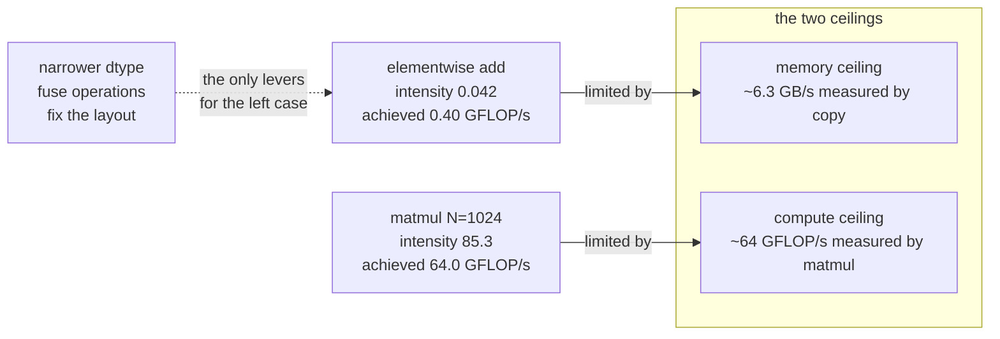

# 3.4 — Why hardware loves matmul: arithmetic intensity, measured

## One-line answer

A matmul does `2N³` arithmetic on `3N²` numbers, so the work grows faster than the traffic — measured
here at **85.3 flops per byte** against **0.042** for an elementwise add — and that single ratio is why
the same machine achieves 64 GFLOP/s on one and 0.4 GFLOP/s on the other.

---

## The story

You are making thirty chapatis.

In the first kitchen, the flour, the water and the rolling board live in a cupboard in the next room.
So you walk to the next room, bring back enough flour for one chapati, roll it, cook it, and walk back
for the next one. Thirty chapatis, thirty trips. By the end you are worn out, dinner is late, and the
pan spent most of the evening sitting empty and hot.

In the second kitchen, you carry the flour bowl, the water and the board to the table **once**. Then
you stay at the table and work: roll, cook, roll, cook, without standing up. The pan is never empty.
Same hands, same rolling speed, four times the chapatis.

Nothing about your skill changed. What changed is how many times the flour had to cross the room
before it was finally used up.

A processor is you at that table, and fetching from memory is the walk to the next room. "How much
work do I get out of each thing I fetched" is a number you can work out for any piece of code, before
you ever run it.
---

## The idea in plain language

Every operation a processor performs has two costs that are paid from two different budgets:

- **Compute**: how many arithmetic operations it does, measured in flops (floating-point operations).
- **Traffic**: how many bytes it has to move between memory and the processor.

The two budgets are independent, and a piece of code is limited by whichever it exhausts first. The
ratio between them has a name:

> **Arithmetic intensity = flops performed ÷ bytes moved.**

Code with **low** intensity is *memory-bound*: it finishes its arithmetic and then waits for the next
bytes. Making the arithmetic faster does nothing; the only lever is moving fewer bytes — a narrower
dtype (part [1.2](../01-what-a-tensor-is/1.2-dtype-the-width-of-a-number.md)), a better layout (part
[1.3](../01-what-a-tensor-is/1.3-strides-and-the-free-transpose.md)), or fusing several operations so
an intermediate never reaches memory.

Code with **high** intensity is *compute-bound*: the bytes arrive faster than the processor can use
them, and the arithmetic units are the constraint. That is the good case, because arithmetic units are
the thing hardware designers can multiply.

Now compute the ratio for the two operations from today:

**Elementwise add**, `(N, N) + (N, N)`. It reads two arrays and writes one: `3N²` numbers. It performs
`N²` additions. Intensity = `N² / (3N² × 8)` = **1/24 ≈ 0.042** flops per byte, in `float64`. And
crucially, it **does not depend on N**: making the arrays bigger does not improve the ratio at all.

**Matmul**, `(N, N) @ (N, N)`. It reads two arrays and writes one: the same `3N²` numbers. It performs
`2N³` operations. Intensity = `2N³ / (3N² × 8)` = `N/12` flops per byte — **and it grows linearly with
N**. Every element that is fetched gets used `N` times, because row *i* of `A` participates in every
one of the `N` outputs in row *i*.

That is the whole answer to "why does everything in deep learning end up as a matmul". It is the one
common operation whose reuse grows with its size, so it is the one operation that stays on the good
side of the memory wall as models get bigger.

---

## Why Akshara needs it

- **Day 28** asks why recurrence lost to attention. The answer is not accuracy — it is that a
  recurrent step is a sequence of small, low-intensity operations that cannot be batched across time,
  while attention is a large, high-intensity matmul. That day measures it; this part is the vocabulary.
- **Day 78–85** is the efficiency phase, and every technique in it is a move on one of the two budgets:
  quantization (fewer bytes), kernel fusion (fewer round trips), KV caching (less recomputation).
  Knowing which budget a technique targets is how you predict whether it will help *your* bottleneck.
- **Day 69–77** builds the decode loop, which is the sharpest example in the whole curriculum:
  generating one token at a time turns the model's big matmuls into skinny matrix-vector products,
  whose intensity is low — so single-token decoding is memory-bound even on hardware that is
  spectacularly compute-rich. That is why batching requests matters so much on Day 154.
- **Day 66** sizes Akshara. A size that fits in memory but runs at 3% of the machine's arithmetic
  capability is a bad size, and this ratio is how you see that before you run it.

---

## The mechanism

The arithmetic first — no library needed, because these are counts:

```python
def intensity(flops: int, bytes_moved: int) -> float:
    """Arithmetic intensity in flops per byte."""
    return flops / bytes_moved


N, width = 1024, 8                       # float64
traffic = 3 * N * N * width              # read A, read B, write C

print("elementwise add:", intensity(N * N, traffic), "flop/byte")
print("matmul         :", intensity(2 * N ** 3, traffic), "flop/byte")
```

**Line by line:**
- `traffic = 3 * N * N * width` counts each array **once**. That is the optimistic assumption — it
  says every byte is fetched exactly once and never re-fetched — and it is close to true for the
  elementwise case and only achievable for matmul because of cache blocking. Being explicit that this
  is a lower bound on traffic matters: an implementation that re-reads `B` for every row of `A` moves
  `N` times more.
- `width` is the dtype's `itemsize` from part
  [1.2](../01-what-a-tensor-is/1.2-dtype-the-width-of-a-number.md). Halving it **doubles** the
  intensity of both operations, which is one of the two reasons narrow dtypes are fast — the other is
  simply that the bytes arrive sooner.
- The add performs `N²` flops; the matmul performs `2N³`. Everything follows from that exponent.
- On this machine, 2026-08-26, it prints `0.041666…` and `85.333…`.

How the matmul's intensity grows and the add's does not:

```text
  N=   64  flops=       524,288  bytes=      98,304  intensity=     5.3 flop/byte
  N=  128  flops=     4,194,304  bytes=     393,216  intensity=    10.7 flop/byte
  N=  256  flops=    33,554,432  bytes=   1,572,864  intensity=    21.3 flop/byte
  N=  512  flops=   268,435,456  bytes=   6,291,456  intensity=    42.7 flop/byte
  N= 1024  flops= 2,147,483,648  bytes=  25,165,824  intensity=    85.3 flop/byte
  N= 2048  flops=17,179,869,184  bytes= 100,663,296  intensity=   170.7 flop/byte
```

The intensity doubles every time `N` doubles. The elementwise add's stays at 0.0417 for every row of
that table. **A bigger matmul is a better matmul; a bigger add is just a longer add.**

Now measure whether the prediction holds. Same machine — Intel Core i3-1115G4 (2 cores / 4 threads),
11.7 GB RAM, Windows 11, CPython 3.12.10, numpy 2.5.2, seed 1337, 2026-08-26 — `N = 1024`, `float64`,
8.0 MiB per array:

```python
import time

import numpy as np

rng = np.random.default_rng(1337)
N = 1024
A = rng.standard_normal((N, N))     # (N, N)
B = rng.standard_normal((N, N))     # (N, N)


def ms(fn, reps=10):
    fn()
    t0 = time.perf_counter()
    for _ in range(reps):
        fn()
    return (time.perf_counter() - t0) / reps


t_add = ms(lambda: A + B, 20)
t_mm = ms(lambda: A @ B, 5)
t_cp = ms(lambda: A.copy(), 20)
traffic = 3 * N * N * 8

print(f"add   : {t_add*1000:7.3f} ms  {N*N/t_add/1e9:6.3f} GFLOP/s  {traffic/t_add/1e9:5.2f} GB/s")
print(f"matmul: {t_mm*1000:7.3f} ms  {2*N**3/t_mm/1e9:6.3f} GFLOP/s  {traffic/t_mm/1e9:5.2f} GB/s")
print(f"copy  : {t_cp*1000:7.3f} ms  {2*A.nbytes/t_cp/1e9:5.2f} GB/s   <- bandwidth ceiling")
```

**Line by line:**
- `reps` differs per operation because they differ by an order of magnitude in duration; the reported
  figure is a mean either way. As in part
  [1.3](../01-what-a-tensor-is/1.3-strides-and-the-free-transpose.md), a mean with no spread is not
  a rigorous measurement — the ratios below are large enough to survive that, and Day 119 is where
  spread becomes obligatory.
- `A.copy()` reads `nbytes` and writes `nbytes`, so its traffic is `2 × A.nbytes`. It is included as a
  crude ceiling: nothing that touches memory can beat a plain copy.
- The GB/s column for the matmul uses the same optimistic `3N²` traffic count, so it measures *how
  little* memory traffic the operation needs per unit of time — a low number there is the good case,
  which is the opposite of how a bandwidth figure usually reads.

Its actual output:

```text
elementwise A+B :    2.609 ms     0.402 GFLOP/s     9.65 GB/s   intensity 0.0417 flop/byte
matmul   A@B    :   33.530 ms    64.047 GFLOP/s     0.75 GB/s   intensity 85.3 flop/byte
copy     A.copy():   2.678 ms     6.26 GB/s  <- rough bandwidth ceiling (read+write)

ratio of achieved GFLOP/s (matmul / add): 159x
ratio of arithmetic intensity           : 2048x
```

Read this carefully, because it is the most informative block in the day:

**The add achieves 0.402 GFLOP/s and the matmul achieves 64.047 — a factor of 159 on the same
machine, the same dtype, the same arrays.** The processor did not get faster between the two lines.
The add simply spent its time waiting.

**The add moved 9.65 GB/s; the plain copy managed 6.26 GB/s.** The add is running at — in fact
slightly above — the machine's rough memory-bandwidth ceiling, which is the signature of a
memory-bound operation. (It exceeds the copy figure because the three 8 MiB arrays partly stay in
cache between repetitions, so not every byte comes from main memory. That is a measurement artefact
worth naming rather than hiding: at sizes far beyond cache the two would converge.)

**The matmul needed only 0.75 GB/s.** It is nowhere near the memory ceiling, which is precisely why it
can be fast: its constraint is arithmetic, and arithmetic is the resource the machine has most of.

**And the two ratios disagree — 159× achieved versus 2048× in intensity.** That gap is real and
honest: intensity is an upper bound on how much better the compute-bound operation *can* do, not a
prediction of how much better it *will* do. The matmul does not reach 2048× because it hits the
processor's arithmetic ceiling instead, which is the whole point of the roofline picture below.
Reporting only the intensity ratio would have been a prediction dressed as a measurement.



---

## Shapes

| Tensor | Symbolic shape | Concrete here | What each axis means |
| --- | --- | --- | --- |
| `A`, `B` | `(N, N)` | `(1024, 1024)` | `float64`, 8.0 MiB each |
| `A + B` | `(N, N)` | `(1024, 1024)` | `N²` = 1,048,576 flops on 25,165,824 bytes |
| `A @ B` | `(N, N)` | `(1024, 1024)` | `2N³` = 2,147,483,648 flops on the same bytes |
| a decode-step matmul | `(1, C) @ (C, V)` | `(1, 768) @ (768, 32000)` | one token: `2·C·V` flops on `C·V·8` bytes → intensity ≈ 0.25 |
| a training-step matmul | `(B·T, C) @ (C, V)` | `(8192, 768) @ (768, 32000)` | the same weights, reused `B·T` times → intensity ≈ 2000× higher |

The last two rows are the same weight matrix and the same operation, and their arithmetic intensity
differs by the batch-times-sequence factor. That is why Day 69's decode loop is slow per token and Day
154's batched server is not.

---

## When it breaks

There is no exception here — arithmetic intensity is a property, not an operation. What "breaks" is
**the conclusion you draw from a timing**, and there are two classic ways.

**The loud one, when it does appear:** an intermediate you did not intend to materialise. Part
[2.1](../02-broadcasting-and-indexing/2.1-broadcasting-the-rule.md) measured a `(10000, 1)` against a
`(1, 10000)` producing 762.9 MiB. That operation has the *add's* intensity — 0.042 — on three quarters
of a gigabyte:

```console
>>> import numpy as np
>>> x = np.arange(100_000, dtype=np.float64)
>>> d = x[:, None] - x[None, :]
Traceback (most recent call last):
  File "<stdin>", line 1, in <module>
numpy._core._exceptions._ArrayMemoryError: Unable to allocate 74.5 GiB for an array with shape (100000, 100000) and data type float64
```

The message names the shape and the dtype, which together are the whole diagnosis: this is part 1.2's
arithmetic (`shape product × itemsize`) arriving as an error.

**The silent one, and it is the reason this part is at `production` level: optimising the wrong
budget.** A profiler says a function takes 40% of the time. You make its arithmetic cleverer — fewer
operations, a smarter formula — and the runtime does not move. Nothing failed; the function was
memory-bound, so its arithmetic was never the constraint, and removing arithmetic from a memory-bound
kernel buys exactly nothing.

The check is to compute the intensity before optimising, and it is two lines:

```python
flops_per_byte = flops_estimate / bytes_estimate
print(f"intensity {flops_per_byte:.3f} flop/byte — "
      f"{'compute-bound: optimise the arithmetic' if flops_per_byte > 10 else 'memory-bound: move fewer bytes'}")
```

**Line by line:**
- `flops_estimate` and `bytes_estimate` are counted by hand from the shapes, exactly as the table
  above does. This is a thirty-second calculation on paper and it decides which of two entirely
  different optimisation strategies is worth a day of your time.
- The threshold of `10` is **not a universal constant** — it is a stand-in for the machine's own
  ratio of compute ceiling to memory ceiling, which for this laptop is roughly 64 GFLOP/s ÷ 6.26 GB/s
  ≈ 10 flops per byte, measured 2026-08-26. On a different machine you measure it the same way, with
  a copy and a large matmul, and substitute your own number. Copying `10` onto other hardware would be
  precisely the rumour Principle 8 forbids.
- The two branches are genuinely different work: "optimise the arithmetic" means better algorithms and
  better kernels; "move fewer bytes" means narrower dtypes, fused operations and better layouts. Doing
  the wrong one is not a small loss — it is a week.

---

## In production

**What a research engineer writes instead of the teaching version.** They do this calculation on a
napkin before touching the code, and they know their machine's two ceilings by heart because they
measured them once. When a model is slow, the first question is never "which line is slow" but "which
budget is exhausted", because the answer determines what class of fix is even relevant. The second
habit is *fusion*: recognising that a chain of low-intensity elementwise operations — add a bias,
apply an activation, scale — each of which round-trips a whole tensor through memory, can be done in
one pass with one round trip. That is what a fused kernel is, and its speedup comes entirely from the
traffic column.

**What degrades at scale.** The gap widens. Arithmetic capability has grown much faster than memory
bandwidth across hardware generations, so the intensity threshold at which an operation becomes
compute-bound keeps rising — an operation that was compute-bound on older hardware can be
memory-bound on newer hardware *without any change to the code*. This is why the efficiency phase is
eight days rather than one, and why "it was fast on the old machine" is not evidence.

**The failure that only shows with real data — and it is the single most important instance of this
part.** Single-token decoding. During training, a weight matrix of shape `(C, V)` is multiplied by an
activation of shape `(B·T, C)`, so each weight byte is fetched once and used `B·T` times: high
intensity, compute-bound, the hardware's good case. During generation, one token at a time, the same
weight matrix is multiplied by a `(1, C)` vector — every weight byte is fetched and used **once**. The
intensity collapses to roughly `2/width` flops per byte, the operation becomes memory-bound, and the
model generates far below the machine's arithmetic capability no matter how fast that machine is. The
fix is not a faster kernel; it is *batching more requests*, which restores the reuse. Days 69–77 build
the decode loop and Day 154 batches it, and this paragraph is why both days exist.

**The review comment.** *"This loop reads the whole activation tensor four times for four elementwise
ops. That's four times the traffic for the same arithmetic — can they be fused?"*

**The interview question.** *"Why is a matmul fast and an elementwise add slow, when the add does far
less work?"* The strong answer gives the ratio and then the measurement: the add does `N²` flops on
`3N²` numbers, so it moves more bytes than it does arithmetic and waits on memory; the matmul does
`2N³` on the same `3N²` numbers, so each byte is reused `N` times. Then it adds the part that shows
experience — that this is exactly why single-token decoding is slow and why batching fixes it — which
turns a definition into a diagnosis.

**Compute tier: T0.** Every measurement here is this laptop's, and the two ceilings (6.26 GB/s,
64 GFLOP/s) are **its** numbers and nobody else's. The T0 measurement proves the *shape* of the
result — that intensity predicts which ceiling binds, and that the achieved ratio is smaller than the
intensity ratio — and that shape holds on any hardware. The absolute figures do not transfer at all,
and the correct response to wanting them for a GPU is to run the same two lines there, which is a
`TODO(measure:)` for Day 66.

---

## Check yourself

Run this. It prints **two GFLOP/s figures and one ratio**, and the ratio is your machine's answer, not
this document's:

```python
import time

import numpy as np

rng = np.random.default_rng(1337)
N = 1024
A = rng.standard_normal((N, N))
B = rng.standard_normal((N, N))


def ms(fn, reps):
    fn()
    t0 = time.perf_counter()
    for _ in range(reps):
        fn()
    return (time.perf_counter() - t0) / reps


g_add = N * N / ms(lambda: A + B, 20) / 1e9
g_mm = 2 * N ** 3 / ms(lambda: A @ B, 5) / 1e9
print(f"elementwise add: {g_add:7.3f} GFLOP/s   (intensity {N*N/(3*N*N*8):.4f} flop/byte)")
print(f"matmul         : {g_mm:7.3f} GFLOP/s   (intensity {2*N**3/(3*N*N*8):.1f} flop/byte)")
print(f"achieved ratio : {g_mm/g_add:.0f}x   vs intensity ratio {2*N:.0f}x")
```

**Line by line:**
- On this machine, 2026-08-26, the two rates are `0.402` and `64.047`, and the achieved ratio is
  `159×` against an intensity ratio of `2048×` (which is just `2N`, since the two operations move
  identical bytes). Write your two numbers down; the first is roughly your memory ceiling expressed in
  flops, the second is roughly your compute ceiling.
- **The achieved ratio is always smaller than the intensity ratio.** Intensity says how much headroom
  exists; the ceilings say how much of it you get. If yours came out equal, one of the measurements is
  wrong.
- Now change `standard_normal((N, N))` to `.astype(np.float32)` on both arrays and re-run. Predict
  which of the two rates improves more, and by roughly what factor, **before** you look.

**Say this out loud, without scrolling up:** define arithmetic intensity in one sentence — and explain
why generating one token at a time is slow on hardware that has no trouble at all training the same
model.
