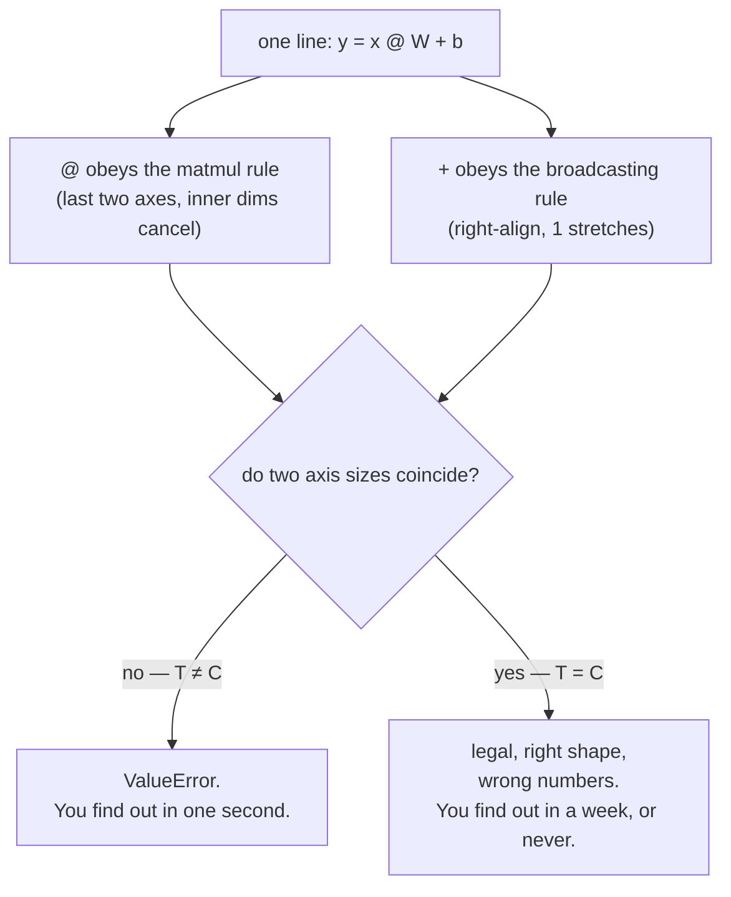

# 4.1 — 💥 The shape was right and the answer was wrong

## One-line answer

When a tensor's axes happen to be the same size — `T` equal to `C`, or a bias reshaped into a column —
the shape check that would have caught your bug passes, both broadcasting and matmul accept the
operation, and the output is the right shape and the wrong numbers.

---

## The story

An exam hall gives every student a seat written as two numbers: the row, and the position within that
row.

For years the hall has 4 rows of 6 seats. The form has two boxes, and nobody has ever mixed them up,
because a row number is never above 4 and a position is never above 6. Write them the wrong way round
and the form is obviously wrong, because there is no row 6.

Then the hall is rebuilt: 6 rows of 6 seats.

Nothing about the form changes. Nothing about the routine changes. But now any number that can go in
one box can also go in the other. The day someone fills them in the wrong order, the form is **still
valid**. It passes every check at the door. It names a real seat, with a real student sitting in it,
who is not the student the form is about.

The mistake was possible before the rebuild too. What changed is that it stopped being **catchable**.

Transformers are built out of square things. `T` and `C` and `C_out` and `V` are all just numbers, and
the moment two of them happen to be equal, the hall has been rebuilt.
---

## The idea in plain language

Today established two independent sets of rules:

- **Broadcasting** (part [2.1](../02-broadcasting-and-indexing/2.1-broadcasting-the-rule.md)): shapes
  are right-aligned, and a size of 1 stretches. Applies to `+`, `-`, `*`, `/`.
- **Matmul** (parts [3.1](../03-matmul/3.1-matmul-is-the-primitive.md) and
  [3.3](../03-matmul/3.3-batched-matmul.md)): the last two axes are the matrix, the inner dimensions
  must match and vanish, the leading axes broadcast. Applies to `@`.

Both are permissive by design, and each one on its own is manageable. The failure this part is about
is what happens when they meet — one line of ordinary model code that uses **both**:

```text
y = x @ W + b
```

`@` follows the matmul rules. `+` follows the broadcasting rules. And a mistake in either one produces
a legal expression whenever the sizes happen to line up.

Three facts combine into the trap:

1. **Axis sizes coincide constantly in real models.** An attention projection is `(C, C)` — square by
   construction. A batch of `B = 8` and a head count of `H = 8`. A sequence length `T = 512` and a
   width `C = 512`. None of these is a contrivance; they are the normal case.
2. **A shape assertion cannot tell two same-sized axes apart.** `assert y.shape == (B, T, C)` passes
   for a tensor whose `T` and `C` axes have been swapped, because the tuple is the same tuple.
3. **A summary statistic cannot either.** As measured below, the wrong-bias version has *exactly the
   same mean* as the right one, to every printed digit — because it adds the same numbers, only to
   different places.

So the defences you have from parts 1.1 and 2.1 — assert the shape, assert the invariant — are both
defeated here, and the part exists to say what actually works instead.

---

## Why Akshara needs it

- **Day 39** assembles Akshara v0 and checks the parameter count by hand. A parameter count is
  invariant to which axis is which, so it will not catch this. The day's forward-pass check has to be
  a *value* check on a known input, and this part is why.
- **Day 32** is the multi-head reshape, the single most transposition-heavy line in the curriculum —
  `(B, T, C)` to `(B, T, H, hs)` to `(B, H, T, hs)`. When `T` equals `H × hs`, or `H` equals `hs`, the
  wrong permutation produces the right shape.
- **Day 31** applies the causal mask. A `(T, T)` mask against a `(B, H, T, T)` score tensor is correct;
  a `(1, T)` mask broadcasts silently and masks the wrong thing, and the model still trains — while
  quietly seeing the future, which is the failure that makes an evaluation meaningless.
- **Day 51 onward**, every debugging session begins by printing shapes. This part is the reason the
  *second* thing you print is a value on a known input.

---

## The mechanism

**Face one: the bias that became per-token instead of per-channel.**

`B = 2`, `T = 8`, `C = 8`, `C_out = 8`. The sizes coincide — which is exactly the condition for the
trap, and exactly what an attention projection looks like:

```python
import numpy as np

rng = np.random.default_rng(1337)
B, T, C, C_out = 2, 8, 8, 8

x = rng.standard_normal((B, T, C))          # (B, T, C)
W = rng.standard_normal((C, C_out))         # (C, C_out)
b_right = rng.standard_normal(C_out)        # (C_out,)   one bias per output channel
b_wrong = b_right.reshape(C_out, 1)         # (C_out, 1) the same numbers, as a column

y = x @ W                                   # (B, T, C_out)
y_right = y + b_right                       # (B, T, C_out)
y_wrong = y + b_wrong                       # (B, T, C_out)  <- also legal

print("shapes equal :", y_right.shape == y_wrong.shape)
print("max abs diff :", round(float(np.abs(y_right - y_wrong).max()), 6))
print("mean right   :", round(float(y_right.mean()), 6))
print("mean wrong   :", round(float(y_wrong.mean()), 6))
```

**Line by line:**
- `b_right` has shape `(C_out,)`. Right-aligned against `(B, T, C_out)` it pads to `(1, 1, C_out)` and
  stretches over batch and token — **one bias per output channel, shared by every token**, which is
  what a linear layer's bias means.
- `b_wrong` holds **the same eight numbers** in shape `(C_out, 1)`. This is what you get from a
  `keepdims=True` reduction, from reading a column out of a file, or from a `.reshape(-1, 1)` written
  two functions away. Right-aligned against `(B, T, C_out)` it pads to `(1, C_out, 1)`, matches
  `C_out` against `T` — **which succeeds only because they are both 8** — and stretches the trailing
  1 across the channels. The result is one bias per *token*, applied to all channels.
- Both lines produce `(2, 8, 8)`. Measured on Intel Core i3-1115G4, CPython 3.12.10, numpy 2.5.2, seed
  1337, 2026-08-26: `shapes equal: True`, `max abs diff: 4.030942`.
- **And the means are identical**: `-0.053643` and `-0.053643`. The same eight numbers were added to
  the same 128 positions in total, just distributed along a different axis. Any statistic over the
  whole tensor — mean, sum, and by symmetry much of the distribution — is unchanged. A sanity check
  that prints the mean of the activations passes.

**Face two: `*` where `@` was meant, on a square projection.**

```python
B, T, C = 2, 8, 8
x = rng.standard_normal((B, T, C))          # (B, T, C)
W = rng.standard_normal((C, C))             # (C, C)   a square projection

mm = x @ W                                  # (B, T, C)  matmul
ew = x * W                                  # (B, T, C)  elementwise — also legal!

print("shapes equal:", mm.shape == ew.shape)
print("allclose    :", np.allclose(mm, ew))
print("max abs diff:", round(float(np.abs(mm - ew).max()), 4))
```

**Line by line:**
- `x @ W` follows the matmul rule: last two axes `(T, C) @ (C, C)` gives `(T, C)`, and `B` is a batch
  axis. Output `(2, 8, 8)`.
- `x * W` follows the broadcasting rule: `(B, T, C)` against `(C, C)`, right-aligned, `C` matches `C`
  and `T` matches `C` **because both are 8**, and `B` is padded. Output `(2, 8, 8)` — the same shape,
  from an entirely different operation.
- Measured, same machine and seed, 2026-08-26: `shapes equal: True`, `allclose: False`,
  `max abs diff: 8.3403`.
- A square weight matrix is not unusual. In a transformer block the query, key, value and output
  projections are all `(C, C)`. This is the single most likely place in the whole architecture for
  this typo to survive.

The two faces, and the condition they share:



**And here is the proof that the coincidence is the whole story.** Change `T` from 8 to 5 and both
faces become loud, verbatim on this machine, 2026-08-26:

```console
>>> x2 = rng.standard_normal((2, 5, 8)); W2 = rng.standard_normal((8, 8))
>>> x2 * W2
Traceback (most recent call last):
  File "<stdin>", line 1, in <module>
ValueError: operands could not be broadcast together with shapes (2,5,8) (8,8)

>>> y2 = x2 @ W2
>>> y2 + rng.standard_normal((5,))
Traceback (most recent call last):
  File "<stdin>", line 1, in <module>
ValueError: operands could not be broadcast together with shapes (2,5,8) (5,)
```

Same code, same bug, one dimension changed — and now it is a one-second fix instead of a week. That is
worth sitting with: **the bug did not become less severe when the sizes differed; it became
detectable.** Which means every hour your development shapes are square is an hour your tests are
weaker than you think.

But note the one that *still* does not raise, even with `T = 5`:

```console
>>> y2 + rng.standard_normal((5, 1))
(2, 5, 8)
```

`(2, 5, 8)` against `(5, 1)` right-aligns to `(1, 5, 1)`: `5` matches `T`, and the trailing `1`
stretches across all 8 channels. Face one survives the size change, because it never needed `T` to
equal `C` — it only needed a trailing singleton. This is part
[2.3](../02-broadcasting-and-indexing/2.3-the-n1-versus-n-bug.md) again, in a model.

---

## Shapes

| Tensor | Symbolic shape | Concrete here | What each axis means |
| --- | --- | --- | --- |
| `x` | `(B, T, C)` | `(2, 8, 8)` | batch item · token position · input channel |
| `W` | `(C, C_out)` | `(8, 8)` | input channel · output channel — **square, so `T` could pass for `C`** |
| `x @ W` | `(B, T, C_out)` | `(2, 8, 8)` | the intended projection |
| `x * W` | `(B, T, C_out)` | `(2, 8, 8)` | a completely different quantity, same shape |
| `b_right` | `(C_out,)` | `(8,)` | one bias per channel → padded to `(1, 1, C_out)` |
| `b_wrong` | `(C_out, 1)` | `(8, 1)` | the same numbers → padded to `(1, C_out, 1)`, matched against `T` |
| `y + b_right` | `(B, T, C_out)` | `(2, 8, 8)` | bias varies along the **channel** axis |
| `y + b_wrong` | `(B, T, C_out)` | `(2, 8, 8)` | bias varies along the **token** axis — max difference 4.03 |

Every output row in this table is `(2, 8, 8)`. The table is the argument: **a `## Shapes` table is
necessary and it is not sufficient**, and knowing where its guarantee stops is what makes it a tool
rather than a ritual.

---

## When it breaks

It does not break. Both faces run, both produce finite numbers of the right shape, and — for face one
— the mean is *exactly* right.

The wrong-but-running output, verbatim, which is what the plan's §25.4 asks for in the silent case:

```text
shapes equal : True
max abs diff : 4.030942
mean right   : -0.053643
mean wrong   : -0.053643
```

and

```text
shapes equal: True
allclose    : False
max abs diff: 8.3403
```

**What a model does with this.** It trains. Face one gives every channel the same bias within a token
and a different one across tokens, which is a strange but learnable constraint — the rest of the
network compensates, the loss goes down, and the model is worse than it should be by an amount nobody
can attribute. Face two makes the "projection" a scaling rather than a mixing, so the layer cannot mix
information across channels at all; the model still learns something from the layers around it. In
neither case is there an error, a `NaN`, or a flat loss curve. There is just a model that is quietly
worse than the architecture you designed on paper.

**The check that actually works, and it is not a shape check.** It is a *value* check on an input
whose answer you know by hand:

```python
def test_linear_bias_is_per_channel():
    B, T, C = 1, 3, 4
    x = np.zeros((B, T, C))                       # (B, T, C) — all zeros
    W = np.zeros((C, C))                          # (C, C)
    b = np.array([10.0, 20.0, 30.0, 40.0])        # (C,) — deliberately all different

    y = x @ W + b                                 # (B, T, C)

    np.testing.assert_allclose(y[0, 0], b)        # every token gets the full bias vector
    np.testing.assert_allclose(y[0, 1], b)
    assert not np.allclose(y[0, :, 0], [10.0, 20.0, 30.0]), "bias is varying along T, not C"
```

**Line by line:**
- `x` and `W` are **zero**, so the matmul contributes nothing and the test isolates the bias. Removing
  every other source of variation is what makes the assertion diagnostic rather than merely true.
- `b` has four **distinct** values. A bias of `[1, 1, 1, 1]` would pass under both the right and the
  wrong broadcast, which is the same detectability trap one level up — *the test data must break the
  symmetry the bug relies on*.
- `T = 3` and `C = 4` are **deliberately different**. Square test data cannot distinguish these cases
  at all. Making the test shapes mutually prime is a cheap, permanent habit and it costs nothing.
- The last assertion is written as a *negative* — it names the specific wrong behaviour, so when it
  fires the message says what happened rather than merely that something did.
- This is Principle 11 in practice: a check that can go **red**, and you must watch it do so before
  trusting it. Substitute `b.reshape(C, 1)` and run it. On this machine, 2026-08-26, it goes red
  immediately and **not** through the assertion:

  ```console
  ValueError: operands could not be broadcast together with shapes (1,3,4) (4,1)
  ```

  That is the strongest possible outcome, and it is a direct consequence of rule 1 above: because the
  test uses `T = 3` and `C = 4` rather than two 8s, the bug cannot even be *expressed*, let alone
  survive. Now change the test to `T = C = 4` and substitute the broken bias again — the `ValueError`
  disappears, the assertion fires instead, and if you had also used a uniform bias `[1, 1, 1, 1]`
  nothing would fire at all. Three levels of detectability from the same bug, decided entirely by the
  test data. A test you have never seen fail is a test you have not written.

**Which silent failure this touches.** All of today's failure modes feed **#4 — noise mistaken for
improvement** (plan §6), and this one most directly: a model damaged this way is worse by an amount
comparable to the differences you will later be trying to measure between real changes. It cannot be
separated from noise by running more seeds, because it is not noise — it is a constant, silent
handicap. The only thing that finds it is a value check against hand-computed arithmetic, which is why
Day 39's parameter count is paired with a forward-pass check on a known input rather than standing
alone.

---

## In production

**What a research engineer writes instead of the teaching version.** Three habits, in order of how
much they pay:

1. **Test with mutually distinct shapes.** `B = 2, T = 3, C = 5, H = 1` — no two the same, none of
   them 1 except where a singleton is genuinely under test. A test suite whose shapes are all 8 is a
   test suite that cannot detect axis confusion, and it costs nothing to fix.
2. **Test with distinguishable values.** `arange` rather than `ones`, distinct biases rather than
   uniform ones. The symmetry in your test data is the symmetry your test cannot see.
3. **Check one value by hand.** For a layer, set the weights to something whose output you can compute
   on paper, and assert the whole output tensor. It is ten minutes once and it is the only check that
   sees through a coincidence of sizes.

Beyond that, named axes — either a library that carries axis names, or `einsum` strings that spell out
which axis is which (`"btc,co->bto"`) — remove the class of bug entirely, at the cost of a little
speed and a little unfamiliarity. Where the shapes are subtle, that trade is usually right.

**What degrades at scale.** Detectability, and only detectability. The bug's *cost* is constant — a few
percent of model quality, forever — while the chance of noticing it falls as the model gets bigger,
because a bigger model has more coinciding axis sizes, longer stack traces, and more plausible reasons
for being slightly worse than expected. The cheapest moment to catch this is the smallest test you
will ever write, which is today.

**The failure that only shows with real data.** A configuration change. The model is developed with
`C = 512` and `T = 512` — everything works, tests pass, results are fine. Someone raises the context
length to 1024 and a shape error appears in a layer nobody touched. The instinct is to "fix" the new
error with a reshape. The truth is that the error was always there and the old configuration was
hiding it, and reshaping to make it go away preserves the bug and removes the last evidence of it.
**A new shape error after a configuration change deserves an investigation, not a reshape.**

**The review comment.** *"These test shapes are all 8. If two axes get swapped, this test still
passes — can they be 2, 3 and 5?"* One of the highest-value review comments there is, and one of the
cheapest to act on.

**The interview question.** *"Your model trains and the loss goes down, but it underperforms a
published baseline by a few points and you can't find why. Walk me through how you'd look."* A strong
answer includes checking the forward pass against hand-computed values on a tiny distinct-shape input,
and says explicitly that shape assertions and loss curves cannot catch an axis confusion between
same-sized axes. That specific admission — knowing what your checks *cannot* see — is what
distinguishes someone who has debugged a real model from someone who has read about one.

**Compute tier: T0.** Both failures were reproduced on a laptop CPU with tensors of 128 elements. That
is the useful property of this whole class of bug: it is a rule about shapes, so the smallest possible
example reproduces it exactly, and the fix is verifiable in milliseconds. What T0 cannot show is the
cost — a few points of model quality on a run that takes a full T1 session — which is precisely why it
is worth spending a laptop minute on now.

---

## Check yourself

Run this. It prints **two `True`s and two differences**, and the two `True`s are the problem:

```python
import numpy as np

rng = np.random.default_rng(1337)
B, T, C = 2, 8, 8

x = rng.standard_normal((B, T, C))
W = rng.standard_normal((C, C))
b = rng.standard_normal(C)

print("x @ W and x * W same shape :", (x @ W).shape == (x * W).shape)
print("  ... and same values      :", np.allclose(x @ W, x * W))
print("  ... max abs diff         :", round(float(np.abs((x @ W) - (x * W)).max()), 4))

y = x @ W
print("y+b and y+b[:, None] same shape:", (y + b).shape == (y + b[:, None]).shape)
print("  ... max abs diff             :", round(float(np.abs((y + b) - (y + b[:, None])).max()), 6))
```

**Line by line:**
- Both "same shape" lines print `True`. Every shape assertion you could write here passes, and two of
  the four expressions are wrong.
- `allclose` prints `False` and the differences are `7.6679` and `4.030942` on this machine,
  2026-08-26 — large, not subtle, and completely invisible to the shape. (The first differs from the
  `8.3403` in the mechanism section above because the generator has been drawn from a different number
  of times; same seed, different position in the stream. Reproducibility means the *whole script*, not
  the line.)
- Now change `T` from `8` to `5` and re-run. Two of the four lines raise, and **that is the improvement
  you are looking for**: the bug did not go away, it became findable. Say out loud which of the four
  still does not raise, and why.

**Say this out loud, without scrolling up:** name the one condition that turns both of today's rules
from safe into dangerous — and name the kind of check that still works when a shape assertion does
not.
