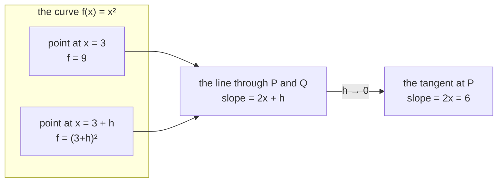

# 1.1 — The slope, from the definition

## One-line answer

A derivative is the answer to one question — *if I nudge this input by a tiny amount, how much does
the output move, per unit of nudge?* — and everything in training is that question asked about a loss
and a weight.

---

## The story

Imagine a car with no speedometer. It has only an odometer — the little counter that shows how many
kilometres the car has travelled in total.

You are in the passenger seat, and you want to know how fast the car is going **right now**.

So you do the obvious thing. You write down the odometer reading, wait one hour, write it down again,
and subtract. It says 40 kilometres. But that hour included a tea stop and a traffic jam, so 40 km/h
is the average for the hour. It says nothing about this moment.

You try again over one minute. Then over ten seconds. Then over one second. Each time the number
settles down a little more, and by the time you are down to a second, it barely changes at all. That
settled number is what anybody means by "the speed right now".

You do not try it over zero seconds. In zero seconds the car covers zero kilometres, and zero divided
by zero tells you nothing whatsoever. You stop shrinking the gap at the point where the answer has
stopped moving.

Everything in this document is in those two paragraphs — including the reason it has a whole failure
part attached ([1.5](1.5-the-finite-difference-that-lied.md)). The "make the gap smaller" trick works
beautifully, right up until the moment it does not.
---

## The idea in plain language

A **function** is a rule that turns a number into a number. Write it `f`, and `f(x)` is what the rule
gives back when you feed it `x`. `f(x) = x²` is a function; `f(3)` is 9.

The question this whole day is about: **if I change `x` a little, how much does `f(x)` change?**

Call the little change `h`. Before the change the output is `f(x)`. After it, `f(x + h)`. The output
moved by `f(x + h) − f(x)`, and the input moved by `h`. The ratio

> `(f(x + h) − f(x)) / h`

is "how much output per unit of input", which is exactly the car's kilometres-per-hour. It
is called a **difference quotient**, and for any actual `h` it is an average over the stretch from `x`
to `x + h`.

The **derivative** is what that ratio settles to as `h` gets small. It is written `f'(x)` or `df/dx`,
and read as "the rate of change of `f` at `x`". It is a *local* quantity: it describes the function
right at `x`, and says nothing about anywhere else.

Three things follow, and they are the ones that matter for training a model:

**A derivative has a sign, and the sign is a direction.** If `f'(x)` is positive, increasing `x`
increases `f`. If it is negative, increasing `x` decreases `f`. When `f` is a loss you want to make
small, the sign tells you which way to move — and that is the whole of gradient descent, which is
Day 8.

**A derivative has a size, and the size is a sensitivity.** `f'(x) = 100` means a nudge of 0.01 in `x`
moves `f` by about 1. `f'(x) = 0.001` means the same nudge barely registers. When some weights have
large derivatives and others tiny ones, they need different step sizes, and that is why Day 8 needs
more than one number for the learning rate.

**A derivative is itself a function.** `f'` has a value at every `x`, and it is usually a different
value at each. `f(x) = x²` has `f'(x) = 2x`, so the slope at `x = 3` is 6 and at `x = −1` is −2. The
slope depends on where you are standing.

One more term, because it appears constantly from Day 4 onward: when a function has several inputs,
the derivative with respect to **one** of them — holding the others still — is called a **partial
derivative**, written `∂f/∂x`. The collection of all the partials, one per input, is called the
**gradient**. The gradient is what a training step consumes, and part
[1.3](1.3-partial-derivatives.md) builds it.

---

## Why Akshara needs it

- **Day 8** is gradient descent: `w ← w − lr · ∂L/∂w`. That line is meaningless without knowing what
  `∂L/∂w` *is*, and its sign convention (subtract, because the gradient points uphill) is the sign
  fact above.
- **Day 3's second half** builds an engine that computes these derivatives automatically for
  arbitrary expressions. The engine is mechanical; what makes it correct is the definition here.
- **Day 4** proves a backward pass with finite differences — literally the difference quotient above,
  used as a test oracle against hand-derived formulas. The whole method is this document plus part
  [1.5](1.5-the-finite-difference-that-lied.md)'s warning.
- **Day 7** is where the "let `h` get small" move collides with floating-point arithmetic, and the
  collision is the reason a stable softmax exists.
- **Every training run from Day 25 to Day 161** is this question, asked a few million times a second
  about a loss and a few million weights.

---

## The mechanism

Ask the question directly. `f(x) = x²`, at `x = 3`:

```python
def f(x: float) -> float:
    return x * x


x = 3.0
for h in (1.0, 0.1, 0.01, 0.001, 0.0001):
    slope = (f(x + h) - f(x)) / h
    print(f"h = {h:<8} slope = {slope}")
```

**Line by line:**
- `f(x + h) - f(x)` is the rise; `h` is the run. Nothing else is happening.
- The loop shrinks `h` by a factor of ten each time, which is you shortening the measured
  stretch.
- On this machine (Intel Core i3-1115G4, CPython 3.12.10, 2026-08-26) it prints `7.0`,
  `6.100000000000012`, `6.009999999999849`, `6.000999999999479` and `6.000100000012054`. **The answers
  are marching towards 6, and each one overshoots by very nearly `h`.** The trailing digits that spoil
  the "very nearly" are already the subject of part
  [1.5](1.5-the-finite-difference-that-lied.md) — note how many of them there are at `h = 0.0001`
  compared with `h = 0.1`, and that the count is going the wrong way.
- That last observation is not a coincidence and it is worth doing on paper once:
  `((x+h)² − x²)/h` = `(x² + 2xh + h² − x²)/h` = `2x + h`. So the difference quotient is
  *exactly* `2x + h`, the true derivative is `2x = 6`, and the error is exactly `h`. **The error
  shrinks in proportion to `h`** — which is the fact part [1.5](1.5-the-finite-difference-that-lied.md)
  builds on, and the reason it is not the whole story.

Doing it symbolically instead of numerically, for the three functions this curriculum actually needs:

| `f(x)` | `f'(x)` | Where it shows up |
| --- | --- | --- |
| `c` (a constant) | `0` | a bias term's derivative with respect to an input |
| `x` | `1` | an identity path — the residual connection, Day 36 |
| `x²` | `2x` | squared error, Day 5 |
| `x^k` | `k·x^(k−1)` | the general power rule; `1/x` is `k = −1` |
| `e^x` | `e^x` | softmax, Day 5; the only function that is its own derivative |
| `ln(x)` | `1/x` | log-likelihood, Day 6 — and the source of the `log(0)` trap |
| `tanh(x)` | `1 − tanh²(x)` | the activation in the Day 27 recurrent network |

Nothing above is derived here — the power rule and the exponential are standard results, and this
curriculum uses them rather than re-proving calculus. What *is* derived here, in the paragraph above,
is that the difference quotient for `x²` is exactly `2x + h`, because that identity is the thing part
1.5 needs.

Two rules that combine derivatives, both of which you can check with the code above:

```python
def check(f, fprime, x, h=1e-6):
    """Compare a claimed derivative against the difference quotient."""
    numeric = (f(x + h) - f(x - h)) / (2 * h)
    return fprime(x), numeric


print("sum rule :", check(lambda t: t * t + 3 * t, lambda t: 2 * t + 3, 2.0))
print("product  :", check(lambda t: t * t * (t + 1), lambda t: 3 * t * t + 2 * t, 2.0))
```

**Line by line:**
- `(f(x + h) - f(x - h)) / (2 * h)` steps **both ways** and divides by the total width. This is the
  *central* difference, and it is a genuinely better estimate than the one-sided version above — part
  [1.5](1.5-the-finite-difference-that-lied.md) measures how much better and why. It is used here so
  the printed numbers agree to enough digits to be convincing.
- The **sum rule**: the derivative of `f + g` is `f' + g'`. Derivatives pass straight through addition,
  which is why the backward pass of an addition (Day 3 part
  [2.2](../02-the-autograd-engine/2.2-the-local-derivative.md)) is the simplest one there is.
- The **product rule**: the derivative of `f·g` is `f'·g + f·g'`. Each factor takes a turn being
  nudged. This is why a multiplication's backward pass needs *the other operand's value*, which is the
  single most important structural fact about how an autograd engine has to be written.
- On this machine, 2026-08-26, both lines print two numbers agreeing to about ten decimal places. They
  do not agree exactly, and the reason is part 1.5.

The picture, because the definition is geometric:



The line through two points on the curve is called a **secant**; the line touching at one point is the
**tangent**. The derivative is the tangent's slope, and the difference quotient is the secant's. Every
numerical derivative you ever compute is a secant pretending to be a tangent, and part 1.5 is about
when the pretence fails.

---

## When it breaks

The loud one — a function that has no derivative at the point you asked about:

```console
>>> def f(x): return abs(x)
>>> h = 1e-6
>>> (f(0 + h) - f(0)) / h
1.0
>>> (f(0 - h) - f(0)) / -h
-1.0
```

No exception. Two answers, `1.0` and `-1.0`, from stepping right and stepping left. `|x|` has a corner
at zero: it approaches with slope −1 from the left and +1 from the right, and there is no single number
the ratio settles to. The derivative genuinely **does not exist** there.

This is not a curiosity. `ReLU(x) = max(0, x)` — the activation function of Day 35 — has exactly this
corner, and every deep network built since has run gradient descent through it anyway, by picking one
of the two answers at the corner by convention. Knowing that this is a *convention* rather than a
derivative is the difference between using the tool and being confused by it.

The other loud one — division by zero, which is what "let `h` go all the way to zero" actually does:

```console
>>> h = 0.0
>>> (f(3 + h) - f(3)) / h
Traceback (most recent call last):
  File "<stdin>", line 1, in <module>
ZeroDivisionError: float division by zero
```

The derivative is the *limit* as `h` approaches zero, not the value at zero. Those are different
statements, and the error message is the machine insisting on the difference.

**The silent version, and it is the one that costs a day.** A wrong sign. Compute a derivative,
negate it somewhere by accident, and use it in a training step:

```python
w = w - lr * grad      # correct: move against the gradient, downhill
w = w + lr * grad      # wrong: move with the gradient, uphill
```

**Line by line:**
- The gradient points in the direction of **increase**. To make a loss smaller you move against it,
  which is the minus sign.
- The wrong version does not crash and does not produce `NaN` immediately. It performs *gradient
  ascent*: it maximises the loss. With a small learning rate the loss climbs slowly and smoothly,
  which looks like a model that is "not learning yet" rather than a model that is learning the wrong
  thing.
- The check that catches it in one step, and it is the cheapest check in this entire curriculum:
  **compute the loss, take one step, compute the loss again.** If it went up, the sign is wrong. Day 8
  makes this a standing habit and Day 51 makes it a test.

---

## In production

**What a research engineer writes instead of the teaching version.** Nobody computes difference
quotients to get gradients — that is what the next section's engine is for, and it is exact and
`n`-times cheaper. What the difference quotient remains, permanently, is the **oracle**: the
independent second opinion you check a hand-written backward pass against. Day 4 (MATH-07) is entirely
this, and every custom operation written in a real codebase gets a gradient check before it is
trusted, because a wrong gradient does not raise — it trains, badly.

**What degrades at scale.** The definition does not degrade at all; it is exact. What degrades is the
*numerical* version, in two directions at once, and part
[1.5](1.5-the-finite-difference-that-lied.md) measures both. And it degrades in cost: a difference
quotient gives you **one** partial derivative per two function evaluations, so getting the gradient of
a model with `n` parameters costs `2n` forward passes. For a model with twelve million parameters that
is twenty-four million forward passes per step. Backpropagation gets all `n` partials for roughly the
cost of **one** forward pass — a factor of `n` — and that single fact is why training large models is
possible at all.

**The failure that only shows with real data.** A loss that is not differentiable where the data puts
it. Accuracy is a count, so its derivative is zero almost everywhere and undefined at the thresholds —
which is why models are never trained directly on accuracy, and why Day 6's cross-entropy exists as a
*differentiable stand-in* for the thing you actually care about. This gap between the metric you
optimise and the metric you report is a permanent feature of the field, and Day 112 onward is about
living with it honestly.

**The review comment.** *"You've added a custom operation with a hand-written backward pass. Where's
the gradient check?"* There is no acceptable answer other than a test file.

**The interview question.** *"Why do we backpropagate instead of just computing numerical
gradients?"* The weak answer says "it's faster". The strong answer gives the factor and its origin:
numerical differentiation costs two forward passes **per parameter**, backpropagation costs about one
forward pass **total**, so the ratio is the parameter count. Then it adds the second reason, which
fewer people mention: the numerical version is also *less accurate*, for the reason part 1.5 measures.

**Compute tier: T0.** Everything here is arithmetic on single floats and runs instantly on a laptop.
The T0 version proves the definition and the difference-quotient behaviour exactly — these are
properties of arithmetic, not of hardware. There is nothing here a GPU would change, and nothing here
that needs one.

---

## Check yourself

Run this. It prints **five numbers**, and each one must overshoot the true answer by exactly `h`:

```python
def f(x: float) -> float:
    return x * x


x = 3.0
true = 2 * x
for h in (1.0, 0.1, 0.01, 0.001, 0.0001):
    slope = (f(x + h) - f(x)) / h
    print(f"h = {h:<8} slope = {slope:<20} error = {slope - true:.6f}")
```

**Line by line:**
- The `error` column prints `1.000000`, `0.100000`, `0.010000`, `0.001000`, `0.000100` on this
  machine, 2026-08-26 — **exactly `h` every time**, because the algebra above says the quotient is
  `2x + h`.
- That exactness is the check. If your error column is not equal to `h` to the digit, the function
  being differentiated is not `x²`.
- Now change `h` to `1e-16` and re-run. Predict what happens before you look, then read part
  [1.5](1.5-the-finite-difference-that-lied.md).

**Say this out loud, without scrolling up:** state what a derivative answers in one sentence with the
word *nudge* in it — and say what the **sign** of a gradient tells you and what its **size** tells you.
