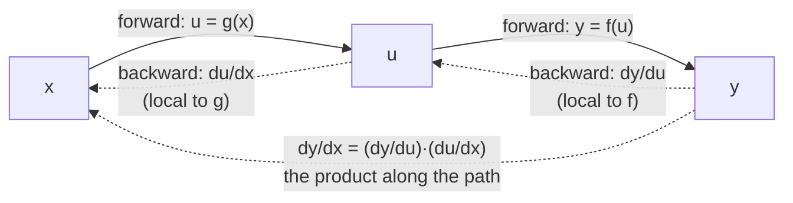

# 1.2 — The chain rule: sensitivities multiply along a path

## One-line answer

When one thing feeds another which feeds another, the sensitivity of the last to the first is the
**product** of the sensitivities along the way — and that single fact is the entire reason
backpropagation exists.

---

## The story

You want to know what one extra hour of driving costs you in fuel. You do not simulate the car. You
read three numbers off three different things.

The speedometer says you are covering 60 kilometres in an hour. The car's manual says the engine burns
5 litres for every 100 kilometres, which is 0.05 litres per kilometre. The board at the petrol pump
says petrol is ₹100 a litre.

One extra hour is 60 kilometres. 60 kilometres is 3 litres. 3 litres is ₹300.

Sixty times 0.05 times 100. That is the answer, and you got it by multiplying three numbers together.

Now look at who produced those three numbers. A speed, measured by the car. A fuel rate, measured
years ago by an engineer on a test bench. A price, chalked on a board this morning by someone at the
pump. Three people, three places, three completely different jobs, and not one of them knew about the
other two.

That is the property that matters. Each link only had to know **its own** rate: kilometres per hour,
litres per kilometre, rupees per litre. Nobody had to hold the whole chain in their head. And that is
exactly why a network with a hundred million dials can be worked out by a hundred million small,
separate, local calculations.
---

## The idea in plain language

A **composition** is a function applied to the result of another function. If `u = g(x)` and
`y = f(u)`, then `y = f(g(x))`, and `y` depends on `x` *through* `u`.

The **chain rule** says:

> `dy/dx = (dy/du) × (du/dx)`

In words: how much `y` moves per unit of `x` equals how much `y` moves per unit of `u`, times how much
`u` moves per unit of `x`.

The notation makes it look like the `du` cancels, and while that is not a proof, it is a reliable way
to remember it and to check that a long chain is written the right way round. For four stages:

> `dy/dx = (dy/dc) × (dc/db) × (db/da) × (da/dx)`

Every adjacent pair shares a symbol; the two ends are what you asked for.

Three consequences, and each one is load-bearing later:

**The factors are local.** `dy/du` depends only on `f` and the *value* of `u` at that point. It does
not depend on `g`, or on `x`, or on anything upstream. This is what makes the rule mechanisable: each
operation can carry its own derivative rule and know nothing about the rest of the graph. Part
[2.2](../02-the-autograd-engine/2.2-the-local-derivative.md) turns exactly this into code.

**They multiply, so they compound.** Ten stages each with a sensitivity of 0.5 give an overall
sensitivity of `0.5¹⁰ ≈ 0.001`. Ten stages each with 2.0 give `1024`. Small numbers multiplied
together vanish; large ones explode. That is not a metaphor — it is the *vanishing and exploding
gradient* problem by name, it is why deep networks were hard to train before residual connections
(Day 36) and normalization (Day 37), and it is visible in one line of arithmetic today.

**The order of evaluation is a choice, and it matters enormously.** The product
`(dy/dc)(dc/db)(db/da)(da/dx)` can be multiplied left-to-right or right-to-left. For a function with
one input and one output it makes no difference. For a function with **millions of inputs and one
output** — which is exactly a neural network's loss — one order is cheap and the other is ruinous.
That is the subject of part [1.4](1.4-the-graph-forward-and-backward.md), and it is the reason the
algorithm is called *back*propagation.

---

## Why Akshara needs it

- **Day 3 part [2.2](../02-the-autograd-engine/2.2-the-local-derivative.md)** implements the chain
  rule as one line inside each operation: `self.grad += <local derivative> * out.grad`. That `*` is
  this rule.
- **Day 4** derives the backward pass of a linear layer, which is the chain rule with matrices instead
  of numbers, and where the notorious transpose comes from.
- **Day 27** builds an LSTM and asks how a gate keeps a gradient alive across many timesteps. The
  question only makes sense once you know that a gradient crossing `T` timesteps is a product of `T`
  factors.
- **Day 36** introduces residual connections, whose entire purpose is to add a path whose local
  derivative is exactly `1`, so that the product along it cannot shrink.
- **Day 37** is normalization, which controls the *size* of those factors so the product stays in a
  usable range.

Days 27, 36 and 37 are three different answers to a problem that is stated completely in the second
consequence above. It is worth being able to state it today.

---

## The mechanism

The drive, in code, with the answer computed three ways:

```python
def g(x: float) -> float:      # the speedometer: kilometres from hours
    return 60.0 * x


def f(u: float) -> float:      # manual and pump together: rupees from kilometres
    return 5.0 * u             # 0.05 litres per km × ₹100 per litre


x = 4.0

# 1 - the composed function, differentiated directly
composed = lambda t: f(g(t))                        # y = 300x
direct = (composed(x + 1e-6) - composed(x - 1e-6)) / (2e-6)

# 2 - the chain rule: local rates, multiplied
du_dx = 60.0                                         # dg/dx
dy_du = 5.0                                          # df/du
chained = dy_du * du_dx

print("direct :", direct)
print("chained:", chained)
```

**Line by line:**
- `composed` builds `f(g(t))` without either function knowing about the other. That is the point: the
  composition is assembled at the call site, and the derivative will be too.
- `direct` is the central difference from part
  [1.1](1.1-the-slope-from-the-definition.md), applied to the whole chain at once. It is the *check*,
  not the method.
- `du_dx` and `dy_du` are the two local rates. Neither one mentions the other function. `du_dx = 3`
  is a property of the speedometer alone.
- `chained = dy_du * du_dx` — note the order. Written right to left, it reads "rupees per kilometre
  times kilometres per hour", and the units cancel to rupees per hour. Writing it in this order is a
  habit worth
  forming, because it matches how the backward pass will traverse the graph.
- On this machine (Intel Core i3-1115G4, CPython 3.12.10, 2026-08-26) `chained` prints exactly
  `300.0` and `direct` prints `300.0000001520675`. **The chain rule is the exact one and the numerical check
  is the approximate one** — which is the opposite of the intuition most people arrive with, and it is
  worth noticing now.

Now a chain where the local rates are not constants, which is the realistic case:

```python
import math


def chain_demo(x: float) -> tuple[float, float]:
    """y = tanh(3x + 1). Return (value, dy/dx by the chain rule)."""
    u = 3.0 * x + 1.0          # stage 1
    y = math.tanh(u)           # stage 2

    du_dx = 3.0                # d(3x + 1)/dx
    dy_du = 1.0 - y * y        # d tanh(u)/du = 1 - tanh²(u)
    return y, dy_du * du_dx


x = 0.7
value, analytic = chain_demo(x)
numeric = (math.tanh(3 * (x + 1e-6) + 1) - math.tanh(3 * (x - 1e-6) + 1)) / 2e-6
print(f"y        = {value}")
print(f"analytic = {analytic}")
print(f"numeric  = {numeric}")
print(f"rel err  = {abs(analytic - numeric) / abs(numeric):.3e}")
```

**Line by line:**
- `du_dx = 3.0` is still a constant, because stage 1 is linear. `dy_du` is **not**: it depends on `y`,
  which depends on where you are.
- `dy_du = 1 - y*y` uses the already-computed `y` rather than recomputing `tanh(u)`. This is the first
  appearance of a pattern that dominates the rest of the day: **the backward pass reuses values the
  forward pass already produced.** It is why an autograd engine stores the forward value inside each
  node (part [2.1](../02-the-autograd-engine/2.1-a-value-that-remembers.md)) and why activation memory
  is a real cost in a real model.
- On this machine, 2026-08-26, it prints `y = 0.9959493592219002`,
  `analytic = 0.02425462159645919`, `numeric = 0.02425462158894831`, and a relative error of
  `3.097e-10`. They agree; they do not agree exactly, and part
  [1.5](1.5-the-finite-difference-that-lied.md) says why.

**The compounding, which is the consequence that shapes the whole architecture.** Ten identical
stages:

```python
for local in (0.5, 0.9, 1.0, 1.1, 2.0):
    for depth in (10, 50):
        print(f"local rate {local}, depth {depth:2d} -> overall {local ** depth:.6g}")
```

**Line by line:**
- Each row is a chain of `depth` stages, each contributing the same local derivative. The overall
  sensitivity is the product, which is `local ** depth`.
- On this machine, 2026-08-26, the output is:

```text
local rate 0.5, depth 10 -> overall 0.000976562
local rate 0.5, depth 50 -> overall 8.88178e-16
local rate 0.9, depth 10 -> overall 0.348678
local rate 0.9, depth 50 -> overall 0.00515378
local rate 1.0, depth 10 -> overall 1
local rate 1.0, depth 50 -> overall 1
local rate 1.1, depth 10 -> overall 2.59374
local rate 1.1, depth 50 -> overall 117.391
local rate 2.0, depth 10 -> overall 1024
local rate 2.0, depth 50 -> overall 1.1259e+15
```

Read the `0.5` row against part
[1.2](../../../day-002-tensors-shape-stride/parts/01-what-a-tensor-is/1.2-dtype-the-width-of-a-number.md)
of Day 2: at depth 50 the overall sensitivity is `8.88e-16`, which is smaller than `float32`'s epsilon
of `1.19e-07` by nine orders of magnitude. A weight at the bottom of that chain receives an update
that **rounds to nothing** in 32-bit arithmetic. Not a small update — no update. The network's early
layers stop learning, and nothing anywhere raises an error.

And look at the `1.0` row: it is the only one that survives depth. A path whose local derivative is
exactly 1 passes gradient through unchanged, at any depth. **That is what a residual connection is**,
three and a half weeks before you build one on Day 36, and this table is the argument for it.

The rule as a picture, with the two directions marked:



---

## When it breaks

The loud one is rare, because the chain rule is arithmetic and arithmetic rarely raises. When it does,
it is an overflow at the end of a long product:

```console
>>> 2.0 ** 5000
Traceback (most recent call last):
  File "<stdin>", line 1, in <module>
OverflowError: (34, 'Result too large')
```

A chain of 5000 stages each amplifying by 2 exceeds what a float can hold. In a real network you meet
the array version of this instead — the loss becomes `inf`, then `NaN`, and the run is over. Day 7
(MATH-13) is where the mechanics of that overflow are the subject, and Day 8 is where the standard
response, **gradient clipping**, appears.

**The silent version, and there are two.**

*Silent one: the vanishing gradient.* Shown above and worth restating, because it looks like nothing at
all. A product of small local derivatives underflows to zero. The loss still decreases, because the
*later* layers are still learning; the early layers are frozen. There is no error, no `NaN` and no
obvious symptom — just a model that plateaus at a quality nobody can explain, and a common misdiagnosis
of "needs more data".

The check is to look at the gradients themselves, per layer:

```python
for name, param in named_parameters:
    print(f"{name:30s} grad norm {norm(param.grad):.3e}")
```

**Line by line:**
- Printing the **norm** rather than individual values gives one number per tensor, which is what makes
  it scannable across dozens of layers.
- What you are looking for is not a specific value but a *trend down the list*. If the norms fall by
  orders of magnitude as you go towards the input, the product is collapsing. If they climb, it is
  exploding.
- Do this once at step 0 and once after a few hundred steps. It is the single most informative
  diagnostic in a training loop and it costs nothing. Day 51 wires it in properly.

*Silent two: the chain written backwards.* `du_dx * dy_du` and `dy_du * du_dx` are the same number,
because multiplication commutes — so for scalars, writing the chain in the wrong order is harmless and
you will never be corrected. Then Day 4 replaces the numbers with **matrices**, where multiplication
does *not* commute, and the habit of not caring about the order becomes a transpose bug that produces
a shape error on a good day and a wrong gradient on a bad one. Write the order deliberately today,
while it is free.

---

## In production

**What a research engineer writes instead of the teaching version.** Nothing — the chain rule is not
something you write, it is something the framework applies. What they carry is the *compounding*
intuition, and it shows up as architectural instinct: a suspicion of anything that multiplies a signal
by a factor far from 1 at every layer, a reflex to check gradient norms by depth when a model
underperforms, and an understanding that residual connections, careful initialization and
normalization are three attacks on one problem rather than three unrelated tricks.

**What degrades at scale — and it degrades with depth, not width.** The product has one factor per
*stage*, so a network twice as deep has twice as many factors and squares the compounding. Width does
not enter into it. This is why depth was the hard part of the field's history and why the
architectural innovations that unlocked deep networks are all, one way or another, about keeping the
per-stage factor near 1.

**The failure that only shows with real data.** A local derivative that is data-dependent and happens
to be small on your real distribution. `tanh` has a derivative of `1 − tanh²`, which is 1 at zero and
falls towards 0 as the input grows in magnitude. On toy data with small activations the chain is
healthy; on real data whose activations are larger, the same architecture saturates and the same chain
collapses. Nothing about the code changed. This is exactly the observation that motivates
normalization layers on Day 37, and it is why "it worked on the toy dataset" is not evidence.

**The review comment.** *"This block multiplies the residual stream by a learned scale at every layer.
What's the initialization, and what does the product look like at depth 24?"* The reviewer is doing
the `local ** depth` arithmetic in their head.

**The interview question.** *"Why do deep networks have vanishing gradients, and name three things
that address it."* The strong answer starts with the product — the chain rule gives one factor per
layer and factors below 1 compound towards zero — and then names residual connections (a path with
derivative exactly 1), normalization (keeping the factors near 1) and careful initialization (starting
them near 1), *and says they are three attacks on the same product*. Listing the three without the
product is a memorised answer.

**Compute tier: T0.** Everything here is arithmetic on single floats. The T0 version proves the rule
and the compounding exactly, because both are algebra. What it does not show is the *scale* of the
consequence — a 24-layer model whose early layers are frozen — which needs a real training run, and
that is Day 51 onward.

---

## Check yourself

Run this. It prints **two numbers that must agree, and one that must be smaller than `float32`'s
epsilon**:

```python
import math

x = 0.7
u = 3.0 * x + 1.0
y = math.tanh(u)
analytic = (1.0 - y * y) * 3.0
numeric = (math.tanh(3 * (x + 1e-6) + 1) - math.tanh(3 * (x - 1e-6) + 1)) / 2e-6

print("chain rule       :", analytic)
print("central difference:", numeric)
print("agree to         :", f"{abs(analytic - numeric) / abs(numeric):.3e}")
print("0.5 ** 50        :", 0.5 ** 50, " vs float32 eps 1.1920929e-07")
```

**Line by line:**
- The first two print `0.02425462159645919` and `0.02425462158894831` on this machine, 2026-08-26,
  agreeing to a relative error of `3.097e-10`. Two independent methods, one answer.
- The last line prints `8.881784197001252e-16`. Compare it to `float32`'s epsilon, measured in Day 2
  part [1.2](../../../day-002-tensors-shape-stride/parts/01-what-a-tensor-is/1.2-dtype-the-width-of-a-number.md)
  as `1.1920929e-07`. **The gradient is nine orders of magnitude below the smallest change that
  register can represent**, which means the update is not small — it is exactly zero.
- Change `0.5` to `1.0` and re-run. Say out loud what changed and which architectural feature that
  corresponds to.

**Say this out loud, without scrolling up:** state the chain rule in one sentence using the word
*local* — and explain, with the arithmetic, why a fifty-layer network with a per-layer sensitivity of
0.9 trains and one with 0.5 does not.
