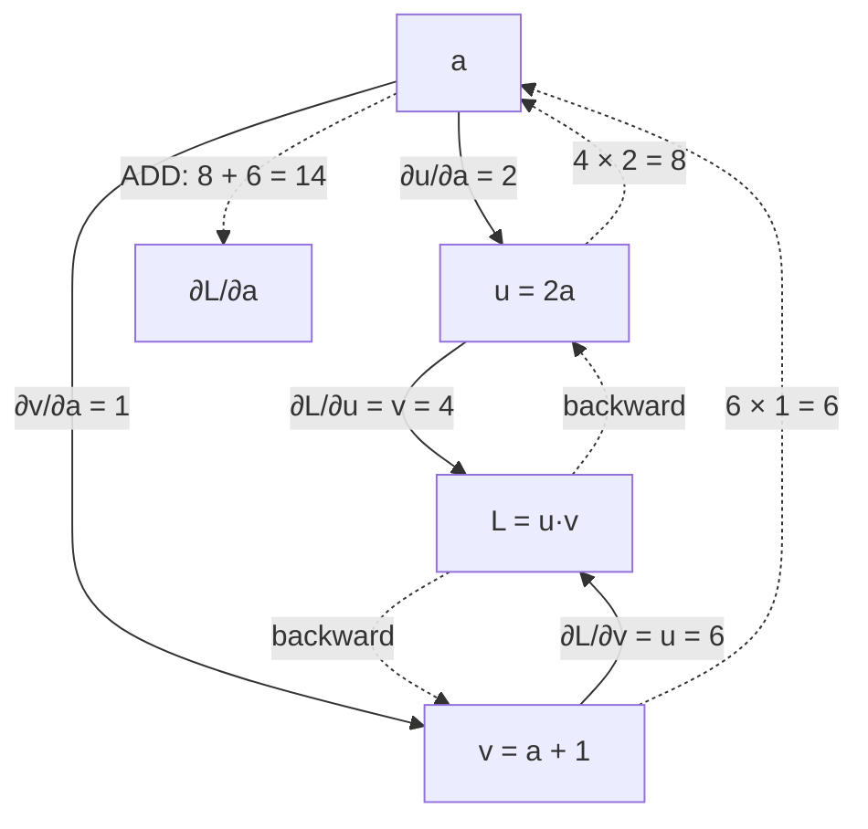

# 1.3 — Partial derivatives, the gradient, and why fan-out means addition

## One-line answer

With several inputs you ask the nudge question once per input while holding the others still — that
collection is the **gradient** — and when one input reaches the output by more than one route, its
sensitivities along those routes are **added**, which is the rule that makes `+=` rather than `=`
correct in an autograd engine.

---

## The story

You run a small tea stall. Two things are yours to decide: what you charge for a cup, and how late you
stay open.

You want to know what each one is worth. So you do the sensible thing. For one week you raise the
price by one rupee and keep your hours exactly the same, and you see what happens to your earnings.
The next week you put the price back and stay open one hour longer instead. Two experiments, two
numbers, and each number is honest about one thing only because everything else was held still.

Then you notice something about the price.

Raising the price by a rupee does two things at the same time. Every cup you sell brings in one more
rupee, which is good. And a few regulars start going to the stall down the road, so you sell fewer
cups, which is bad. Both effects come from the same decision. They travel through different parts of
the stall — one through the till, one through the queue — and they both land on the same figure at the
end of the day.

The right thing to do with two effects of one decision is not to pick the bigger one, and not to
average them. It is to **add** them, because the total change is what route one did plus what route
two did.

If you counted only the extra rupee per cup, you would conclude that raising the price is free money,
and you would keep raising it until nobody came at all.
---

## The idea in plain language

When a function has several inputs, `f(x, y, z)`, the nudge question from part
[1.1](1.1-the-slope-from-the-definition.md) has to name which input is being nudged.

A **partial derivative** `∂f/∂x` is the answer to "nudge `x` by a tiny amount, hold every other input
exactly still, how much does `f` move per unit of nudge?" The symbol `∂` (a curly d) is used instead of
`d` purely to signal that other inputs exist and are being held. There is no new idea in it — the
computation is identical to part 1.1's, applied to one variable at a time.

The **gradient** is the list of all the partials, one per input, written `∇f`:

> `∇f = [∂f/∂x, ∂f/∂y, ∂f/∂z]`

Two properties of it are what training uses:

- **It has the same shape as the inputs.** A model with twelve million parameters has a gradient with
  twelve million entries — one number per parameter, saying how much the loss would move if that
  parameter moved. This is why a gradient costs as much memory as the parameters themselves, which is
  a line in Day 66's memory budget.
- **It points uphill.** Of all directions you could step, the gradient direction increases `f` fastest.
  So to *decrease* `f` you step against it, which is the minus sign in `w ← w − lr·∇L`.

And then the rule this part exists for. Suppose `a` feeds into `u` and also into `v`, and both `u` and
`v` feed into `L`. `a` has two routes to `L`. The **multivariable chain rule** says:

> `∂L/∂a = (∂L/∂u)(∂u/∂a) + (∂L/∂v)(∂v/∂a)`

**One term per route, and the terms are added.** Along a single route the sensitivities multiply (part
[1.2](1.2-the-chain-rule.md)); across parallel routes they add. Those two rules together —
multiply along, add across — are the whole of differentiation for any expression you will ever write.

The word for one value being used in more than one place is **fan-out**. Fan-out in the forward
direction becomes **addition** in the backward direction, always, with no exceptions. Part
[2.4](../02-the-autograd-engine/2.4-accumulate-never-assign.md) is what happens when an engine forgets
this.

---

## Why Akshara needs it

- **Day 3 part [2.4](../02-the-autograd-engine/2.4-accumulate-never-assign.md)** is a deliberate
  failure built entirely on this rule: an engine that assigns instead of accumulating gets `x·x`
  wrong, and the measured answer is 3 where the truth is 6.
- **Day 4** derives `∂L/∂W` for a linear layer. Every weight in `W` feeds many outputs, so its gradient
  is a **sum** over all of them — that sum is where the matmul in the backward pass comes from.
- **Day 36**'s residual connection is fan-out by construction: the stream goes both through the block
  and around it, so its gradient is the sum of two terms, one of which has derivative exactly 1. The
  whole benefit is a consequence of the addition rule.
- **Day 18**'s embedding gradient: a token that appears five times in a batch has five routes to the
  loss, so its embedding row accumulates five contributions. Implementing that as an assignment
  instead of an accumulation is a real and common bug, and it silently trains only on the last
  occurrence.
- **Day 8** consumes `∇L` and needs it to be the same shape as the parameters, which is the first
  property above.

---

## The mechanism

Two partials, each holding the other input still:

```python
def f(x: float, y: float) -> float:
    return x * y + x * x


x0, y0, h = 2.0, -3.0, 1e-6

dfdx_analytic = y0 + 2 * x0                          # d/dx (xy + x²) = y + 2x
dfdy_analytic = x0                                   # d/dy (xy + x²) = x

dfdx_numeric = (f(x0 + h, y0) - f(x0 - h, y0)) / (2 * h)
dfdy_numeric = (f(x0, y0 + h) - f(x0, y0 - h)) / (2 * h)

print("df/dx  analytic", dfdx_analytic, " numeric", dfdx_numeric)
print("df/dy  analytic", dfdy_analytic, " numeric", dfdy_numeric)
```

**Line by line:**
- In `dfdx_numeric`, `y0` appears unchanged in both evaluations. **That is what "holding the others
  still" means in code** — the nudge is applied to exactly one argument.
- `d/dx (xy)` is `y`, because with `y` held still `xy` is just a constant times `x`. `d/dx (x²)` is
  `2x` from part 1.1's table. They add, by the sum rule.
- `d/dy (xy + x²)` is `x`, because `x²` does not contain `y` at all and so contributes nothing. **A
  partial derivative with respect to a variable that does not appear is zero** — obvious, and the
  reason a gradient is mostly zeros for a sparse operation like an embedding lookup.
- On this machine (Intel Core i3-1115G4, CPython 3.12.10, 2026-08-26) it prints
  `df/dx analytic 1.0 numeric 1.000000000139778` and
  `df/dy analytic 2.0 numeric 2.000000000279556`.

**Now the fan-out, which is the point of the document.** One input, two routes:

```python
def L(a: float) -> float:
    u = 2.0 * a                # route 1
    v = a + 1.0                # route 2
    return u * v               # both routes arrive here


a0, h = 3.0, 1e-6

# by route, then added
dL_du, du_da = (a0 + 1.0), 2.0        # ∂L/∂u = v ; ∂u/∂a = 2
dL_dv, dv_da = (2.0 * a0), 1.0        # ∂L/∂v = u ; ∂v/∂a = 1
route_1 = dL_du * du_da
route_2 = dL_dv * dv_da

print("route via u :", route_1)
print("route via v :", route_2)
print("sum         :", route_1 + route_2)
print("numeric     :", (L(a0 + h) - L(a0 - h)) / (2 * h))
```

**Line by line:**
- `∂L/∂u = v` and `∂L/∂v = u` are the product rule from part 1.1: when differentiating `u·v` with
  respect to one factor, the answer is the other factor.
- `du_da = 2` and `dv_da = 1` are the two local rates, each computed without reference to the other
  route.
- `route_1` and `route_2` are each a product **along** a path — part 1.2's rule.
- `route_1 + route_2` is the sum **across** paths — this part's rule.
- Measured on this machine, 2026-08-26: `route via u : 8.0`, `route via v : 6.0`, `sum : 14.0`,
  `numeric : 14.000000001956892`. The true answer is `4a + 2 = 14`.
- **Take either route alone and you get 8 or 6, both wrong, both plausible.** Neither is off by a
  factor that would look suspicious in a training log. That is the failure mode part 2.4 reproduces.

The two rules, drawn together, because this diagram is the whole of backpropagation:



**Multiply along an arrow. Add where arrows meet.** Everything else in this day is bookkeeping.

The gradient as a vector, and the claim that it points uphill:

```python
def g(x: float, y: float) -> float:
    return x * x + 3.0 * x * y + y * y


px, py, lr = 1.0, 2.0, 0.01
grad = (2 * px + 3 * py, 3 * px + 2 * py)            # ∇g at (px, py)

print("grad        :", grad)
print("g here      :", g(px, py))
print("g downhill  :", g(px - lr * grad[0], py - lr * grad[1]))
print("g uphill    :", g(px + lr * grad[0], py + lr * grad[1]))
```

**Line by line:**
- `grad` is a tuple with one entry per input — the same "shape" as the input, which is the first
  property from above.
- `g downhill` steps **against** the gradient by a small multiple `lr`. `g uphill` steps with it. The
  step size is deliberately small, because the gradient is a *local* statement and only describes the
  function near where you are standing.
- Measured on this machine, 2026-08-26: `grad (8.0, 7.0)`, `g here 11.0`, `g downhill 9.8981`,
  `g uphill 12.158100000000001`. Down went down, up went up.
- **That three-line experiment is the cheapest possible test of a gradient's sign**, and it is worth
  writing into every training loop you build from Day 25 onward: compute the loss, take one step,
  compute it again. Day 8 formalises it.

---

## When it breaks

The loud one — asking for a partial with respect to something that is not an input:

```console
>>> def f(x, y): return x * y
>>> h = 1e-6
>>> (f(2 + h, -3, 1) - f(2 - h, -3, 1)) / (2 * h)
Traceback (most recent call last):
  File "<stdin>", line 1, in <module>
TypeError: f() takes 2 positional arguments but 3 were given
```

Trivial in this form and decidedly not trivial in a real model, where "which things are inputs" is a
genuine question: the parameters are inputs to the loss, the data is not (you do not want `∂L/∂data`),
and a mistake in that boundary is how a training loop ends up computing gradients for tensors it
should have detached. That boundary is Day 51's subject.

**The silent version, and it is this part's entire reason for existing: a missing route.** Nothing
raises. You get `8.0` instead of `14.0`, or `6.0` instead of `14.0` — a real number of the right sign
and roughly the right magnitude.

What a training run does with a gradient that is missing a route:

- It still trains. The direction is not random; it is one component of the correct direction.
- The loss still falls, because a partly-correct direction is usually still downhill.
- The model converges to something worse, more slowly, and no diagnostic in a normal training loop
  distinguishes it from "this task is hard" or "the learning rate needs tuning".

The check is the one Day 4 makes into a whole curriculum ID — **gradient checking** — and its whole
value is that it is independent of your derivation:

```python
def grad_check(f, args: list[float], i: int, analytic: float, h: float = 1e-5) -> float:
    """Relative error between an analytic partial and a central difference."""
    up, down = list(args), list(args)
    up[i] += h
    down[i] -= h
    numeric = (f(*up) - f(*down)) / (2 * h)
    return abs(analytic - numeric) / max(1e-12, abs(analytic) + abs(numeric))
```

**Line by line:**
- `up` and `down` are **copies** — `list(args)` — so nudging one does not disturb the other. Mutating
  `args` in place here would be the aliasing bug from Day 2 part
  [1.5](../../../day-002-tensors-shape-stride/parts/01-what-a-tensor-is/1.5-the-view-that-changed-the-original.md),
  and it would silently compare the function against itself.
- Only index `i` is nudged; every other argument is passed through untouched. That is the definition
  of a partial derivative, expressed as code.
- The return is a **relative** error, normalised by the sum of the magnitudes rather than by one of
  them, so it behaves when either value is near zero. Part
  [1.5](1.5-the-finite-difference-that-lied.md) explains why relative and not absolute, and Day 4 fixes
  the threshold.
- A missing route makes this number large — `abs(14 − 8)/22 ≈ 0.27`, which is not a rounding
  discrepancy and cannot be argued away. **That unmissability is the point**: the failure is silent in
  the training loop and screaming in the gradient check, so the check is where you spend your
  attention.

---

## In production

**What a research engineer writes instead of the teaching version.** Nothing by hand — the framework
accumulates gradients across fan-out automatically, and that is exactly what the `+=` in every
autograd implementation is doing. What they carry is the *reflex*: when a tensor is used twice, its
gradient has two contributions, and when a custom backward pass is written, the first review question
is "does this handle the case where the input is used more than once?" It is also why frameworks
expose an explicit "zero the gradients" step rather than clearing automatically — the engine cannot
tell the difference between the accumulation it is supposed to do (fan-out) and the accumulation it is
not (the previous step's leftovers), so the decision is handed to you. Part
[2.5](../02-the-autograd-engine/2.5-zero-grad-the-state-that-leaks.md) is that trade.

**What degrades at scale.** Memory, straightforwardly: the gradient has one number per parameter, so
it is the same size as the model. Adding the optimizer's own state on top is Day 8's arithmetic, and
the sum is what Day 66 has to fit into a free notebook's VRAM. Nothing about the *rule* degrades — it
is exact at any size.

**The failure that only shows with real data.** A repeated index in a sparse gradient. An embedding
table is indexed by token ids (Day 2 part
[2.2](../../../day-002-tensors-shape-stride/parts/02-broadcasting-and-indexing/2.2-indexing-view-or-copy.md)),
and in real text the same token appears many times in a batch — "the" might appear forty times. Every
occurrence is a route from that embedding row to the loss, so the row's gradient is the sum of forty
contributions. An implementation that *assigns* instead of accumulating trains that row on one
occurrence out of forty. On a toy batch with no repeated tokens the bug is invisible; on real text it
is present in every step, and its effect is concentrated on exactly the most frequent tokens — the
ones that matter most. This is why frameworks provide a dedicated scatter-add for this operation and
why writing it yourself is discouraged.

**The review comment.** *"This tensor is used in two places. Your custom backward returns one term —
where's the other one?"*

**The interview question.** *"A value in your computation graph is consumed by three different
operations. What happens to its gradient?"* The answer is one word — added — and the follow-up that
separates people is *why*: because the total change in the output is the sum of the changes along each
route, which is the multivariable chain rule and not a convention. A strong answer then volunteers the
practical consequence: that this is why gradients accumulate by default and why you must zero them
between steps.

**Compute tier: T0.** All arithmetic on single floats, instant on a laptop. The T0 version proves the
rules exactly — they are algebra. What it does not show is the *cost* of a gradient for a real model,
which is a memory figure rather than a correctness one, and that arrives on Day 66.

---

## Check yourself

Run this. It prints **three numbers, and the third must be the sum of the first two**:

```python
def L(a: float) -> float:
    u = 2.0 * a
    v = a + 1.0
    return u * v


a0, h = 3.0, 1e-6
route_u = (a0 + 1.0) * 2.0        # (∂L/∂u)(∂u/∂a)
route_v = (2.0 * a0) * 1.0        # (∂L/∂v)(∂v/∂a)

print("route via u :", route_u)
print("route via v :", route_v)
print("sum         :", route_u + route_v)
print("numeric     :", (L(a0 + h) - L(a0 - h)) / (2 * h))
print("truth 4a+2  :", 4 * a0 + 2)
```

**Line by line:**
- It prints `8.0`, `6.0`, `14.0`, `14.000000001956892`, `14.0` on this machine, 2026-08-26.
- **Delete either route and the number is still plausible.** Try it: print `route_u` alone as if it
  were the answer, and ask yourself what in a training log would have told you.
- The `numeric` line is the independent check. It agrees with the sum and with neither route alone.

**Say this out loud, without scrolling up:** state the two rules — what happens *along* a path and what
happens *across* paths — and say what a partial derivative with respect to a variable that does not
appear in the expression is equal to.
