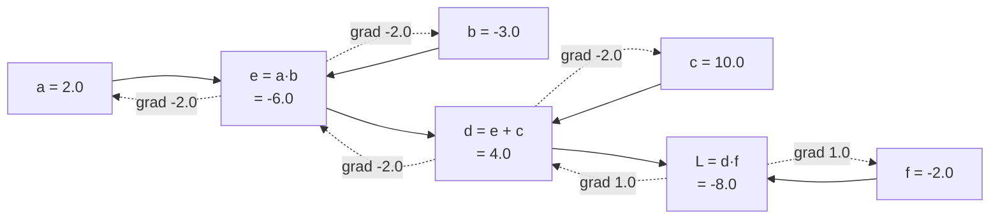

# 1.4 — The graph: forward values, backward sensitivities, and why backwards is cheaper

## One-line answer

Every expression is a graph of small operations; the forward pass fills in a **value** at each node
and the backward pass fills in a **sensitivity** — and going backwards gets every input's derivative
in roughly one pass, while going forwards would need one pass per input.

---

## The story

There is a hill with ten thousand houses on it, and one pond at the bottom. When it rains, water runs
off every roof, down the drains and channels, joins up at junction after junction, and ends in the
pond.

Somebody asks a question about every single house: if this roof sent one extra bucket of water down,
how much would the pond rise?

The first team answers it the direct way. Pick a house. Pour a bucket onto its roof. Walk downhill
after the water, junction by junction, noting what fraction goes down each channel, and measure what
arrives at the pond. That is one house answered. Ten thousand houses, ten thousand walks down the
hill.

The second team does something that feels backwards. They start **at the pond** and walk uphill, once.
At every junction they already know how much of that junction's water reaches the pond, so they split
that number among the channels feeding into it, in proportion to how much each one brings. By the time
they have walked the whole hill — one time — every house has a number chalked on its wall.

One walk. Ten thousand answers.

Neither team is cleverer than the other, and both used exactly the same junction-by-junction facts.
The only difference is which direction they walked, and it comes out this way because there is **one**
pond and **many** houses. Turn it around — one house, ten thousand ponds — and the first team would be
the efficient one.

A neural network has one loss and a hundred million weights. That is the entire reason the algorithm
is called *back*propagation.
---

## The idea in plain language

Any expression, however long, is built out of tiny operations — an add here, a multiply there. Write
each operation as a **node**, and draw an arrow from each input into the operation that consumes it.
What you get is a **graph**: nodes for values, arrows for dependency.

It is a **directed acyclic graph** (a DAG): directed because arrows have a direction, acyclic because
nothing can be its own ancestor. Two terms used constantly from here on:

- The **forward pass** walks the graph from inputs to output, computing a **value** at each node.
  This is just evaluating the expression.
- The **backward pass** walks it from the output back to the inputs, computing at each node a
  **sensitivity**: how much the final output would move per unit of change in *this* node. That
  number is what everybody calls "the gradient at this node", and in code it is the node's `.grad`.

The backward pass uses exactly the two rules from parts [1.2](1.2-the-chain-rule.md) and
[1.3](1.3-partial-derivatives.md), and nothing else:

1. To push a sensitivity **along an arrow**, multiply it by that operation's local derivative.
2. Where several arrows arrive at the same node, **add** their contributions.

And it uses one structural fact, which is the reason the algorithm has to be written carefully:
**a node's sensitivity is not finished until every consumer of that node has contributed.** If `b`
feeds both `c` and `d`, you cannot push `b`'s sensitivity further back until `c` *and* `d` have both
sent theirs. That ordering requirement is part
[2.3](../02-the-autograd-engine/2.3-topological-order.md), and violating it is measured there at a
gradient of `14.0` where the truth is `8.0`.

**Why backwards rather than forwards.** Part 1.2 noted that the chain rule's product can be evaluated
in either order. Concretely:

- **Forward mode** starts at one input and pushes forward: "if *this* input moves, how does everything
  downstream move?" One sweep answers that for **one input**, and for all outputs at once.
- **Reverse mode** starts at one output and pulls backward: "how sensitive is *this* output to
  everything upstream?" One sweep answers that for **all inputs**, and for one output.

So the choice is decided by the shape of the problem. Many inputs and one output — a loss — makes
reverse mode cheaper by roughly the number of inputs. Few inputs and many outputs would flip it. The
loss being a single number is not an aesthetic choice; it is what makes training affordable.

---

## Why Akshara needs it

- **Day 3 section 2** implements exactly this: `Value` nodes holding a value and a `grad`, a
  `_backward` closure per operation implementing rule 1, `+=` implementing rule 2, and a topological
  sort enforcing the ordering fact.
- **Day 51** builds the real training loop, where the forward pass's stored values are the
  *activations* — and their memory cost is the reason activation checkpointing exists on Day 82.
- **Day 82** trades compute for memory by *discarding* forward values and recomputing them during the
  backward pass. That trade is only expressible once you know the backward pass needs the forward
  values at all, which is the observation below.
- **Day 34** counts attention's memory, and most of it is stored forward values waiting for the
  backward pass.
- **Day 4** is the same walk done with matrices instead of scalars.

---

## The mechanism

Take a small expression and do both passes by hand. `L = (a·b + c) · f`, at `a = 2`, `b = −3`,
`c = 10`, `f = −2`:



The forward pass fills the solid arrows left to right: `e = 2 × −3 = −6`, `d = −6 + 10 = 4`,
`L = 4 × −2 = −8`.

The backward pass fills the dotted arrows right to left, and it is four applications of rule 1:

| Node | Local derivative | Incoming sensitivity | This node's sensitivity |
| --- | --- | --- | --- |
| `L` | — (this is the output) | — | `1.0` by definition |
| `d` | `∂L/∂d = f = −2` | `1.0` | `−2.0` |
| `f` | `∂L/∂f = d = 4` | `1.0` | `4.0` |
| `e` | `∂d/∂e = 1` (an add) | `−2.0` | `−2.0` |
| `c` | `∂d/∂c = 1` (an add) | `−2.0` | `−2.0` |
| `a` | `∂e/∂a = b = −3` | `−2.0` | `6.0` |
| `b` | `∂e/∂b = a = 2` | `−2.0` | `−4.0` |

`L`'s own sensitivity is `1.0` because it is the sensitivity of `L` to itself: nudge `L` by one, `L`
moves by one. That seeding is the only thing the backward pass needs to get started, and it is the
`self.grad = 1.0` line in every autograd implementation.

Two things to notice in the table, because they are the entire content of the next section:

- **An addition passes its sensitivity through unchanged.** `∂d/∂e = 1` and `∂d/∂c = 1`, so both `e`
  and `c` receive `−2.0`. An add is a *router*: it copies the incoming gradient to each input.
- **A multiplication swaps in the other operand.** `∂e/∂a = b`, not `a`. So the backward pass of a
  multiply **needs the forward value of the other input.** That is why the graph must remember its
  values, why activations dominate training memory, and why Day 82 has something to trade.

Now measure the cost claim, because "reverse mode is cheaper" is exactly the kind of sentence
Principle 8 says not to write without a number. The comparison is a scalar autograd backward pass
against the numerical alternative — one central difference per input, from part
[1.1](1.1-the-slope-from-the-definition.md):

```python
import math
import time


def bench(n: int, rng) -> tuple[float, float, float]:
    """Reverse mode once, versus 2n numerical evaluations. Returns (t_rev, t_num, max_rel_err)."""
    scale = 1.0 / math.sqrt(n)
    raw_w = [float(v) * scale for v in rng.standard_normal(n)]
    xs = [float(v) for v in rng.standard_normal(n)]

    ws = [Value(v) for v in raw_w]
    t0 = time.perf_counter()
    s = Value(0.0)
    for w, x in zip(ws, xs, strict=True):
        s = s + w * x
    loss = (s.tanh()) ** 2
    loss.backward()
    t_rev = time.perf_counter() - t0
    reverse = [w.grad for w in ws]

    def f(raw: list[float]) -> float:
        total = 0.0
        for w, x in zip(raw, xs, strict=True):
            total += w * x
        return math.tanh(total) ** 2

    h = 1e-6
    t0 = time.perf_counter()
    numeric = []
    for i in range(n):
        up, down = raw_w[:], raw_w[:]
        up[i] += h
        down[i] -= h
        numeric.append((f(up) - f(down)) / (2 * h))
    t_num = time.perf_counter() - t0

    err = max(abs(a - b) / max(1e-12, abs(a) + abs(b)) for a, b in zip(reverse, numeric, strict=True))
    return t_rev, t_num, err
```

**Line by line:**
- `scale = 1.0 / math.sqrt(n)` divides the weights by the square root of the input count. **This is
  not cosmetic and the first attempt at this measurement omitted it and produced nonsense.** Without
  it, the pre-activation sum grows with `n`, `tanh` saturates towards ±1, its derivative `1 − tanh²`
  collapses towards zero, and the relative-error check compares two near-zero numbers and reports
  `1.00e+00`. Measured on this machine, 2026-08-26: at `n = 400` the unscaled version had
  `1 − tanh² = 1.699e-01` and a max relative error of `1.00e+00`, which is a measurement artefact and
  not a bug in either method. The `1/√n` scaling is the standard initialization idea that Day 8 and
  Day 51 formalise, and meeting it here as *the thing that makes the measurement work at all* is a
  better introduction than meeting it as a rule.
- `loss.backward()` is one traversal. Everything after `t_rev` has all `n` gradients in hand.
- The numerical loop runs `2n` full evaluations of `f`. There is no way to share work between them:
  each one nudges a different input.
- `zip(..., strict=True)` throughout, for the reason Day 2 part
  [1.1](../../../day-002-tensors-shape-stride/parts/01-what-a-tensor-is/1.1-the-array-that-is-flat.md)
  gave: a length mismatch here would silently truncate and compare a shorter gradient.
- The error is relative and normalised by the sum of magnitudes, exactly as part
  [1.3](1.3-partial-derivatives.md) defined it.

Its actual output on Intel Core i3-1115G4 (2 cores / 4 threads), 11.7 GB RAM, Windows 11,
CPython 3.12.10, numpy 2.5.2 (used only to generate the inputs), seed 1337, 2026-08-26:

```text
  n=  10  reverse=   0.135 ms  numerical=    0.062 ms  ratio=   0.5x  max rel err=5.28e-10
  n=  50  reverse=   0.230 ms  numerical=    0.225 ms  ratio=   1.0x  max rel err=2.31e-09
  n= 100  reverse=   0.357 ms  numerical=    0.754 ms  ratio=   2.1x  max rel err=1.38e-09
  n= 200  reverse=   1.228 ms  numerical=    3.213 ms  ratio=   2.6x  max rel err=3.67e-07
  n= 400  reverse=   2.418 ms  numerical=   12.953 ms  ratio=   5.4x  max rel err=2.49e-07
  n= 800  reverse=   6.117 ms  numerical=   46.005 ms  ratio=   7.5x  max rel err=2.26e-08
```

Three honest readings, in order of importance:

**The ratio grows with `n`, which is the prediction.** At `n = 10` reverse mode is *slower*; by
`n = 800` it is 7.5× faster, and the trend has not flattened. That is the shape the theory predicts:
reverse mode's cost grows like `n` (the graph has `n` nodes) while the numerical method's grows like
`n²` (`n` partials, each costing an `n`-term evaluation).

**But the ratio is nowhere near `n`.** At `n = 800` the theory's headline factor would be in the
hundreds and the measurement says 7.5. That gap is real and it is not the theory being wrong: this
scalar engine is written in Python with an object per node, so it pays an enormous constant that the
numerical loop — plain float arithmetic — does not. **The measurement establishes the trend; it does
not establish the constant**, and quoting "backprop is `n` times faster" as a measured fact off the
back of this table would be exactly the rumour Principle 8 forbids. The honest statement is: the
advantage grows with the number of parameters, on this machine, in this implementation.

**Both methods agree to about 1 part in 10⁷ to 10⁹.** They are computing the same quantity by
completely different routes, and that agreement is what makes the numerical method useful as a *test*
even though it is useless as a *method*. Day 4 turns this into a formal gradient check.

---

## When it breaks

The loud one, and it is the characteristic failure of a graph that is deeper than the interpreter
expects:

```console
>>> import sys
>>> sys.setrecursionlimit(1000)
>>> v = Value(1.0)
>>> for _ in range(5000):
...     v = v + 1.0
...
>>> v.backward()
Traceback (most recent call last):
  File "<stdin>", line 1, in <module>
  File "<stdin>", line 8, in backward
  File "<stdin>", line 5, in build
  File "<stdin>", line 5, in build
  [Previous line repeated 995 more times]
RecursionError: maximum recursion depth exceeded
```

The topological sort in part [2.3](../02-the-autograd-engine/2.3-topological-order.md) is written
recursively, and a graph 5000 nodes deep needs 5000 stack frames. The smallest fix is to raise the
recursion limit; the *right* fix is an iterative traversal, which is one of that part's `TODO(me)`
items. This is worth meeting now because a real model's graph is deep — one node per operation per
layer per timestep — and "it worked on the toy expression" is exactly the kind of evidence this
curriculum distrusts.

**The silent version: a graph that is not the graph you think it is.** Nothing raises. Somewhere in
the forward pass a value is turned into a plain Python float — by `float(x)`, by a comparison, by
`round()`, by being put into a formatted string and parsed back — and from that point on it is no
longer a node. The graph is **severed**: everything upstream of that point receives no gradient at
all, and everything downstream still computes fine.

What you see is a model where some parameters never change:

```python
before = [w.data for w in ws]
# ... one training step ...
unmoved = sum(1 for w, b in zip(ws, before, strict=True) if w.data == b)
print(f"{unmoved} of {len(ws)} parameters did not move at all")
```

**Line by line:**
- Comparing with `==` is correct here and only here: the question is not "did it move much" but "did
  it move *at all*", and a parameter with a genuinely zero gradient is exactly what you are hunting.
- Run this once, after the first step, on a fresh model. On a healthy graph the count is `0` or very
  near it. Any large number is a severed graph or a parameter genuinely not used by the loss, and both
  are things you want to know at step 1 rather than at step 40,000.
- The equivalent in a framework is checking that every parameter has a non-`None` gradient after the
  first backward pass. It is two lines, it goes in every training loop from Day 51, and it catches a
  class of bug that produces no other symptom.

---

## In production

**What a research engineer writes instead of the teaching version.** They do not build graphs by hand;
the framework does it while the forward pass runs. What they carry is the *memory* consequence, which
is the practical face of this document. Every intermediate value the backward pass will need is alive
from the moment it is computed until the moment it is consumed going back — so peak memory is
determined by the *widest point of the graph*, not by the model's parameter count. That is why
activation memory usually dominates parameter memory during training, and why the first response to
an out-of-memory error is to reduce the batch size rather than the model.

**What degrades at scale.** Stored activations, linearly in batch size, sequence length and depth all
at once. A `(B, T, C)` tensor at every layer, kept for the backward pass, is `L × B × T × C` numbers
alive simultaneously. Day 82's activation checkpointing throws most of them away and recomputes them
during the backward pass — trading roughly 30% more compute for a large memory saving. That trade is
only available because of the observation in the mechanism section: the backward pass needs forward
*values*, and values can either be stored or recomputed.

**The failure that only shows with real data.** Graph growth across steps. In a loop, if a tensor from
step `k` is kept alive in a list — for logging, for a running average — and that tensor is still
attached to its graph, then step `k + 1`'s graph is joined to step `k`'s, and the whole history stays
in memory. Memory climbs steadily, the first few hundred steps look fine, and the run dies later with
an out-of-memory error whose traceback points at an innocent line. The fix is to detach the value
before storing it, and part
[3.2](../03-scaling-up/3.2-the-graph-that-was-never-freed.md) reproduces the whole thing on a laptop.

**The review comment.** *"You're appending the loss tensor to a list. Is that detached? If not, you're
keeping every step's graph alive."*

**The interview question.** *"Why is it called backpropagation — why not forward?"* The strong answer
is the pond: reverse mode gets all inputs' sensitivities for one output in one sweep, forward
mode gets one input's for all outputs, and a loss is a single number with millions of parameters
behind it, so reverse mode wins by roughly the parameter count. A very strong answer adds that the
choice would flip if you wanted the sensitivity of many outputs to one input — which is what forward
mode is genuinely used for, in Jacobian-vector products.

**Compute tier: T0.** Every measurement here is a laptop CPU measurement of a pure-Python engine. The
T0 version proves the **structure** — that a backward pass is one traversal, that the sensitivities
agree with an independent numerical method to 7–9 digits, and that the advantage grows with `n`. It
proves nothing about the *constant*, which is dominated by this implementation's Python overhead and
would be entirely different in a real framework. That is stated in the mechanism section rather than
buried here, because it is the kind of caveat that gets dropped when a number is quoted onwards.

---

## Check yourself

Run this against the engine you build in section 2. It prints **seven numbers**, and every one must
match the table above:

```python
a, b, c, f = Value(2.0), Value(-3.0), Value(10.0), Value(-2.0)
e = a * b
d = e + c
loss = d * f
loss.backward()

for name, node in [("L", loss), ("d", d), ("f", f), ("e", e), ("c", c), ("a", a), ("b", b)]:
    print(f"{name}: value {node.data:6.1f}   grad {node.grad:6.1f}")
```

**Line by line:**
- It prints values `-8, 4, -2, -6, 10, 2, -3` and gradients `1, -2, 4, -2, -2, 6, -4`.
- **Work out `a`'s gradient on paper before you run it**, using the two rules: multiply along the
  arrow, add where arrows meet. `a` has one route, so it is `∂L/∂d × ∂d/∂e × ∂e/∂a = 1 × (−2) ×
  (−3) = 6`.
- Notice that `c` and `e` have the **same** gradient, `−2.0`. Say why out loud — it is the property of
  addition that makes it the simplest backward pass there is.
- Now change `d = e + c` to `d = e + c + c` and predict `c`'s new gradient before running.

**Say this out loud, without scrolling up:** explain, using one pond and ten thousand houses, why
the backward direction is the cheap one — and say what would have to be true about a problem for the
forward direction to be cheaper instead.
