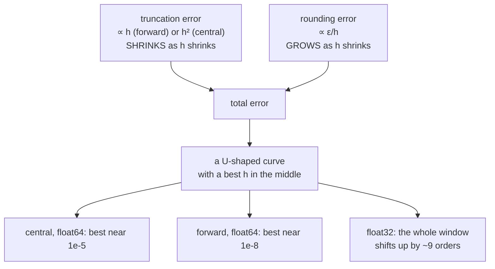

# 1.5 — 💥 The finite difference that lied

## One-line answer

"Make `h` smaller and the answer gets better" is true down to about `10⁻⁵` and then **false**: below
that, subtracting two nearly-equal floats destroys the digits you were trying to measure, and at
`h = 10⁻¹⁶` the measured derivative of `sin` is exactly `0.0`.

---

## The story

You want to know how much your phone weighs, and the only scale in the house is the bathroom scale.

So you step on it: 68 kg. You step on it again holding the phone: 68 kg. You subtract, and you
conclude that the phone weighs nothing.

The scale is not broken, and your arithmetic is not wrong. The bathroom scale rounds to the nearest
half kilogram, and your phone weighs about 200 grams. Every digit that could have told you the answer
was rounded away *before* you did the subtraction.

Put the phone on a kitchen scale on its own and it reads 200 g. Same phone, same house, a perfectly
ordinary answer.

The instrument was never the problem. The **method** was: you tried to measure a small thing as the
difference between two big ones.
---

## The idea in plain language

Part [1.1](1.1-the-slope-from-the-definition.md) said the difference quotient gets better as `h`
shrinks, and it showed the error for `x²` being exactly `h`. That is one of **two** errors in play, and
they move in opposite directions.

**Truncation error** — because `h` is not zero. The secant is not the tangent. For the one-sided
(forward) difference this error is proportional to `h`; for the two-sided (central) difference the
first-order terms cancel and it is proportional to `h²`. This error **shrinks** as `h` shrinks, and it
is the one everybody knows about.

**Rounding error** — because `f(x + h)` and `f(x − h)` are floats. When `h` is small the two values
agree in most of their digits, so their difference keeps only the few digits where they disagree. Then
you divide by a tiny `h`, which magnifies whatever noise survived. This error **grows** as `h`
shrinks, and it is the one that surprises people.

The sum of a decreasing curve and an increasing one has a minimum, and that is why the measured error
below is a **U**. There is a best `h`, it is nowhere near as small as intuition suggests, and going
past it makes things worse — eventually catastrophically.

The name for the mechanism behind the rising side is **catastrophic cancellation**: subtracting two
nearly-equal floating-point numbers, where the leading digits cancel exactly and what remains is
mostly the rounding error of the inputs. The bathroom scale is the same phenomenon with
kilograms instead of bits, and the fix is the same in both cases — **do not compute a small quantity as
the difference of two large ones** if you can avoid it.

One more failure that is not about `h` at all: a function with a **corner**. At a point where the
derivative does not exist, the central difference happily returns the average of the two one-sided
slopes — a number that is not wrong so much as meaningless, and that no amount of shrinking `h` will
fix.

---

## Why Akshara needs it

- **Day 4** (MATH-07) is gradient checking: proving a hand-written backward pass with finite
  differences. That method **is** this document's method, and using it without knowing where its
  usable range is produces either false alarms or false confidence. The relative-error threshold Day 4
  picks comes from this measurement.
- **Day 7** (MATH-13, MATH-14) is the numerical-reality day, and cancellation is its central
  mechanism. The stable softmax exists because of the same arithmetic seen here.
- **Day 35** introduces ReLU, whose corner at zero is the second failure below. Every network built
  since runs gradient descent through that corner by convention, and knowing it is a convention
  matters.
- **Day 51** puts a gradient check into the test suite. A check with a badly chosen `h` is a flaky
  test, and a flaky test in this repository is indistinguishable from Silent Failure #4 and must be
  fixed, never re-run.

---

## The mechanism

Sweep `h` across sixteen orders of magnitude on a function whose derivative is known exactly.
`f(x) = sin(x)` at `x = 1.2`, whose true derivative is `cos(1.2) = 0.3623577544766736`:

```python
import math


def f(x: float) -> float:
    return math.sin(x)


x0 = 1.2
true = math.cos(x0)

print(f"{'h':>10} | {'forward diff':>22} {'rel err':>10} | {'central diff':>22} {'rel err':>10}")
h = 1e-1
for _ in range(16):
    forward = (f(x0 + h) - f(x0)) / h
    central = (f(x0 + h) - f(x0 - h)) / (2 * h)
    ef = abs(forward - true) / abs(true)
    ec = abs(central - true) / abs(true)
    print(f"{h:10.0e} | {forward:22.16f} {ef:10.2e} | {central:22.16f} {ec:10.2e}")
    h /= 10
```

**Line by line:**
- `sin` is chosen because its derivative is `cos` exactly, with no derivation to get wrong — the
  reference is not in question, so anything the table shows is the method's fault.
- `x0 = 1.2` is deliberately not a special point. At `x = 0`, `sin` is odd and the central difference
  is unnaturally accurate; a benchmark chosen at a symmetric point flatters the method.
- The **forward** difference uses `f(x0)` and one step. The **central** difference uses two steps and
  no centre point — so it costs the same two evaluations and is strictly better, which is why every
  gradient checker uses it.
- Errors are printed as **relative** (`|estimate − true| / |true|`), not absolute. A relative error is
  comparable across functions of different magnitudes, which is exactly what a gradient check needs
  when different parameters have wildly different gradient sizes.
- `h /= 10` rather than a list, so the sweep spans `10⁻¹` to `10⁻¹⁶` without anyone typing sixteen
  literals.

Its actual output on Intel Core i3-1115G4 (2 cores / 4 threads), 11.7 GB RAM, Windows 11,
CPython 3.12.10, 2026-08-26 — `float64` throughout:

```text
         h |           forward diff    rel err |           central diff    rel err
----------------------------------------------------------------------------------
     1e-01 |     0.3151909944996667   1.30e-01 |     0.3617541267787883   1.67e-03
     1e-02 |     0.3576915586159690   1.29e-02 |     0.3623517152109679   1.67e-05
     1e-03 |     0.3618916745795620   1.29e-03 |     0.3623576940836593   1.67e-07
     1e-04 |     0.3623111519190925   1.29e-04 |     0.3623577538730549   1.67e-09
     1e-05 |     0.3623530942853392   1.29e-05 |     0.3623577544742406   6.71e-12
     1e-06 |     0.3623572885080861   1.29e-06 |     0.3623577544686895   2.20e-11
     1e-07 |     0.3623577082834117   1.27e-07 |     0.3623577543576672   3.28e-10
     1e-08 |     0.3623577549127787   1.20e-09 |     0.3623577549127787   1.20e-09
     1e-09 |     0.3623578104239299   1.54e-07 |     0.3623577549127787   1.20e-09
     1e-10 |     0.3623579214462324   4.61e-07 |     0.3623579214462324   4.61e-07
     1e-11 |     0.3623656930074047   2.19e-05 |     0.3623601418922816   6.59e-06
     1e-12 |     0.3624878175401136   3.59e-04 |     0.3624323063888823   2.06e-04
     1e-13 |     0.3619327060278010   1.17e-03 |     0.3619327060278010   1.17e-03
     1e-14 |     0.3663735981263016   1.11e-02 |     0.3608224830031758   4.24e-03
     1e-15 |     0.4440892098500626   2.26e-01 |     0.3885780586188047   7.24e-02
     1e-16 |     0.0000000000000000   1.00e+00 |     0.0000000000000000   1.00e+00

best forward: h=1e-08 rel err 1.20e-09
best central: h=1e-05 rel err 6.71e-12
```

Read the two error columns as curves and the whole document is in them.

**Down the top half, the theory holds exactly.** Forward's error divides by 10 each row —
`1.30e-01`, `1.29e-02`, `1.29e-03` — because its truncation error is proportional to `h`. Central's
divides by **100** each row — `1.67e-03`, `1.67e-05`, `1.67e-07`, `1.67e-09` — because its truncation
error is proportional to `h²`. Four rows, four clean factors of a hundred. That is as good as
numerical evidence for a theoretical claim ever gets.

**Then it turns around.** Central's best is at `h = 1e-05` with a relative error of `6.71e-12`, and
`h = 1e-06` is *worse*. The rounding error has taken over. Forward's best is at `h = 1e-08` with
`1.20e-09` — a different optimum, and a thousand times less accurate than central's best.

**And at the bottom it collapses completely.** By `h = 1e-15` the answers are wrong in the first
decimal place. At `h = 1e-16` both methods return exactly `0.0000000000000000`, a relative error of
1.00e+00 — a 100% error, silently, from code that has no bug in it.

Watch the cancellation happen directly, which is the bathroom scale:

```python
for h in (1e-1, 1e-8, 1e-13, 1e-16):
    numerator = math.sin(x0 + h) - math.sin(x0 - h)
    print(f"h={h:8.0e}  f(x+h) - f(x-h) = {numerator!r}")
```

**Line by line:**
- `!r` prints the full repr rather than a rounded form. **Rounding the diagnostic would hide the
  thing being diagnosed**, which is a mistake worth naming: when investigating precision, never print
  with a format spec.
- Measured on this machine, 2026-08-26: `0.07235082535575765`, `7.2471550982555755e-09`,
  `7.238654120556021e-14`, and `0.0`.
- The last one is the whole failure in one value. `sin(1.2 + 1e-16)` and `sin(1.2 - 1e-16)` are **the
  same float**, because `1e-16` is below the spacing between representable numbers near 1.2 —
  `float64`'s epsilon is `2.22e-16`, measured in Day 2 part
  [1.2](../../../day-002-tensors-shape-stride/parts/01-what-a-tensor-is/1.2-dtype-the-width-of-a-number.md).
  Adding it changes nothing, the difference is exactly zero, and dividing zero by `2e-16` is zero.
- Note what this implies for **`float32`**: its epsilon is `1.19e-07`, so the cancellation cliff
  arrives around `h ≈ 10⁻⁷` instead of `10⁻¹⁶`, and the usable window shrinks to roughly `10⁻³` to
  `10⁻⁴`. A gradient check written for `float64` and run on `float32` tensors will fail for reasons
  that have nothing to do with the gradient. This is the single most common way a gradient check is
  misdiagnosed.

The two errors as a picture:



**The second failure, which `h` cannot fix.** A function with a corner:

```python
def relu(x: float) -> float:
    return max(0.0, x)


for x0k in (0.0, 1e-9, -1e-9):
    h = 1e-5
    print(f"x0={x0k:+.0e}  central diff of relu = {(relu(x0k + h) - relu(x0k - h)) / (2 * h)}")
```

**Line by line:**
- At exactly `x = 0`, ReLU's slope is 0 from the left and 1 from the right. There is no derivative.
- Measured on this machine, 2026-08-26: `0.5`, `0.50005`, `0.49994999999999995`. The central
  difference returns **the average of the two one-sided slopes** — and it does so confidently, with no
  indication that it has averaged two different answers rather than measured one.
- `0.5` is not what any framework's ReLU backward pass returns. Implementations pick `0` or `1` at the
  corner by convention. So a gradient check on a ReLU network, at an input that lands near zero, will
  report a mismatch — **and both sides are behaving correctly**. The fix is not to change either one;
  it is to choose gradient-check inputs that stay away from the corners, and to say so in the test.

---

## When it breaks

Everything in this document is the breaking. What follows is the two ways it reaches you.

**The false alarm.** Your backward pass is correct. Your gradient check uses `h = 1e-10` because
smaller felt safer, and it reports a relative error of `4.61e-07` — measured above — against a
threshold of `1e-7`. You spend a day auditing a correct derivation. The wrong-but-running output:

```text
     1e-10 |     0.3623579214462324   4.61e-07 |     0.3623579214462324   4.61e-07
```

**The false confidence, which is far worse.** Your backward pass is wrong — say it is missing one of
two fan-out routes, the failure from part [1.3](1.3-partial-derivatives.md). Your gradient check uses
`h = 1e-16`. Both the analytic and the numerical value come back near zero, the relative error is
small, and **the check passes on a broken gradient.** A test that cannot fail is worse than no test,
because it is also a claim.

The defences, all three of which belong in the same test file:

```python
H = 1e-5          # float64; use ~1e-3 for float32 (see the epsilon argument above)
RTOL = 1e-7       # a threshold chosen from a measured sweep, not from taste


def grad_check(f, args, i, analytic, h=H):
    up, down = list(args), list(args)
    up[i] += h
    down[i] -= h
    numeric = (f(*up) - f(*down)) / (2 * h)
    denom = max(1e-12, abs(analytic) + abs(numeric))
    return abs(analytic - numeric) / denom, numeric
```

**Line by line:**
- `H = 1e-5` is not a taste. It is the measured minimum of the central-difference column above, on
  `float64`, on this machine. **Run the sweep on your own machine and dtype before choosing it** — the
  sweep is fifteen lines and it is the difference between a test you can trust and one you cannot.
- The **central** form, always. It costs the same two evaluations as forward and its usable window is
  three orders of magnitude wider.
- `denom = max(1e-12, |analytic| + |numeric|)` guards the case where both are near zero. Dividing by
  `|analytic|` alone gives a division by zero exactly where you most need an answer, and dividing by
  `|numeric|` alone trusts the less reliable of the two.
- Returning `numeric` alongside the error is not decoration: when a check fails, the first question is
  always "which of the two is the strange one", and having both in the failure message answers it
  without a second run.
- **What is missing and must be added by the caller:** a check that the test point is not near a
  corner, and a check that the gradient is not near zero — both are conditions under which this
  function's answer means nothing. Day 4 makes both explicit.

---

## In production

**What a research engineer writes instead of the teaching version.** They use the framework's own
gradient-checking utility, which handles the `h` selection, the relative-error convention and the
dtype question. What they still have to supply is *judgement*: choosing test inputs away from
non-differentiable points, running the check in `float64` even when the model trains in lower
precision, and treating a failure as a question rather than a verdict. The single most common
production mistake with this tool is running it on `float32` and concluding the gradient is wrong.

**What degrades at scale.** Cost, immediately and fatally. A gradient check costs `2n` forward passes
for `n` parameters, so it is only ever run on a *tiny* instance of an operation — a handful of inputs,
a batch of two — never on the real model. That is fine and it is the intended use: the operation's
correctness does not depend on its size. What does *not* transfer from the small check is anything
about numerical behaviour at scale, which is Day 7's business.

**The failure that only shows with real data.** Gradient checks that pass on random test inputs and
fail on real ones, because real activations land on a corner. Real text batches contain padding, and
padded positions often produce exactly-zero activations, which is exactly where ReLU's corner is. The
check on random data never lands there; the real forward pass lands there constantly. The lesson is
not that the check is useless — it is that "passes the gradient check" and "correct on the data
distribution" are different claims, and Day 4's checklist asks for both.

**The review comment.** *"Your gradient check uses `h=1e-10`. Where did that come from? Run the sweep
and pick the minimum for the dtype you're testing in."*

**The interview question.** *"You compare an analytic gradient against a numerical one and they differ
by 1e-4. Is your gradient wrong?"* The weak answer says yes. The strong answer asks four questions
first: what `h`, what dtype, is the gradient near zero (so the relative error is meaningless), and is
the test point near a non-differentiable kink. Then it says how to settle it — sweep `h` and look for
the U; if the disagreement is flat across the whole sweep, the gradient really is wrong, and if it
moves with `h`, the check is.

**Compute tier: T0.** Every number here is a laptop CPU measurement in `float64`, and — unusually for
this curriculum — the numbers mostly *do* transfer, because they are properties of the IEEE-754
arithmetic rather than of the machine. What does not transfer is the dtype: the entire table shifts by
about nine orders of magnitude in `float32`, and that shift is stated above rather than left for the
reader to discover through a failing test.

---

## Check yourself

Run this. It prints **a column of errors that must go down and then up**, and one value that must be
exactly `0.0`:

```python
import math

x0 = 1.2
true = math.cos(x0)

h = 1e-1
for _ in range(16):
    central = (math.sin(x0 + h) - math.sin(x0 - h)) / (2 * h)
    print(f"h = {h:8.0e}   rel err = {abs(central - true) / abs(true):.2e}")
    h /= 10

print("numerator at h=1e-16:", repr(math.sin(x0 + 1e-16) - math.sin(x0 - 1e-16)))
```

**Line by line:**
- The error column falls to `6.71e-12` at `h = 1e-05` on this machine, 2026-08-26, and then climbs all
  the way back to `1.00e+00`. **Find your machine's minimum and write the `h` down** — it is the value
  your Day 4 gradient check should use.
- The last line prints `0.0`. Two different inputs, one output, and a derivative of nothing. Say why
  before you run it, in terms of `float64`'s epsilon.
- Now change `math.sin` to `lambda t: max(0.0, t)` and `x0` to `0.0`, and re-run. The error column will
  not have a minimum at all, because there is no true value to converge to.

**Say this out loud, without scrolling up:** name the two errors that fight each other as `h` shrinks,
say which direction each one moves — and say what happens to the best `h` when you switch from
`float64` to `float32`, and why.
