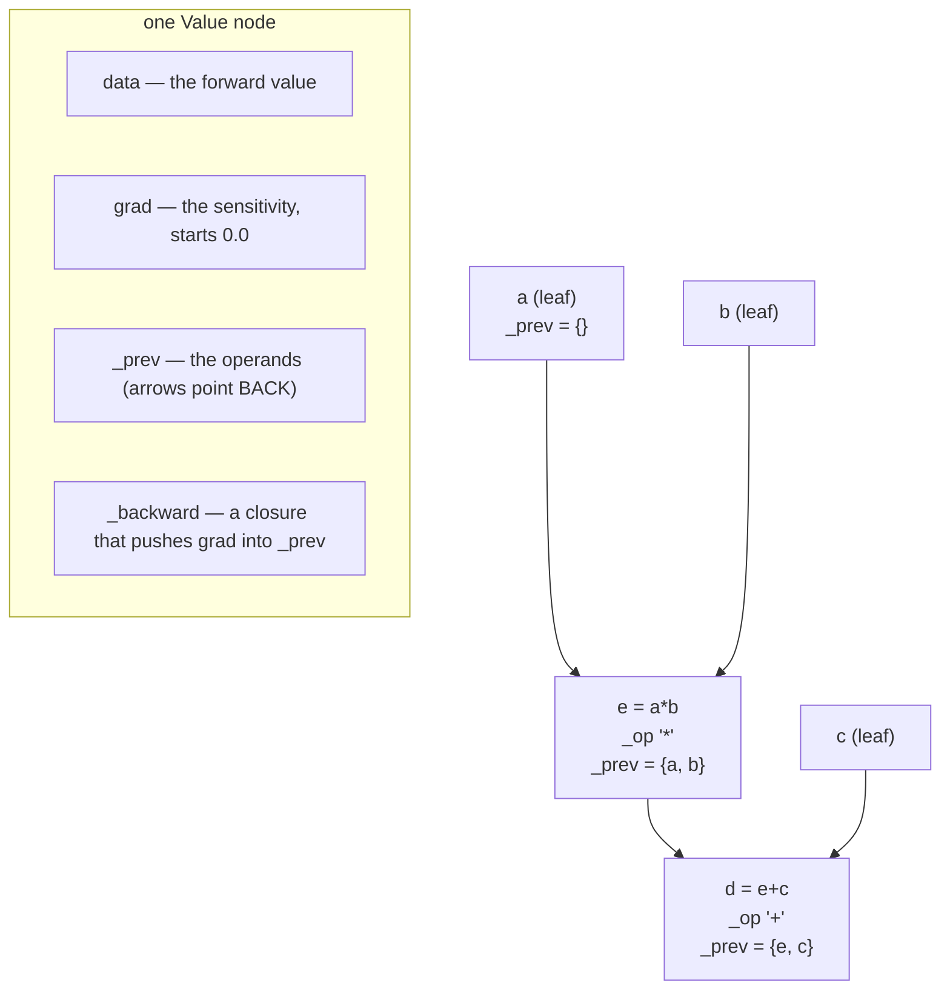

# 2.1 — A `Value` that remembers where it came from

## One-line answer

Replace the plain float with an object that carries three extra things — the gradient slot, the
operands it was built from, and a closure that knows how to push gradient back to them — and an
ordinary Python expression **builds its own computation graph** as a side effect of being evaluated.

---

## The story

Someone hands you a plate of curry and asks what is in it.

You taste it. It is good. But the plate does not tell you which vegetables went in, or in what order,
or how much chilli, or whether the onions were fried first. Every one of those facts was true and
obvious while the cooking was happening, and none of them is present in the food afterwards. To
answer, the cook would have to remember — and the cook has made two hundred plates today.

So the kitchen changes one thing. Every dish now leaves the counter with a small slip tucked under the
bowl, naming the two things that were combined last to make it. The slip costs nothing. The food is
exactly the same food.

Now anybody can pick up a finished plate, read the slip, go and find the two things it names, read
*their* slips, and rebuild the entire recipe backwards, without asking a single person.

Nothing new was discovered. The information was there the whole time; the slip is just the decision to
write it down at the moment it is known, instead of hoping to remember it later.

A plain number is the plate with no slip. Write `a * b + c` and you get a number, and that number has
no idea it was ever `a`, `b` or `c`. This document tucks the slip underneath.
---

## The idea in plain language

Part [1.4](../01-the-derivative/1.4-the-graph-forward-and-backward.md) established that a backward
pass needs a graph: nodes, arrows, and the forward value at each node. The question this part answers
is *where that graph comes from*, and the answer is a small trick.

Python lets a class define what `+` and `*` mean for its instances, through **operator overloading**:
write a method called `__add__` and the interpreter calls it whenever your object appears on the left
of a `+`. So if `a` and `b` are objects of your class, `a * b + c` is three method calls on your
objects, and **your methods get to do whatever they like** — including recording who was involved.

That gives the whole design. A node needs four things:

- **`data`** — the forward value, the number this node currently holds. Without it the expression
  cannot be evaluated at all.
- **`grad`** — a slot for the sensitivity, starting at `0.0` and filled in by the backward pass. It is
  `0.0` and not `None` because part [1.3](../01-the-derivative/1.3-partial-derivatives.md) established
  that fan-out contributions are *added*, so the slot must start at the additive identity.
- **`_prev`** — the nodes this one was built from. These are the arrows, stored pointing *backwards*,
  because the backward pass is the direction that needs them.
- **`_backward`** — a function that, when called, takes this node's `grad` and pushes the appropriate
  share into each of `_prev`'s `grad`. It is written when the node is *created*, by the operation that
  created it, which is part [2.2](2.2-the-local-derivative.md).

Two design decisions in that list are worth stating out loud, because they are what make the whole
thing work:

**The graph is built by the forward pass, not declared in advance.** You do not write down a graph and
then run it. You write ordinary arithmetic, and the graph is the residue. This is called a
*define-by-run* or *dynamic* graph, and it is why a model can contain an `if` or a `while` and still be
differentiable — the graph is whatever actually executed.

**The arrows point backwards.** A node knows its inputs; it does **not** know its consumers. That is
the direction the backward pass travels, so it is the only direction that needs storing — and it is
also why a node cannot tell whether its gradient is finished, which is the problem part
[2.3](2.3-topological-order.md) has to solve.

---

## Why Akshara needs it

- **The whole rest of today** is built on this class. Parts 2.2 through 2.5 add operations, ordering,
  accumulation and state management to exactly this object.
- **Day 4** writes a linear layer's backward pass, and checks it against the numerical method. The
  layer is expressed in these nodes.
- **Day 8** implements gradient descent as `w.data -= lr * w.grad` — which requires `data` and `grad`
  to be separate slots on the same object, and requires the update to touch `data` only. Getting that
  distinction wrong is a real bug, and Day 8 names it.
- **Day 25** trains the first model, whose parameters are these objects and whose loop is
  forward / `backward()` / step / zero.
- **Every framework you will ever use** has this object at its centre with a different name and a
  tensor instead of a float. Recognising it is the point of building it.

---

## The mechanism

The skeleton, with the operations left for the next part:

```python
from __future__ import annotations


class Value:
    """A scalar that remembers the operation and operands that produced it."""

    def __init__(self, data: float, _children: tuple[Value, ...] = (), _op: str = "") -> None:
        self.data = float(data)          # the forward value
        self.grad = 0.0                  # the sensitivity, filled in by backward()
        self._backward = lambda: None    # how to push grad to _prev; set by the operation
        self._prev = set(_children)      # the arrows, pointing back at the operands
        self._op = _op                   # a label, for printing the graph

    def __repr__(self) -> str:
        return f"Value(data={self.data:.4f}, grad={self.grad:.4f})"
```

**Line by line:**
- `from __future__ import annotations` lets the type hints mention `Value` inside its own body without
  quoting. Cosmetic, but it keeps the signatures readable, which matters in the part where they get
  long.
- `self.data = float(data)` **coerces**. Passing an `int` and getting integer division later is a real
  bug — Day 2 part
  [1.2](../../../day-002-tensors-shape-stride/parts/01-what-a-tensor-is/1.2-dtype-the-width-of-a-number.md)
  showed `int` arithmetic silently truncating — and one `float()` at construction removes the whole
  class of it.
- `self.grad = 0.0` starts at the **additive identity**, because contributions accumulate. `None`
  would be more explicit about "not yet computed" and would cost a special case in every `_backward`;
  `0.0` is the trade every implementation makes.
- `self._backward = lambda: None` is the default for a **leaf** — a node with no operands, like an
  input or a parameter. There is nothing behind it to push gradient to, so its `_backward` does
  nothing. Making this the default rather than a special case means the backward pass never has to ask
  whether a node is a leaf.
- `self._prev = set(_children)` is a **set**, not a list, and this is a real decision with a real
  consequence. A set gives fast membership tests for the topological sort in part
  [2.3](2.3-topological-order.md), and it **deduplicates**: in `x * x`, both operands are the same
  object, so `_prev` has one element rather than two. That deduplication is correct — the arrow is
  traversed once — precisely *because* the gradient contributions accumulate rather than being counted
  by traversals. Part [2.4](2.4-accumulate-never-assign.md) is what happens when that second half is
  missing.
- The leading underscores on `_prev`, `_op` and `_backward` say "internal". A user of this class reads
  and writes `data` and `grad`; the rest is machinery.
- `_op` is a string label carried purely so the graph can be printed and drawn. It costs one string
  per node and it is the difference between debugging a graph and guessing at one.
- `__repr__` prints both numbers, because the two questions you ask a node are always "what value" and
  "what gradient".

Prove the tag exists, before any derivative machinery is written:

```python
a = Value(2.0)
b = Value(-3.0)
c = Value(10.0)

# assume __mul__ and __add__ exist (part 2.2) and just build the expression
e = a * b
d = e + c

print("d      :", d)
print("d._op  :", d._op)
print("d._prev:", {n._op or 'leaf' for n in d._prev})
print("e._prev:", {round(n.data, 1) for n in e._prev})
print("a._prev:", a._prev)
```

**Line by line:**
- `d._op` prints `+`, because `d` was produced by an addition. The node knows what made it.
- `d._prev` contains `e` and `c`. Printing their `_op` labels gives `{'*', 'leaf'}` — `e` came from a
  multiplication, `c` came from nowhere.
- `e._prev` contains the two leaves, whose data are `2.0` and `-3.0`.
- `a._prev` prints `set()`. A leaf has no ancestors, which is what makes it a leaf.
- Measured on this machine (Intel Core i3-1115G4, CPython 3.12.10, 2026-08-26) with the full class from
  part [2.2](2.2-the-local-derivative.md).

The structure that has been built, drawn:



**What this costs, because it is not free.** A `Value` is a Python object with a dictionary, a set and
a closure, where a `float` is eight bytes. Measured on this machine, 2026-08-26:

```python
import tracemalloc

N = 200_000
tracemalloc.start()
base = tracemalloc.get_traced_memory()[0]
nodes = [Value(float(i)) for i in range(N)]
used = tracemalloc.get_traced_memory()[0] - base
tracemalloc.stop()
print(f"{N} leaf nodes: {used / 1024 / 1024:.2f} MiB -> {used / N:.0f} bytes each")
print(f"a float64 in an array is 8 bytes -> factor {used / N / 8:.0f}x")
```

**Line by line:**
- `tracemalloc` is used rather than `sys.getsizeof`, and that choice is the measurement. `getsizeof`
  reports one object without following its references, so a `Value` would have to be added up by hand
  from the object, its `__dict__` and its `_prev` set — and CPython's key-sharing dictionaries make the
  `__dict__` figure vary from run to run depending on what else has been created. **A number that
  changes when unrelated code runs is not a measurement.** Allocating 200,000 real nodes and asking
  the allocator how much it handed out is stable and honest.
- `base` is sampled **after** `tracemalloc.start()` and before the allocation, so the difference is
  the list and its contents and not the tracer's own overhead.
- `N = 200_000` is large enough that per-object noise averages out and small enough to finish
  instantly.
- Measured on this machine, 2026-08-26: **97.68 MiB for 200,000 nodes — 512 bytes each, a factor of
  64 against a `float64` in an array.** For comparison, the same measurement on 200,000 plain Python
  floats in a list gives 32 bytes each, so about half of the 64× is the cost of being a Python object
  at all and half is the graph machinery this class adds.
- This is the honest reason nobody trains a real model on a scalar engine, and it is quantified rather
  than asserted. Part [3.1](../03-scaling-up/3.1-from-scalars-to-tensors.md) takes it further. The
  engine is for understanding; the tensor version exists because of this number.

---

## When it breaks

The loud ones, all verbatim on this machine, 2026-08-26. A `Value` supports the arithmetic part
[2.2](2.2-the-local-derivative.md) gives it and **nothing else**, and the errors say so precisely:

```console
>>> a, b = Value(2.0), Value(-3.0)
>>> a + 1
Value(data=3.0000, grad=0.0000)
>>> a < b
Traceback (most recent call last):
  File "<stdin>", line 1, in <module>
TypeError: '<' not supported between instances of 'Value' and 'Value'
>>> float(a)
Traceback (most recent call last):
  File "<stdin>", line 1, in <module>
TypeError: float() argument must be a string or a real number, not 'Value'
```

`a + 1` **works**, because part 2.2's operations wrap a bare number in a `Value` first. The other two
fail, and both failures are useful rather than annoying: a comparison and a `float()` are exactly the
two things that would take a value *out* of the graph, and the class not supporting them means you
have to write `a.data` and thereby say out loud that you are leaving. That is the silent failure below,
turned loud by omission.

The other loud one, and it appears the moment you try to put nodes in a set:

```console
>>> Value(1.0) == Value(1.0)
False
```

That is not an error, and it is **correct**. Two nodes holding the same number are different nodes in
the graph — a parameter that happens to equal another parameter must still get its own gradient.
`Value` deliberately does *not* define `__eq__`, so it keeps Python's default identity-based equality
and hashing, which is exactly what `_prev` as a set requires. **Adding a `__eq__` that compares `data`
would silently break the graph**: two distinct nodes with equal values would collapse into one set
entry, and one of them would never receive its gradient. If you ever want value comparison, give it a
different name.

**The silent version, and it is the one to watch for all day: leaving the graph.** Any operation that
produces a plain float instead of a `Value` severs the chain, and nothing complains:

```python
a = Value(2.0)
b = Value(-3.0)
severed = float(a.data) * float(b.data)      # a plain float — the tag is gone
kept = a * b                                  # a Value — the tag is intact

print("severed:", type(severed).__name__, "— has _prev?", hasattr(severed, "_prev"))
print("kept   :", type(kept).__name__, "— has _prev?", hasattr(kept, "_prev"))
```

**Line by line:**
- `severed` is a `float`. It holds the right number — `-6.0` — and is completely correct as arithmetic.
  It has no ancestry, so any gradient flowing back stops here and `a` and `b` receive nothing.
- On this machine, 2026-08-26, it prints `severed: float — has _prev? False` and
  `kept: Value — has _prev? True`.
- The everyday ways this happens are all innocent: reading `.data` to print something and then using
  the printed value, comparing two nodes and using the boolean, wrapping a value in `round()`, or
  passing a node to a library function that returns a plain number.
- The symptom, from part
  [1.4](../01-the-derivative/1.4-the-graph-forward-and-backward.md): parameters upstream of the cut
  never move. The check is the same one — count how many parameters have a gradient of exactly zero
  after the first backward pass, and be suspicious of any number above zero.

---

## In production

**What a research engineer writes instead of the teaching version.** They use a framework's tensor
object, which is this class with three differences: `data` is an array rather than a scalar, `grad` is
an array of the same shape, and there is a flag saying whether this tensor should participate in the
graph at all. That flag is the production-grade version of the "leaving the graph" problem — instead
of severing by accident, you sever **on purpose** and say so, which is what a `detach`, `no_grad` or
`stop_gradient` call is for. Inference runs with the graph off entirely, because building a graph you
will never traverse is pure waste in both time and memory.

**What degrades at scale.** The 64× memory factor measured above, and worse: at one node per scalar,
a single `(B, T, C)` activation of shape `(8, 512, 768)` would be 3,145,728 nodes and — at 512 bytes
each — 1.5 GiB, for one tensor in one layer. The fix is not a smaller node; it is to make the
node's `data` an entire array, so one node covers three million numbers. That is the whole difference
between this engine and a real one, and part
[3.1](../03-scaling-up/3.1-from-scalars-to-tensors.md) works the arithmetic.

**The failure that only shows with real data.** Graph retention across steps. Because each node holds
references to its operands, keeping *any* node alive keeps its entire ancestry alive. Append a loss
node to a list for logging and you have pinned that step's whole graph; do it every step and memory
climbs without bound. On a short development run it is invisible. Part
[3.2](../03-scaling-up/3.2-the-graph-that-was-never-freed.md) reproduces it and measures it.

**The review comment.** *"This stores the loss for logging — is it detached? Otherwise every step's
graph stays alive."*

**The interview question.** *"How does a framework know how to differentiate arbitrary Python code?"*
The strong answer is this document in three sentences: the operations are overloaded, so evaluating
an expression also records which operands produced each result; that record is a graph; and the
backward pass walks it. The follow-up worth volunteering is that this is why control flow works — the
graph is whatever actually ran — and why the graph must be rebuilt each step rather than reused.

**Compute tier: T0.** A pure-Python object, instant on a laptop. The T0 version proves the
**mechanism** exactly — the graph really is built, the arrows really do point backwards, and the
memory cost really is 512 bytes a node on CPython 3.12.10. It proves nothing about a real framework's
representation, which stores the graph very differently for exactly the reasons measured here.

---

## Check yourself

Run this with the class from part [2.2](2.2-the-local-derivative.md). It prints **three structures and
one number**:

```python
import tracemalloc

a, b, c = Value(2.0), Value(-3.0), Value(10.0)
e = a * b
d = e + c

print("d._op            :", d._op)
print("labels in d._prev:", sorted(n._op or "leaf" for n in d._prev))
print("a._prev          :", a._prev)

tracemalloc.start()
base = tracemalloc.get_traced_memory()[0]
nodes = [Value(float(i)) for i in range(200_000)]
print("bytes/node       :", round((tracemalloc.get_traced_memory()[0] - base) / 200_000))
tracemalloc.stop()
```

**Line by line:**
- `d._op` prints `+`; the labels print `['*', 'leaf']`; `a._prev` prints `set()`.
- The byte count prints `512` on this machine, 2026-08-26. Divide it by 8 and you have the factor by
  which a scalar engine is more expensive than an array — **64** — write it down, part
  [3.1](../03-scaling-up/3.1-from-scalars-to-tensors.md) uses it.
- Now write `e2 = a * a` and print `len(e2._prev)`. It is `1`, not `2`, because `_prev` is a set. Say
  out loud why that is still correct before reading part
  [2.4](2.4-accumulate-never-assign.md).

**Say this out loud, without scrolling up:** name the four things a node carries and say what each is
for — and explain why the arrows point at a node's *operands* rather than at its *consumers*.
