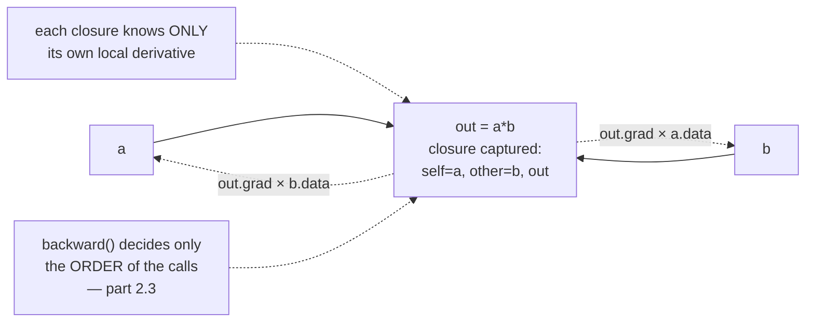

# 2.2 — The local derivative lives inside the operation

## One-line answer

Each operation is responsible for exactly one thing — knowing its own derivative and multiplying the
incoming gradient by it — and because that knowledge is stored in a closure attached to the node it
produced, the engine can differentiate any expression without ever knowing what expressions exist.

---

## The story

A relay race is run at night on an unlit road. Each runner can see only the person just ahead and the
person just behind.

Nobody knows how long the course is, how many runners there are, or where the finish line is. What
every runner does know is one number, and only one: how far the baton moves for each step **they**
take.

The last runner is handed the baton along with a message: "one". They multiply it by their own number
and pass the result back down the line. The next runner multiplies it by theirs and passes it back
again. And again. When the number finally reaches the first runner, it is every runner's number
multiplied together — and not one of them ever needed to know anything about anybody else's stretch of
road.

The organiser has exactly one job: make sure each runner gets their number **after** everyone who
depends on them and **before** everyone they depend on. That scheduling is somebody else's problem —
it is part [2.3](2.3-topological-order.md) — and it is genuinely the only piece of knowledge in this
whole system that has to be global.
---

## The idea in plain language

Part [1.2](../01-the-derivative/1.2-the-chain-rule.md) said the chain rule multiplies local
sensitivities along a path, and that each factor is **local**: it depends only on the operation and
the values at that node. Part [1.3](../01-the-derivative/1.3-partial-derivatives.md) added that where
paths meet, contributions are **added**.

Those two sentences are an implementation instruction. For each operation, write down:

- how to compute the output value from the inputs — the forward part; and
- for each input, the derivative of the output with respect to it — the local derivative.

Then the backward step for that operation is one line per input:

> `input.grad += (local derivative) * (output.grad)`

The `*` is the chain rule. The `+=` is the fan-out rule. **Every operation in every autograd engine
ever written is that line**, with a different expression in the parentheses.

The mechanism that makes it work in Python is a **closure**: a function defined inside another
function, which keeps access to the enclosing function's local variables even after that function has
returned. When `__mul__` creates the output node, it defines a small `_backward` function that
captures `self`, `other` and `out`, and attaches it to `out`. Later — possibly much later — calling
`out._backward()` still has all three in hand.

The local derivatives you need for today, and where each comes from:

| Operation | Forward | Derivative with respect to each input |
| --- | --- | --- |
| `a + b` | `a.data + b.data` | `1` for both — an addition is a router |
| `a * b` | `a.data * b.data` | `b.data` for `a`, and `a.data` for `b` — the product rule |
| `a ** k` | `a.data ** k` | `k * a.data ** (k - 1)` — the power rule, `k` constant |
| `a.tanh()` | `tanh(a.data)` | `1 - tanh(a.data)²` — reuses the forward value |
| `a.exp()` | `exp(a.data)` | `exp(a.data)` — reuses the forward value |

Two of those reuse the value the forward pass already computed. That is the structural fact from part
[1.4](../01-the-derivative/1.4-the-graph-forward-and-backward.md) appearing in code, and it is why an
autograd engine holds on to intermediate results.

And a fact worth noticing before writing anything: **subtraction and division do not need their own
entries.** `a - b` is `a + (-1 * b)` and `a / b` is `a * b ** -1`, so once `+`, `*` and `**` exist,
those two are free — with correct gradients, automatically, because they are compositions of things
that already know their derivatives. Getting more operations out of fewer is the whole design.

---

## Why Akshara needs it

- **Day 4** hand-derives the backward pass of a linear layer. It is this document's exercise done once
  more with matrices, and the transpose that appears there is the matrix version of "swap in the other
  operand".
- **Day 5** needs `exp` for the softmax and **Day 6** needs `log` for cross-entropy. Both are added to
  this class as one more entry in the table above, which is the point of the design.
- **Day 30** implements attention, whose backward pass through the softmax is the single most
  error-prone derivative in the architecture. It is written the same way and checked the same way.
- **Day 35** adds GELU and SwiGLU. Every activation function in the curriculum is one forward
  expression plus one derivative expression, and this is where that pattern is established.
- **Any custom operation you ever write in a real framework** is exactly this: a forward, a backward,
  and a gradient check.

---

## The mechanism

The three core operations, added to the class from part
[2.1](2.1-a-value-that-remembers.md):

```python
def __add__(self, other: Value | float) -> Value:
    other = other if isinstance(other, Value) else Value(other)
    out = Value(self.data + other.data, (self, other), "+")

    def _backward() -> None:
        self.grad += out.grad          # d(a+b)/da = 1
        other.grad += out.grad         # d(a+b)/db = 1

    out._backward = _backward
    return out


def __mul__(self, other: Value | float) -> Value:
    other = other if isinstance(other, Value) else Value(other)
    out = Value(self.data * other.data, (self, other), "*")

    def _backward() -> None:
        self.grad += other.data * out.grad     # d(a*b)/da = b
        other.grad += self.data * out.grad     # d(a*b)/db = a

    out._backward = _backward
    return out


def __pow__(self, k: int | float) -> Value:
    assert isinstance(k, (int, float)), "only constant exponents; a Value exponent needs log"
    out = Value(self.data ** k, (self,), f"**{k}")

    def _backward() -> None:
        self.grad += k * (self.data ** (k - 1)) * out.grad

    out._backward = _backward
    return out
```

**Line by line:**
- `other = other if isinstance(other, Value) else Value(other)` wraps a bare number. Without it,
  `a + 1` raises; with it, the constant becomes a leaf node whose gradient nobody reads. One line,
  and every literal in every expression works.
- `Value(..., (self, other), "+")` passes the operands as `_children`, which is what creates the
  arrows. **The graph is built here**, in the forward pass, as a side effect.
- `def _backward()` is defined **inside** the method, so it closes over `self`, `other` and `out`. It
  is not called now. It is stored on `out` and called later by
  [`backward()`](2.3-topological-order.md), possibly after thousands of other operations have run.
- `self.grad += out.grad` — **`+=`, never `=`.** This is the fan-out rule from part
  [1.3](../01-the-derivative/1.3-partial-derivatives.md), and it is the single most important
  character in the file. Part [2.4](2.4-accumulate-never-assign.md) measures what `=` costs.
- Addition's local derivative is `1` for both inputs, so the multiplication by it is not written. An
  addition **copies** the incoming gradient to each operand unchanged.
- Multiplication's local derivative for `self` is `other.data` — **the other operand's forward
  value**. Note it reads `other.data`, not `other.grad`: the backward pass needs the *value* the
  forward pass computed. This is why nodes must stay alive between the two passes.
- In `__pow__`, `k` is asserted to be a plain number. `a ** b` with both as `Value`s has a genuinely
  different derivative involving a logarithm, and quietly computing the wrong one would be a silent
  failure. **An assertion is the honest way to have an incomplete implementation** — it says what is
  not supported instead of guessing.
- `out._backward = _backward` attaches the closure. Assigning to the attribute rather than defining a
  method is what lets each *instance* carry its own rule, which is exactly what is needed when
  different nodes came from different operations.

The two activations, both of which reuse the forward value:

```python
import math


def tanh(self) -> Value:
    t = math.tanh(self.data)
    out = Value(t, (self,), "tanh")

    def _backward() -> None:
        self.grad += (1 - t * t) * out.grad     # d tanh/dx = 1 - tanh²(x)

    out._backward = _backward
    return out


def exp(self) -> Value:
    e = math.exp(self.data)
    out = Value(e, (self,), "exp")

    def _backward() -> None:
        self.grad += e * out.grad               # d exp/dx = exp(x)

    out._backward = _backward
    return out
```

**Line by line:**
- `t = math.tanh(self.data)` is computed **once**, used for the output value, and then captured by the
  closure for the backward pass. Recomputing `math.tanh(self.data)` inside `_backward` would give the
  same answer and cost a second transcendental evaluation for nothing.
- `(1 - t * t)` uses the already-computed `t`, not `self.data`. This is the memory-versus-compute trade
  named in part [1.4](../01-the-derivative/1.4-the-graph-forward-and-backward.md): storing `t` costs
  memory and saves work, and Day 82's activation checkpointing chooses the other side of that trade
  deliberately.
- `exp` is the one function that is its own derivative, so the closure captures `e` and uses it
  directly.
- Both return early-bound values, not late-bound lookups. If `_backward` read `self.data` instead of
  the captured `t`, and something later modified `self.data` — which Day 8's optimizer step does on
  every parameter — the backward pass would use the *new* value with the *old* graph. That is a real
  bug class, and capturing at construction time avoids it.

Everything else, free, by composition:

```python
def __neg__(self) -> Value:               # -a
    return self * -1


def __sub__(self, other) -> Value:        # a - b
    return self + (-other)


def __truediv__(self, other) -> Value:    # a / b
    return self * other ** -1


__radd__ = __add__                        # 1 + a
__rmul__ = __mul__                        # 2 * a


def __rsub__(self, other) -> Value:       # 1 - a
    return other + (-self)


def __rtruediv__(self, other) -> Value:   # 1 / a
    return other * self ** -1
```

**Line by line:**
- Every one of these is written in terms of `+`, `*` and `**`, so **none of them needs a derivative
  rule.** The gradients are correct automatically, because the composition is made of nodes that each
  know their own.
- The `__r*__` methods handle the case where the `Value` is on the **right** of the operator. Python
  tries `(1).__add__(a)` first, gets `NotImplemented` because `int` has never heard of `Value`, and
  then tries `a.__radd__(1)`. Without these, `2 * a` raises while `a * 2` works — an asymmetry that is
  maddening to debug and trivial to prevent.
- `__radd__ = __add__` and `__rmul__ = __mul__` work only because addition and multiplication
  **commute**. `__rsub__` and `__rtruediv__` cannot be aliases and are written out, with the operands
  in the right order. Writing `__rsub__ = __sub__` would make `1 - a` compute `a - 1`, silently, and
  the gradient would be correct for the wrong expression.
- `self * other ** -1` relies on Python's precedence: `**` binds tighter than `*`, so this is
  `self * (other ** -1)`. Adding the parentheses anyway would be clearer and costs nothing.

The relay, drawn:



Prove one operation against the numerical method before trusting any of them:

```python
x = Value(0.7)
y = (x * 3.0 + 1.0).tanh()
y.backward()

h = 1e-5
up = math.tanh(3.0 * (0.7 + h) + 1.0)
down = math.tanh(3.0 * (0.7 - h) + 1.0)
print("engine :", x.grad)
print("numeric:", (up - down) / (2 * h))
```

**Line by line:**
- The expression uses `__mul__` with a bare float, `__add__` with a bare float, and `tanh` — three of
  the rules above in one line.
- `h = 1e-5` is the measured optimum for a central difference in `float64` from part
  [1.5](../01-the-derivative/1.5-the-finite-difference-that-lied.md), not a guess.
- On this machine (Intel Core i3-1115G4, CPython 3.12.10, 2026-08-26) both print approximately
  `0.024254621`, agreeing to about nine significant figures. **Do this for every operation you add,
  the day you add it.** Day 4 makes it a test file.

---

## When it breaks

The loud one, and it is the assertion doing its job:

```console
>>> a, b = Value(2.0), Value(-3.0)
>>> a ** b
Traceback (most recent call last):
  File "<stdin>", line 1, in <module>
AssertionError: only constant exponents; a Value exponent needs log
```

Verbatim on this machine, 2026-08-26. The alternative — silently applying the constant-exponent rule
to a variable exponent — would produce a gradient that is wrong in a way nothing downstream could
detect. **An operation that refuses is better than one that guesses**, and this is Principle 10 in a
single `assert`.

The other loud one, from the missing reflected operator, if you leave one out:

```console
>>> 2 * Value(3.0)
Traceback (most recent call last):
  File "<stdin>", line 1, in <module>
TypeError: unsupported operand type(s) for *: 'int' and 'Value'
```

Note that `Value(3.0) * 2` works fine in the same session. That asymmetry is the signature of a
missing `__r*__`.

**The silent versions, and there are three. Every one of them trains.**

*First: a wrong local derivative.* Write `self.grad += self.data * out.grad` in `__mul__` — using the
node's **own** value instead of the other operand's — and everything runs. The gradients are wrong.
The loss usually still decreases, because a wrong direction is often still partly downhill. Nothing in
a training log distinguishes it.

*Second: `=` instead of `+=`.* The whole subject of part
[2.4](2.4-accumulate-never-assign.md), measured there at `3.0` where the truth is `6.0`.

*Third: reading `self.data` inside the closure instead of capturing it.* Correct today, wrong from
Day 8 onward, when the optimizer mutates `.data` between the forward pass and the backward pass of a
*different* step. The bug appears only in a training loop and never in a unit test of the operation.

There is exactly one check that catches all three, and it is the reason Day 4 exists as a whole day:

```python
def check_op(build, x0: float, h: float = 1e-5) -> tuple[float, float]:
    """Compare the engine's gradient for a one-input expression against a central difference."""
    x = Value(x0)
    build(x).backward()
    analytic = x.grad
    numeric = (build(Value(x0 + h)).data - build(Value(x0 - h)).data) / (2 * h)
    return analytic, numeric


print(check_op(lambda v: (v * 3.0 + 1.0).tanh(), 0.7))
print(check_op(lambda v: v * v, 3.0))
print(check_op(lambda v: (v ** 2 + v).exp(), 0.4))
```

**Line by line:**
- `build` is a function that constructs the expression, so the same expression can be rebuilt at
  `x0 + h` and `x0 - h`. Rebuilding rather than reusing matters: a graph that has already had
  `backward()` called on it has non-zero gradients lying around, which is part
  [2.5](2.5-zero-grad-the-state-that-leaks.md)'s subject.
- The numerical side reads `.data` off freshly built graphs and never calls `backward()`. It is
  genuinely independent of the engine's derivative rules, which is the entire point of it as a test.
- The second case, `v * v`, is the one that catches `=` versus `+=`, because it is the only one of the
  three with fan-out.
- On this machine, 2026-08-26, all three pairs agree to at least eight significant figures.
- **Write one of these per operation, in a test file, on the day the operation is added.** It is a
  handful of lines and it is the difference between an engine you trust and one you hope about.

---

## In production

**What a research engineer writes instead of the teaching version.** They register a custom operation
with the framework: a `forward` that computes the value and saves whatever the backward pass will
need, and a `backward` that receives the output gradient and returns one gradient per input. The shape
is identical to what is written here — the framework supplies the graph, the ordering and the
accumulation, and the author supplies exactly the two things this document is about. And the first
thing they do after writing it is run the framework's gradient checker against it, for the reasons in
*When it breaks*.

**What degrades at scale.** Not correctness — the rules are exact. What degrades is the *number of
nodes*: a real forward pass creates one node per operation per layer, and each node's closure holds
references to its operands, so the graph's memory is the sum of everything the backward pass will need.
This is why frameworks are careful about which intermediates a backward pass saves, and why a
hand-written operation that stashes a large tensor "just in case" is a real memory regression that no
test will catch.

**The failure that only shows with real data.** A derivative that is correct on the values your tests
use and wrong elsewhere. `tanh`'s derivative `1 − t²` is fine everywhere; `**` with a negative
exponent is not defined at zero; a `log` added on Day 6 is not defined at zero either, and real
probability distributions produce zeros. A gradient check at `x = 0.7` says nothing about `x = 0`. The
discipline is to check each operation at several points **including its awkward ones**, and to say in
the test which awkward point each case is covering.

**The review comment.** *"New operation, no gradient check. Also — this backward reads `self.data`;
is that value guaranteed not to have changed since the forward pass?"*

**The interview question.** *"You need a new activation function that a framework doesn't provide.
What do you write, and how do you know it's right?"* The strong answer is short: a forward, a backward
returning one gradient per input, and a gradient check against a central difference at several points
including the edge cases. If it also mentions saving the forward value for reuse and being deliberate
about what the backward pass holds onto, that is someone who has done it.

**Compute tier: T0.** Pure Python floats, instant on a laptop. The T0 version proves the **derivative
rules** exactly — they are algebra, and they are identical in any framework on any hardware. It proves
nothing about the cost of those rules at tensor scale, which is part
[3.1](../03-scaling-up/3.1-from-scalars-to-tensors.md).

---

## Check yourself

Run this. It prints **three pairs of numbers, and each pair must agree to at least eight significant
figures**:

```python
import math


def check_op(build, x0: float, h: float = 1e-5):
    x = Value(x0)
    build(x).backward()
    numeric = (build(Value(x0 + h)).data - build(Value(x0 - h)).data) / (2 * h)
    return x.grad, numeric


print("tanh chain :", check_op(lambda v: (v * 3.0 + 1.0).tanh(), 0.7))
print("v * v      :", check_op(lambda v: v * v, 3.0))
print("exp of poly:", check_op(lambda v: (v ** 2 + v).exp(), 0.4))
```

**Line by line:**
- The second line is the important one. `v * v` uses the same node twice, so it is the only case here
  whose correctness depends on `+=` rather than `=`. It must print two numbers near `6.0`.
- Now change one `+=` in `__mul__` to `=` and re-run. **Only the second line changes**, and it changes
  to `3.0` — half. The other two are unaffected, which is exactly why a test suite without a fan-out
  case would pass on a broken engine.
- Then put it back, and change `other.data` to `self.data` in `__mul__`'s first line. Predict which
  lines break before you look.

**Say this out loud, without scrolling up:** state the one line every operation's backward pass
contains, and name what the `*` in it is and what the `+=` in it is — and say why `a - b` needs no
derivative rule of its own.
