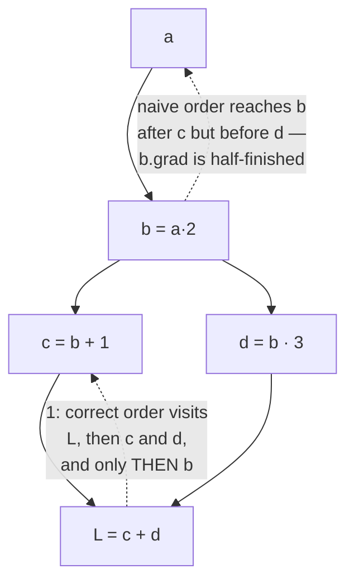

# 2.3 — Topological order: why backward has to wait

## One-line answer

A node's gradient is not finished until **every** consumer of it has contributed, so the backward pass
must visit nodes in reverse topological order — and the obvious recursive alternative is measured here
giving `14.0` where the truth is `8.0`, and 12,285 calls where 36 would do.

---

## The story

A house is being renovated, and there is one rule on site: you do not start a job until everything it
depends on is finished.

You do not plaster a wall before the electrician has run the cable through it. You do not lay the
floor before the plumbing is in. Once the dependencies are written down they are obvious, and keeping
the list in an order where nothing is ever started early is basically the whole job of the person
running the site.

One week a stand-in tries a different approach: whenever a job *becomes* possible, start it. Follow
the work as it opens up.

The first cable goes in, so the wall gets plastered. Then a second cable arrives, so the wall has to
be opened and plastered again. Then a third. The wall ends up plastered four times, three of them
wasted, and the final surface is a mess of patches.

Nobody did their job badly. The plasterer plastered well every single time. The plastering was simply
started before the things it depended on were finished.

The fix is not to work harder or to plaster more carefully. It is to write the list down in the right
order first, and only then start working through it.
---

## The idea in plain language

Part [2.2](2.2-the-local-derivative.md) gave every node a `_backward` closure that pushes gradient
into its operands. All that remains is deciding **when to call each one**.

There is exactly one constraint, and it comes from the fan-out rule in part
[1.3](../01-the-derivative/1.3-partial-derivatives.md):

> A node's `_backward` may be called only after **all** of its consumers have pushed their
> contributions into its `grad`.

If `b` feeds both `c` and `d`, then `b.grad` is the sum of a contribution from `c` and one from `d`.
Calling `b._backward()` after only `c` has contributed pushes a **half-finished** number further back,
and everything upstream of `b` is then wrong.

An ordering that respects "every consumer first" is called a **reverse topological order**. A
**topological order** of a directed acyclic graph is any listing of its nodes in which every node
appears after all of its ancestors; reverse it and every node appears after all of its descendants,
which is exactly the constraint above.

The standard way to produce one is a depth-first traversal that appends a node to the list **after**
recursing into its children — a *post-order* walk — plus a `visited` set so each node is appended
once. Then iterating the list backwards gives the order the backward pass needs.

Two properties of that algorithm are what make it the right choice, and both are measured below:

- **Each node is processed exactly once.** The `visited` set turns what could be an exponential
  traversal into a linear one.
- **The order is correct by construction.** A node is appended only after everything it points to has
  been appended, so reversing puts every consumer before its operand.

The alternative that suggests itself — "call `_backward` on this node, then recurse into its operands
and do the same" — is wrong on both counts, and part of the point of this document is that it is wrong
*quietly*: on small graphs it often produces the right answer.

---

## Why Akshara needs it

- **Day 25 onward**, every `loss.backward()` call in every training loop runs this traversal. A model
  with a residual connection (Day 36) has fan-out at every single block, so this is not an edge case —
  it is the normal structure of the graph.
- **Day 30**'s attention uses `Q`, `K` and `V` derived from the same input, and the input's gradient is
  the sum of three routes. Ordering matters at every layer.
- **Day 82**'s activation checkpointing rewrites *when* parts of the graph are recomputed, which is
  only expressible once you can say precisely what order the backward pass runs in.
- **Day 27**'s recurrent network unrolls into a graph as deep as the sequence, which is where the
  recursion-depth failure below stops being hypothetical.

---

## The mechanism

The traversal, added to the class from parts [2.1](2.1-a-value-that-remembers.md) and
[2.2](2.2-the-local-derivative.md):

```python
def backward(self) -> None:
    """Fill in .grad for every node this one depends on."""
    order: list[Value] = []
    visited: set[Value] = set()

    def build(node: Value) -> None:
        if node not in visited:
            visited.add(node)
            for child in node._prev:
                build(child)
            order.append(node)          # AFTER the children — post-order

    build(self)

    self.grad = 1.0                     # seed: d(self)/d(self) = 1
    for node in reversed(order):
        node._backward()
```

**Line by line:**
- `order` and `visited` are local to the call, so two `backward()` calls never interfere. Making them
  attributes would be a subtle bug the day anything runs concurrently.
- `if node not in visited` is the deduplication, and it is why `visited` is a **set**: membership
  testing has to be cheap because it happens once per arrow. This is the same reasoning that made
  `_prev` a set in part [2.1](2.1-a-value-that-remembers.md).
- `visited.add(node)` happens **before** recursing, not after. Adding it afterwards would let a
  diamond-shaped graph enter the same node twice before either call finished, and the deduplication
  would not deduplicate.
- `order.append(node)` is **after** the loop over children. That single placement is the whole
  algorithm: it guarantees every child is already in the list when the parent is added. Move the
  append above the loop and you get a pre-order walk, which is a valid traversal and the **wrong**
  order.
- `self.grad = 1.0` seeds the output. It is the sensitivity of the output to itself, from part
  [1.4](../01-the-derivative/1.4-the-graph-forward-and-backward.md). Without it every `_backward`
  multiplies by zero and the whole pass produces nothing — a failure that looks exactly like a severed
  graph.
- `for node in reversed(order)` walks consumers before operands. Each `_backward()` reads its node's
  `grad`, which by then is complete, and adds into its operands' `grad`s, which are still being
  assembled.
- `backward()` **does not zero anything**. It adds to whatever is already in `.grad`. That is
  deliberate and it is the subject of part [2.5](2.5-zero-grad-the-state-that-leaks.md).

Now the comparison that justifies the algorithm. The wrong version — call, then recurse:

```python
def backward_naive(self) -> None:
    """WRONG. Kept only to be measured."""
    self.grad = 1.0

    def go(node: Value) -> None:
        node._backward()
        for child in node._prev:
            go(child)

    go(self)
```

**Line by line:**
- It looks reasonable: push this node's gradient back, then do the same for everything behind it.
- It has no `visited` set, so a node reachable by two routes is processed **twice** — and each
  processing pushes gradient again, into operands that then push again themselves.
- It calls `_backward()` *before* the node's own gradient is complete, so the first push is made from a
  partial value. The second push is made from the completed one, but the damage from the first has
  already propagated.
- Both defects are invisible on a chain with no fan-out, which is why this version survives casual
  testing.

Measure it on the smallest graph that has fan-out. `L = (2a) + (2a · 3)` — written so that `b = 2a` is
used twice — for which `L = 8a + 1` and `dL/da = 8`:

```python
a = Value(3.0)
b = a * 2          # b is used twice: this is the fan-out
c = b + 1
d = b * 3
loss = c + d
loss.backward()
print("dL/da =", a.grad, " (true 8)")
```

**Line by line:**
- `b = a * 2` is the shared node. `c` and `d` both consume it, so `b.grad` must be the sum of two
  contributions before `b._backward()` may run.
- `L = c + d = (2a + 1) + (6a) = 8a + 1`, so the true derivative is `8`, computable by hand in one
  line — which is the point of choosing an example this small.
- Measured on Intel Core i3-1115G4, CPython 3.12.10, 2026-08-26:

```text
topo=True   dL/da =   8.000  (true 8)   _backward calls: 4
topo=False  dL/da =  14.000  (true 8)   _backward calls: 5
```

**`14.0` instead of `8.0`.** Not a rounding difference, not a sign error, not an obviously absurd
number — a plausible gradient that is 75% too large. Trace it once by hand and the mechanism is
visible: `c._backward()` puts `1` into `b.grad`, then the naive traversal immediately calls
`b._backward()`, which pushes `2 × 1 = 2` into `a`. Later `d._backward()` adds `3` to `b.grad`, making
it `4`, and `b` is visited again, pushing `2 × 4 = 8`. Total `10` from `a`'s point of view via that
path — plus the rest — and the sum comes out at `14`.

**And the cost, which is the second half of the argument.** Build a graph that reuses its value once
per level and count `_backward` calls:

```python
for depth in (2, 4, 6, 8, 10, 12):
    v = Value(1.0)
    x = v
    for _ in range(depth):
        x = x * 1 + x * 1        # each level consumes the previous value TWICE
    x.backward()
    print(depth, v.grad)
```

**Line by line:**
- `x * 1 + x * 1` is a deliberately silly expression whose value is `2x`, chosen because it creates
  fan-out at every level while keeping the true gradient trivially computable: after `depth` levels the
  value is `2^depth · v`, so `dv` should be `2^depth`.
- Each level doubles the number of routes from `v` to the output, so the number of *paths* is
  exponential while the number of *nodes* is linear. A traversal that follows paths does exponential
  work; a traversal that visits nodes does linear work.
- Measured on this machine, 2026-08-26:

```text
  depth   2: naive _backward calls =        9   topo =      6   grad naive=8.0                              topo=4.0
  depth   4: naive _backward calls =       45   topo =     12   grad naive=728.0                            topo=16.0
  depth   6: naive _backward calls =      189   topo =     18   grad naive=1219352.0                        topo=64.0
  depth   8: naive _backward calls =      765   topo =     24   grad naive=80966931480.0                    topo=256.0
  depth  10: naive _backward calls =     3069   topo =     30   grad naive=351835830409271296.0             topo=1024.0
  depth  12: naive _backward calls =    12285   topo =     36   grad naive=136890472124920317257711616.0    topo=4096.0
```

The topological column is exactly `3 × depth` calls and exactly `2^depth` for the gradient — correct
at every depth. The naive column is `12285` calls at depth 12 against `36`, and a gradient of
`136890472124920317257711616.0` against the true `4096`.

At depth 2 the naive answer is `8.0` against a true `4.0` — wrong by a factor of two, which in a
training loop is indistinguishable from having chosen a learning rate twice as large. **That is the
version you would ship**, because by the time the factor is `1e22` you have obviously noticed.

The two orders, drawn on the small graph:



---

## When it breaks

The loud one, and it is the characteristic failure of a recursive traversal on a real model:

```console
>>> import sys
>>> sys.setrecursionlimit(1000)
>>> v = Value(1.0)
>>> for _ in range(5000):
...     v = v + 1.0
...
>>> v.backward()
Traceback (most recent call last):
  File "<stdin>", line 1, in <module>
  File "<stdin>", line 8, in backward
  File "<stdin>", line 5, in build
  File "<stdin>", line 5, in build
  [Previous line repeated 995 more times]
RecursionError: maximum recursion depth exceeded
```

Verbatim on this machine, 2026-08-26. `build` recurses once per level of graph depth, and a graph
5000 deep needs 5000 stack frames. Raising `sys.setrecursionlimit` works and is a bad habit — the
stack is a real, finite resource and a large limit turns a clean `RecursionError` into a process
crash. The right fix is an explicit stack, which is this part's `TODO(me)`.

This matters concretely by **Day 27**, where a recurrent network unrolled over a sequence of length
`T` produces a graph at least `T` deep.

**The silent version, which is the whole document: the wrong order gives a plausible number.** No
exception, no warning:

```text
topo=False  dL/da =  14.000  (true 8)
```

and at shallow depth:

```text
depth 2: grad naive = 8.0   (true 4.0)
```

A gradient that is exactly twice the truth trains. It trains as though the learning rate were doubled,
so it might even *look* better for a while before it diverges, and the diagnosis would go to the
learning rate rather than to the engine.

The check that catches it, and it is one test with one property:

```python
def test_fanout_gradient():
    a = Value(3.0)
    b = a * 2
    loss = (b + 1) + (b * 3)         # b consumed twice — the whole point
    loss.backward()
    assert a.grad == 8.0, f"fan-out gradient is {a.grad}, expected 8.0"
```

**Line by line:**
- The expression is chosen so the answer is an exact small integer, computable by hand: `L = 8a + 1`.
  Comparing with `==` is safe **here** because every operation is a multiply-by-integer and an add, so
  the arithmetic is exact in binary floating point. For anything involving `tanh`, `exp` or division,
  use `assert_allclose` with a stated tolerance, for the reason Day 2 part
  [3.2](../../../day-002-tensors-shape-stride/parts/03-matmul/3.2-three-loops-then-one-call.md) gives.
- **`b` must be consumed twice.** A test suite made entirely of straight chains passes on a broken
  traversal — that is exactly how this bug survives.
- The message prints the actual value. `14.0` versus `8.0` immediately says "too large by a factor
  related to double-counting", which points at the traversal; a bare `AssertionError` points nowhere.
- This test belongs in `tests/` from the day the engine exists, and it is the single highest-value test
  in this whole day.

---

## In production

**What a research engineer writes instead of the teaching version.** Nothing — the framework owns the
traversal. What they carry from it is the ability to reason about *when* a gradient is available, which
matters the moment anything non-standard happens: gradient accumulation across micro-batches, a
backward pass run twice on the same graph, a hook that fires when a particular tensor's gradient is
ready. All of those are statements about this ordering, and none of them makes sense to someone who
thinks `backward()` is a single opaque step.

Real implementations also do not use recursion. They keep an explicit worklist and a count of how many
consumers each node is still waiting on, decrementing as contributions arrive and processing a node
only when its count reaches zero. That is the same constraint enforced by counting rather than by
sorting, and it is both iterative (no stack limit) and naturally parallel — independent branches can
be processed at the same time.

**What degrades at scale.** Depth, in two ways. The recursive version hits the stack limit; the
iterative version does not, but the *order* still forces the backward pass to be as sequential as the
graph is deep. A very deep model's backward pass cannot be parallelised along its depth, only across
its width — which is one of several reasons the field grew models wider as well as deeper.

**The failure that only shows with real data.** Graphs whose shape depends on the input. A model with
data-dependent control flow — early exit, variable sequence length, a mixture-of-experts router — has
a different graph per batch. A traversal bug that only bites on a particular shape then bites only on
particular batches, producing occasional wrong gradients among mostly-correct ones. The result is
extra noise in training that is indistinguishable from the ordinary kind, which is Silent Failure #4
(plan §6) arriving through the engine rather than through the data.

**The review comment.** *"Does this test cover a tensor that's used more than once? A straight chain
passes on a broken traversal."*

**The interview question.** *"Why does a backward pass need a topological sort — why not just recurse
from the loss?"* The strong answer names both defects and, ideally, quantifies one: recursing without
ordering pushes a half-finished gradient (giving 14 instead of 8 on a four-node graph), and recursing
without deduplication does work proportional to the number of *paths* rather than *nodes*, which is
exponential in depth. Naming only the second is the common half-answer.

**Compute tier: T0.** Everything here is a laptop CPU measurement on graphs of a few dozen nodes. The
T0 version proves the **correctness argument and the complexity argument** exactly — both are
properties of the algorithm, identical on any hardware. It says nothing about the wall-clock cost of a
real backward pass, which is dominated by the arithmetic inside each node rather than by the
traversal.

---

## Check yourself

Run this. It prints **one gradient that must be exactly `8.0`, and one call count**:

```python
calls = 0                      # increment this inside each _backward while testing

a = Value(3.0)
b = a * 2
loss = (b + 1) + (b * 3)
loss.backward()

print("dL/da        :", a.grad, " (true 8.0)")
print("nodes in graph:", len({id(n) for n in [a, b, loss]}))
```

**Line by line:**
- `a.grad` must print `8.0`. If it prints `14.0`, your `backward()` is calling `_backward` before a
  node's gradient is complete — check that `order.append(node)` comes **after** the loop over children.
- If it prints `4.0` or some other halved value, the problem is not the ordering but the accumulation:
  read part [2.4](2.4-accumulate-never-assign.md) next.
- Now move `order.append(node)` to **before** the `for child` loop and re-run. Predict what happens
  before you look, then explain the number you get.

**Say this out loud, without scrolling up:** state the single constraint the backward pass's ordering
must satisfy — and name the two separate things that go wrong when you recurse from the loss instead.
