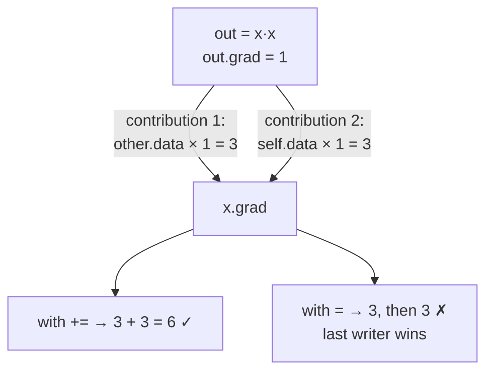

# 2.4 — 💥 Accumulate, never assign

## One-line answer

Changing one character — `+=` to `=` — in an operation's backward pass makes the engine keep only the
**last** of a node's gradient contributions instead of their sum, and the measured consequence on
`y = x·x` at `x = 3` is a gradient of `3.0` where the truth is `6.0`: exactly half, silently, on an
expression three characters long.

---

## The story

You are collecting money from your friends for a shared gift.

Three of them pay you on three different days: ₹400 on Monday, ₹350 on Wednesday, ₹120 on Friday. You
keep one line in your notebook that says "Total:". On Monday you write 400. On Wednesday you cross it
out and write 350. On Friday you cross that out and write 120.

At the end of the week the notebook says ₹120.

Nothing was stolen. Nobody miscounted. Every single number was correct on the day you wrote it. The
notebook had one line for *the* total and you filled that line in three separate times, so it holds
the last number instead of the sum of them.

And here is the part that makes this dangerous: ₹120 is a real amount that a real friend really did
hand you. It is not a silly number. It does not look like a mistake. It is simply not the answer to
the question you were asking.

The fix is one word on that line: **add to** the total, do not **replace** it.
---

## The idea in plain language

Part [1.3](../01-the-derivative/1.3-partial-derivatives.md) established the rule: when a value reaches
the output by more than one route, its sensitivity is the **sum** of the sensitivities along those
routes. Part [2.2](2.2-the-local-derivative.md) implemented it as `+=`.

This document is about what `=` does instead, and why the failure is so hard to see.

The engine's `.grad` slot is a running total. Each consumer of a node calls its own `_backward`, which
adds its contribution into that node's slot. The slot starts at `0.0` — the additive identity, chosen
in part [2.1](2.1-a-value-that-remembers.md) for exactly this reason — and finishes as the sum of
however many contributions arrived.

With `=` instead of `+=`, the slot is a **last-writer-wins** box. Whichever consumer happens to be
processed last determines the value, and the others are overwritten.

Three properties make this the nastiest bug in the day:

**It requires fan-out to appear at all.** On a straight chain — every value used exactly once —
`=` and `+=` produce identical results, because there is only ever one contribution. So a test suite
built from chains passes completely.

**The result is plausible.** It is not `NaN`, not zero, not enormous. It is one of the correct partial
contributions — a real number of the right sign and roughly the right magnitude.

**It gets worse as the model gets better designed.** Fan-out is not an occasional accident; it is what
residual connections (Day 36), multi-head attention (Day 32) and weight tying (Day 20) all *are*. The
more of the architecture you build, the more of your gradient is wrong.

---

## Why Akshara needs it

- **Day 18–20**: an embedding table indexed by token ids. A token appearing five times in a batch has
  five routes to the loss. With `=`, that row trains on the last occurrence only — and the tokens with
  the most occurrences, the most frequent and most important ones, are the ones damaged most.
- **Day 20**: weight tying, where the embedding matrix and the output head are literally the same
  parameter used twice. Its gradient is the sum of two contributions by construction, and `=` throws
  one of them away.
- **Day 36**: every residual connection is a fan-out. In a 12-block model that is 12 places per
  forward pass.
- **Day 32**: multi-head attention derives `Q`, `K` and `V` from the same input.
- **Day 51 onward**: gradient accumulation across micro-batches — the standard technique for
  simulating a large batch on small hardware — relies on `+=` being the engine's behaviour *across
  backward calls*, not just within one. Part
  [2.5](2.5-zero-grad-the-state-that-leaks.md) is the other side of that same coin.

By Day 39 there is no forward pass in this curriculum without fan-out. This is not an exotic failure.

---

## The mechanism

The smallest expression that shows it. `y = x · x`, so `y = x²` and `dy/dx = 2x = 6` at `x = 3`:

```python
x = Value(3.0)
y = x * x                    # x is consumed TWICE by one operation
y.backward()
print("y      =", y.data, " (true 9)")
print("dy/dx  =", x.grad, " (true 2x = 6)")
```

**Line by line:**
- `x * x` calls `__mul__` with `self is other` — the same object in both roles. So the backward closure
  runs `self.grad += other.data * out.grad` and then `other.grad += self.data * out.grad`, and **both
  lines write to the same slot**.
- With `+=`, the slot receives `3 × 1` and then `3 × 1` again: total `6.0`. Correct.
- With `=`, the slot receives `3` and then `3`, keeping the last: `3.0`. Exactly half.
- Note that `_prev` is a set (part [2.1](2.1-a-value-that-remembers.md)) so it contains `x` once, and
  the topological traversal visits `x` once. **The doubling comes from the closure running two
  statements, not from the graph being traversed twice.** Those are separate mechanisms and it is worth
  being clear which is which: part [2.3](2.3-topological-order.md) is about traversal, this part is
  about accumulation, and the two failures look similar and have different fixes.

Both versions, measured side by side on Intel Core i3-1115G4, CPython 3.12.10, 2026-08-26:

```text
  accumulate=True   y=x*x at x=3 -> dy/dx = 6.0   (true 2x = 6)
  accumulate=False  y=x*x at x=3 -> dy/dx = 3.0   (true 2x = 6)
```

**One character, a factor of two.** And `3.0` is not a nonsense value — it is `x` itself, which is one
of the two correct terms of the product rule. Anyone reading that number in a debugger would have to
already suspect this bug to notice.

Why it is invisible on a chain, which is the reason it survives testing:

```python
a = Value(2.0)
b = a * 3                    # a used once
c = b + 1                    # b used once
d = c * 4                    # c used once
d.backward()
print("dd/da =", a.grad, " (true 12)")
```

**Line by line:**
- Every intermediate is consumed exactly once, so every `.grad` slot is written exactly once.
- `=` and `+=` give **identical** answers here — `12.0` from both. Measured on this machine,
  2026-08-26.
- This is why the fan-out test in part [2.3](2.3-topological-order.md) matters so much: a suite of
  chain expressions is not a test of the engine, it is a test of arithmetic.

The two behaviours, drawn:



**Where else it hides.** The `x * x` case is the demonstration; these are the shapes it takes in real
code, and all three have the same one-character fix:

```python
# 1 - the same node consumed by two different operations
b = a * 2
loss = (b + 1) + (b * 3)              # b has two consumers

# 2 - a residual connection (Day 36's shape)
out = x + block(x)                    # x reaches the output twice

# 3 - a parameter used in two places (Day 20's weight tying)
logits = hidden @ emb.T               # emb is also the embedding table
```

**Line by line:**
- Case 1 puts the two contributions in *different* closures, arriving at different times during the
  traversal. The `x * x` case put them in the same closure. Both are fan-out; the `=` bug eats both.
- Case 2 is the one that matters most in practice, because a residual connection appears once per
  block and its whole purpose (part
  [1.2](../01-the-derivative/1.2-the-chain-rule.md)) is to add a gradient path with local derivative
  1. With `=`, whichever of the two paths is processed last wins and the other is discarded — and if
  the discarded one is the identity path, the residual connection stops doing the only thing it was
  added to do while continuing to look exactly like a residual connection.
- Case 3's `emb` is one parameter tensor serving two roles, so its gradient is genuinely a sum of two
  unrelated terms.

---

## When it breaks

It does not break. There is no traceback anywhere in this document. What there is, is this:

```text
dy/dx = 3.0
```

against a true value of `6.0`, from code that runs, on an expression that fits on one line.

**What a training run does with gradients that are systematically too small.** It trains — slowly, and
to a worse result. The effective learning rate is reduced by a factor that depends on how much fan-out
each parameter has, so **different parameters are scaled differently**: a weight behind a residual
connection is halved, a weight used once is not. That is not equivalent to a smaller learning rate; it
is a per-parameter distortion of the update direction that no learning-rate tuning can undo.

And the diagnosis goes the wrong way. The loss is decreasing, just less than expected, so the natural
responses are to raise the learning rate, train longer, or add capacity. All three produce a bit of
improvement, which confirms the wrong hypothesis.

**The check, and it is one test.** Not a large test — this one:

```python
def test_gradient_accumulates_over_fanout():
    x = Value(3.0)
    (x * x).backward()
    assert x.grad == 6.0, f"x*x gave {x.grad}, expected 6.0 — is the backward using = instead of +=?"
```

**Line by line:**
- `x * x` is the minimum reproduction. Three characters, one assertion, and it catches the whole class.
- `== 6.0` exactly is safe here because `3.0 * 1.0 + 3.0 * 1.0` is exact in binary floating point. For
  anything with `tanh` or `exp` in it, use `assert_allclose` with a stated tolerance — Day 2 part
  [3.2](../../../day-002-tensors-shape-stride/parts/03-matmul/3.2-three-loops-then-one-call.md) is the
  argument.
- **The failure message names the suspected cause.** `x*x gave 3.0, expected 6.0` plus the hint about
  `=` versus `+=` turns a five-minute investigation into a ten-second fix. A message that says only
  what happened is half a message.
- The complementary test, which catches the *other* half of the same rule, belongs next to it:

```python
def test_gradient_accumulates_across_backward_calls():
    x = Value(3.0)
    (x * 2).backward()
    (x * 2).backward()
    assert x.grad == 4.0, f"two backward calls gave {x.grad}, expected 4.0 (2 + 2)"
```

**Line by line:**
- Two separate expressions, two separate `backward()` calls, one shared leaf. The gradient should be
  the **sum**: `2 + 2 = 4`.
- This is not a curiosity — it is exactly how gradient accumulation across micro-batches works on
  Day 51, and it only works because `backward()` adds rather than replaces.
- It is also why the engine cannot zero gradients for you, which is part
  [2.5](2.5-zero-grad-the-state-that-leaks.md): from inside `backward()`, the accumulation you *want*
  here and the accumulation you *don't* want between training steps are indistinguishable.

---

## In production

**What a research engineer writes instead of the teaching version.** They rely on the framework's
accumulation and think about it explicitly in exactly two places. First, when writing a custom
backward pass that returns a gradient for an input used more than once — the framework's convention is
usually to return one gradient per input and let the engine sum them, so the author must not
pre-combine. Second, when doing gradient accumulation across micro-batches, where the accumulation is
the whole technique: run several forward/backward passes, then one optimizer step, and the gradients
sum because that is the engine's contract.

**What degrades at scale.** Nothing about the rule — it is exact. What scales is the *damage*: the
proportion of parameters affected grows with how much fan-out the architecture has, and modern
architectures are built almost entirely out of fan-out. A model with residual connections at every
block, tied embeddings and multi-head attention has fan-out on most of its parameters, so a `=` bug
corrupts most of the gradient rather than a corner of it.

**The failure that only shows with real data.** The embedding table again, and it is worth being
concrete. On a synthetic batch of unique token ids, every embedding row has exactly one route to the
loss and `=` behaves identically to `+=`. On real text, frequency follows a very steep distribution —
a handful of tokens account for a large share of all positions — so the most common rows have dozens
of routes and lose all but one. The bug's damage is concentrated precisely on the parameters that
matter most, and it is completely absent from the synthetic test.

**The review comment.** *"This custom backward sets `grad` rather than adding to it. What happens when
this input is used twice?"*

**The interview question.** *"Why do gradients accumulate by default, rather than being reset on every
backward call?"* The strong answer has two halves: within one backward pass, accumulation *is* the
multivariable chain rule for fan-out; across backward passes, it is what makes gradient accumulation
over micro-batches possible. And then the honest consequence — that because the engine cannot tell the
two apart, zeroing is the caller's job, which is where the classic forgotten-`zero_grad` bug comes
from.

**Compute tier: T0.** Reproduced on a laptop CPU with an expression of three characters, in
microseconds. That is the good news about this bug: the minimal reproduction is as small as a bug's
reproduction ever gets, and the test that prevents it is one line. What T0 cannot show is the cost —
weeks of a distorted training run — which is why the test is worth writing before the first model
exists rather than after.

---

## Check yourself

Run this. It prints **two gradients; the first must be `6.0` and the second `12.0`**:

```python
x = Value(3.0)
(x * x).backward()
print("x*x at x=3       :", x.grad, " (true 6.0)")

a = Value(2.0)
((a * 3 + 1) * 4).backward()
print("chain, no fan-out:", a.grad, " (true 12.0)")
```

**Line by line:**
- Now change **one** `+=` to `=` in `__mul__`'s backward closure and re-run. The first number becomes
  `3.0`; the second stays `12.0`.
- **That is the entire lesson in two lines of output.** The chain expression — the kind of expression
  most people write when testing an engine — is completely blind to the bug.
- Put it back. Then add the second test from *When it breaks* and confirm two `backward()` calls on the
  same leaf give `4.0`, not `2.0`.

**Say this out loud, without scrolling up:** explain why `=` gives exactly half the correct gradient
for `x·x` — and name the architectural feature that appears once per block in every modern transformer
and is corrupted by this bug on every single one of them.
