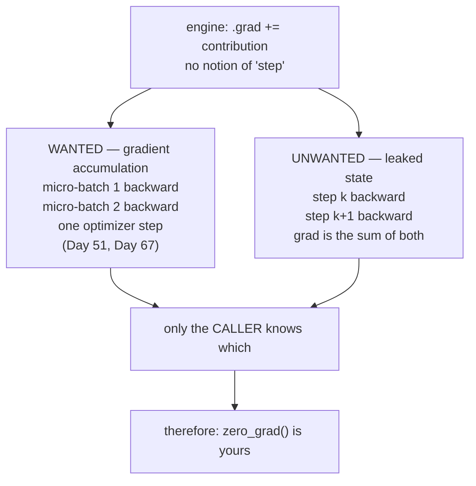

# 2.5 — 💥 `zero_grad`: the state that leaks between steps

## One-line answer

The same `+=` that makes fan-out correct also makes gradients survive from one training step into the
next, so the engine **cannot** clear them for you — and forgetting to clear them yourself produces a
gradient that grows step by step, measured here at 6, 12, 18, 24 on a loop whose true gradient is 6
every time.

---

## The story

A kitchen weighs its ingredients on a digital scale.

The usual routine is this. Put the empty bowl on the scale, press **tare** so it reads 0, and add
flour until it reads 500. Tip it into the mixer. Press tare again, add sugar until it reads 200. Press
tare again, add butter until it reads 250.

One day somebody new does the same job, and the cake comes out wrong. They put the bowl on and added
flour to 500, exactly right — but they never pressed tare again. So when the display reached 200 for
the sugar, that 200 already included the flour, which means they added no sugar at all and then took
some flour back out. By the third ingredient, nothing on that scale had any relation to the recipe.

Neither cook is wrong about the scale. The scale is doing precisely what a scale does: it reports the
total weight sitting on it.

**Tare is not something the scale can work out on its own.** It cannot tell the difference between
"this is a new ingredient, forget the last one" and "this is more of the same ingredient, keep
counting". Only the person holding the bowl knows which of those is happening.

That is exactly the position an autograd engine is in, and it is why every framework in existence
makes you press the tare button by hand.
---

## The idea in plain language

Part [2.4](2.4-accumulate-never-assign.md) established that `.grad` must accumulate, because a node
used twice has two contributions and they add.

That rule has no clock in it. The engine adds contributions into `.grad` whenever `backward()` runs,
and it has no way to know whether a given contribution belongs to *this* backward pass or a previous
one. From inside the engine, these two situations are identical:

- **Wanted:** two backward passes over two micro-batches, whose gradients should sum so that one
  optimizer step behaves like a step over the combined batch. This is **gradient accumulation** and it
  is the standard way to simulate a large batch on hardware that cannot hold one — it is how Day 67's
  free-GPU run gets an effective batch size larger than its memory allows.
- **Unwanted:** two consecutive training steps, whose gradients should absolutely not sum, because
  step 2's update must be based on step 2's gradient alone.

Same operation, opposite intent, no way to distinguish them from inside. So the decision is handed to
the caller, and the training loop acquires a fourth line:

```text
forward  →  backward  →  step  →  zero
```

Leave out the fourth and the gradient at step `k` is the sum of the first `k` gradients. What that does
to training is the subject below, and it is worse than "the learning rate is too high" in a specific
way: the effective step size **grows without bound** as training proceeds.

One more term, because it is where the bug usually actually lives: **when** to zero. Zeroing after the
optimizer step and zeroing before the next forward pass are equivalent in a simple loop and are *not*
equivalent once anything else is going on — a validation pass, a logging branch that calls `backward`,
an early `continue` that skips the step. The robust convention is to zero **immediately before the
backward pass that will fill them**, because then the clearing is adjacent to the thing it protects.

---

## Why Akshara needs it

- **Day 8** writes the optimizer, and the loop it defines is the four lines above. The `zero` line
  exists because of this document.
- **Day 25** trains the first model. This is the single most likely bug in anyone's first training
  loop, and its symptom — a loss that falls then explodes — is easy to misattribute to the learning
  rate.
- **Day 51** builds the real training loop and introduces gradient accumulation over micro-batches,
  which is this behaviour used **on purpose**. The same line that is a bug at step boundaries is the
  technique inside a step.
- **Day 67** is the free-GPU pretraining run, whose batch size is memory-limited. Accumulation is how
  it gets an effective batch larger than the device can hold, so both halves of this rule are live in
  the run that matters most.

---

## The mechanism

Reproduce it. A loop with no zeroing, on a loss whose gradient is a constant `6w`:

```python
w = Value(1.0)
for step in range(1, 5):
    loss = w * w * 3                    # L = 3w², so dL/dw = 6w
    loss.backward()
    print(f"step {step}: w={w.data:.4f}  w.grad={w.grad:.4f}   (true 6w = {6 * w.data:.4f})")
```

**Line by line:**
- `loss = w * w * 3` is rebuilt every iteration, exactly as a real training loop rebuilds its graph
  each step. The graph is new; the **leaf** `w` is not, and `.grad` lives on the leaf.
- `w.data` is deliberately never updated here, so the true gradient is the same `6.0` on every
  iteration. That isolates the accumulation: any change in the printed gradient is the bug and nothing
  else.
- Measured on Intel Core i3-1115G4, CPython 3.12.10, 2026-08-26:

```text
  step 1: w=1.0000  w.grad=6.0000   (true 6w = 6.0000)
  step 2: w=1.0000  w.grad=12.0000  (true 6w = 6.0000)
  step 3: w=1.0000  w.grad=18.0000  (true 6w = 6.0000)
  step 4: w=1.0000  w.grad=24.0000  (true 6w = 6.0000)
```

**Step 1 is exactly right.** That is the cruelty of it: the first step of every run is correct, so
whatever smoke test you do at step 1 passes. By step 4 the gradient is four times too large, by step
100 it is a hundred times, and the "learning rate" you thought you set is now being multiplied by the
step number.

The fix, and where it goes:

```python
def zero_grad(params: list[Value]) -> None:
    for p in params:
        p.grad = 0.0


params = [Value(1.0)]
lr = 0.1
for step in range(1, 5):
    zero_grad(params)                       # 1 - clear, immediately before the backward that fills
    w = params[0]
    loss = w * w * 3                        # 2 - forward
    loss.backward()                         # 3 - backward
    w.data -= lr * w.grad                   # 4 - step
    print(f"step {step}: w={w.data:.4f}  grad={w.grad:.4f}  loss={loss.data:.4f}")
```

**Line by line:**
- `p.grad = 0.0` uses `=` — and this is the **one** place in the entire engine where assignment rather
  than accumulation is correct. Zeroing is not a gradient contribution; it is the tare button.
- `zero_grad` takes an explicit list of parameters. It cannot walk the graph to find them, because the
  graph is rebuilt every step and the *previous* step's graph is gone — only the leaves survive, and
  only the caller knows which leaves are parameters. This is exactly why every framework has an
  explicit notion of "the parameters of this model" rather than inferring it.
- The clear is placed **first in the loop body**, immediately before the forward/backward that will
  fill the gradients. Putting it after the step works in this loop and breaks the day someone adds a
  `continue` above it.
- `w.data -= lr * w.grad` touches **`.data` only**. Writing `w -= lr * w.grad` would build a *new*
  `Value` node and rebind the name, and the parameter list would still hold the old object — so the
  update would be silently discarded. Day 8 names that one.
- Measured on this machine, 2026-08-26, with `lr = 0.1`:

```text
  step 1: w=0.4000  grad=6.0000  loss=3.0000
  step 2: w=0.1600  grad=2.4000  loss=0.4800
  step 3: w=0.0640  grad=0.9600  loss=0.0768
  step 4: w=0.0256  grad=0.3840  loss=0.0123
```

The gradient now **falls** as `w` approaches the minimum at zero, which is what a gradient is supposed
to do, and the loss falls with it.

The two situations the engine cannot tell apart:



And the same mechanism used deliberately, which is the thing to recognise on Day 51:

```python
zero_grad(params)
for micro_batch in split(batch, into=4):    # 4 micro-batches
    loss = compute_loss(micro_batch) * (1 / 4)
    loss.backward()                          # gradients ACCUMULATE across the four
step(params, lr)
```

**Line by line:**
- `zero_grad` is called **once**, outside the inner loop. That placement is the entire difference
  between accumulation and a bug.
- `* (1 / 4)` scales each micro-batch's loss so the accumulated gradient matches what a single batch of
  the full size would have produced. Omitting it gives a gradient four times too large — which is the
  same failure as this document's bug, arriving through a technique rather than an oversight. **This
  scaling is the most commonly forgotten line in gradient accumulation.**
- `step` is outside the loop too: four backward passes, one update.
- Whether the correct scale factor is `1/n` depends on how the loss is reduced over the batch — a mean
  needs it, a sum does not. Day 51 settles that against the actual loss function rather than assuming.

---

## When it breaks

Nothing raises. Ever. The output is this:

```text
  step 1: w=1.0000  w.grad=6.0000   (true 6w = 6.0000)
  step 2: w=1.0000  w.grad=12.0000  (true 6w = 6.0000)
  step 3: w=1.0000  w.grad=18.0000  (true 6w = 6.0000)
  step 4: w=1.0000  w.grad=24.0000  (true 6w = 6.0000)
```

**What a real training run looks like with this bug.** A very specific and recognisable shape:

1. The first few steps are fine — step 1 is exactly correct.
2. The loss falls faster than expected for a while, because the effective step size is growing.
3. It overshoots, oscillates, and then diverges to `inf` or `NaN`.
4. Lowering the learning rate delays the divergence and does not prevent it, because the growth is
   multiplicative in the step count rather than in the learning rate.

That last point is the diagnostic. **A run that diverges no matter how low the learning rate goes is
not a learning-rate problem.** If halving the learning rate merely doubles the number of steps before
divergence, something is scaling with the step count, and this is the first thing to check.

The check, and it costs one line in the loop:

```python
grad_norm = sum(p.grad * p.grad for p in params) ** 0.5
print(f"step {step}  loss {loss.data:.4f}  grad_norm {grad_norm:.4f}")
```

**Line by line:**
- The **norm** is one number for the whole parameter set, which makes it printable every step without
  drowning the log.
- What you are watching for is not a particular value but a **trend that tracks the step number**. A
  healthy gradient norm wanders, spikes occasionally and generally trends down. A leaked gradient's
  norm climbs roughly linearly from the start.
- Print it from step 0 of the very first run. Retrofitting it after a run goes wrong means running
  again.
- The test-suite version, which is stronger because it can go red:

```python
def test_grad_does_not_leak_between_steps():
    w = Value(1.0)
    firsts = []
    for _ in range(3):
        w.grad = 0.0
        (w * w * 3).backward()
        firsts.append(w.grad)
    assert firsts == [6.0, 6.0, 6.0], f"gradients drifted across steps: {firsts}"
```

**Line by line:**
- `w.data` is never updated, so the true gradient is identical on all three iterations. Any difference
  is leakage.
- Remove the `w.grad = 0.0` line and the assertion fires with `[6.0, 12.0, 18.0]` — a message that
  names the bug by its shape.
- This is Principle 11: a check that can go red, and one you should watch go red once before trusting
  it.

---

## In production

**What a research engineer writes instead of the teaching version.** The four-line loop, with the
zeroing adjacent to the backward pass it protects, and — in a framework that offers it — the variant
that releases the gradient buffers rather than filling them with zeros, which saves memory equal to
the model size between steps. They also treat the gradient norm as a first-class logged metric, not a
debugging afterthought, because it is the cheapest early warning for this bug, for exploding gradients
(part [1.2](../01-the-derivative/1.2-the-chain-rule.md)) and for a dead layer, all at once.

**What degrades at scale.** The cost of the mistake, not its likelihood. On a laptop toy model a
diverged run costs seconds. On Day 67's free notebook session it costs the session — and free sessions
are the scarce resource of this entire curriculum (plan §4). The habit of logging the gradient norm
from step 0 is cheap insurance against spending a whole session discovering this at step 4000.

**The failure that only shows with real data.** A branch that skips the optimizer step. Real training
loops have them: skip a step when the loss is `NaN`, skip when a batch is malformed, skip on the
gradient-clipping threshold. If `zero_grad` lives *after* the step and the step is skipped, that
iteration's gradient survives into the next one — so the bug appears only on the iterations following
a skip, at a rate that depends on the data. The result is occasional oversized updates scattered
through training, which look exactly like noise and are Silent Failure #4 (plan §6) with a
non-statistical cause. Putting the clear at the top of the loop body makes the whole class impossible.

**The review comment.** *"`zero_grad` is after the optimizer step, and there's a `continue` above it.
Move it to the top of the loop."*

**The interview question.** *"Why do you have to zero gradients manually — why doesn't the framework do
it?"* The strong answer is that accumulation is load-bearing in two places the engine cannot
distinguish: within a backward pass it *is* the fan-out rule, and across backward passes it is
gradient accumulation over micro-batches. Only the caller knows which one is intended. A very strong
answer adds the symptom — a run that diverges regardless of learning rate — because that is the shape
of someone who has debugged it rather than read about it.

**Compute tier: T0.** Reproduced on a laptop in a four-iteration loop on a single scalar. The T0
version proves the **mechanism** exactly: the gradient really does grow by a constant per step, and
one line fixes it. What it cannot show is the expensive version — a T1 session lost to a divergence
that was diagnosed as a learning-rate problem — which is the reason to have met it here.

---

## Check yourself

Run this. It prints **two columns of four gradients**; the first must grow and the second must not:

```python
print("without zeroing:")
w = Value(1.0)
for step in range(1, 5):
    (w * w * 3).backward()
    print(f"  step {step}: grad={w.grad:.4f}   (true 6.0)")

print("with zeroing:")
w = Value(1.0)
for step in range(1, 5):
    w.grad = 0.0
    (w * w * 3).backward()
    print(f"  step {step}: grad={w.grad:.4f}   (true 6.0)")
```

**Line by line:**
- The first block prints `6, 12, 18, 24` on this machine, 2026-08-26. The second prints `6, 6, 6, 6`.
- **`w.data` is never updated in either block**, so the true gradient is `6.0` in all eight lines. Every
  number that is not `6.0` is the bug, with nothing else to confuse it.
- Now move `w.grad = 0.0` to the **end** of the second loop body and re-run. Predict the first printed
  value before you look, and say what that tells you about where the clear belongs.

**Say this out loud, without scrolling up:** explain why the engine cannot zero the gradients for you —
naming the one legitimate use of cross-call accumulation — and describe the shape of a training run
that has this bug, including why lowering the learning rate does not fix it.
