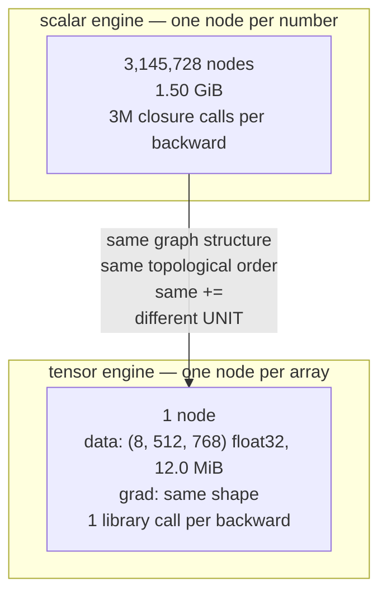

# 3.1 — From scalars to tensors: what this engine costs, measured

## One-line answer

The scalar engine is correct and unusable: a 24×24 matmul through it takes 113 ms against numpy's
2.16 µs — **52,523 times slower** — a 32×32 matmul raises `RecursionError` outright, and one node per
number costs 512 bytes against 8, so the fix is not a faster node but a node whose `data` is an entire
array.

---

## The story

A bank has a sack of ten thousand coins to count.

A trainee counts them one at a time. Pick up a coin, look at it, check it is real, put it on the pile,
say the next number. Every coin is genuinely checked, and if you ask what is in the sack, the trainee
can tell you exactly. For teaching somebody what a coin is and how counting works, nothing beats it.

Then the branch has to count forty sacks before closing time.

The bank does not solve this by hiring a faster trainee. Counting one at a time has a floor built into
it — the picking up, the looking, the putting down — and no amount of hand speed removes that floor.
So the bank uses a scale instead. One coin of that type weighs a known amount. Put the whole sack on,
read one number, divide. One action for ten thousand coins.

The one-at-a-time counting was never wrong. It was the correct answer to a different question.
---

## The idea in plain language

The engine built in section 2 is correct. Every part of this document assumes that and asks only what
it costs.

There are three costs and they are separate:

**Time per node.** Every arithmetic operation becomes a Python object construction, a set construction,
a closure definition and later a closure call. Measured below at roughly 1.25 to 3.79 microseconds per
node — for one multiply-add. NumPy does the equivalent arithmetic in a fraction of a nanosecond.

**Memory per node.** Measured in part [2.1](../02-the-autograd-engine/2.1-a-value-that-remembers.md) at
512 bytes against 8 for a `float64` in an array — a factor of 64.

**Depth of the graph.** The traversal in part
[2.3](../02-the-autograd-engine/2.3-topological-order.md) recurses once per level, and a dot product of
length `K` is a chain `K` deep. Past a few thousand levels the interpreter refuses.

The fix for all three is the same and it is a change of *granularity*, not of implementation quality.
Instead of one node per number, make one node per **array**:

- `data` is a `(B, T, C)` array rather than a float.
- `grad` is an array of the same shape.
- A node's `_backward` does array arithmetic — one matmul instead of `M·N·K` multiplies.

Everything else in the design is unchanged. The graph is the same graph, the topological order is the
same order, the `+=` is the same `+=` — it just operates on whole arrays. A `(8, 512, 768)` activation
becomes **one** node instead of 3,145,728, and its backward pass becomes one library call instead of
three million closure invocations.

That is the entire difference between the engine you built today and the framework you will use later,
and having built the scalar one is what makes the tensor one legible rather than magical.

---

## Why Akshara needs it

- **Day 4** derives the backward pass of a *linear layer* rather than of a scalar multiply. That is
  this document's change of granularity, done for one operation, and the transpose that appears is the
  array version of "swap in the other operand".
- **Day 25** trains the first model. The scale numbers below say why it cannot be done on the scalar
  engine.
- **Day 39** assembles Akshara v0, whose smallest useful forward pass moves tensors with millions of
  elements.
- **Day 82** trades compute for memory by recomputing activations, a trade whose whole premise is the
  memory arithmetic below.
- **Day 66** sizes the model against a free notebook GPU. Every number in that calculation is
  `shape product × dtype width`, which is the same arithmetic as this part's memory column.

---

## The mechanism

Build a matmul out of `Value` nodes and time it against numpy doing the same shape. Both compute the
same product; the scalar version additionally does a full backward pass, which is stated rather than
hidden:

```python
import time

import numpy as np

rng = np.random.default_rng(1337)

for N in (4, 8, 16, 24):
    A = [[Value(float(rng.standard_normal())) for _ in range(N)] for _ in range(N)]
    B = [[Value(float(rng.standard_normal())) for _ in range(N)] for _ in range(N)]

    t0 = time.perf_counter()
    C = [[sum((A[i][k] * B[j][k] for k in range(N)), Value(0.0)) for j in range(N)] for i in range(N)]
    loss = sum((C[i][j] for i in range(N) for j in range(N)), Value(0.0))
    loss.backward()
    t_scalar = time.perf_counter() - t0

    seen, stack = set(), [loss]
    while stack:
        node = stack.pop()
        if node in seen:
            continue
        seen.add(node)
        stack.extend(node._prev)

    An, Bn = rng.standard_normal((N, N)), rng.standard_normal((N, N))   # (N, N)
    An @ Bn
    t0 = time.perf_counter()
    for _ in range(500):
        An @ Bn                                                         # (N, N)
    t_np = (time.perf_counter() - t0) / 500

    print(f"N={N:3d}  nodes={len(seen):6d}  scalar={t_scalar * 1000:8.2f} ms  "
          f"numpy={t_np * 1e6:6.2f} us  ratio={t_scalar / t_np:7.0f}x  "
          f"us/node={t_scalar / len(seen) * 1e6:5.2f}")
```

**Line by line:**
- `sum((...), Value(0.0))` supplies a `Value` as the start argument. Python's `sum` starts at the
  integer `0` by default, and `0 + Value(...)` would need `__radd__` — which part
  [2.2](../02-the-autograd-engine/2.2-the-local-derivative.md) provides, but starting from a `Value`
  is clearer about what kind of thing is being accumulated.
- `B[j][k]` rather than `B[k][j]`: `B` is built row-major and indexed as if transposed, so this is
  `A`'s row against `B`'s row. It is the same arithmetic count either way and it keeps the inner loop
  reading two rows, which is Day 2 part
  [3.2](../../../day-002-tensors-shape-stride/parts/03-matmul/3.2-three-loops-then-one-call.md)'s
  locality point applied here.
- `loss = sum(...)` reduces the whole output matrix to one number, because `backward()` needs a scalar
  to seed. Reducing to a sum is the cheapest way to make every output element participate.
- The `while stack` loop counts distinct nodes **iteratively**, with an explicit stack — deliberately
  not recursively, because at these sizes the recursion limit is a live constraint, as the failure
  below shows.
- The numpy side is timed over 500 repetitions and does the **forward pass only**. That is not a
  like-for-like comparison and saying so matters: numpy is doing less work. The point of the number is
  the order of magnitude, not the precise ratio.
- Measured on Intel Core i3-1115G4 (2 cores / 4 threads), 11.7 GB RAM, Windows 11, CPython 3.12.10,
  numpy 2.5.2, seed 1337, 2026-08-26:

```text
   N |    nodes |  scalar fwd+bwd |   numpy fwd |    ratio |  us/node
   4 |      193 |         0.24 ms |     1.35 us |     180x |    1.25
   8 |     1281 |         2.06 ms |     1.29 us |    1598x |    1.61
  16 |     9217 |        26.06 ms |     1.51 us |   17252x |    2.83
  24 |    29953 |       113.43 ms |     2.16 us |   52523x |    3.79
```

Three readings:

**The ratio grows roughly as `N³`**, because the node count does. 180×, 1598×, 17252×, 52523× — the
scalar engine's work is proportional to the number of multiply-adds, while numpy at these tiny sizes is
almost entirely call overhead and barely moves at all (1.35 µs to 2.16 µs across a 216× increase in
arithmetic). The comparison is not really "two implementations of a matmul"; it is "arithmetic
happening in an interpreter" versus "arithmetic happening in a kernel".

**The per-node cost *grows* with size**, from 1.25 µs to 3.79 µs. That is not the arithmetic getting
harder — every node does one multiply and one add regardless. It is memory: at `N = 24` the graph is
29,953 objects scattered across the heap, and the traversal chases pointers through a working set far
larger than cache. This is Day 2 part
[1.3](../../../day-002-tensors-shape-stride/parts/01-what-a-tensor-is/1.3-strides-and-the-free-transpose.md)'s
locality argument arriving in a completely different context.

**And at `N = 32` it stops working entirely.** Verbatim on this machine, 2026-08-26, from the same
script with `N = 32` added to the loop:

```console
Traceback (most recent call last):
  File "d3r.py", line 14, in <module>
    L.backward()
  File "<string>", line 73, in backward
  File "<string>", line 71, in build
  File "<string>", line 71, in build
  File "<string>", line 71, in build
  [Previous line repeated 995 more times]
RecursionError: maximum recursion depth exceeded
```

A 32×32 matmul. Not a model, not a layer — a single matrix multiply smaller than anything in any
architecture in this curriculum, and the engine cannot complete it. The dot products are 32 long but
the *sum reduction over the whole output* builds a chain 1024 long on top of them, and the recursive
topological sort in part [2.3](../02-the-autograd-engine/2.3-topological-order.md) runs out of stack.

The memory arithmetic, which is the argument that no amount of speed would fix this:

```python
B, T, C = 8, 512, 768
n = B * T * C
print(f"one (B, T, C) = ({B}, {T}, {C}) activation")
print(f"  numbers                : {n:,}")
print(f"  as float32 array       : {n * 4 / 1024 / 1024:.1f} MiB")
print(f"  as Value nodes @ 512 B : {n * 512 / 1024 / 1024 / 1024:.2f} GiB")
```

**Line by line:**
- `(8, 512, 768)` is a modest activation: batch 8, sequence 512, width 768. It is the shape a single
  layer of Akshara v0 will move on Day 39.
- The `512` is measured, not assumed — part
  [2.1](../02-the-autograd-engine/2.1-a-value-that-remembers.md) allocated 200,000 real nodes and
  divided.
- On this machine, 2026-08-26, it prints `3,145,728` numbers, `12.0 MiB` as a `float32` array, and
  **`1.50 GiB` as `Value` nodes.** For **one** tensor, in **one** layer, of which a model has dozens
  and a training step keeps most alive at once.
- 12 MiB fits anywhere. 1.5 GiB per activation does not fit on a free notebook GPU (Day 1 part
  [4.2](../../../day-001-bootstrap-and-map/parts/04-free-compute/4.2-the-accounts-and-what-they-cost.md)
  is where you measured yours). **The scalar engine is not slow-but-workable; it is off by a factor
  that no hardware closes.**

The change of granularity, drawn:



**What actually changes in the class, and it is less than you would expect:**

| Piece | Scalar version | Tensor version |
| --- | --- | --- |
| `data` | a `float` | an array of shape `(...)` |
| `grad` | a `float`, starts `0.0` | an array of the same shape, starts all-zeros |
| `__mul__` forward | `self.data * other.data` | elementwise array multiply |
| `__mul__` backward | `other.data * out.grad` | the same expression, elementwise |
| a new operation | matmul has no meaning | `__matmul__`, whose backward is Day 4 |
| `_prev`, ordering, `+=` | **unchanged** | **unchanged** |
| broadcasting | does not arise | the backward pass must **sum over broadcast axes** |

The last row is the one genuinely new idea, and it is Day 4's. When a `(C,)` bias is broadcast against
a `(B, T, C)` activation — Day 2 part
[2.1](../../../day-002-tensors-shape-stride/parts/02-broadcasting-and-indexing/2.1-broadcasting-the-rule.md)
— the forward pass stretched one value across `B × T` positions, so that value has `B × T` routes to
the loss, and part [1.3](../01-the-derivative/1.3-partial-derivatives.md)'s rule says its gradient is
their **sum**. **Backpropagating through a broadcast is a sum over the broadcast axes.** That sentence
is worth carrying into tomorrow.

---

## When it breaks

The loud one is the `RecursionError` above, and it arrives at a shockingly small size. The immediate
fix is an iterative topological sort:

```python
def _topo_iterative(root):
    """Post-order without recursion: no stack limit."""
    order, visited, stack = [], set(), [(root, False)]
    while stack:
        node, processed = stack.pop()
        if processed:
            order.append(node)
        elif node not in visited:
            visited.add(node)
            stack.append((node, True))
            for child in node._prev:
                stack.append((child, False))
    return order
```

**Line by line:**
- The `(node, processed)` pair is how a post-order walk is done with an explicit stack: push the node
  back with `processed=True` **before** pushing its children, so it is popped again — and appended —
  only after they have all been handled.
- `visited` still deduplicates, so the complexity argument from part
  [2.3](../02-the-autograd-engine/2.3-topological-order.md) is preserved.
- The stack is a Python list on the heap, so depth is limited by memory rather than by
  `sys.setrecursionlimit`. This is one of this day's `TODO(me)` items and it is worth doing, because
  Day 27's recurrent network unrolls to a graph deeper than any expression you have written so far.
- It fixes the depth problem and **not** the speed or memory problems. Those need the granularity
  change, which is the point of the document.

**The silent version, and it is a failure of *judgement* rather than of code.** Nothing raises. You
have a correct engine, you time it on `N = 4`, you see 0.24 ms, and you conclude it is fine. The
measurement was real and the conclusion was wrong, because the cost grows as `N³` and the test was at
the smallest possible `N`.

The check is to measure at **two** sizes and look at the ratio:

```python
t_small = time_it(N=8)
t_large = time_it(N=16)
print(f"N doubled -> time x{t_large / t_small:.1f}   (expect ~8 for N³ growth)")
```

**Line by line:**
- On this machine, 2026-08-26, that ratio is `26.06 / 2.06 = 12.6`, which is above the `8` that pure
  `N³` scaling predicts — because the per-node cost is also rising (1.61 µs to 2.83 µs), for the cache
  reason above. **Two effects, both measured, and reporting only one would be a tidier story and a
  worse one.**
- **One measurement is a data point; two are a trend.** Any performance claim in this curriculum that
  is going to be extrapolated needs at least two sizes, and this is the cheapest possible instance of
  that rule.

---

## In production

**What a research engineer writes instead of the teaching version.** They use a framework whose node
is a tensor, and the mental model they carry is exactly the table above: the graph, the ordering and
the accumulation are identical, and only the unit changed. That model is what makes the framework's
behaviour predictable rather than mysterious — why a backward pass allocates what it allocates, why a
broadcast's gradient is a sum, why the graph must be rebuilt each step.

**What degrades at scale — and the honest answer is that the scalar engine does not degrade, it
stops.** The `RecursionError` at `N = 32` and the 1.5 GiB for a single activation are not performance
problems to be optimised; they are the wrong construction for the size. That distinction is worth
being able to make about your own code: some slowness is a constant factor and some is a category
error, and only the second requires a redesign.

**The failure that only shows with real data.** Prototype engines that work on toy inputs and fall over
on a real batch, and the fall is usually depth rather than width. A sequence of length 512 unrolled
through a recurrent cell, a sum reduction over a large tensor, or a deeply nested expression will each
produce a graph thousands of levels deep, while the toy version was tens. The `RecursionError` above
appeared at a 32×32 matmul precisely because the reduction over 1024 output elements built a long
chain — **the depth came from the reduction, not from the matmul** — and that is exactly the kind of
thing that is invisible until the real shape arrives.

**The review comment.** *"This benchmark is at one size. What's the exponent? Run it at two sizes and
put the ratio in the message."*

**The interview question.** *"You've written a working scalar autograd engine. What stops you training
a real model with it?"* The strong answer gives numbers and names the categories: roughly 3.8 µs per
multiply-add against a fraction of a nanosecond, 512 bytes per number against 4, and a recursion depth
that fails on a 32×32 matmul — and then the important part, that the fix is one node per *array*
rather than a faster node, because the graph structure was never the problem.

**Compute tier: T0.** Every number here is a laptop CPU measurement, and the *ratios* are what the
document claims — 52,523× at `N = 24`, 64× on memory, `RecursionError` at `N = 32`. Those ratios are
specific to this implementation and this interpreter and would be different in another Python build.
What transfers exactly is the **arithmetic**: 3,145,728 numbers at 512 bytes is 1.5 GiB on any machine,
and that is the number that settles the argument.

---

## Check yourself

Run this. It prints **a ratio that must be far above 8, and one memory figure in GiB**:

```python
import time

import numpy as np

rng = np.random.default_rng(1337)


def scalar_matmul_time(N: int) -> float:
    A = [[Value(float(rng.standard_normal())) for _ in range(N)] for _ in range(N)]
    B = [[Value(float(rng.standard_normal())) for _ in range(N)] for _ in range(N)]
    t0 = time.perf_counter()
    C = [[sum((A[i][k] * B[j][k] for k in range(N)), Value(0.0)) for j in range(N)] for i in range(N)]
    sum((C[i][j] for i in range(N) for j in range(N)), Value(0.0)).backward()
    return time.perf_counter() - t0


t8, t16 = scalar_matmul_time(8), scalar_matmul_time(16)
print(f"N 8 -> 16 : time x{t16 / t8:.1f}   (N³ alone predicts ~8)")

n = 8 * 512 * 768
print(f"one (8, 512, 768) activation as Value nodes: {n * 512 / 1024 ** 3:.2f} GiB")
print(f"                          as a float32 array: {n * 4 / 1024 ** 2:.1f} MiB")
```

**Line by line:**
- The ratio prints around `12.6` on this machine, 2026-08-26 — above 8, and the excess is the per-node
  cost rising with the working set. Say which of the two effects you would expect to dominate at
  `N = 64` before you try it.
- The GiB figure prints `1.50` and the MiB figure `12.0`. **One tensor. One layer.** Write both down;
  Day 66 does this arithmetic for every tensor in the model at once.
- Now add `N = 32` to the timing and watch it raise. Read the traceback and say which line of part
  [2.3](../02-the-autograd-engine/2.3-topological-order.md) it is pointing at.

**Say this out loud, without scrolling up:** name the three separate costs of the scalar engine and
say which single design change fixes all three — and state what backpropagating through a *broadcast*
turns into, and why.
