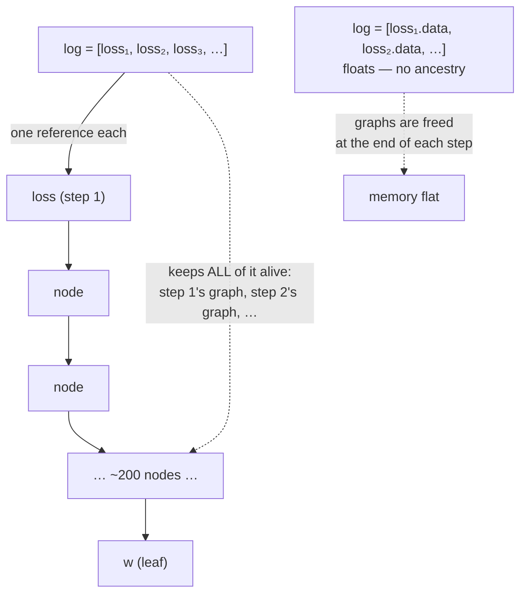

# 3.2 — 💥 The graph that was never freed

## One-line answer

Because every node holds references to its operands, keeping **one** node alive keeps its entire
ancestry alive — so appending a loss node to a log list instead of appending its number makes memory
grow linearly with the step count, measured here at 384 KiB held flat versus 76 MiB and climbing after
200 steps.

---

## The story

You write down what you spent each month, one line per month, on a single sheet of paper. Twelve
months later you have twelve lines and one sheet, and you can throw all the receipts away.

A friend does the same thing, with one difference. They write the month's total on a slip and then
staple that slip to the **shoebox of receipts** it came from.

They are not being careless. If anyone ever questions a total, the evidence is right there attached to
it. Every number is fully backed up.

But now nothing can ever be thrown away, because every total is fastened to a box. Twelve months later
their room has twelve shoeboxes in it, and the strange part is that you cannot point at a single
decision that was wrong. Keeping a monthly total: sensible. Keeping the receipts that prove it:
sensible. Keeping them together so they do not get separated: also sensible.

The entire cost is in the **staple**.
---

## The idea in plain language

Part [2.1](../02-the-autograd-engine/2.1-a-value-that-remembers.md) gave every node a `_prev` set
holding its operands. That is what makes the backward pass possible, and it has a consequence nobody
declares:

> A node keeps its operands alive. Its operands keep *their* operands alive. So a reference to any node
> is a reference to its entire ancestry, all the way back to the leaves.

Python frees an object when nothing refers to it any more. During a training loop, the natural
lifetime of a graph is one step: build it in the forward pass, walk it in the backward pass, drop it
when the local variable goes out of scope on the next iteration. That is what makes a training loop's
memory flat rather than growing.

Keep **one** reference to any node in that graph and the whole graph survives. And the most natural
thing anyone does in a training loop is keep a reference to a node:

```text
losses.append(loss)              # keeps the node — and everything behind it
losses.append(loss.data)         # keeps a float
```

The difference is five characters and the difference in memory is the whole graph, once per step,
forever.

The word for taking a value out of the graph deliberately is **detaching**. In the scalar engine it is
`.data`; in a framework it is a method whose name says the same thing. Detaching says: *I want the
number, not the history.*

Three places it happens in practice, all of them innocent:

- **Logging.** Appending a loss to a list to plot later.
- **Running statistics.** Keeping a moving average of something computed inside the graph.
- **Carrying state across steps.** In a recurrent model, passing a hidden state from one batch to the
  next — where forgetting to detach joins every step's graph into one that grows without bound.

---

## Why Akshara needs it

- **Day 25** trains the first model and logs the loss each step. This is the first place the bug can
  appear in this curriculum.
- **Day 27** builds a recurrent network and carries hidden state across batches — the third case above,
  where the consequence is unbounded and not merely per-step.
- **Day 51** builds the real training loop with proper logging, and the detach is one of the lines that
  looks like boilerplate and is not.
- **Day 67** runs on a free notebook session that is reclaimed if it exhausts memory. A leak here does
  not present as a memory problem; it presents as a lost session and a lost run.
- **Day 82** manages activation memory deliberately, which is impossible while an unnoticed leak is
  competing for the same budget.

---

## The mechanism

A training loop with one line switched, run both ways:

```python
import gc
import tracemalloc


def step(w: Value, n: int = 200) -> Value:
    """One 'training step': builds a graph of a few hundred nodes."""
    acc = Value(0.0)
    for i in range(n):
        acc = acc + w * float(i % 7 + 1)
    return acc.tanh()


def run(keep_graph: bool, steps: int) -> int:
    w = Value(1.0)
    log = []
    gc.collect()
    tracemalloc.start()
    base = tracemalloc.get_traced_memory()[0]
    for _ in range(steps):
        w.grad = 0.0
        loss = step(w)
        loss.backward()
        log.append(loss if keep_graph else loss.data)     # <- the entire bug
    gc.collect()
    used = tracemalloc.get_traced_memory()[0] - base
    tracemalloc.stop()
    return used
```

**Line by line:**
- `step` rebuilds the graph every call, exactly as a real forward pass does. `w` is the only thing that
  survives between calls, and it is a leaf.
- `log.append(loss if keep_graph else loss.data)` is the switch. `loss` is a node; `loss.data` is a
  float. Everything else in the loop is identical.
- `gc.collect()` is called **before** the baseline and **before** the final reading. Without it the
  measurement includes whatever the collector happened not to have run on yet, and the numbers wobble
  by megabytes between runs — measured, on an earlier version of this experiment, at 2871, 6244, 5619
  and 4343 KiB for what should have been a flat line. **A measurement that changes when unrelated code
  runs is not a measurement**, and forcing collection is what makes this one reproducible.
- `tracemalloc` rather than `sys.getsizeof`, for the reason part
  [2.1](../02-the-autograd-engine/2.1-a-value-that-remembers.md) gives: `getsizeof` does not follow
  references, and following references is precisely what this bug is about.
- `w.grad = 0.0` is there so the loop is otherwise correct — part
  [2.5](../02-the-autograd-engine/2.5-zero-grad-the-state-that-leaks.md)'s bug is not also running.

Measured on Intel Core i3-1115G4 (2 cores / 4 threads), 11.7 GB RAM, Windows 11, CPython 3.12.10,
2026-08-26:

```text
 steps |   detached (KiB) |   attached (KiB) | ratio
    10 |            382.8 |           3824.3 | 10x
    25 |            383.2 |           9560.6 | 25x
    50 |            384.0 |          19121.1 | 50x
   100 |            385.6 |          38242.3 | 99x
   200 |            388.7 |          76484.4 | 197x
```

Read the two columns as curves.

**The detached column is flat.** 382.8, 383.2, 384.0, 385.6, 388.7 KiB across a twentyfold increase in
steps. Each step's graph is built, walked and released, and the only thing that grows is the list of
floats — a few bytes per step. **That is what a healthy training loop looks like in a memory graph: a
horizontal line.**

**The attached column is a straight line through the origin.** 3.8, 9.6, 19.1, 38.2, 76.5 MiB. The
ratio column is the step count, almost exactly, because every step retains one whole graph and the
graphs are the same size. At 200 steps it is 76 MiB — for a toy loop with 200-node graphs and a single
scalar parameter.

Scale that honestly. A real forward pass does not build 200 nodes; part
[3.1](3.1-from-scalars-to-tensors.md) measured a single `(8, 512, 768)` activation at 12.0 MiB as an
array. A training run does not do 200 steps; Day 67 does thousands. **The bug's cost is
`graph size × step count`, and both factors are orders of magnitude larger in the run that matters.**

Why one reference is enough, drawn:



The fix, and where it goes:

```python
losses.append(loss.data)                       # a float — no ancestry
running = 0.9 * running + 0.1 * loss.data      # detach BEFORE combining
print(f"step {step}  loss {loss.data:.4f}")    # printing is already safe
```

**Line by line:**
- `loss.data` reads the number out. The node is still referenced by the local variable `loss`, which
  goes out of scope at the end of the iteration — so the graph is freed on schedule.
- The running-average line detaches **before** the arithmetic. Writing `running = 0.9 * running + 0.1 *
  loss` would build a *new node* out of `loss`, and then `running` — which survives every iteration —
  holds a reference to a chain that grows by one graph per step. **That is the same bug wearing a
  different shape, and it is harder to spot because there is no obvious list.**
- Printing with an f-string is already safe: formatting calls `__format__`, which produces a string,
  and the string holds no reference. Reading is safe; *storing a node* is not.

---

## When it breaks

There is no traceback on a laptop. What there is, is a memory graph with a slope, and eventually — on
a machine with a limit — this:

```text
Traceback (most recent call last):
  File "<stdin>", line 1, in <module>
numpy._core._exceptions._ArrayMemoryError: Unable to allocate 74.5 GiB for an array
and data type float64
```

That message is quoted from Day 2 part
[3.4](../../../day-002-tensors-shape-stride/parts/03-matmul/3.4-why-hardware-loves-matmul.md), where a
single pairwise subtraction asked for more memory than the machine had — and it is quoted here
deliberately, because it is what this leak looks like when it finally surfaces. **An out-of-memory
error names the allocation that happened to be last, not the one that was wrong.** A leak of this kind
shows up as a failure in some unrelated, perfectly reasonable line — whichever one asked for memory
after the leak had eaten it — and the traceback sends you to the wrong file entirely.

**The silent version, which is the normal one: nothing fails at all, until it does.** The run works.
Development runs are short and finish before the leak matters. The real run is longer, and it either
slows down as the system starts swapping or dies at step 4000 with an out-of-memory error in a
function that has been fine for 3999 steps.

On a free notebook session (Day 1 part
[4.4](../../../day-001-bootstrap-and-map/parts/04-free-compute/4.4-the-session-that-vanished.md)) it is
worse than that: a session killed for exhausting memory looks exactly like a session reclaimed for
being pre-empted, which is normal and expected. **The bug hides inside a legitimate explanation**, and
you would have no reason to look for it.

The check, and it belongs in the loop from step 0:

```python
import gc
import tracemalloc

tracemalloc.start()
for step in range(num_steps):
    ...
    if step % 100 == 0:
        gc.collect()
        current = tracemalloc.get_traced_memory()[0]
        print(f"step {step}  traced memory {current / 1024 / 1024:.1f} MiB")
```

**Line by line:**
- The number to watch is the **slope**, not the value. A loop that reports 40 MiB at step 0 and 40 MiB
  at step 1000 is healthy at any absolute size; one that climbs by a constant every hundred steps is
  leaking, and the constant is the size of one graph.
- `gc.collect()` before reading, for the same reason as in the experiment: without it the trend is
  buried in collector noise.
- Every 100 steps, not every step — the collection is not free, and the trend is what matters.
- The framework equivalent is the allocator's own memory statistics, and the reading is identical:
  flat is healthy, sloped is a leak.
- The test-suite version, which can go red:

```python
def test_training_loop_memory_is_flat():
    short = run(keep_graph=False, steps=25)
    long = run(keep_graph=False, steps=100)
    assert long < short * 1.5, f"memory grew with step count: {short} -> {long}"
```

**Line by line:**
- Four times the steps must **not** produce four times the memory. The `1.5` allows for the log list
  itself growing and for allocator noise, and it is loose on purpose: the failure this catches is a
  factor of four, not a factor of 1.6.
- Measured on this machine, 2026-08-26, the detached version gives `383.2 KiB -> 385.6 KiB` and passes
  comfortably; switching `keep_graph` to `True` gives `9560.6 KiB -> 38242.3 KiB` and fails by a factor
  of four. **Watch it go red before you trust it** (Principle 11).

---

## In production

**What a research engineer writes instead of the teaching version.** Detaching at the boundary,
reflexively, wherever a value crosses from "inside the step" to "outside the step". Anything that
outlives an iteration — a log list, a running average, a metric accumulator, a carried hidden state —
is a plain number or a detached tensor, never a live node. And inference runs with the graph disabled
entirely, because building a graph nobody will traverse costs both time and memory for nothing.

**What degrades at scale.** Both factors of `graph size × step count` at once. A real graph is
thousands of nodes holding megabytes of activations rather than a few hundred nodes holding floats,
and a real run is thousands of steps rather than 200. The 76 MiB measured here is the toy version of a
number that would be measured in hundreds of gigabytes, which is to say: it does not slow the run down,
it ends it.

**The failure that only shows with real data — carried state in a recurrent model.** Passing the hidden
state from batch `k` to batch `k + 1` without detaching joins the two graphs, so batch `k + 2`'s graph
includes both predecessors, and so on. Memory grows, and — worse — the backward pass now propagates
gradients through every previous batch, which is a *correctness* change as well as a memory one:
gradients that should have been truncated at the batch boundary flow arbitrarily far back. The
training is not merely slower; it is optimising something different. This is why the standard idiom in
recurrent training is to detach the carried state explicitly at every boundary, and it is Day 27's
subject.

**The review comment.** *"`losses.append(loss)` — that keeps the graph. Append `loss.item()`."* The
same comment applies to running averages, and those are the ones that get missed.

**The interview question.** *"Your training loop's memory grows steadily and you can't find an obvious
leak. Where do you look?"* The strong answer goes straight to references held across iterations —
logging lists, running metrics, carried state — and explains *why* one reference is enough: a node
holds its operands, so retaining any node retains its whole ancestry. Then it names the diagnostic:
watch the slope of memory against step count, not the absolute value. Someone who has actually
debugged it will also mention that the out-of-memory error, when it finally comes, points at an
innocent line.

**Compute tier: T0.** The whole failure is reproduced and measured on a laptop CPU with 200-node
graphs, in a fraction of a second, using only the standard library. That is worth appreciating: this
is a bug whose real-world form costs a T1 session, and its complete diagnosis is available at T0 for
nothing. What T0 cannot show is the consequence — a notebook session reclaimed at step 4000 with an
explanation that sounds entirely plausible — which is the reason to build the habit now.

---

## Check yourself

Run this. It prints **two memory figures; the first must be flat across step counts and the second must
not**:

```python
import gc
import tracemalloc


def run(keep_graph: bool, steps: int) -> float:
    w = Value(1.0)
    log = []
    gc.collect()
    tracemalloc.start()
    base = tracemalloc.get_traced_memory()[0]
    for _ in range(steps):
        w.grad = 0.0
        acc = Value(0.0)
        for i in range(200):
            acc = acc + w * float(i % 7 + 1)
        loss = acc.tanh()
        loss.backward()
        log.append(loss if keep_graph else loss.data)
    gc.collect()
    used = tracemalloc.get_traced_memory()[0] - base
    tracemalloc.stop()
    return used / 1024


for steps in (25, 100):
    print(f"steps={steps:4d}  detached={run(False, steps):9.1f} KiB   attached={run(True, steps):9.1f} KiB")
```

**Line by line:**
- On this machine, 2026-08-26, the detached figures are `383.2` and `385.6` KiB — a 2.4 KiB increase
  for four times the work. The attached figures are `9560.6` and `38242.3` KiB — almost exactly four
  times.
- **The ratio between the two attached figures is the step-count ratio.** That proportionality is the
  fingerprint: a leak that scales with iterations, not with anything else.
- Now change `log.append(...)` to a running average written as
  `running = running * 0.9 + loss * 0.1` with `running = Value(0.0)` outside the loop, and re-measure.
  Predict which column it resembles before you look.

**Say this out loud, without scrolling up:** explain why keeping one node alive keeps a whole graph
alive — and name the three places in an ordinary training loop where a node accidentally outlives its
step.
