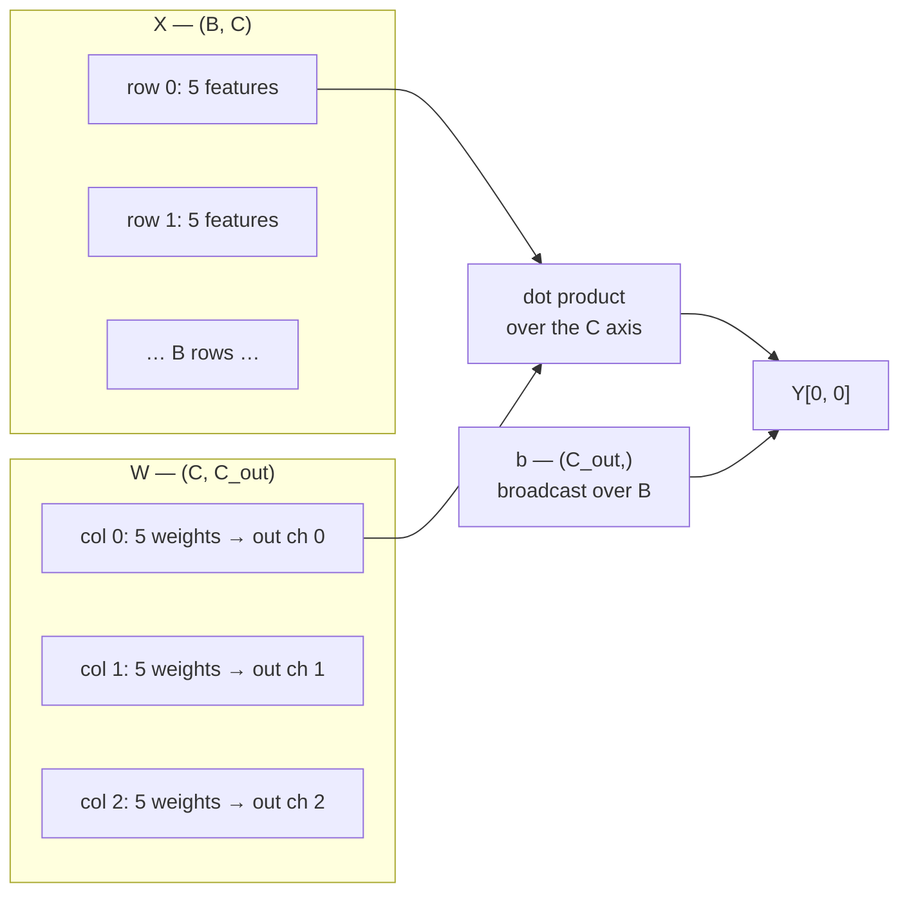

# 1.1 — A linear layer is a matmul plus a vector

## One-line answer

A linear layer is `Y = X @ W + b` — every input row is measured against every column of a weight
matrix and then shifted by a bias — and it is the only kind of layer in a transformer that holds
parameters, so everything you learn about differentiating it applies to the whole model.

---

## The story

A school report card starts with five marks: maths, science, english, history and drawing.

The card that goes home does not print those five numbers. It prints three: "science side", "language
side" and "overall".

So a teacher writes out a small table. For "science side", maths counts for 0.5, science for 0.4,
english for 0.1, and history and drawing for nothing at all. Then another five numbers for "language
side", and another five for "overall". Fifteen numbers in a grid, decided once, for the whole school.

Now filling in a report card is just arithmetic. Take a student's five marks, multiply each one by its
weight for the line you are filling in, add them up, and write the answer. Three lines, three sums.

Then one last thing per line. The staff noticed that "language side" always came out a few marks low
for everybody, so they agreed to add two to it, every time, for every student. Three lines, three
fixed numbers added on at the end.

Fifteen weights and three fixed numbers. That is a linear layer. Every new student who arrives is a
new row of five marks, and gets exactly the same treatment as everybody else.
---

## The idea in plain language

Two shapes, one operation, and a name for each piece.

Let `X` be the input: `B` rows, `C` numbers each. `B` is the **batch** — how many independent examples
are being processed at once — and `C` is the number of **channels** or **features** per example.

Let `W` be the weights: a grid of `C` rows by `C_out` columns. Column `j` of `W` holds one weight per
input channel, and it produces output channel `j`. So `W` has `C × C_out` numbers.

Let `b` be the bias: one number per output channel, so `C_out` of them.

Then:

> `Y = X @ W + b`, of shape `(B, C_out)`

The matmul is Day 2 part
[3.1](../../../day-002-tensors-shape-stride/parts/03-matmul/3.1-matmul-is-the-primitive.md)'s rule:
`(B, C) @ (C, C_out)` pairs the `C`s, they cancel, and `B` and `C_out` survive. The `+ b` is Day 2
part [2.1](../../../day-002-tensors-shape-stride/parts/02-broadcasting-and-indexing/2.1-broadcasting-the-rule.md)'s
rule: `(C_out,)` right-aligns against `(B, C_out)`, pads to `(1, C_out)` and stretches down the batch —
**one bias per output channel, shared by every example**.

Three properties matter for everything that follows:

**Every example is treated identically and independently.** Row `i` of `Y` depends only on row `i` of
`X`. The layer does not mix examples. That is why the batch axis is "free" — you can put any number of
examples through and the parameters do not change — and it is why the batch is a *convenience* for
hardware rather than part of the model.

**The parameters are `W` and `b`, and nothing else.** `X` is data. When Day 8 updates parameters, it
updates these two. The parameter count of this layer is `C × C_out + C_out`, and Day 39 sums that
expression over every layer in Akshara v0 and checks it by hand.

**It is linear, which is both its power and its limit.** Doubling an input doubles its contribution.
Stacking two linear layers with nothing between them gives another linear layer — `(X @ W₁) @ W₂` is
`X @ (W₁ W₂)` — so depth without a nonlinearity buys nothing at all. Day 35 is where the nonlinearity
goes, and this is why it has to.

---

## Why Akshara needs it

- **Day 26** builds a multi-layer perceptron, which is two of these with a nonlinearity between them.
- **Day 30** computes `Q`, `K` and `V`, each of which is one of these applied to the same input.
- **Day 35** is the feed-forward block: two of these, and together they hold most of a transformer's
  parameters.
- **Day 39** counts every parameter in Akshara v0 by hand. The count is `C × C_out + C_out` summed over
  every one of these in the model, and the day's gate is that your hand count matches the code.
- **Day 89** fine-tunes with LoRA, which replaces the update to `W` with a product of two much thinner
  matrices. That trick is only expressible if you know exactly what `W` is and what its gradient looks
  like — which is part [1.2](1.2-the-three-gradients.md).

There is no layer type in this curriculum that holds parameters and is not one of these, apart from the
embedding table (Day 18) and the normalization scales (Day 37). Learning to differentiate this one
thing covers almost the whole model.

---

## The mechanism

The forward pass, with every shape stated:

```python
import numpy as np

rng = np.random.default_rng(1337)

B, C, C_out = 4, 5, 3
X = rng.standard_normal((B, C))        # (B, C)      the batch of inputs
W = rng.standard_normal((C, C_out))    # (C, C_out)  the weights
b = rng.standard_normal(C_out)         # (C_out,)    one bias per output channel

Y = X @ W + b                          # (B, C_out)
print("X", X.shape, "@ W", W.shape, "+ b", b.shape, "->", Y.shape)
print("parameters:", W.size + b.size, "=", C * C_out, "+", C_out)
```

**Line by line:**
- `B, C, C_out = 4, 5, 3` are **three different numbers on purpose**. Day 2 part
  [4.1](../../../day-002-tensors-shape-stride/parts/04-where-they-meet/4.1-the-shape-was-right-the-answer-was-wrong.md)
  is the reason: with three equal sizes, an axis confusion produces the right shape and the wrong
  answer, and nothing in this document would catch it. Every example and every test in this day uses
  mutually distinct sizes.
- `rng = np.random.default_rng(1337)` seeds explicitly, so every number printed below is reproducible
  (Principle 9).
- `X @ W` pairs the two `C`s and they vanish. Reading the shapes left to right — `(4, 5)`, `(5, 3)` —
  the touching numbers are both 5, which is the one-second check to do before running anything.
- `+ b` broadcasts. `b` has no batch axis because a bias is a property of the *layer*, not of the
  example.
- On this machine (Intel Core i3-1115G4, CPython 3.12.10, numpy 2.5.2, 2026-08-26) it prints
  `X (4, 5) @ W (5, 3) + b (3,) -> (4, 3)` and `parameters: 18 = 15 + 3`.

Written out for one output element, because the sum is the thing the derivative acts on:

> `Y[i, j] = b[j] + Σ over k of X[i, k] · W[k, j]`

**That single formula is the whole layer**, and every gradient in part
[1.2](1.2-the-three-gradients.md) is read straight off it:

- `W[k, j]` appears in `Y[i, j]` for **every** `i`. So `W[k, j]` has `B` routes to the loss — one per
  example — and part [1.3](../../../day-003-derivatives-and-autograd/parts/01-the-derivative/1.3-partial-derivatives.md)
  says its gradient is the **sum** over those routes.
- `b[j]` appears in `Y[i, j]` for every `i` too, so it also has `B` routes.
- `X[i, k]` appears in `Y[i, j]` for every `j`. So it has `C_out` routes.

Every transpose in tomorrow's formulas is bookkeeping for **which axis the sum runs over**, and it is
determined entirely by the three sentences above.

The picture, with the axes labelled:



**The composition property, in code, because it is the argument for Day 35's existence:**

```python
W1 = rng.standard_normal((C, 8))       # (C, 8)
W2 = rng.standard_normal((8, C_out))   # (8, C_out)

two_layers = (X @ W1) @ W2             # (B, C_out)
one_layer = X @ (W1 @ W2)              # (B, C_out)
print("stacked equals collapsed:", np.allclose(two_layers, one_layer))
```

**Line by line:**
- `(X @ W1) @ W2` is what a two-layer network with no nonlinearity computes.
- `X @ (W1 @ W2)` collapses the two weight matrices into one `(C, C_out)` matrix **before** touching
  the data. Matrix multiplication is associative, so the results are equal.
- `np.allclose`, not `==` — Day 2 part
  [3.2](../../../day-002-tensors-shape-stride/parts/03-matmul/3.2-three-loops-then-one-call.md)
  measured why two correct orderings differ in the last bits. It prints `True` on this machine,
  2026-08-26.
- **Two linear layers are one linear layer.** Whatever the second layer can express, a single layer
  with the product of the weights can express too. Stacking these without something nonlinear between
  them adds parameters and adds no capability, which is a fact worth being able to demonstrate rather
  than repeat.

---

## Shapes

| Tensor | Symbolic shape | Concrete here | What each axis means |
| --- | --- | --- | --- |
| `X` | `(B, C)` | `(4, 5)` | example in the batch · input channel |
| `W` | `(C, C_out)` | `(5, 3)` | input channel · output channel |
| `b` | `(C_out,)` | `(3,)` | output channel; broadcast over the batch |
| `X @ W` | `(B, C_out)` | `(4, 3)` | the `C` axis is consumed by the dot product |
| `Y` | `(B, C_out)` | `(4, 3)` | example · output channel |
| `W1` | `(C, H)` | `(5, 8)` | a hidden width `H` between two layers |
| `W1 @ W2` | `(C, C_out)` | `(5, 3)` | two layers collapsed into one — the composition argument |

Parameters: `C · C_out + C_out` = 15 + 3 = **18**. The batch size `B` appears nowhere in that count,
which is the "every example treated identically" property expressed as arithmetic.

---

## When it breaks

The loud one, and it is the message you will see most often in this entire curriculum:

```console
>>> import numpy as np
>>> X = np.ones((4, 5))
>>> W = np.ones((3, 5))
>>> X @ W
Traceback (most recent call last):
  File "<stdin>", line 1, in <module>
ValueError: matmul: Input operand 1 has a mismatch in its core dimension 0, with gufunc signature (n?,k),(k,m?)->(n?,m?) (size 3 is different from 5)
```

Verbatim on this machine, 2026-08-26. `W` was built transposed. The tempting fix is `X @ W.T`, and it
even works — but ask first whether `W` should have been `(5, 3)` all along, because a `.T` at the call
site means every *other* use of `W` now needs one too, and one of them will be forgotten.

The other loud one, from a bias with the wrong length:

```console
>>> Y = np.ones((4, 3))
>>> b = np.ones(4)
>>> Y + b
Traceback (most recent call last):
  File "<stdin>", line 1, in <module>
ValueError: operands could not be broadcast together with shapes (4,3) (4,)
```

A bias of length `B` instead of `C_out`. Right-aligned, `(4,)` pads to `(1, 4)` and 4 does not match 3.
**This one only raises because `B ≠ C_out`** — which is precisely why the sizes in this document are
mutually distinct, and why your tests should be too.

**The silent version.** Make `B` equal to `C_out` and the same mistake is legal:

```console
>>> Y = np.ones((3, 3))
>>> b = np.ones(3)            # meant per-output-channel; could equally be per-example
>>> (Y + b).shape
(3, 3)
```

There is no way to tell from the shapes which the author meant, and both are legal. The check is a
**value** test with distinguishable numbers, which is Day 2 part
[4.1](../../../day-002-tensors-shape-stride/parts/04-where-they-meet/4.1-the-shape-was-right-the-answer-was-wrong.md)'s
conclusion applied here:

```python
def test_bias_is_per_output_channel():
    B, C, C_out = 2, 3, 4                       # deliberately all different
    X = np.zeros((B, C))                        # (B, C)
    W = np.zeros((C, C_out))                    # (C, C_out)
    b = np.array([10.0, 20.0, 30.0, 40.0])      # (C_out,) — all values distinct

    Y = X @ W + b                               # (B, C_out)
    np.testing.assert_allclose(Y[0], b)
    np.testing.assert_allclose(Y[1], b)
```

**Line by line:**
- `X` and `W` are zero, so the matmul contributes nothing and the test isolates the bias.
- `b` has four **distinct** values. A bias of `[1, 1, 1, 1]` would pass whichever axis it was broadcast
  along — the symmetry in the test data is the symmetry the test cannot see.
- `B = 2`, `C = 3`, `C_out = 4` are mutually distinct, so the wrong-length bias raises instead of
  broadcasting.
- Asserting **both** rows equal `b` is what pins the direction: a per-example bias would give row 0 and
  row 1 different values.

---

## In production

**What a research engineer writes instead of the teaching version.** They call the framework's linear
layer, which stores `W` **transposed** — as `(C_out, C)` — and computes `X @ W.T`. That is not
arbitrary: it makes each output channel's weights contiguous in memory, which is the layout the matmul
kernel wants, for exactly the reason Day 2 part
[1.3](../../../day-002-tensors-shape-stride/parts/01-what-a-tensor-is/1.3-strides-and-the-free-transpose.md)
measured. **So the very first thing to check when reading someone's layer code is which convention it
uses**, because every gradient formula flips with it and the two conventions are indistinguishable in
a square layer.

**What degrades at scale.** Nothing about the operation — it is a matmul, which is the one operation
that gets *more* efficient as it gets larger (Day 2 part
[3.4](../../../day-002-tensors-shape-stride/parts/03-matmul/3.4-why-hardware-loves-matmul.md)). What
grows is the parameter count, as `C × C_out`. Doubling the width of a model quadruples the parameters
in every one of these layers, which is why width is the expensive dimension and why Day 66's sizing
arithmetic is dominated by these matrices.

**The failure that only shows with real data.** A bias that absorbs the mean. If the input features are
not centred — real data rarely is — the bias ends up carrying the offset, which is fine, but it also
means the layer's behaviour changes if the input distribution shifts. That is one of the arguments for
normalization on Day 37, and it is the kind of thing that is invisible on synthetic zero-mean test
data and obvious on a real corpus.

**The review comment.** *"Is `W` stored `(C, C_out)` or `(C_out, C)`? Say so in the docstring — the
backward pass depends on it and the shapes don't."*

**The interview question.** *"Why does a neural network need a nonlinearity between its layers?"* The
strong answer is the demonstration above rather than a definition: two linear layers compose to a
single linear layer, `(X W₁) W₂ = X (W₁ W₂)`, so depth without a nonlinearity adds parameters and no
expressive power. If it adds that the collapsed matrix is the *product*, and that this is exactly why
low-rank adapters work, that is someone who has thought about it.

**Compute tier: T0.** Everything here runs on a laptop CPU at `B = 4`. The T0 version proves the
**shape rules, the parameter count and the composition property** exactly — all three are algebra and
transfer to any size and any hardware. It proves nothing about throughput; the layer's cost at real
widths is Day 2 part 3.4's arithmetic and Day 66's budget.

---

## Check yourself

Run this. It prints **one shape, one parameter count and one boolean**, and the boolean must be `True`:

```python
import numpy as np

rng = np.random.default_rng(1337)
B, C, C_out = 4, 5, 3
X = rng.standard_normal((B, C))
W = rng.standard_normal((C, C_out))
b = rng.standard_normal(C_out)

print("Y shape        :", (X @ W + b).shape)
print("parameters     :", W.size + b.size, "= C*C_out + C_out =", C * C_out + C_out)

W1 = rng.standard_normal((C, 8))
W2 = rng.standard_normal((8, C_out))
print("two layers == one:", np.allclose((X @ W1) @ W2, X @ (W1 @ W2)))
```

**Line by line:**
- The shape prints `(4, 3)` and the count prints `18 = C*C_out + C_out = 18`. **Say both out loud
  before running**, from the shapes alone.
- The boolean prints `True`. That is the argument for Day 35 in one line: without something nonlinear
  between them, the two layers you just paid for are one layer.
- Now set `C_out = 4` so that `C_out == B`, and change `b` to `rng.standard_normal(B)`. It will not
  raise. Say what the layer now computes.

**Say this out loud, without scrolling up:** state the shape rule for `Y = X @ W + b` naming every
axis — and say how many routes a single weight `W[k, j]` has to the loss, and why that number is `B`.
