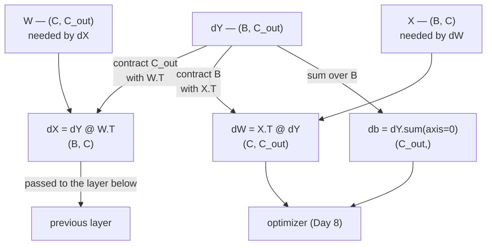

# 1.2 — The three gradients: `dX`, `dW` and `db`

## One-line answer

A linear layer has three inputs — the data, the weights and the bias — so its backward pass produces
three gradients, each one derived by asking the same question: *which output elements did this thing
touch, and what did it multiply?*

---

## The story

Your phone bill is ₹40 higher than you expected, and you want to know which one thing to argue about.

You do not re-live the month. You ask three separate questions, one for each thing that could have
caused it.

Was the **per-minute rate** wrong? That rate was applied to every single call you made, so to see what
it cost you, you have to add its effect up across all of them.

Was the **length of one call** recorded wrong? Then only that one line of the bill moves, and every
other line is untouched.

Was the **fixed monthly rental** wrong? That one number sits underneath the whole bill, once, so its
effect is one number too.

Three questions, three different shapes of answer: something per rate, something per call, and one
number on its own. And what decides the shape is not the arithmetic. It is **how many places that
thing showed up**.
---

## The idea in plain language

Part [1.1](1.1-a-layer-is-a-matmul-plus-a-vector.md) wrote the layer out one element at a time:

> `Y[i, j] = b[j] + Σ over k of X[i, k] · W[k, j]`

The backward pass starts with `dY`, the gradient of the loss with respect to `Y` — one number per
output element, the same shape as `Y`. Where `dY` comes from is somebody else's problem: it is handed
in by whatever consumed `Y`. This is the locality property from Day 3 part
[1.2](../../../day-003-derivatives-and-autograd/parts/01-the-derivative/1.2-the-chain-rule.md), and it
is why a layer can be written and tested on its own.

Now apply the two rules from Day 3 part
[1.3](../../../day-003-derivatives-and-autograd/parts/01-the-derivative/1.3-partial-derivatives.md) —
multiply along a path, add across paths — to each of the three inputs in turn.

**The bias `b[j]`.** It appears in `Y[i, j]` for every `i`, with a coefficient of 1. So it has `B`
routes to the loss, each contributing `1 × dY[i, j]`. Add them:

> `db[j] = Σ over i of dY[i, j]`

which is `dY` summed over the **batch** axis. Shape `(C_out,)` — the same shape as `b`, which is the
first sanity check and always holds: **a gradient has the shape of the thing it is a gradient of.**

**The weight `W[k, j]`.** It appears in `Y[i, j]` for every `i`, multiplied by `X[i, k]`. So it also
has `B` routes, each contributing `X[i, k] × dY[i, j]`:

> `dW[k, j] = Σ over i of X[i, k] · dY[i, j]`

Shape `(C, C_out)`, matching `W`.

**The input `X[i, k]`.** It appears in `Y[i, j]` for every `j`, multiplied by `W[k, j]`. So it has
`C_out` routes:

> `dX[i, k] = Σ over j of W[k, j] · dY[i, j]`

Shape `(B, C)`, matching `X`.

Three sums, and each one runs over a different axis: `db` sums over `i` (batch), `dW` sums over `i`
(batch), `dX` sums over `j` (output channels). **Every transpose in the matrix form is bookkeeping for
which axis is being summed**, and that is part [1.3](1.3-the-transpose-everyone-gets-wrong.md).

Two habits that follow immediately and are worth adopting today:

- **Check shapes first.** `dX` must match `X`, `dW` must match `W`, `db` must match `b`. This catches
  most errors before any arithmetic runs — and part
  [1.5](1.5-the-transpose-that-trained-anyway.md) is about the case where it does not.
- **Ask "how many routes"** rather than trying to remember a formula. The number of routes tells you
  which axis the sum runs over, and the sum tells you the shape.

---

## Why Akshara needs it

- **Day 26 onward**, every backward pass in every model is these three formulas, applied once per
  layer.
- **Day 8**'s optimizer consumes `dW` and `db` and never sees `dX`. `dX` exists only to be passed to
  the layer below — which is why the very first layer's `dX` is computed and thrown away, and why
  frameworks let you switch it off for a frozen input.
- **Day 89**'s LoRA freezes `W` and trains two thin matrices instead. Knowing that `dW = X.T @ dY` is
  an outer-product-like structure is what makes it obvious that a low-rank update can capture much of
  it.
- **Day 82**'s activation checkpointing hinges on the fact that `dW` **needs `X`** — the forward input
  must survive until the backward pass, which is why activations dominate training memory.
- **Day 32**'s multi-head attention has a batch and a head axis in front, and `db`'s sum runs over both.
  The rule generalises exactly: sum over every axis that was broadcast or batched.

---

## The mechanism

The three gradients in matrix form, with every shape stated:

```python
import numpy as np

rng = np.random.default_rng(1337)

B, C, C_out = 4, 5, 3
X = rng.standard_normal((B, C))        # (B, C)
W = rng.standard_normal((C, C_out))    # (C, C_out)
b = rng.standard_normal(C_out)         # (C_out,)

Y = X @ W + b                          # (B, C_out)   forward
dY = 2 * Y                             # (B, C_out)   pretend the loss is (Y**2).sum()

dX = dY @ W.T                          # (B, C_out) @ (C_out, C) -> (B, C)
dW = X.T @ dY                          # (C, B) @ (B, C_out)     -> (C, C_out)
db = dY.sum(axis=0)                    # sum over the batch axis -> (C_out,)

print("dX", dX.shape, "== X", X.shape, ":", dX.shape == X.shape)
print("dW", dW.shape, "== W", W.shape, ":", dW.shape == W.shape)
print("db", db.shape, "== b", b.shape, ":", db.shape == b.shape)
```

**Line by line:**
- `dY = 2 * Y` is the gradient of `(Y**2).sum()` with respect to `Y`, by the power rule from Day 3
  part [1.1](../../../day-003-derivatives-and-autograd/parts/01-the-derivative/1.1-the-slope-from-the-definition.md).
  A sum-of-squares is chosen as the stand-in loss because its own gradient is trivial, so any error
  found below is in the *layer* and not in the loss.
- `dX = dY @ W.T` reads as: for each example `i` and input channel `k`, sum over output channels `j`.
  `dY` is `(B, C_out)` and `W.T` is `(C_out, C)`, so the matmul contracts over `C_out` — **exactly the
  axis the derivation said to sum over.**
- `dW = X.T @ dY` contracts over `B`. `X.T` is `(C, B)` and `dY` is `(B, C_out)`, so the shared axis is
  the batch, which is what "sum over `i`" means.
- `db = dY.sum(axis=0)` sums over the batch axis explicitly, because there is no matmul to hide it in.
  **This is backpropagation through a broadcast**, exactly as Day 3 part
  [3.1](../../../day-003-derivatives-and-autograd/parts/03-scaling-up/3.1-from-scalars-to-tensors.md)
  predicted: the forward pass stretched `b` across `B` positions, so the backward pass sums over those
  `B` positions.
- `axis=0` and not `axis=-1`. The bias was broadcast along the **batch**, so that is the axis to
  collapse. Writing `axis=-1` would sum over output channels and give a `(B,)` — a legal array of the
  wrong meaning.
- On this machine (Intel Core i3-1115G4, CPython 3.12.10, numpy 2.5.2, seed 1337, 2026-08-26) all three
  comparisons print `True`.

The three formulas as a picture, with the contracted axis labelled on each arrow:



Two structural facts are visible in that diagram and both matter later:

- **`dW` needs `X`** — the forward input. It must be kept alive from the forward pass to the backward
  pass. That is the memory cost Day 82 trades against recomputation.
- **`dX` needs `W`** — but not `X`. So a layer whose input needs no gradient can skip `dX` entirely,
  which is what happens at the very bottom of a network and for any frozen input.

Now prove all three against an independent method, because a derivation you have not checked is a
guess:

```python
def numgrad(f, A, h=1e-5):
    """Central difference for every element of A, in place. Returns an array shaped like A."""
    g = np.zeros_like(A)
    it = np.nditer(A, flags=["multi_index"])
    while not it.finished:
        i = it.multi_index
        old = A[i]
        A[i] = old + h
        up = f()
        A[i] = old - h
        down = f()
        A[i] = old
        g[i] = (up - down) / (2 * h)
        it.iternext()
    return g


def relerr(analytic, numeric):
    return float(np.max(np.abs(analytic - numeric) / np.maximum(1e-12, np.abs(analytic) + np.abs(numeric))))


loss = lambda: float(((X @ W + b) ** 2).sum())
print(f"rel err dX: {relerr(dX, numgrad(loss, X)):.3e}")
print(f"rel err dW: {relerr(dW, numgrad(loss, W)):.3e}")
print(f"rel err db: {relerr(db, numgrad(loss, b)):.3e}")
```

**Line by line:**
- `np.nditer` with `multi_index` walks every element of an array of any rank, which is what lets one
  function check `X`, `W` and `b` without knowing their shapes.
- `A[i] = old` **restores** the element before moving on. Forgetting that line leaves the array
  permanently perturbed and every subsequent element is measured at the wrong point — a bug that
  produces plausible-looking nonsense.
- `h = 1e-5` is the measured optimum for a central difference in `float64` from Day 3 part
  [1.5](../../../day-003-derivatives-and-autograd/parts/01-the-derivative/1.5-the-finite-difference-that-lied.md),
  not a guess.
- `relerr` normalises by the **sum** of the magnitudes so it behaves when either side is near zero.
  Part [2.2](../02-gradient-checking/2.2-the-relative-error-criterion.md) is why.
- Measured on this machine, 2026-08-26: `dX 2.464e-10`, `dW 1.856e-10`, `db 5.546e-10`. All three
  around `10⁻¹⁰`, which for `float64` central differences is agreement rather than approximation.

---

## Shapes

| Tensor | Symbolic shape | Concrete here | What each axis means |
| --- | --- | --- | --- |
| `X` | `(B, C)` | `(4, 5)` | example · input channel |
| `W` | `(C, C_out)` | `(5, 3)` | input channel · output channel |
| `b` | `(C_out,)` | `(3,)` | output channel |
| `Y` | `(B, C_out)` | `(4, 3)` | example · output channel |
| `dY` | `(B, C_out)` | `(4, 3)` | **handed in** — one gradient per output element |
| `W.T` | `(C_out, C)` | `(3, 5)` | a view, not a copy (Day 2 part 1.3) |
| `dX = dY @ W.T` | `(B, C)` | `(4, 5)` | contracts `C_out`; matches `X` |
| `X.T` | `(C, B)` | `(5, 4)` | a view |
| `dW = X.T @ dY` | `(C, C_out)` | `(5, 3)` | contracts `B`; matches `W` |
| `db = dY.sum(axis=0)` | `(C_out,)` | `(3,)` | sums `B`; matches `b` |

**Every gradient has the shape of the thing it differentiates.** That invariant is the cheapest check
in this document and it holds for every operation in the curriculum.

---

## When it breaks

The loud one — the transpose omitted:

```console
>>> dX = dY @ W
Traceback (most recent call last):
  File "<stdin>", line 1, in <module>
ValueError: matmul: Input operand 1 has a mismatch in its core dimension 0, with gufunc signature (n?,k),(k,m?)->(n?,m?) (size 5 is different from 3)
```

Verbatim on this machine, 2026-08-26. `dY` is `(4, 3)` and `W` is `(5, 3)`; the touching numbers are 3
and 5. The message is doing the shape check for you, which is why non-square layers are a gift.

The other loud one — the bias summed over the wrong axis, when it happens to be caught:

```console
>>> db = dY.sum(axis=1)
>>> db.shape
(4,)
>>> b.shape
(3,)
```

No exception at the sum — the failure surfaces one line later, at `b -= lr * db`, or not at all if
`B == C_out`. **The shape assertion is what turns this into an immediate failure**, which is the check
below.

**The silent version, and it is what part [1.5](1.5-the-transpose-that-trained-anyway.md) is entirely
about.** When `B`, `C` and `C_out` coincide, every wrong transpose is legal:

```console
>>> n = 4
>>> X = np.ones((n, n)); dY = np.ones((n, n))
>>> (X.T @ dY).shape, (X @ dY).shape
((4, 4), (4, 4))
```

Two different quantities, one shape, no error. Part 1.5 measures what that does to a training run.

The check, and it costs three lines:

```python
def linear_backward(X, W, dY):
    dX = dY @ W.T
    dW = X.T @ dY
    db = dY.sum(axis=0)
    assert dX.shape == X.shape, f"dX {dX.shape} != X {X.shape}"
    assert dW.shape == W.shape, f"dW {dW.shape} != W {W.shape}"
    assert db.shape == (W.shape[1],), f"db {db.shape} != (C_out,) = {(W.shape[1],)}"
    return dX, dW, db
```

**Line by line:**
- Three assertions, one per gradient, comparing against the thing being differentiated. This is the
  invariant from the `## Shapes` table, written down.
- `db` is compared against `(W.shape[1],)` rather than against `b.shape`, so the function does not need
  `b` at all — the bias's *value* is irrelevant to its gradient, which is itself worth noticing.
- Each message prints **both** shapes. `dW (4, 5) != W (5, 4)` names a transpose instantly.
- These assertions cost microseconds and catch every non-square version of this bug. They catch **none**
  of the square version, which is why part 1.5 exists and why the gradient check in section 2 is the
  real defence.

---

## In production

**What a research engineer writes instead of the teaching version.** They let the framework do it — and
they can still write these three lines from memory, because custom operations are common and every one
needs them. The reasoning they use is not memorisation but the route-counting from the *idea* section:
"which outputs did this touch, and what did it multiply?" That derivation works for operations nobody
has written down for you, which is the point.

They also know which gradients can be skipped. A framework tracks whether each input requires a
gradient, and a layer at the bottom of the network, or one with a frozen weight, computes only what is
needed. On Day 89's LoRA fine-tune, `W` is frozen: `dW` is never computed, and skipping it saves both
the matmul and the memory for a full-size gradient tensor.

**What degrades at scale.** The backward pass costs about **twice** the forward pass, and the shapes
above say why: the forward pass is one matmul, and the backward pass is two — `dY @ W.T` and
`X.T @ dY` — each with the same flop count as the forward one (Day 2 part
[3.1](../../../day-002-tensors-shape-stride/parts/03-matmul/3.1-matmul-is-the-primitive.md)). So a
training step is roughly three times a forward pass, which is the arithmetic behind every training-cost
estimate in this curriculum, including Day 66's.

**The failure that only shows with real data.** A batch axis that is sometimes 1. `db = dY.sum(axis=0)`
on a batch of size 1 gives the same shape as on a batch of size 32, so nothing changes — but if a
different axis was being summed by mistake, the last ragged batch of an epoch is where the shapes
finally disagree, and the run fails at the end of epoch 1 rather than at step 1. Testing with a batch
of 1 *and* a batch of several is a cheap habit that catches this.

**The review comment.** *"`db` sums over axis 0 — is that the axis the bias was broadcast along? Say so
in a comment; with a batch-first layout it is, and with a different layout it isn't."*

**The interview question.** *"Derive the gradient of `Y = XW + b` with respect to `W`."* The strong
answer does not recall `X.T @ dY`; it derives it in three sentences — `W[k, j]` appears in `Y[i, j]`
for every `i`, multiplied by `X[i, k]`, so its gradient sums over `i`, which contracts the batch axis
— and then writes the matrix form and **checks the shape**. Someone who states the formula and cannot
say which axis is contracted has memorised it.

**Compute tier: T0.** Every number here is a laptop CPU measurement at `B = 4`, and the agreement to
`10⁻¹⁰` is a property of `float64` arithmetic rather than of the machine. The derivation is exact and
transfers to any size. What does not transfer is the *cost*: the 2× backward-versus-forward ratio is
arithmetic, and whether it holds in wall-clock terms depends on the hardware, which Day 51 measures.

---

## Check yourself

Run this. It prints **three relative errors, and all three must be below `10⁻⁸`**:

```python
import numpy as np

rng = np.random.default_rng(1337)
B, C, C_out = 4, 5, 3
X = rng.standard_normal((B, C))
W = rng.standard_normal((C, C_out))
b = rng.standard_normal(C_out)

Y = X @ W + b
dY = 2 * Y
dX, dW, db = dY @ W.T, X.T @ dY, dY.sum(axis=0)


def numgrad(f, A, h=1e-5):
    g = np.zeros_like(A)
    it = np.nditer(A, flags=["multi_index"])
    while not it.finished:
        i = it.multi_index
        old = A[i]
        A[i] = old + h; up = f()
        A[i] = old - h; down = f()
        A[i] = old
        g[i] = (up - down) / (2 * h)
        it.iternext()
    return g


def relerr(a, n):
    return float(np.max(np.abs(a - n) / np.maximum(1e-12, np.abs(a) + np.abs(n))))


loss = lambda: float(((X @ W + b) ** 2).sum())
print(f"dX: {relerr(dX, numgrad(loss, X)):.3e}")
print(f"dW: {relerr(dW, numgrad(loss, W)):.3e}")
print(f"db: {relerr(db, numgrad(loss, b)):.3e}")
```

**Line by line:**
- On this machine, 2026-08-26, it prints `2.464e-10`, `1.856e-10` and `5.546e-10`.
- Now delete the `A[i] = old` restore line and re-run. **Predict which of the three errors goes wrong
  first, and why**, before you look.
- Then swap `dW = X.T @ dY` for `dW = dY.T @ X` and re-run. It raises — say which of the two operands
  the message names, from the shapes alone, before reading it.

**Say this out loud, without scrolling up:** for each of the three gradients, name the axis that is
summed over and say why — and state the invariant that every gradient's shape must satisfy.
