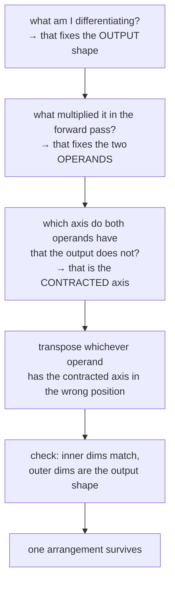

# 1.3 — The transpose everyone gets wrong, derived from shapes alone

## One-line answer

You never have to remember where the `.T` goes: there is exactly one arrangement of the two operands
that produces a matmul whose inner dimensions match **and** whose output has the right shape, so
writing down the three shapes determines the formula uniquely.

---

## The story

A child is doing a jigsaw puzzle. There is one gap left and one piece left, and the piece is the wrong
way round.

They do not look anything up. They look at the piece — a tab sticking out of one edge, a notch cut
into another — and they look at the gap. There is exactly one way round in which the tab meets the
notch. The other three ways do not physically fit, and you can see that without trying them.

Somebody who has memorised "tab on the left" is fine until the box gets turned around. Somebody who
looks at the shapes is never wrong, and never has to remember anything in the first place.

Matrix gradients are jigsaw pieces. Two things to combine, two possible orders, and each one can be
turned around — and exactly one of those combinations fits.
---

## The idea in plain language

Part [1.2](1.2-the-three-gradients.md) derived the three gradients from the index formula. This part is
the shortcut you will actually use, and it needs no calculus at all.

You know three things before you start:

1. **The gradient's shape.** It equals the shape of the thing being differentiated. `dW` is `(C, C_out)`
   because `W` is.
2. **The two ingredients.** From the derivation, `dW` is built from `X` and `dY`, and `dX` from `dY`
   and `W`. Which two things go into each gradient comes from the forward formula: whatever multiplied
   the thing you are differentiating.
3. **The matmul rule** from Day 2 part
   [3.1](../../../day-002-tensors-shape-stride/parts/03-matmul/3.1-matmul-is-the-primitive.md): the
   inner dimensions must match and vanish; the outer two survive.

Those three constraints leave exactly one answer. Work `dW` through:

```text
    want:      dW is (C, C_out)
    have:      X is (B, C)        dY is (B, C_out)
    outer dims of the answer are C and C_out
      -> C must come from X, and it is X's SECOND axis
      -> so X must be transposed: X.T is (C, B)
      -> C_out must come from dY, and it is dY's second axis: fine as is
    try:       X.T @ dY  =  (C, B) @ (B, C_out)  ->  inner B and B match  ✓  gives (C, C_out)  ✓
```

There is no other arrangement that works, and you can check that by trying them:

| Candidate | Shapes | Result |
| --- | --- | --- |
| `X.T @ dY` | `(C, B) @ (B, C_out)` | `(C, C_out)` ✓ **the answer** |
| `X @ dY` | `(B, C) @ (B, C_out)` | inner `C` vs `B` — raises unless `B == C` |
| `dY.T @ X` | `(C_out, B) @ (B, C)` | `(C_out, C)` — the **transpose** of the answer |
| `dY @ X` | `(B, C_out) @ (B, C)` | inner `C_out` vs `B` — raises unless they are equal |

Three of the four are wrong and two of the three raise. The one that does not raise gives the
transposed answer, which will then raise one line later at `W -= lr * dW` — unless `C == C_out`.

**The rule, stated once:** *the axis being contracted is the one the two operands share and the answer
does not have.* For `dW`, `X` and `dY` share `B` and the answer has no `B`, so `B` is contracted, and
whichever operand has `B` in the wrong position gets transposed.

That is the whole method, and it works for every gradient of every operation in this curriculum,
including attention's on Day 30 where there are four axes and the shapes are the only thing keeping
anyone honest.

---

## Why Akshara needs it

- **Day 30** derives the backward pass of `Q @ K.T`, where both operands are rank 4 and the contracted
  axis is neither the first nor the last. Nobody remembers that formula; everybody derives it from
  shapes.
- **Day 32**'s multi-head reshape puts two batch axes in front, so every gradient is a batched matmul.
  The rule generalises without change because Day 2 part
  [3.3](../../../day-002-tensors-shape-stride/parts/03-matmul/3.3-batched-matmul.md) says the leading
  axes are just carried along.
- **Day 37**'s normalization has a genuinely awkward backward pass, and shape-first is what makes it
  tractable.
- **Day 89**'s LoRA inserts `A @ Bm` in place of `W`. Deriving the gradients for `A` and `Bm` is this
  method applied twice, and getting it wrong silently trains the wrong subspace.

---

## The mechanism

Do the derivation for all three gradients, mechanically:

```text
dX  want (B, C)      from dY (B, C_out) and W (C, C_out)
    B comes from dY's first axis        -> dY as is
    C comes from W's first axis, but it must end up SECOND
                                        -> W.T is (C_out, C)
    dY @ W.T = (B, C_out) @ (C_out, C) = (B, C)   inner C_out matches  ✓

dW  want (C, C_out)  from X (B, C) and dY (B, C_out)
    C comes from X's second axis, must end up FIRST  -> X.T is (C, B)
    X.T @ dY = (C, B) @ (B, C_out) = (C, C_out)   inner B matches  ✓

db  want (C_out,)    from dY (B, C_out)
    no matmul available — one operand
    the only axis to remove is B        -> dY.sum(axis=0)  ✓
```

Now confirm it by trying every candidate and letting the library judge:

```python
import numpy as np

rng = np.random.default_rng(1337)
B, C, C_out = 4, 5, 3
X = rng.standard_normal((B, C))          # (B, C)
W = rng.standard_normal((C, C_out))      # (C, C_out)
dY = rng.standard_normal((B, C_out))     # (B, C_out)

candidates = {
    "dY @ W.T": lambda: dY @ W.T,
    "dY @ W":   lambda: dY @ W,
    "W @ dY":   lambda: W @ dY,
    "X.T @ dY": lambda: X.T @ dY,
    "X @ dY":   lambda: X @ dY,
    "dY.T @ X": lambda: dY.T @ X,
}
for name, fn in candidates.items():
    try:
        print(f"  {name:10s} -> {fn().shape}")
    except ValueError as exc:
        print(f"  {name:10s} -> ValueError: {str(exc)[:60]}...")
```

**Line by line:**
- `B, C, C_out = 4, 5, 3` are mutually distinct. **With three equal sizes every candidate above would
  succeed** and this whole exercise would prove nothing — which is part
  [1.5](1.5-the-transpose-that-trained-anyway.md)'s subject.
- `dY` is generated directly rather than computed from a loss, because this part is about shapes and
  the *values* are irrelevant to the question being asked.
- Catching `ValueError` and printing a truncated message keeps the output readable; the full messages
  are in *When it breaks*.
- Measured on this machine (Intel Core i3-1115G4, CPython 3.12.10, numpy 2.5.2, 2026-08-26):

```text
  dY @ W.T   -> (4, 5)
  dY @ W     -> ValueError: matmul: Input operand 1 has a mismatch in its core dimension...
  W @ dY     -> ValueError: matmul: Input operand 1 has a mismatch in its core dimension...
  X.T @ dY   -> (5, 3)
  X @ dY     -> ValueError: matmul: Input operand 1 has a mismatch in its core dimension...
  dY.T @ X   -> (3, 5)
```

Read that output as the argument: of six candidates, **three raise**, one gives `(3, 5)` — the
transpose of `dW` — and exactly two give the shapes we wanted, `(4, 5)` for `dX` and `(5, 3)` for `dW`.
The shapes did the work.

Note `dY.T @ X` giving `(3, 5)`. It is the transpose of the correct `dW`, and it is the single most
common wrong answer, because it *is* correct — for a layer whose weights are stored `(C_out, C)`.
**Which convention `W` uses decides which of these two is right**, which is why part
[1.1](1.1-a-layer-is-a-matmul-plus-a-vector.md) said to write the convention in the docstring.

The method as a decision procedure:



And the reason it works, which is worth stating once so the method does not feel like a trick: a matmul
can only ever contract **one** axis, the two operands must agree on it, and the output is everything
else. So specifying the output shape and the operands over-determines the arrangement. It is not a
coincidence that the shapes are enough — it is a consequence of matmul having exactly one degree of
freedom.

---

## Shapes

| Tensor | Symbolic shape | Concrete here | What each axis means |
| --- | --- | --- | --- |
| `X` | `(B, C)` | `(4, 5)` | example · input channel |
| `W` | `(C, C_out)` | `(5, 3)` | input channel · output channel |
| `dY` | `(B, C_out)` | `(4, 3)` | example · output channel |
| `W.T` | `(C_out, C)` | `(3, 5)` | a view — free (Day 2 part 1.3) |
| `X.T` | `(C, B)` | `(5, 4)` | a view |
| `dY @ W.T` | `(B, C)` | `(4, 5)` | contracts `C_out` → **`dX`** |
| `X.T @ dY` | `(C, C_out)` | `(5, 3)` | contracts `B` → **`dW`** |
| `dY.T @ X` | `(C_out, C)` | `(3, 5)` | contracts `B` → `dW` **transposed** |

The last two rows differ only in orientation and are the two answers you have to choose between. The
`## Shapes` table is what chooses.

---

## When it breaks

The three loud ones, verbatim on this machine, 2026-08-26:

```console
>>> dY @ W
ValueError: matmul: Input operand 1 has a mismatch in its core dimension 0, with gufunc signature (n?,k),(k,m?)->(n?,m?) (size 5 is different from 3)

>>> W @ dY
ValueError: matmul: Input operand 1 has a mismatch in its core dimension 0, with gufunc signature (n?,k),(k,m?)->(n?,m?) (size 4 is different from 3)

>>> X @ dY
ValueError: matmul: Input operand 1 has a mismatch in its core dimension 0, with gufunc signature (n?,k),(k,m?)->(n?,m?) (size 4 is different from 5)
```

All three name the two numbers that failed to match, which — with mutually distinct sizes — is enough
to locate the error without a debugger. Read `size 5 is different from 3` in the first as: the left
operand's inner axis is 3 (`dY` is `(4, 3)`) and the right operand's is 5 (`W` is `(5, 3)`).

**The near-miss, which does not raise:**

```console
>>> (dY.T @ X).shape
(3, 5)
>>> W.shape
(5, 3)
```

`dW` came out transposed. The failure surfaces at the update — `W -= lr * dW` — with a broadcasting
error rather than a matmul one, which sends you to the optimizer instead of to the backward pass. Two
files away from the bug.

**The silent version** is part [1.5](1.5-the-transpose-that-trained-anyway.md) and it needs
`B == C == C_out`. Then every one of the six candidates above succeeds, all with shape `(n, n)`, and
nothing in this document helps at all.

The check, which is the shape assertion from part [1.2](1.2-the-three-gradients.md) — plus the habit
that makes it effective:

```python
assert dW.shape == W.shape, f"dW {dW.shape} != W {W.shape} — transposed?"
```

**Line by line:**
- The message names the suspicion. `dW (3, 5) != W (5, 3) — transposed?` is a fix, not a puzzle.
- **The habit that matters more than the assertion: make your test shapes mutually distinct.** With
  `B = 2`, `C = 3`, `C_out = 5`, every wrong arrangement either raises or fails this assertion. With
  three 4s, none of them does. The assertion is free; the shape choice is what gives it teeth.

---

## In production

**What a research engineer writes instead of the teaching version.** Increasingly, `einsum` — because
it removes the question entirely. `np.einsum("bc,bo->co", X, dY)` says *contract the `b` axis, keep
`c` and `o`, in that order*, which is the derivation written down rather than compiled into a pair of
transposes. It is slower on some paths and immune to this whole class of bug, and the trade is usually
worth it wherever the shapes are non-obvious. Where it is hot, they write the matmul and put the
`einsum` string in a comment.

The other production habit is the docstring convention: every custom layer states its weight layout,
because the two conventions are indistinguishable in a square layer and every gradient flips between
them.

**What degrades at scale.** Nothing about the rule — but the transposes stop being free in the sense
that matters. `W.T` is a strides edit and costs nothing (Day 2 part
[1.3](../../../day-002-tensors-shape-stride/parts/01-what-a-tensor-is/1.3-strides-and-the-free-transpose.md)),
but the matmul that consumes it now reads a non-contiguous operand, and that cost was measured on this
machine at up to 6.11× for an elementwise operation. Optimised matmul kernels take a "transposed?" flag
and handle it internally, which is why the framework's linear layer stores `W` in whichever layout its
kernel prefers rather than in whichever layout reads best.

**The failure that only shows with real data.** A layer that is square in development and not in
production. `C == C_out` is extremely common in a transformer — the attention projections are all
`(C, C)` — so a transpose bug in one of them survives every test, and then someone adds a layer where
`C_out = 4C` (the feed-forward block, Day 35) and *that* layer raises. The natural response is to fix
the new layer. The right response is to check the old ones, because the bug was always there.

**The review comment.** *"These test shapes are `(4, 4)` and `(4, 4)`. Make them `(2, 3)` and `(3, 5)`
— a transpose bug is invisible at these shapes."*

**The interview question.** *"Write the backward pass of a linear layer."* The weak answer recites
`dX = dY @ W.T; dW = X.T @ dY`. The strong answer derives them out loud from the shapes — "`dW` has to
be `(C, C_out)`, it is built from `X` and `dY`, they share `B`, so `B` is contracted and `X` needs
transposing" — and then asks *which layout the weights are stored in*, because the answer changes.
That question is the tell.

**Compute tier: T0.** Everything here is shape arithmetic on a laptop, and it is exact and
hardware-independent. The T0 version proves the derivation completely. The only thing it does not show
is the cost of the resulting non-contiguous matmul, which is Day 2 part 1.3's measurement and Day 78's
concern.

---

## Check yourself

Run this. It prints **six results, of which exactly three must raise**:

```python
import numpy as np

rng = np.random.default_rng(1337)
B, C, C_out = 4, 5, 3
X = rng.standard_normal((B, C))
W = rng.standard_normal((C, C_out))
dY = rng.standard_normal((B, C_out))

for name, fn in {
    "dY @ W.T": lambda: dY @ W.T,
    "dY @ W": lambda: dY @ W,
    "W @ dY": lambda: W @ dY,
    "X.T @ dY": lambda: X.T @ dY,
    "X @ dY": lambda: X @ dY,
    "dY.T @ X": lambda: dY.T @ X,
}.items():
    try:
        print(f"  {name:10s} -> {fn().shape}")
    except ValueError:
        print(f"  {name:10s} -> raises")
```

**Line by line:**
- **Predict all six before running.** Three raise; `dY @ W.T` gives `(4, 5)`; `X.T @ dY` gives `(5, 3)`;
  `dY.T @ X` gives `(3, 5)`.
- The two that do not raise and are not the answer are the interesting ones: `dY.T @ X` is `dW`
  transposed, and it is the answer for the *other* weight-layout convention.
- Now set `B = C = C_out = 4` and re-run. **All six succeed, all with shape `(4, 4)`.** That is part
  [1.5](1.5-the-transpose-that-trained-anyway.md) in one line of output, and it is the reason the next
  document exists.

**Say this out loud, without scrolling up:** state the rule for finding the contracted axis in one
sentence — and say what `dY.T @ X` computes and under what convention it would be the right answer.
