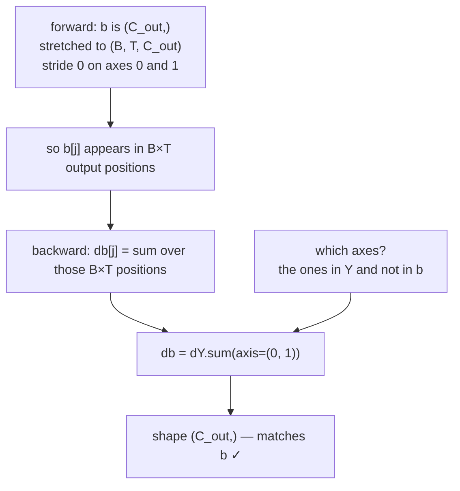

# 1.4 — The bias gradient is a sum, over exactly the axes that were broadcast

## One-line answer

Broadcasting in the forward pass creates one route to the loss per stretched position, so
backpropagating through it is a **sum over precisely those axes** — and getting the axis list right is
the difference between a `(C_out,)` gradient and a plausible array of the wrong meaning.

---

## The story

A small food stall adds a flat ₹5 packing charge to every order that goes out of the door.

At the end of the month somebody asks a simple question: if the packing charge had been ₹1 higher,
how much more would the stall have made?

Not ₹1. One rupee **per order**. There were 800 orders that month, so the answer is ₹800.

The charge was a single number, written down once. Its effect was that number multiplied by the number
of places it got applied. And working out "how many places" is not a matter of opinion or judgement:
it is exactly the list of orders it was copied onto, and you can count them.
---

## The idea in plain language

Day 2 part
[2.1](../../../day-002-tensors-shape-stride/parts/02-broadcasting-and-indexing/2.1-broadcasting-the-rule.md)
established that broadcasting stretches a size-1 axis by giving it a stride of zero — the same numbers
read many times, with nothing copied.

Day 3 part
[1.3](../../../day-003-derivatives-and-autograd/parts/01-the-derivative/1.3-partial-derivatives.md)
established that when one value reaches the output by several routes, its gradient is the **sum** over
those routes.

Put those together and there is one rule, with no exceptions anywhere in this curriculum:

> **Backpropagating through a broadcast is a sum over the broadcast axes.**

For a bias in `Y = X @ W + b`:

- `b` has shape `(C_out,)`. `Y` has shape `(B, C_out)`.
- Right-aligned, `b` was padded to `(1, C_out)` and the `1` was stretched over `B`.
- So `b[j]` appears in `Y[i, j]` for all `B` values of `i` — `B` routes — and
  `db[j] = Σ over i of dY[i, j]`, which is `dY.sum(axis=0)`.

And the rule generalises without changing, which is the point of doing it properly now. In a
transformer the activation is `(B, T, C_out)` — batch, token position, channel — and the same
`(C_out,)` bias is stretched over **two** axes:

- `db = dY.sum(axis=(0, 1))`.

The list of axes is not something to remember per layer. It is read off by comparing two shapes: the
axes present in the output and absent from the parameter are exactly the axes to sum. A one-line
helper does it mechanically, and it is written below.

Two more things worth naming because they generalise:

**The same rule covers every broadcast, not just biases.** A `(1, C)` scale in a normalization layer
(Day 37), a `(T, T)` mask broadcast over `(B, H, T, T)` (Day 31), a scalar temperature broadcast over
a whole logit tensor (Day 5) — each backward pass sums over whatever the forward pass stretched.

**The sum is over axes, not over everything.** Summing one axis too many gives a smaller array;
summing one too few leaves an axis that should not be there. Both are legal arrays and — as measured
below — both can survive into the optimizer without raising.

---

## Why Akshara needs it

- **Day 26 onward**, every layer in every model has a bias, and every one of them is a `(B, T, C_out)`
  case rather than the `(B, C_out)` case.
- **Day 37**'s LayerNorm has a learned scale and shift, both of shape `(C,)`, broadcast over `(B, T)`.
  Their gradients are this sum, and getting the axis list wrong there is a classic.
- **Day 31**'s causal mask is a `(T, T)` tensor broadcast over batch and head. It carries no gradient
  because it is not a parameter — but knowing *why* it carries none, and what the sum would be if it
  did, is the same reasoning.
- **Day 89**'s LoRA has a scaling factor broadcast across a whole update. Same rule.

---

## The mechanism

The rank-2 case first, then the one you will actually meet:

```python
import numpy as np

rng = np.random.default_rng(1337)

B, C, C_out = 4, 5, 3
X = rng.standard_normal((B, C))         # (B, C)
W = rng.standard_normal((C, C_out))     # (C, C_out)
b = rng.standard_normal(C_out)          # (C_out,)

Y = X @ W + b                           # (B, C_out)
dY = 2 * Y                              # (B, C_out)
db = dY.sum(axis=0)                     # (C_out,)   sum over the axis b was stretched along
print("Y", Y.shape, "b", b.shape, "db", db.shape)
```

**Line by line:**
- `b` was padded to `(1, C_out)` and stretched over axis 0, so axis 0 is the one summed.
- `db` comes out `(C_out,)` — the shape of `b`, which is the invariant from part
  [1.2](1.2-the-three-gradients.md).
- On this machine (Intel Core i3-1115G4, CPython 3.12.10, numpy 2.5.2, seed 1337, 2026-08-26) it prints
  `Y (4, 3) b (3,) db (3,)`.

Now the transformer shape, where there are **two** broadcast axes:

```python
B, T, C, C_out = 2, 3, 5, 4
X = rng.standard_normal((B, T, C))      # (B, T, C)
W = rng.standard_normal((C, C_out))     # (C, C_out)
b = rng.standard_normal(C_out)          # (C_out,)

Y = X @ W + b                           # (B, T, C_out)
dY = 2 * Y                              # (B, T, C_out)

db = dY.sum(axis=(0, 1))                          # (C_out,)
dW = np.einsum("btc,bto->co", X, dY)              # (C, C_out)
dX = dY @ W.T                                     # (B, T, C)
print("Y", Y.shape, "db", db.shape, "dW", dW.shape, "dX", dX.shape)
```

**Line by line:**
- `X @ W` is the batched matmul from Day 2 part
  [3.3](../../../day-002-tensors-shape-stride/parts/03-matmul/3.3-batched-matmul.md): the last two axes
  are the matrix, `B` is carried along, and `W` — having no batch axes — is broadcast across both `B`
  and `T`. Output `(B, T, C_out)`.
- `db = dY.sum(axis=(0, 1))` sums over **both** stretched axes. Passing a tuple to `axis` is how you
  say "collapse these", and it is exactly the list of axes present in `Y` and absent from `b`.
- `dW` cannot be written as a plain `X.T @ dY` any more, because `X` now has three axes and the
  contraction has to happen over **two** of them — `B` and `T` — at once. `einsum` states it directly:
  `btc,bto->co` says *`b` and `t` appear in both inputs and in neither output, so contract them; keep
  `c` and `o`*. This is the shape-first method from part
  [1.3](1.3-the-transpose-everyone-gets-wrong.md) written in a notation that cannot be misread.
- The equivalent without `einsum` is `X.reshape(-1, C).T @ dY.reshape(-1, C_out)` — flatten the batch
  and token axes into one, then use the rank-2 formula. Measured on this machine, 2026-08-26, the two
  agree exactly (`np.allclose` prints `True`). **`W` genuinely does not care whether a row came from
  batch item 0 or batch item 1**, which is why flattening is valid and why the parameter count does not
  contain `B` or `T`.
- `dX = dY @ W.T` is unchanged from the rank-2 case, because the batched matmul rule carries the
  leading axes through untouched.
- Measured on this machine, 2026-08-26: `Y (2, 3, 4) db (4,) dW (5, 4) dX (2, 3, 5)`.

Verified against an independent numerical gradient, same machine and date:

```text
rel err db: 2.357e-09
rel err dW: 1.890e-10
rel err dX: 1.415e-09
```

The rule, drawn:



**The helper that removes the judgement**, because "which axes" should never be a decision made twice:

```python
def unbroadcast(grad: np.ndarray, shape: tuple[int, ...]) -> np.ndarray:
    """Sum `grad` down to `shape`, undoing whatever broadcasting produced it."""
    while grad.ndim > len(shape):
        grad = grad.sum(axis=0)                          # drop the axes that were prepended
    for axis, size in enumerate(shape):
        if size == 1 and grad.shape[axis] != 1:
            grad = grad.sum(axis=axis, keepdims=True)    # collapse the axes that were stretched
    return grad
```

**Line by line:**
- The first loop handles axes that broadcasting **added** on the left. A `(C_out,)` bias against a
  `(B, T, C_out)` output gained two leading axes, and each `sum(axis=0)` removes one. It is a `while`
  rather than a single call because the number of added axes varies.
- The second loop handles axes that were present but of size **1** — a `(1, C)` scale, for instance.
  Those are collapsed with `keepdims=True` so the axis survives at size 1 and the shape still matches.
- The two loops correspond exactly to the two halves of the broadcasting rule from Day 2 part 2.1: pad
  on the left, then stretch the 1s. **The backward pass undoes them in reverse.**
- This is what a real autograd engine calls internally after every elementwise operation, and having
  written it once is why the framework's behaviour around broadcast gradients stops being surprising.
- `unbroadcast(dY, b.shape)` gives the same answer as `dY.sum(axis=(0, 1))` for the case above, with no
  axis list to get wrong.

---

## Shapes

| Tensor | Symbolic shape | Concrete here | What each axis means |
| --- | --- | --- | --- |
| `X` | `(B, T, C)` | `(2, 3, 5)` | example · token position · input channel |
| `W` | `(C, C_out)` | `(5, 4)` | input channel · output channel; **no** batch axes |
| `b` | `(C_out,)` | `(4,)` | output channel |
| `b` as broadcast | `(1, 1, C_out)` | `(1, 1, 4)` | what right-alignment made of it, strides 0 on axes 0 and 1 |
| `Y` | `(B, T, C_out)` | `(2, 3, 4)` | example · token · output channel |
| `dY` | `(B, T, C_out)` | `(2, 3, 4)` | handed in |
| `db = dY.sum(axis=(0,1))` | `(C_out,)` | `(4,)` | sums the two stretched axes; matches `b` |
| `dW` (einsum `btc,bto->co`) | `(C, C_out)` | `(5, 4)` | contracts `B` **and** `T`; matches `W` |
| `dX = dY @ W.T` | `(B, T, C)` | `(2, 3, 5)` | leading axes carried through; matches `X` |

The fourth row is the one worth staring at: `b` never physically becomes `(1, 1, C_out)`, but that is
the shape the broadcasting rule treats it as, and it is what tells you the sum runs over axes 0 and 1.

---

## When it breaks

The loud one, when the summed shape reaches an operation that cannot broadcast it:

```console
>>> b.shape
(4,)
>>> db = dY.sum(axis=(0, 2))
>>> db.shape
(3,)
>>> b - 0.1 * db
Traceback (most recent call last):
  File "<stdin>", line 1, in <module>
ValueError: operands could not be broadcast together with shapes (4,) (3,)
```

Summing axes 0 and 2 instead of 0 and 1 collapsed the **channel** axis and kept the **token** axis. The
result is a `(3,)` — a real array with the wrong meaning — and it raises at the update line rather than
at the sum, which is one function away from the bug.

**The silent version, and it is the reason this part exists separately.** Sum the wrong axes in a way
that happens to broadcast, and nothing raises at all:

```console
>>> db = dY.sum(axis=0)          # forgot T
>>> db.shape
(3, 4)
>>> (b - 0.1 * db).shape
(3, 4)
```

Measured on this machine, 2026-08-26. `b` is `(4,)` and `db` is `(3, 4)`; right-aligned, the 4s match
and the 3 has nothing opposite it, so the subtraction **broadcasts** and produces a `(3, 4)`.

Think about what that means in a training loop. The bias was a vector of 4 numbers. After one update it
is a `(3, 4)` matrix. The next forward pass broadcasts *that* against `(B, T, C_out)`, which also
works, and the model now has a bias that varies with token position — a different model from the one
you designed, arrived at silently, in one step, with no error anywhere.

The check, and it is one line placed where the update happens:

```python
assert db.shape == b.shape, f"db {db.shape} != b {b.shape} — wrong axes summed?"
```

**Line by line:**
- Compare against the **parameter**, not against a remembered shape. The parameter is the ground truth
  and it is right there.
- The message names the suspicion, so `db (3, 4) != b (4,) — wrong axes summed?` is a fix rather than a
  puzzle.
- **The stronger version is to not compute the axis list by hand at all**: use `unbroadcast(dY,
  b.shape)` from the mechanism section, which derives it from the two shapes and cannot disagree with
  them.
- The strongest version is a shape check on **every** parameter update, in one loop, once:
  `for p, g in zip(params, grads, strict=True): assert p.shape == g.shape`. That is four lines in the
  optimizer on Day 8 and it retires this entire class of bug.

---

## In production

**What a research engineer writes instead of the teaching version.** They rely on the framework's
`unbroadcast` — every autograd engine has one — and they never write an axis list by hand for a
broadcast gradient. Where they *do* write it is in a custom operation, and there the habit is to derive
it from the shapes with a helper rather than to reason about it, for the same reason part
[1.3](1.3-the-transpose-everyone-gets-wrong.md) derives transposes from shapes: a rule you re-derive is
right every time and a rule you remember is right most of the time.

**What degrades at scale.** The number of summed elements, which is `B × T`. On a batch of 8 with a
sequence of 1024, every bias gradient is a sum over 8192 values — which is arithmetically trivial and
*numerically* worth noticing: summing thousands of `float16` values accumulates error, which is one of
the reasons mixed-precision training keeps reductions in 32-bit. Day 7 is the mechanism and Day 78 is
where it becomes a decision.

**The failure that only shows with real data.** Variable sequence length. If `T` differs between
batches and the axis list is hard-coded by position, a change in the tensor layout — say, moving from
`(B, T, C)` to `(T, B, C)` — silently changes which axis is which while every shape assertion still
passes, because the summed result is `(C_out,)` either way. The defence is to name the layout in the
function's docstring and to test with `B ≠ T`, which is why the numbers in this part are 2 and 3 rather
than two 4s.

**The review comment.** *"`sum(axis=0)` — that's the batch axis, but this tensor is `(B, T, C)`. Should
it be `axis=(0, 1)`?"*

**The interview question.** *"What is the gradient of a bias, and why?"* The weak answer says "the sum
of the output gradient". The strong answer says **which axes** and why: the forward pass broadcast the
bias across batch and token, so those are the routes, and the multivariable chain rule says routes are
summed — then it notes that the general rule is "sum over whatever was broadcast", which covers
normalization scales and masks too.

**Compute tier: T0.** Every number here is a laptop CPU measurement at `B = 2`, `T = 3`. The rule and
the shapes are exact and transfer to any size and any hardware; the numerical agreement around
`10⁻⁹` is a property of `float64`. What T0 does not show is the accumulation error at `B × T` in the
thousands and in a narrow dtype, which is Day 7's subject.

---

## Check yourself

Run this. It prints **three shapes and one relative error**, and the error must be below `10⁻⁸`:

```python
import numpy as np

rng = np.random.default_rng(1337)
B, T, C, C_out = 2, 3, 5, 4
X = rng.standard_normal((B, T, C))
W = rng.standard_normal((C, C_out))
b = rng.standard_normal(C_out)

dY = 2 * (X @ W + b)
db = dY.sum(axis=(0, 1))

print("correct   db.sum(axis=(0,1)):", db.shape)
print("wrong     db.sum(axis=0)    :", dY.sum(axis=0).shape)
print("b - 0.1 * the wrong one     :", (b - 0.1 * dY.sum(axis=0)).shape)


def numgrad(f, A, h=1e-5):
    g = np.zeros_like(A)
    it = np.nditer(A, flags=["multi_index"])
    while not it.finished:
        i = it.multi_index
        old = A[i]
        A[i] = old + h; up = f()
        A[i] = old - h; down = f()
        A[i] = old
        g[i] = (up - down) / (2 * h)
        it.iternext()
    return g


nb = numgrad(lambda: float(((X @ W + b) ** 2).sum()), b)
print("rel err db:", f"{np.max(np.abs(db - nb) / (np.abs(db) + np.abs(nb))):.3e}")
```

**Line by line:**
- The three shapes print `(4,)`, `(3, 4)` and `(3, 4)` on this machine, 2026-08-26.
- **The third line is the finding.** A `(4,)` bias minus a `(3, 4)` gradient gives a `(3, 4)` bias, with
  no error, and the model quietly acquires a per-token bias it was never designed to have.
- The relative error prints `2.357e-09`, confirming the correct version against an independent method.
- Now write `unbroadcast(dY, b.shape)` from the mechanism section and confirm it equals `db` without
  your having typed an axis list.

**Say this out loud, without scrolling up:** state the rule for backpropagating through a broadcast in
one sentence — and say how you determine *which* axes to sum without remembering anything about the
layer.
