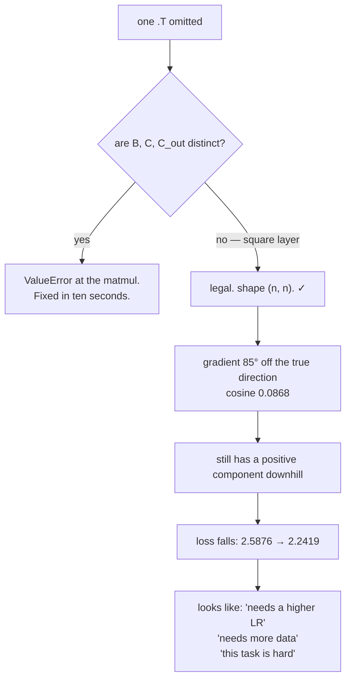

# 1.5 — 💥 The transpose that trained anyway

## One-line answer

In a square layer, `X @ dY` and `X.T @ dY` both produce the right shape, and the wrong one is measured
here at a cosine similarity of **0.0868** with the true gradient — nearly perpendicular to it — and yet
the loss still falls from 2.5876 to 2.2419, so the run looks like a model that is merely learning
slowly.

---

## The story

You are driving to a friend's house for the first time, following the map on your phone. You typed the
house number in yourself, and you typed it wrong — 47 instead of 74.

Nothing about the drive feels wrong. The blue dot moves. The street names go past in a sensible order.
The arrival time counts down. Every turn the phone asks for is a real turn onto a real road, and every
screen on the phone agrees with every other screen on the phone.

Forty minutes later you arrive. It is a real house on a real street with a real gate. It is simply not
your friend's house, and nothing you were looking at could ever have told you that, because every
single thing on the screen was worked out from the number you typed in.

Being at number 47 instead of 74 is not a subtle error. It survived the whole journey because there
was nothing independent to check it against.
---

## The idea in plain language

Part [1.3](1.3-the-transpose-everyone-gets-wrong.md) showed that when `B`, `C` and `C_out` are
mutually distinct, five of six wrong arrangements raise and the sixth gives a visibly transposed shape.

Now make them equal. In a transformer this is not a contrivance — the query, key, value and output
projections of an attention block are all `(C, C)`, and it is common to run with a batch size that
happens to equal one of them.

With `B = C = C_out = n`, every candidate produces `(n, n)`. Measured on this machine, 2026-08-26, all
six of part 1.3's candidates succeed with shape `(4, 4)`.

So the shape check — the thing that has caught every error in this section so far — is now blind. What
remains true is:

- The gradient is **wrong**, and not slightly. Measured below, the wrong `dW` has a cosine similarity of
  0.0868 with the correct one: they are nearly perpendicular. It is not a scaled version of the right
  answer; it points somewhere else entirely.
- **The loss still decreases.** A direction that is 85 degrees off from the steepest descent direction
  still has a small component pointing downhill, and gradient descent with a small step size will
  still, on average, go down.
- Therefore the symptom is *slow learning*, which is the single most over-diagnosed condition in
  machine learning and has a dozen innocent explanations.

The reason a wrong direction still works at all is worth stating precisely, because it is what makes
this failure survive. The loss falls as long as the step has a **positive component along the true
negative gradient** — that is, as long as the angle between the update and the true descent direction
is less than 90 degrees. At 0.0868 cosine similarity the angle is about 85 degrees: barely inside the
window, and still inside it.

---

## Why Akshara needs it

- **Day 30–32** build attention out of `(C, C)` projections. Four square layers per block, every one of
  them a place this bug can live undetected.
- **Day 39** assembles Akshara v0 and checks the parameter count by hand. A parameter count is
  invariant to transposition, so that gate does **not** catch this — which is why Day 39 also needs a
  value check.
- **Day 25** trains the first model and the day's whole claim is "the loss went down". This document is
  why that claim needs a companion.
- **Day 51 onward**, every debugging session that starts with "it trains but not as well as it should"
  is a session where this class of bug is on the list.
- **Section 2 of today** is the answer. A gradient check is the independent check the drive did not
  have.

---

## The mechanism

Make the layer square and compare the two candidates directly:

```python
import numpy as np

rng = np.random.default_rng(1337)

n = 4                                          # B == C == C_out
X = rng.standard_normal((n, n))                # (n, n)
W = rng.standard_normal((n, n))                # (n, n)
b = rng.standard_normal(n)                     # (n,)

Y = X @ W + b                                  # (n, n)
dY = 2 * Y                                     # (n, n)

dW_right = X.T @ dY                            # (n, n)  the correct gradient
dW_wrong = X @ dY                              # (n, n)  the transpose omitted — also legal

cos = float((dW_right * dW_wrong).sum() /
            (np.linalg.norm(dW_right) * np.linalg.norm(dW_wrong)))
print("same shape        :", dW_right.shape == dW_wrong.shape)
print("max |difference|  :", round(float(np.abs(dW_right - dW_wrong).max()), 4))
print("cosine similarity :", round(cos, 4))
print("norms             :", round(float(np.linalg.norm(dW_right)), 4),
      round(float(np.linalg.norm(dW_wrong)), 4))
```

**Line by line:**
- `n = 4` for `B`, `C` **and** `C_out`. That single line is the whole precondition for this failure.
- `dW_wrong = X @ dY` is the transpose omitted. With distinct sizes it raises (part
  [1.3](1.3-the-transpose-everyone-gets-wrong.md) measured it); here it does not.
- **Cosine similarity** is the right measure, not the maximum difference. It asks how much the two
  vectors point the same way, normalising away magnitude — and *direction* is what a gradient is for.
  A gradient that is twice too large is a learning-rate change; one that points elsewhere is a
  different optimisation problem.
- `np.linalg.norm` on a 2-D array gives the Frobenius norm — the square root of the sum of squares of
  every element — which is what treats the matrix as a flat vector of parameters, exactly as the
  optimizer does.
- Measured on Intel Core i3-1115G4, CPython 3.12.10, numpy 2.5.2, seed 1337, 2026-08-26:

```text
same shape        : True
max |difference|  : 44.259
cosine similarity : 0.0868
norms             : 77.7715 27.9741
```

**0.0868.** The wrong gradient is nearly perpendicular to the right one, and it is also about a third
of the magnitude. Two independent things wrong, no error, identical shape.

Now the part that makes it dangerous — train with each and watch both losses fall:

```python
def run(use_wrong: bool, steps: int = 40, lr: float = 0.01, seed: int = 1337) -> list[float]:
    r = np.random.default_rng(seed)
    X = r.standard_normal((n, n))              # (n, n)
    target = r.standard_normal((n, n))         # (n, n)
    W = r.standard_normal((n, n)) * 0.5        # (n, n)
    b = np.zeros(n)                            # (n,)
    history = []
    for _ in range(steps):
        Y = X @ W + b                          # (n, n)
        history.append(float(((Y - target) ** 2).mean()))
        dY = 2 * (Y - target) / Y.size         # (n, n)
        dW = (X @ dY) if use_wrong else (X.T @ dY)
        db = dY.sum(axis=0)                    # (n,)
        W = W - lr * dW
        b = b - lr * db
    return history


right, wrong = run(False), run(True)
print(f"correct dW : {right[0]:.4f} -> {right[-1]:.4f}")
print(f"wrong   dW : {wrong[0]:.4f} -> {wrong[-1]:.4f}")
print(f"wrong still decreased: {wrong[-1] < wrong[0]}")
print(f"final loss ratio wrong/right: {wrong[-1] / right[-1]:.2f}")
```

**Line by line:**
- Both runs use the **same seed**, so they start from identical `X`, `target`, `W` and `b`. The only
  difference in the entire experiment is one `.T`.
- `dY = 2 * (Y - target) / Y.size` is the gradient of a mean squared error. Dividing by `Y.size`
  matches the `.mean()` in the loss — the scaling that Day 3 part
  [2.5](../../../day-003-derivatives-and-autograd/parts/02-the-autograd-engine/2.5-zero-grad-the-state-that-leaks.md)
  warned is the most commonly forgotten line in gradient accumulation.
- `db` is deliberately **correct** in both runs, so the difference is attributable to `dW` alone.
- Measured on this machine, 2026-08-26:

```text
correct dW : 2.5876 -> 0.6074
wrong   dW : 2.5876 -> 2.2419
wrong still decreased: True
final loss ratio wrong/right: 3.69
```

**The broken run's loss went down.** From 2.5876 to 2.2419 over forty steps. If you had only that
curve — and in a real project you only ever have that curve — you would see a model that is learning,
just not very fast, and you would reach for the learning rate.

And it is 3.69× worse than it should be, which in a real setting is the difference between a result and
a disappointment. Nothing anywhere says so.



---

## Shapes

| Tensor | Symbolic shape | Concrete here | What each axis means |
| --- | --- | --- | --- |
| `X` | `(B, C)` | `(4, 4)` | example · input channel — **square on purpose** |
| `W` | `(C, C_out)` | `(4, 4)` | input channel · output channel |
| `dY` | `(B, C_out)` | `(4, 4)` | handed in |
| `X.T @ dY` | `(C, C_out)` | `(4, 4)` | contracts `B` — **correct** |
| `X @ dY` | `(C_out, C_out)` | `(4, 4)` | contracts `C` against `B` — meaningless, same shape |
| `dY.T @ X` | `(C_out, C)` | `(4, 4)` | the other convention's answer — same shape again |

Every row is `(4, 4)`. **The `## Shapes` table is the tool that has caught every error so far and it
catches nothing here**, which is the honest thing to say about it: it is necessary and it is not
sufficient, and knowing where its guarantee ends is what makes it a tool rather than a ritual.

---

## When it breaks

It does not break. Here is the entire diagnostic output a real project would produce:

```text
step  0  loss 2.5876
step 10  loss 2.4868
step 20  loss 2.3956
step 30  loss 2.3119
step 39  loss 2.2419
```

Monotonically decreasing. No `NaN`, no spike, no warning. That is what an 85-degree error in the
gradient looks like from the outside.

**Three things that do not catch it**, and it is worth knowing why each fails:

- **Shape assertions.** Every shape is `(4, 4)` and every assertion passes. Part
  [1.2](1.2-the-three-gradients.md)'s three assertions are silent.
- **The parameter count.** Transposing a square matrix does not change how many parameters it has, so
  Day 39's hand count matches.
- **The loss curve.** It decreases, which is the thing everyone looks at.

**The one thing that does catch it** is an independent computation of the same quantity — which is
section 2 of today. Applied here:

```python
def numgrad(f, A, h=1e-5):
    g = np.zeros_like(A)
    it = np.nditer(A, flags=["multi_index"])
    while not it.finished:
        i = it.multi_index
        old = A[i]
        A[i] = old + h; up = f()
        A[i] = old - h; down = f()
        A[i] = old
        g[i] = (up - down) / (2 * h)
        it.iternext()
    return g


loss = lambda: float(((X @ W + b) ** 2).sum())
numeric = numgrad(loss, W)
for name, candidate in (("X.T @ dY", dW_right), ("X @ dY", dW_wrong)):
    err = np.max(np.abs(candidate - numeric) / np.maximum(1e-12, np.abs(candidate) + np.abs(numeric)))
    print(f"{name:10s} rel err vs numerical: {err:.3e}")
```

**Line by line:**
- The numerical gradient knows nothing about your derivation. It nudges `W` and watches the loss, which
  is the definition from Day 3 part
  [1.1](../../../day-003-derivatives-and-autograd/parts/01-the-derivative/1.1-the-slope-from-the-definition.md).
  **That independence is the entire value.** Two derivations that share an assumption can agree and both
  be wrong; a derivation and a measurement cannot.
- On this machine, 2026-08-26, the correct candidate reports `3.480e-10` and the wrong one reports
  `1.000e+00` — not a borderline result, a factor of about three billion. A relative error of exactly 1
  under this normalisation means the two disagree as completely as two numbers can.
- **This is the check that would have saved the drive**, and it costs `2n` forward passes on a tiny
  instance, once, in a test file.
- And there is a cheaper habit that costs nothing at all: **make the test shapes mutually distinct.**
  `B = 2, C = 3, C_out = 5` turns this entire silent failure back into a `ValueError`. The gradient
  check is the instrument; distinct shapes are the reason you rarely need it.

---

## In production

**What a research engineer writes instead of the teaching version.** They never write the gradient at
all — the framework does — but they hit the identical failure whenever they write a custom operation,
and the defences are the same two: gradient-check every custom backward pass, and never test at square
shapes. The second is free and it is the one people skip, because `(4, 4)` is what you type when you
are typing quickly.

**What degrades at scale.** Detectability, and the cost of the delay. The bug's damage is a roughly
constant multiplier on your result quality — 3.69× worse final loss in this measurement — and it does
not grow. What grows is how long it takes to notice, because larger models have more plausible reasons
to underperform, longer runs between hypotheses, and more square layers for it to hide in. Finding it
on a laptop in a test file costs minutes; finding it after a Day 67 pretraining run costs the session.

**The failure that only shows with real data.** Actually the reverse, and it is worth naming: this bug
shows up in *development* and hides in *production shapes*, or the other way around, depending entirely
on which shapes happen to be equal. A model developed with `C = 512` and a batch of 512 has a square
coincidence that vanishes the moment someone changes the batch size — and then a `ValueError` appears
in a layer nobody touched. **The correct response to that is an investigation, not a reshape.** The bug
was always there; the batch-size change is what revealed it.

**The review comment.** *"These test shapes are all `n`. Please make `B`, `C` and `C_out` mutually
distinct — a transposed gradient is invisible at square shapes and passes every assertion in this
file."*

**The interview question.** *"Your model trains, the loss goes down, but it plateaus well short of a
baseline you trust. Walk me through your first three checks."* A strong answer includes gradient
checking a layer at non-square shapes, and — this is the part that shows experience — explicitly says
that a decreasing loss is **not** evidence the gradient is correct, because any direction within 90
degrees of the true descent direction still reduces the loss. Quantifying it ("I've seen a gradient at
0.09 cosine similarity still train") is better still.

**Compute tier: T0.** The whole failure is reproduced and measured on a laptop CPU with `4 × 4`
matrices in milliseconds — the cosine similarity, the two loss curves and the gradient-check
discrimination all fit on one screen. That is the argument for doing it now: this is a bug whose
production form costs a training session and whose complete diagnosis costs nothing at T0.

---

## Check yourself

Run this. It prints **one cosine similarity and two final losses**, and both losses must be lower than
their starting value:

```python
import numpy as np

rng = np.random.default_rng(1337)
n = 4
X = rng.standard_normal((n, n))
W = rng.standard_normal((n, n))
b = rng.standard_normal(n)
dY = 2 * (X @ W + b)

right, wrong = X.T @ dY, X @ dY
cos = float((right * wrong).sum() / (np.linalg.norm(right) * np.linalg.norm(wrong)))
print("same shape        :", right.shape == wrong.shape)
print("cosine similarity :", round(cos, 4))


def run(use_wrong, steps=40, lr=0.01, seed=1337):
    r = np.random.default_rng(seed)
    Xr = r.standard_normal((n, n)); target = r.standard_normal((n, n))
    Wr = r.standard_normal((n, n)) * 0.5; br = np.zeros(n)
    hist = []
    for _ in range(steps):
        Y = Xr @ Wr + br
        hist.append(float(((Y - target) ** 2).mean()))
        g = 2 * (Y - target) / Y.size
        Wr = Wr - lr * ((Xr @ g) if use_wrong else (Xr.T @ g))
        br = br - lr * g.sum(axis=0)
    return hist


for label, use_wrong in (("correct", False), ("wrong  ", True)):
    h = run(use_wrong)
    print(f"{label}: {h[0]:.4f} -> {h[-1]:.4f}   decreased: {h[-1] < h[0]}")
```

**Line by line:**
- The cosine prints `0.0868` on this machine, 2026-08-26 — about 85 degrees apart — and the shapes
  match.
- Both runs print `decreased: True`. **That is the whole document**: `2.5876 -> 0.6074` and
  `2.5876 -> 2.2419`, and only one of them is the model you designed.
- Now change `n` to distinct sizes — `X` at `(2, 3)`, `W` at `(3, 5)` — and re-run. The wrong version
  raises. **Say out loud which is the better outcome and why**, then go and check the shapes in your
  own test files.

**Say this out loud, without scrolling up:** explain why a gradient 85 degrees away from the true one
still reduces the loss — and name the two defences against this bug, saying which one costs nothing.
