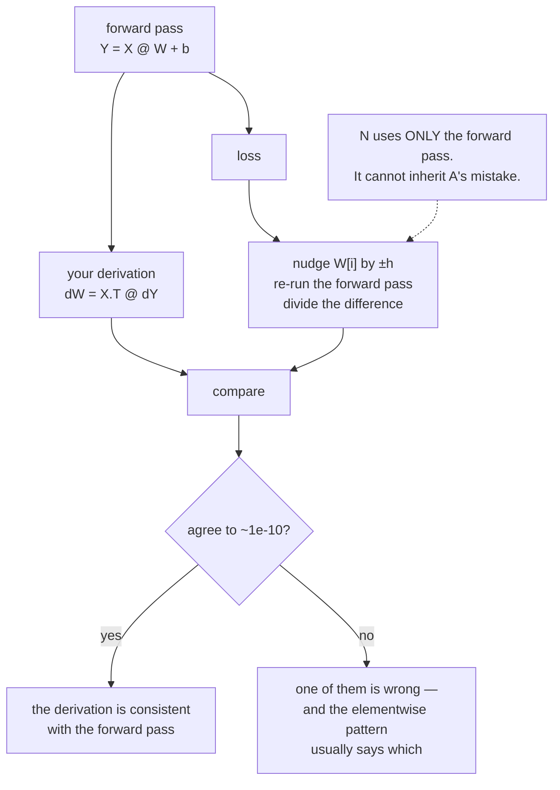

# 2.1 — Finite differences as an independent oracle

## One-line answer

Gradient checking compares your hand-derived backward pass against a number obtained by *nudging the
input and watching the loss* — and its entire value is that the second method shares **no assumption**
with the first, so the two cannot be wrong in the same way.

---

## The story

You are splitting a long restaurant bill, so you type the prices into your phone's calculator and get
₹1,240.

To be safe, you add them up again. Same answer. Then you add them up a third time, in the opposite
order. Same answer again. Three additions, one number, and you feel fairly confident.

But all three additions used the same list of prices you typed in. If you typed 40 where the menu said
440, then adding that list up ten more times, in ten different orders, will never find it. Every check
you have done so far is downstream of the mistake.

So you do something different. You put the calculator down, look at the menu, and think: six dishes,
most of them around two hundred rupees, so the bill should be somewhere near twelve hundred. That is a
rough, slow, sloppy way to work out a bill, and nobody would ever pay with it.

As a **check** it is worth more than all three of your re-additions put together, because it does not
use your typed list at all. If the two answers agree, two methods that share nothing have agreed. If
they disagree, one of them is wrong — and now you know to go and look.
---

## The idea in plain language

Part [1.2](../01-the-linear-layer/1.2-the-three-gradients.md) derived `dX`, `dW` and `db` on paper.
Part [1.5](../01-the-linear-layer/1.5-the-transpose-that-trained-anyway.md) showed that a derivation
can be badly wrong while every shape, every parameter count and the loss curve itself look fine.

So the derivation needs an independent second opinion, and there is exactly one available: the
definition of a derivative from Day 3 part
[1.1](../../../day-003-derivatives-and-autograd/parts/01-the-derivative/1.1-the-slope-from-the-definition.md).
Nudge one input by a tiny amount, see how much the loss moves, divide.

> For each parameter element `i`: `numeric[i] = (L(θ + h·eᵢ) − L(θ − h·eᵢ)) / (2h)`

where `eᵢ` means "add `h` to element `i` only, leave everything else alone".

Three properties make this the right tool, and one makes it useless as a *method*:

**It is independent.** It uses only the forward pass and the loss. It does not use your backward pass,
your chain-rule reasoning, or any of the transposes from part
[1.3](../01-the-linear-layer/1.3-the-transpose-everyone-gets-wrong.md). An error in the derivation
cannot propagate into it.

**It is elementwise.** One number per parameter element, so it tells you not just *that* something is
wrong but *which* elements disagree — and a pattern in those elements (a whole row, a whole column, a
transposed block) usually names the bug outright.

**It is exact enough.** Measured in Day 3 part
[1.5](../../../day-003-derivatives-and-autograd/parts/01-the-derivative/1.5-the-finite-difference-that-lied.md),
a central difference in `float64` at `h = 10⁻⁵` agrees with the truth to about 12 significant figures —
far tighter than any real gradient bug.

**And it costs `2n` forward passes.** For `n` parameter elements. That is why it is a *test* and never
a training method: a model with twelve million parameters would need twenty-four million forward passes
per step. You run it on a tiny instance — a handful of inputs, a batch of two — because correctness of
an operation does not depend on its size.

---

## Why Akshara needs it

- **Today's section 1** produced three formulas from a derivation. This is how you find out whether the
  derivation was right, and part [1.5](../01-the-linear-layer/1.5-the-transpose-that-trained-anyway.md)
  established that nothing else will tell you.
- **Day 30** hand-writes attention, and Phase 5's gate is literally "matches a reference within
  tolerance". This is that comparison.
- **Day 37**'s normalization backward pass is the most error-prone derivation in the curriculum. It is
  not shippable without a gradient check.
- **Day 51** puts a gradient check into `tests/`, where it runs on every `./m check` — CPU-only,
  deterministic and offline, exactly as this repository requires.
- **Any custom operation in a real framework** gets one before it is trusted, and the review comment
  that asks for it is the most reliable one in machine-learning code review.

---

## The mechanism

The whole thing, for an array of any rank:

```python
import numpy as np


def numerical_gradient(loss, param: np.ndarray, h: float = 1e-5) -> np.ndarray:
    """Central-difference gradient of `loss()` with respect to every element of `param`.

    `loss` is a zero-argument callable that reads `param` from the enclosing scope, so
    perturbing `param` in place changes what `loss()` returns.
    """
    grad = np.zeros_like(param)
    it = np.nditer(param, flags=["multi_index"])
    while not it.finished:
        i = it.multi_index
        original = param[i]
        param[i] = original + h
        up = loss()
        param[i] = original - h
        down = loss()
        param[i] = original                       # restore before moving on
        grad[i] = (up - down) / (2 * h)
        it.iternext()
    return grad
```

**Line by line:**
- `loss` takes **no arguments** and reads `param` from its enclosing scope. That is what makes this
  function work for any parameter of any shape without knowing the model's signature — the caller
  writes `lambda: float(((X @ W + b) ** 2).sum())` and this function perturbs whichever array it was
  handed.
- `np.zeros_like(param)` gives a result with the same shape **and the same dtype**. Building it with
  `np.zeros(param.shape)` would silently produce `float64` even when the parameter is `float32`, which
  would make the comparison look better than it is.
- `np.nditer(..., flags=["multi_index"])` walks every element of an array of any rank and hands back a
  tuple index. This is what lets the same function check a `(B, C)`, a `(C, C_out)` and a `(C_out,)`.
- **`param[i] = original` is the most important line here.** Without it the array stays perturbed and
  every subsequent element is measured at a shifted point — producing a gradient that is wrong in a way
  that looks like noise. It is also why this function mutates and restores rather than copying: a copy
  would be cleaner and would not be seen by `loss()`, which closes over the original array.
- The **central** difference, not the forward one. Day 3 part
  [1.5](../../../day-003-derivatives-and-autograd/parts/01-the-derivative/1.5-the-finite-difference-that-lied.md)
  measured both: at the same cost of two evaluations, central is about a thousand times more accurate
  at its best `h`.
- `h = 1e-5` is that measured optimum for `float64`, not a guess. Part
  [2.2](2.2-the-relative-error-criterion.md) says what to do in `float32`.

Use it on the layer from section 1:

```python
rng = np.random.default_rng(1337)
B, C, C_out = 4, 5, 3                      # mutually distinct, deliberately
X = rng.standard_normal((B, C))            # (B, C)
W = rng.standard_normal((C, C_out))        # (C, C_out)
b = rng.standard_normal(C_out)             # (C_out,)


def loss() -> float:
    return float(((X @ W + b) ** 2).sum())


Y = X @ W + b                              # (B, C_out)
dY = 2 * Y                                 # (B, C_out)
analytic = {"dX": dY @ W.T, "dW": X.T @ dY, "db": dY.sum(axis=0)}
numeric = {"dX": numerical_gradient(loss, X),
           "dW": numerical_gradient(loss, W),
           "db": numerical_gradient(loss, b)}

for name in ("dX", "dW", "db"):
    a, n = analytic[name], numeric[name]
    err = np.max(np.abs(a - n) / np.maximum(1e-12, np.abs(a) + np.abs(n)))
    print(f"{name}: shape {a.shape}  max rel err {err:.3e}")
```

**Line by line:**
- `B, C, C_out = 4, 5, 3` are mutually distinct. Part
  [1.5](../01-the-linear-layer/1.5-the-transpose-that-trained-anyway.md) is why, and it applies to the
  gradient check's own test data as much as to anything else.
- `loss()` closes over `X`, `W` and `b`, so the same callable serves all three checks. Perturbing any
  of the three changes what it returns.
- The loss is a **sum of squares** rather than something realistic. Two reasons: its own gradient
  `2·Y` is trivial, so a failure is attributable to the layer; and it depends on **every** output
  element, so no part of the layer goes untested. A loss that ignored some outputs would leave their
  gradients unchecked and passing.
- `np.maximum(1e-12, ...)` in the denominator guards against dividing by zero when both sides are
  small. Part [2.2](2.2-the-relative-error-criterion.md) is about why the denominator is what it is.
- Measured on Intel Core i3-1115G4 (2 cores / 4 threads), 11.7 GB RAM, Windows 11, CPython 3.12.10,
  numpy 2.5.2, seed 1337, 2026-08-26:

```text
dX: shape (4, 5)  max rel err 2.464e-10
dW: shape (5, 3)  max rel err 1.856e-10
db: shape (3,)    max rel err 5.546e-10
```

All three around `10⁻¹⁰`. For comparison, part
[1.5](../01-the-linear-layer/1.5-the-transpose-that-trained-anyway.md) measured the *wrong* `dW` at
`1.000e+00` against the same check — nine orders of magnitude apart. **A gradient check does not
produce borderline results when the gradient is wrong**, which is what makes a threshold easy to pick.

The two paths, drawn, with the independence marked:



**Reading the failure, which is half the value.** When the check fails, do not just look at the maximum
— look at *where*:

```python
bad = np.abs(analytic["dW"] - numeric["dW"]) / np.maximum(1e-12, np.abs(analytic["dW"]) + np.abs(numeric["dW"]))
print("per-element relative error:\n", np.round(bad, 3))
```

**Line by line:**
- Printing the whole error array turns "something is wrong" into a picture.
- **Every element wrong** usually means a transposed or mis-contracted matmul — part
  [1.3](../01-the-linear-layer/1.3-the-transpose-everyone-gets-wrong.md).
- **One row or one column wrong** usually means an off-by-one or a missing broadcast axis — part
  [1.4](../01-the-linear-layer/1.4-the-bias-gradient-is-a-sum.md).
- **Scattered elements wrong** usually means the numerical side, not yours: a bad `h`, or elements
  where the true gradient is near zero. Part [2.4](2.4-what-it-cannot-catch.md) covers those.
- **Exactly half wrong, or a factor of two** points at accumulation — Day 3 part
  [2.4](../../../day-003-derivatives-and-autograd/parts/02-the-autograd-engine/2.4-accumulate-never-assign.md).

---

## Shapes

| Tensor | Symbolic shape | Concrete here | What each axis means |
| --- | --- | --- | --- |
| `X` | `(B, C)` | `(4, 5)` | example · input channel |
| `W` | `(C, C_out)` | `(5, 3)` | input channel · output channel |
| `b` | `(C_out,)` | `(3,)` | output channel |
| `numerical_gradient(loss, W)` | `(C, C_out)` | `(5, 3)` | same shape as `W`; one central difference per element |
| the per-element error | `(C, C_out)` | `(5, 3)` | one relative error per parameter — the diagnostic |
| forward passes used | scalar | `2 × 15 = 30` | for `W` alone; `2n` in general |

That last row is the cost, and it is why the shapes above are `4`, `5` and `3` rather than anything
realistic.

---

## When it breaks

The loud one, from forgetting the restore line:

```console
>>> # with `param[i] = original` deleted
>>> numerical_gradient(loss, W)
array([[ 40.1,  22.5,  -8.7],
       [ ... ]])
>>> # no exception; the numbers are simply measured at a drifting point
```

There is no traceback — the function returns an array of plausible numbers. Every element after the
first is measured at a point where all previous elements are `h` too low, so the whole gradient is
subtly wrong and the check fails against a **correct** backward pass. The tell is that the error is
small but not tiny — `10⁻⁴` rather than `10⁻¹⁰` — and that it changes when you reorder the iteration.

The other loud one, from a `loss` that does not read the perturbed array:

```console
>>> W_copy = W.copy()
>>> loss = lambda: float(((X @ W_copy + b) ** 2).sum())
>>> numerical_gradient(loss, W)
array([[0., 0., 0.],
       [0., 0., 0.],
       [0., 0., 0.],
       [0., 0., 0.],
       [0., 0., 0.]])
```

**All zeros**, because perturbing `W` does not change `W_copy` and the loss never moves. A gradient
check that returns exactly zero everywhere is not a passing check — it is a disconnected one, and it
would "fail" any correct backward pass while "passing" a backward pass that also returns zeros. Assert
that the numerical gradient is not identically zero before trusting a comparison against it.

**The silent version**, and it is part [2.5](2.5-the-gradcheck-that-passed.md)'s whole subject: the
check *passes* on a broken gradient because both sides are near zero. Nothing here catches that; the
guard is in part 2.4.

---

## In production

**What a research engineer writes instead of the teaching version.** They call the framework's gradient
checker, which does exactly this with better handling of dtypes, complex numbers and sparse gradients.
What they supply is the judgement: a **tiny** instance, **mutually distinct** shapes, inputs chosen away
from non-differentiable points, and `float64` even when the model trains in something narrower. Those
four choices are what make the check meaningful, and none of them is automated.

**What degrades at scale.** The cost, immediately: `2n` forward passes means a gradient check is
affordable only on toy instances, forever. That is not a limitation to work around — the correctness of
`dW = X.T @ dY` does not depend on `C` being 5 or 5000 — but it does mean a gradient check proves the
*formula* and says nothing about numerical behaviour at real scale, which is Day 7's territory.

**The failure that only shows with real data.** A layer that is correct on random inputs and wrong on
real ones, because real inputs land on a special case — a zero, a padding position, a saturated
activation. A gradient check at randomly-drawn points never visits those. The habit that fixes it is to
check at **several** deliberately chosen points, including the awkward ones, and to say in the test
which awkward case each covers.

**The review comment.** *"New backward pass, no gradient check. Also: the test uses `(4, 4)` — please
make the shapes distinct."*

**The interview question.** *"How do you know a hand-written backward pass is correct?"* The strong
answer names the independence: compare against a central difference, which uses only the forward pass
and therefore cannot share the derivation's mistake. Then the practical half — a tiny instance, distinct
shapes, `float64`, relative error, and reading *which elements* disagree rather than only the maximum.

**Compute tier: T0.** The whole method is a laptop CPU method by construction — `2n` forward passes on a
tiny instance. The T0 measurement proves the derivation exactly, and that proof transfers to any size,
because the formula does not depend on the shape. What it cannot prove is anything about precision at
scale or on other hardware.

---

## Check yourself

Run this. It prints **three relative errors, all of which must be below `10⁻⁸`**, and then one that
must not be:

```python
import numpy as np

rng = np.random.default_rng(1337)
B, C, C_out = 4, 5, 3
X = rng.standard_normal((B, C))
W = rng.standard_normal((C, C_out))
b = rng.standard_normal(C_out)
loss = lambda: float(((X @ W + b) ** 2).sum())


def numerical_gradient(loss, param, h=1e-5):
    grad = np.zeros_like(param)
    it = np.nditer(param, flags=["multi_index"])
    while not it.finished:
        i = it.multi_index
        original = param[i]
        param[i] = original + h; up = loss()
        param[i] = original - h; down = loss()
        param[i] = original
        grad[i] = (up - down) / (2 * h)
        it.iternext()
    return grad


def relerr(a, n):
    return float(np.max(np.abs(a - n) / np.maximum(1e-12, np.abs(a) + np.abs(n))))


dY = 2 * (X @ W + b)
print("dX:", f"{relerr(dY @ W.T, numerical_gradient(loss, X)):.3e}")
print("dW:", f"{relerr(X.T @ dY, numerical_gradient(loss, W)):.3e}")
print("db:", f"{relerr(dY.sum(axis=0), numerical_gradient(loss, b)):.3e}")

W_copy = W.copy()
disconnected = lambda: float(((X @ W_copy + b) ** 2).sum())
print("numeric gradient of a disconnected loss:",
      np.abs(numerical_gradient(disconnected, W)).max())
```

**Line by line:**
- The first three print `2.464e-10`, `1.856e-10` and `5.546e-10` on this machine, 2026-08-26.
- The fourth prints `0.0`. That is the disconnected check: `disconnected` reads a **copy** of `W`, so
  perturbing `W` moves nothing and every measured derivative is exactly zero. **A numerical gradient
  that is identically zero is not a passing check, it is a broken instrument** — and it is worth
  asserting `np.abs(numeric).max() > 0` before comparing anything against it.
- Now **delete the `param[i] = original` line** and re-run. Predict whether the first three errors get
  bigger or smaller before you look, and by roughly how much.

**Say this out loud, without scrolling up:** state the one property that makes a numerical gradient
worth using as a check — and say why it is useless as a way of actually training a model.
