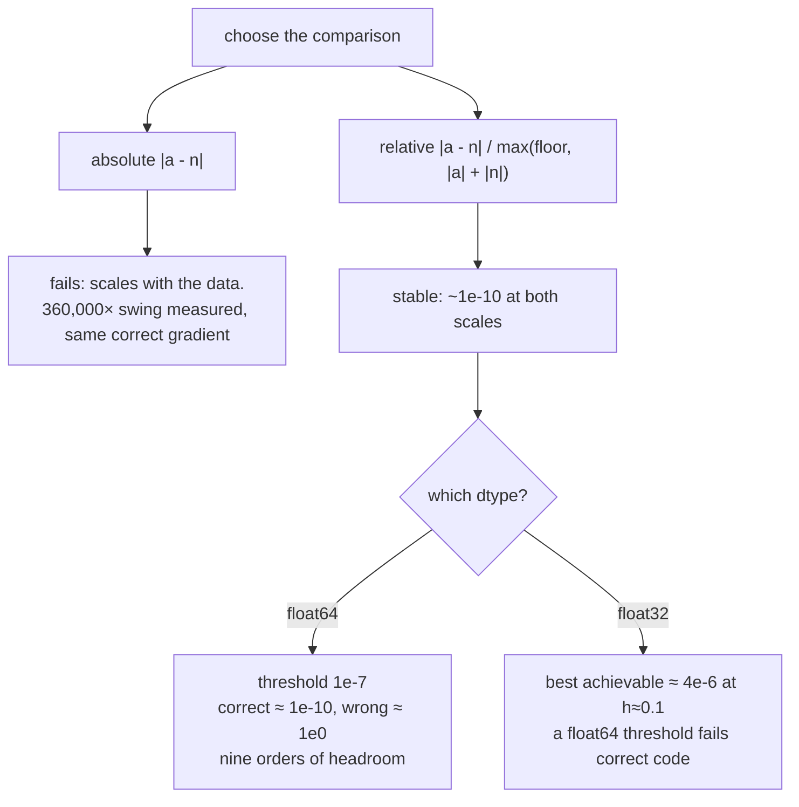

# 2.2 — The relative error criterion, and picking a threshold you can defend

## One-line answer

Compare gradients by **relative** error normalised by the sum of both magnitudes with a small floor —
because the same correct gradient measured here shows an absolute error of `2.4 × 10⁻⁴` at one input
scale and `6.6 × 10⁻¹⁰` at another, while its relative error stays around `10⁻¹⁰` at both.

---

## The story

Two things are weighed, and both come out exactly one gram off.

The first is a two-gram packet of saffron, which the scale says is three grams. The second is a
five-kilogram bag of rice, which the scale says is 5.001 kg.

Both are "one gram off". The first is half again as much as it should be, and completely unusable. The
second is closer than anybody needed it to be. Somebody who only ever writes down "off by one gram"
cannot tell those two situations apart at all.

That is exactly why a shop's tolerance is written as a **percentage** rather than a weight. The same
number means wildly different things at different sizes, and a check that does not know the size is
not really a check.
---

## The idea in plain language

Part [2.1](2.1-finite-differences-as-an-oracle.md) produced two arrays that should agree. This part is
how to decide whether they do.

**Absolute error** — `|analytic − numeric|` — is unusable, because gradient magnitudes vary by many
orders of magnitude between layers, between parameters and between input scales. Measured below: the
same correct `dW`, on inputs scaled up by 1000, has an absolute error a *million times larger* and is
no less correct.

**Relative error** divides by the size of the thing being compared, so it asks "what fraction of the
value is the disagreement?" — which is the question. But there is a choice of denominator, and it
matters when either side is near zero:

| Denominator | Behaviour |
| --- | --- |
| `\|analytic\|` | divides by zero exactly where the gradient vanishes |
| `\|numeric\|` | same problem, and trusts the *less* reliable of the two |
| `\|analytic\| + \|numeric\|` | symmetric, never worse than 1 when both are the same sign, still explodes when both are near zero |
| `max(floor, \|analytic\| + \|numeric\|)` | **the one to use** — symmetric, and a floor stops meaningless comparisons of two tiny numbers |

Measured below with `a = 1e-12` and `n = 3e-12` — two numbers that are both effectively zero — the
four denominators give `2.0`, `0.667`, `0.5` and `2e-4`. Only the last one declines to make a fuss
about a difference of two femto-somethings.

And then the threshold, which is the part people copy from somewhere and should not:

- In **`float64`**, a correct gradient agrees to around `10⁻¹⁰` and a wrong one disagrees at order
  `10⁰`. Part [1.5](../01-the-linear-layer/1.5-the-transpose-that-trained-anyway.md) measured exactly
  that pair: `3.480e-10` versus `1.000e+00`. There is no middle ground to worry about, so `10⁻⁷` is a
  comfortable threshold with nine orders of headroom.
- In **`float32`** everything shifts. Measured below, the *best achievable* relative error for a
  correct gradient is `4.4 × 10⁻⁶` — and at the `h` that was optimal for `float64` it is `3.3 × 10⁻²`,
  a **3% disagreement on a correct gradient**. A `float64` threshold applied to a `float32` check fails
  every time, on correct code.

So the rule is: **gradient-check in `float64`**, even for a model that trains in something narrower, and
if you cannot, measure the achievable error first and set the threshold from the measurement.

---

## Why Akshara needs it

- **Day 30**'s phase gate is "matches a reference within tolerance". This part is what "within
  tolerance" means, and it has to be a number somebody chose for a reason.
- **Day 51** puts a gradient check in `tests/`. A threshold that is too tight makes a flaky test — and
  a flaky test in this repository is indistinguishable from Silent Failure #4 and must be fixed, never
  re-run (CLAUDE.md).
- **Days 78–85** run the model in narrow dtypes deliberately, so knowing that a check's usable
  precision moves with the dtype is what stops a quantization experiment being misdiagnosed as a
  gradient bug.
- **Day 7** is the numerical-reality day, and this part is its first practical consequence.

---

## The mechanism

The criterion, written once and reused everywhere:

```python
import numpy as np


def relative_error(analytic: np.ndarray, numeric: np.ndarray, floor: float = 1e-8) -> float:
    """Worst-case relative disagreement, symmetric, with a floor for near-zero entries."""
    denom = np.maximum(floor, np.abs(analytic) + np.abs(numeric))
    return float(np.max(np.abs(analytic - numeric) / denom))
```

**Line by line:**
- `np.abs(analytic) + np.abs(numeric)` is **symmetric**: swapping the arguments gives the same answer.
  A check whose result depends on argument order is a check with an opinion about which side is
  trusted, and there is no reason to have one.
- `np.maximum(floor, ...)` applies the floor **elementwise**, so entries with healthy gradients are
  judged normally and entries where both sides are near zero are not judged at all. Part
  [2.4](2.4-what-it-cannot-catch.md) is about what that means for coverage.
- `np.max` rather than a mean. **A gradient check is a worst-case check**: one wrong element is a bug,
  and averaging it against a thousand right ones hides it. This is the opposite of how you would report
  a training metric, and the difference is worth being deliberate about.
- `floor = 1e-8` suits `float64` gradients of order 1. It is a parameter rather than a literal because
  the right value depends on the dtype and the scale, and hiding it inside the function would make it
  unmeasurable.

**Why relative and not absolute**, measured. The same layer, the same correct `dW`, with the inputs
scaled by 1000:

```python
rng = np.random.default_rng(1337)
B, C, C_out = 4, 5, 3

for scale in (1.0, 1000.0):
    X = rng.standard_normal((B, C)) * scale       # (B, C)
    W = rng.standard_normal((C, C_out))           # (C, C_out)
    b = rng.standard_normal(C_out)                # (C_out,)
    loss = lambda: float(((X @ W + b) ** 2).sum())

    analytic = X.T @ (2 * (X @ W + b))            # (C, C_out)
    numeric = numerical_gradient(loss, W, h=1e-5) # (C, C_out)
    print(f"scale {scale:7.1f}: |dW|max {np.abs(analytic).max():.3e}"
          f"  abs err {np.max(np.abs(analytic - numeric)):.3e}"
          f"  rel err {relative_error(analytic, numeric):.3e}")
```

**Line by line:**
- Only `X` is scaled. `W` and `b` are unchanged, and the derivation is unchanged — **the gradient is
  correct in both rows.**
- `abs err` is the maximum absolute disagreement; `rel err` is the criterion above.
- Measured on Intel Core i3-1115G4, CPython 3.12.10, numpy 2.5.2, seed 1337, 2026-08-26:

```text
scale     1.0: |dW|max 2.518e+01  abs err 6.643e-10  rel err 1.504e-09
scale  1000.0: |dW|max 1.684e+07  abs err 2.394e-04  rel err 2.935e-11
```

**The absolute error grew by a factor of 360,000 and the gradient did not get any less correct.** An
absolute threshold of `10⁻⁶` would pass the first row and fail the second, on identical code. The
relative error is around `10⁻¹⁰` in both — in fact *better* in the scaled row, because the larger
values carry more significant digits relative to the perturbation.

**And why the dtype decides the threshold**, measured. The same check in `float64` and `float32`,
sweeping `h`:

```text
float64:
  h=1e-03  max rel err 4.096e-12
  h=1e-05  max rel err 1.856e-10
  h=1e-07  max rel err 1.830e-08
float32:
  h=1e-01  max rel err 4.357e-06
  h=1e-02  max rel err 2.828e-05
  h=1e-03  max rel err 3.133e-04
  h=1e-04  max rel err 4.491e-03
  h=1e-05  max rel err 3.304e-02
```

Read the two blocks against each other:

- In `float64` the error is `10⁻¹²` to `10⁻⁸` across three decades of `h`. Any threshold between
  `10⁻⁷` and `10⁻⁵` works and nothing is borderline.
- In `float32` the **best** result in the sweep is `4.36 × 10⁻⁶`, at `h = 0.1` — a step size that would
  look absurdly large to anyone reasoning from `float64` habits. And the errors grow *monotonically* as
  `h` shrinks: by `h = 10⁻⁵`, the value that was near-optimal in `float64`, the disagreement is
  **3.3%** on a gradient that is exactly correct.
- The reason is Day 2 part
  [1.2](../../../day-002-tensors-shape-stride/parts/01-what-a-tensor-is/1.2-dtype-the-width-of-a-number.md)'s
  epsilon: `1.19e-07` for `float32` against `2.22e-16` for `float64`. Nine orders of magnitude of
  precision, gone, and the whole usable `h` window moves with it — exactly as Day 3 part
  [1.5](../../../day-003-derivatives-and-autograd/parts/01-the-derivative/1.5-the-finite-difference-that-lied.md)
  predicted.



---

## Shapes

| Tensor | Symbolic shape | Concrete here | What each axis means |
| --- | --- | --- | --- |
| `analytic` | `(C, C_out)` | `(5, 3)` | your derived gradient |
| `numeric` | `(C, C_out)` | `(5, 3)` | the central-difference gradient, same shape |
| `np.abs(a) + np.abs(n)` | `(C, C_out)` | `(5, 3)` | the elementwise denominator |
| `denom` after the floor | `(C, C_out)` | `(5, 3)` | entries below the floor are lifted to it |
| the per-element error | `(C, C_out)` | `(5, 3)` | **the diagnostic** — read this, not just its max |
| `relative_error(...)` | `()` | scalar | the worst element, which is the verdict |

---

## When it breaks

The loud one — comparing arrays that are not the same shape:

```console
>>> relative_error(np.zeros((5, 3)), np.zeros((3, 5)))
Traceback (most recent call last):
  File "<stdin>", line 1, in <module>
ValueError: operands could not be broadcast together with shapes (5,3) (3,5)
```

A transposed gradient caught by the comparison rather than by an assertion — useful, but note that in a
**square** layer it would broadcast and produce a number instead, which is part
[1.5](../01-the-linear-layer/1.5-the-transpose-that-trained-anyway.md) all over again. Assert the shapes
before comparing.

**The silent versions, and there are two, in opposite directions.**

*The false alarm.* A correct gradient, checked in `float32` with a `float64` threshold:

```text
h=1e-05  max rel err 3.304e-02      threshold 1e-7      -> FAIL
```

Nothing is wrong with the gradient. The test is measuring the dtype. This is the single most common way
a gradient check is misdiagnosed, and the fix is one line — do the check in `float64` — not an
afternoon reading the derivation.

*The false confidence.* Take the **mean** instead of the max:

```python
mean_err = np.mean(np.abs(analytic - numeric) / denom)     # WRONG for this purpose
```

**Line by line:**
- With one wrong element out of fifteen and fourteen at `10⁻¹⁰`, the mean is about `1/15` of the wrong
  element's error — enough to sneak under a loose threshold.
- On a real layer with thousands of elements, a mean will hide a completely wrong row. **The maximum is
  the only defensible statistic for a correctness check**, and reporting the mean alongside it is fine
  as long as the max is what decides.

The check on the check, which belongs next to it:

```python
assert analytic.shape == numeric.shape, f"{analytic.shape} vs {numeric.shape}"
assert np.abs(numeric).max() > 0, "numerical gradient is identically zero — the loss is disconnected"
assert np.isfinite(numeric).all(), "numerical gradient has NaN or inf — check h and the loss"
```

**Line by line:**
- The shape assertion prevents the square-layer broadcast from producing a meaningless number.
- The all-zeros assertion is part [2.1](2.1-finite-differences-as-an-oracle.md)'s disconnected-loss
  failure, which otherwise makes any comparison vacuous.
- The finiteness assertion catches an `h` so small that the subtraction underflowed, or a loss that
  produced `inf`. Both give a comparison that means nothing, and neither raises on its own.
- Three lines, run once per check, and together they turn "the number was small" into "the number was
  small and the instrument was working".

---

## In production

**What a research engineer writes instead of the teaching version.** They use the framework's checker,
which implements exactly this criterion with a documented default threshold — and they still read the
docs to find out what dtype it uses and what `h` it picked, because those two decide whether a failure
means anything. When it fails, the first question is never "is my gradient wrong" but "is the check
measuring what I think" — dtype, `h`, near-zero entries, non-differentiable points.

**What degrades at scale.** The worst-case statistic gets harder to satisfy as the parameter count
grows, purely because there are more chances for one element to land in a bad spot — a near-zero
gradient, a saturated activation. That is not the gradient getting worse; it is the max over more
samples. The response is not to loosen the threshold but to **exclude** the entries the check cannot
judge, which is the floor above and part [2.4](2.4-what-it-cannot-catch.md)'s subject.

**The failure that only shows with real data.** Gradient magnitudes that span many orders of magnitude
within one tensor — normal in a trained model, where some channels are active and others are nearly
dead. The relative criterion handles that correctly by construction, which is precisely why it is
preferred; an absolute criterion would be dominated by the largest entries and blind to everything
else.

**The review comment.** *"This uses absolute error with a fixed tolerance. Gradient magnitudes vary by
orders of magnitude across layers — make it relative, and say which dtype the check runs in."*

**The interview question.** *"Your gradient check reports a relative error of 3e-2. Is the gradient
wrong?"* The strong answer asks the dtype first, then `h`, then whether the failing entries have
near-zero gradients — because `3e-2` is exactly what a *correct* gradient produces in `float32` at a
`float64`-sized `h`, which is measured above. Answering "yes, it's wrong" is the common and expensive
mistake.

**Compute tier: T0.** Every measurement here is a laptop CPU measurement, and — unusually — the numbers
transfer, because they are properties of IEEE-754 arithmetic rather than of the machine. The `float32`
window sits about nine orders of magnitude above the `float64` one on any hardware. What is
machine-specific is nothing here; what is *problem*-specific is the floor, which depends on your
gradient magnitudes and should be measured rather than copied.

---

## Check yourself

Run this. It prints **two absolute errors that differ by five orders of magnitude, and two relative
errors that do not**:

```python
import numpy as np

rng = np.random.default_rng(1337)
B, C, C_out = 4, 5, 3


def numerical_gradient(loss, param, h=1e-5):
    grad = np.zeros_like(param)
    it = np.nditer(param, flags=["multi_index"])
    while not it.finished:
        i = it.multi_index
        o = param[i]
        param[i] = o + h; up = loss()
        param[i] = o - h; down = loss()
        param[i] = o
        grad[i] = (up - down) / (2 * h)
        it.iternext()
    return grad


def relative_error(a, n, floor=1e-8):
    return float(np.max(np.abs(a - n) / np.maximum(floor, np.abs(a) + np.abs(n))))


for scale in (1.0, 1000.0):
    X = rng.standard_normal((B, C)) * scale
    W = rng.standard_normal((C, C_out))
    b = rng.standard_normal(C_out)
    loss = lambda: float(((X @ W + b) ** 2).sum())
    a = X.T @ (2 * (X @ W + b))
    n = numerical_gradient(loss, W)
    print(f"scale {scale:7.1f}  abs {np.max(np.abs(a - n)):.3e}  rel {relative_error(a, n):.3e}")
```

**Line by line:**
- On this machine, 2026-08-26, it prints absolute errors of `9.012e-10` and `2.189e-04` — a factor of
  about 243,000 — and relative errors of `1.856e-10` and `1.974e-10`, which agree to within a factor of
  1.06. (These differ slightly from the mechanism section's figures because the generator has been
  drawn from a different number of times before each block; same seed, different position in the
  stream. The *ratio* is the finding, and it survives.)
- **The gradient is correct in both rows.** Say out loud which threshold you would have to pick to
  accept both under an absolute criterion, and what that threshold would then fail to catch.
- Now add `.astype(np.float32)` to `X`, `W` and `b` and re-run with `h = 1e-5`. Predict roughly what the
  relative error becomes before you look; the answer is in the mechanism section.

**Say this out loud, without scrolling up:** say why the denominator is `|a| + |n|` and not `|a|` — and
give the two thresholds you would use for `float64` and `float32`, with the reason each one is what it
is.
