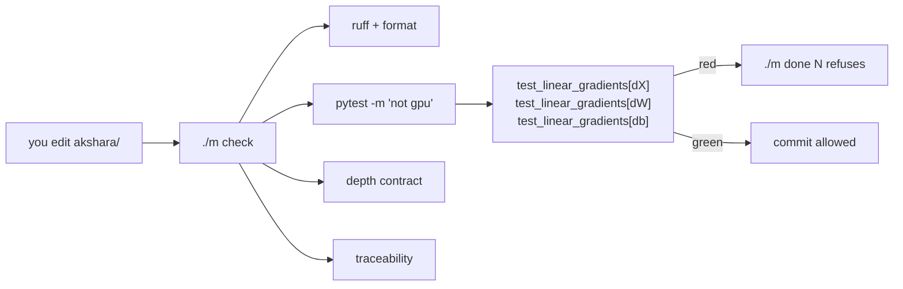

# 2.3 — Making it a test: the check that runs on every commit

## One-line answer

A gradient check you run once by hand protects the version of the code you ran it against; the same
check as a seeded, CPU-only, offline test in `tests/` protects every version after it, which is the
only kind of protection that survives a curriculum this long.

---

## The story

A house has a rule: the last person out locks the door.

For the first month, everybody remembers. Then term starts, people get busy, and one evening the door
is left open all night. Nobody sat down and decided to stop locking it. It stopped happening because
it was a thing a person had to remember, and a person is the least reliable part of anything that has
to happen a thousand times in a row.

So they fit a lock that closes by itself when the door shuts. Now nobody has to remember anything, and
the door is locked on exactly the evenings when everyone is rushing out late — which are precisely the
evenings it used to be left open.

The locking was never the improvement. **Making it impossible to skip was the improvement.**
---

## The idea in plain language

Parts [2.1](2.1-finite-differences-as-an-oracle.md) and
[2.2](2.2-the-relative-error-criterion.md) built the instrument. This part is about where it lives.

A gradient check run in a notebook proves something about the code as it stood at that moment. Every
edit afterwards is unprotected, and the edits that break gradients are exactly the ones that look
harmless — a refactor that swaps two lines, a "simplification" that removes a transpose, an
optimisation that reuses a buffer.

Putting it in `tests/` changes what it is. It becomes:

- **Automatic.** `./m check` runs it, so it runs on every commit, and `./m done N` refuses while it is
  red.
- **A specification.** The test says what the layer's gradients *are*, in a form a reader can check.
  When someone changes the layer, the test tells them what they broke, in the language of the thing
  they broke.
- **A regression net.** The bug from part
  [1.5](../01-the-linear-layer/1.5-the-transpose-that-trained-anyway.md) cannot come back, ever.

This repository has four requirements for anything in `tests/` (CLAUDE.md), and a gradient check
satisfies all four naturally, which is worth noticing because most things do not:

| Requirement | How a gradient check meets it |
| --- | --- |
| **CPU-only** | it is `2n` forward passes on a tiny instance; there is nothing for a GPU to do |
| **Deterministic** | seed the generator explicitly and it produces the same arrays every run |
| **Offline** | it downloads nothing |
| **Fast** | tiny shapes, chosen for exactly this reason |

And one requirement that comes from Principle 11: **it must be able to go red.** A test you have never
seen fail is a claim, not a check. So the discipline is to break the gradient on purpose, watch the
test fail, and put it back — before believing it.

---

## Why Akshara needs it

- **Day 51** is where the training loop's tests are established, and this is the pattern they follow.
- **Day 30 and Day 37** add the two hardest backward passes in the curriculum. Both need this test
  written the same day the derivation is.
- **`./m check`** is the whole-project gate, and this is the first genuinely mathematical thing in it.
  Before today it ran lint and a depth check; from today it verifies a derivation.
- **Day 161**'s capstone runs everything cold. A test suite that has been accumulating since Day 4 is
  what makes that possible.

---

## The mechanism

The test file, complete:

```python
"""Gradient checks for the linear layer (Day 4, MATH-06 / MATH-07)."""

from __future__ import annotations

import numpy as np
import pytest

H = 1e-5          # measured optimum for a float64 central difference (Day 3 part 1.5)
RTOL = 1e-6       # measured below: correct gradients land at 1e-10..9e-9, wrong ones at 1e0
FLOOR = 1e-8      # entries where both sides are below this are not judged (part 2.2)


def numerical_gradient(loss, param: np.ndarray, h: float = H) -> np.ndarray:
    grad = np.zeros_like(param)
    it = np.nditer(param, flags=["multi_index"])
    while not it.finished:
        i = it.multi_index
        original = param[i]
        param[i] = original + h
        up = loss()
        param[i] = original - h
        down = loss()
        param[i] = original
        grad[i] = (up - down) / (2 * h)
        it.iternext()
    return grad


def relative_error(analytic: np.ndarray, numeric: np.ndarray) -> float:
    assert analytic.shape == numeric.shape, f"{analytic.shape} vs {numeric.shape}"
    assert np.isfinite(numeric).all(), "numerical gradient is not finite"
    assert np.abs(numeric).max() > 0.0, "numerical gradient is identically zero"
    denom = np.maximum(FLOOR, np.abs(analytic) + np.abs(numeric))
    return float(np.max(np.abs(analytic - numeric) / denom))


@pytest.fixture
def layer():
    """A deliberately non-square layer with a fixed seed."""
    rng = np.random.default_rng(1337)
    B, C, C_out = 2, 3, 5                       # mutually distinct and mutually prime
    X = rng.standard_normal((B, C))             # (B, C)
    W = rng.standard_normal((C, C_out))         # (C, C_out)
    b = rng.standard_normal(C_out)              # (C_out,)
    return X, W, b


@pytest.mark.parametrize("name", ["dX", "dW", "db"])
def test_linear_gradients(layer, name):
    X, W, b = layer
    loss = lambda: float(((X @ W + b) ** 2).sum())
    dY = 2 * (X @ W + b)                        # (B, C_out)

    analytic = {"dX": dY @ W.T, "dW": X.T @ dY, "db": dY.sum(axis=0)}[name]
    param = {"dX": X, "dW": W, "db": b}[name]

    err = relative_error(analytic, numerical_gradient(loss, param))
    assert err < RTOL, f"{name}: relative error {err:.3e} exceeds {RTOL:.0e}"
```

**Line by line:**
- `H`, `RTOL` and `FLOOR` are **module-level constants with comments saying where they came from**.
  Buried literals are the reason nobody can tell whether a threshold was chosen or copied, and part
  [2.2](2.2-the-relative-error-criterion.md) is the measurement behind these three.
- `RTOL = 1e-6` and not `1e-7`, and the reason is a measurement rather than caution. On this machine,
  2026-08-26, this exact test reports `dX 8.978e-09`, `dW 2.554e-10`, `db 1.386e-10`. **`dX` is the
  tightest of the three at `9 × 10⁻⁹`** — only about one order of magnitude below a `1e-7` threshold,
  which is not enough margin for a test that must never be flaky across machines and numpy builds. At
  `1e-6` the margin against the observed worst case is about 100×, and the margin against a *wrong*
  gradient (order `1`, measured in part
  [1.5](../01-the-linear-layer/1.5-the-transpose-that-trained-anyway.md)) is still a factor of a
  million. **Pick the threshold from the measured spread, not from a round number.**
- `relative_error` carries its three guard assertions *inside* it. Putting them in the comparison
  function rather than in each test means every future check inherits them for free — and each one
  corresponds to a real failure from part [2.1](2.1-finite-differences-as-an-oracle.md) or
  [2.2](2.2-the-relative-error-criterion.md).
- `B, C, C_out = 2, 3, 5` are mutually distinct **and pairwise coprime**. Distinct kills the square-layer
  blindness from part [1.5](../01-the-linear-layer/1.5-the-transpose-that-trained-anyway.md); coprime
  also kills the case where one size happens to divide another and a reshape bug survives.
- `rng = np.random.default_rng(1337)` inside the fixture, not at module level. A module-level generator
  is shared state: the arrays a test sees would depend on which other tests ran first, and that is a
  flaky test waiting to happen.
- `@pytest.mark.parametrize` gives **three separate test cases** rather than one test with three
  assertions. When `dW` breaks, the report says `test_linear_gradients[dW]` failed and the other two
  passed — which is half the diagnosis, for free.
- `loss` is a sum of squares over **every** output element, so no part of the layer goes unexercised.
  Part [2.4](2.4-what-it-cannot-catch.md) is about what still does.
- The assertion message prints the measured error **and** the threshold. `dW: relative error 1.000e+00
  exceeds 1e-06` is a diagnosis; a bare `AssertionError` is a starting point.
- No `@pytest.mark.gpu`, no network, no files. It runs in `./m check` on a laptop, which is the
  requirement.

**Now watch it go red**, because a test you have not seen fail is not evidence:

```python
# temporarily, in the test:
analytic = {"dX": dY @ W.T, "dW": dY.T @ X, "db": dY.sum(axis=0)}[name]
```

**Line by line:**
- `dY.T @ X` is the other weight-layout convention's answer — part
  [1.3](../01-the-linear-layer/1.3-the-transpose-everyone-gets-wrong.md) measured it at shape `(3, 5)`
  where `W` is `(5, 3)`... but here `C = 3` and `C_out = 5`, so `dY.T @ X` is `(5, 3)` and `W` is
  `(3, 5)`. The **shape assertion inside `relative_error` fires first**, with the message
  `(5, 3) vs (3, 5)`.
- That is the good outcome and it is a consequence of the distinct shapes. Make `C = C_out` and the
  shape assertion passes, the comparison runs, and the relative error comes back at order `1` instead —
  a different message for the same bug, one step later.
- Both are red. **Run it both ways once**, so you know what each failure looks like before you meet one
  at eleven at night.

Where the test sits in the gate:



---

## Shapes

| Tensor | Symbolic shape | Concrete here | What each axis means |
| --- | --- | --- | --- |
| `X` | `(B, C)` | `(2, 3)` | example · input channel — small, distinct, coprime |
| `W` | `(C, C_out)` | `(3, 5)` | input channel · output channel |
| `b` | `(C_out,)` | `(5,)` | output channel |
| `dY` | `(B, C_out)` | `(2, 5)` | one gradient per output element |
| `dX` | `(B, C)` | `(2, 3)` | checked against `numerical_gradient(loss, X)` |
| `dW` | `(C, C_out)` | `(3, 5)` | checked against `numerical_gradient(loss, W)` |
| `db` | `(C_out,)` | `(5,)` | checked against `numerical_gradient(loss, b)` |
| forward passes per run | scalar | `2 × (6 + 15 + 5) = 52` | the whole test's cost |

Fifty-two forward passes on `(2, 3)` matrices. That is why this can run on every commit forever.

---

## When it breaks

The loud one, and it is the one you want:

```console
$ uv run python -m pytest tests/test_linear.py -q
F..
=================================== FAILURES ===================================
_________________________ test_linear_gradients[dW] __________________________
    err = relative_error(analytic, numerical_gradient(loss, param))
>   assert err < RTOL, f"{name}: relative error {err:.3e} exceeds {RTOL:.0e}"
E   AssertionError: dW: relative error 1.000e+00 exceeds 1e-06
1 failed, 2 passed
```

`F..` — one failed, two passed — and the failing one is named. The parametrisation did the triage
before anyone read the message.

**The silent versions, and both are failures of the test rather than of the code.**

*The test that cannot fail.* If `loss` reads a copy of the parameter, the numerical gradient is
identically zero (part [2.1](2.1-finite-differences-as-an-oracle.md)) — and without the guard
assertion the comparison would then depend entirely on the analytic side. The `np.abs(numeric).max() >
0` assertion inside `relative_error` exists for exactly this, and it is the reason the guards live in
the shared function rather than in each test.

*The test that passes on square shapes.* If the fixture used `B = C = C_out = 4`, part
[1.5](../01-the-linear-layer/1.5-the-transpose-that-trained-anyway.md)'s bug would produce a shape that
passes the shape assertion and a relative error that catches it — but a *reshape* bug, or an axis
permutation, could survive. Distinct coprime sizes are free and they close that door.

*The flaky test.* If `RTOL` were `1e-12`, the test would pass or fail depending on the machine's
summation order — Day 2 part
[3.2](../../../day-002-tensors-shape-stride/parts/03-matmul/3.2-three-loops-then-one-call.md) measured
that two correct matmuls disagree at `10⁻¹⁴`. And `1e-7` would be uncomfortably tight too: `dX`
measured `8.978e-09` here, one order away. **A flaky test in this repository is indistinguishable from
Silent Failure #4 and must be fixed, never re-run** (CLAUDE.md), and the fix is a threshold chosen from
the measured worst case with real headroom on both sides — which is what `1e-6` is, sitting 100× above
the worst correct value and a million times below a wrong one.

---

## In production

**What a research engineer writes instead of the teaching version.** Almost exactly this, using the
framework's gradient checker in place of the hand-rolled one, and with two additions. First, several
**test points** rather than one — a random point, a point with a zero in it, a point near an
activation's saturation — each with a comment saying which case it covers. Second, a **shape sweep**:
the same check parametrised over two or three shape triples, so a bug that only appears when a
dimension is 1 gets caught.

The cultural half matters as much as the code: a custom backward pass without a gradient check does not
get merged. That is a review norm rather than a technical one, and it is the reason the norm exists at
all.

**What degrades at scale.** Nothing about this test — it is deliberately tiny and stays tiny forever.
What grows is the *number* of such tests, one per custom operation, and their total runtime is what
keeps `./m check` fast enough to actually run. That is the argument for keeping the shapes at 2, 3 and
5 rather than at something that feels more realistic: realism buys nothing here, because the formula
does not depend on the size.

**The failure that only shows with real data.** A layer that passes at every synthetic test point and
fails on real inputs, because real inputs are not drawn from a standard normal — they have zeros, they
have outliers, they saturate activations. The test suite cannot cover the data distribution; what it
can do is cover the *structural* cases deliberately, which is part
[2.4](2.4-what-it-cannot-catch.md)'s list.

**The review comment.** *"Good check — can it be parametrised over a couple of shapes, including one
with a size-1 axis? And have you watched it go red?"*

**The interview question.** *"What's in your test suite for a model?"* A weak answer lists "unit tests".
A strong one names the specific things that can go red: gradient checks per custom operation, an
overfit-one-batch test (Principle 12, Day 51), a shape/dtype assertion at every boundary, and a
determinism test that the same seed gives the same loss. And then the honest part — which of them has
actually caught something.

**Compute tier: T0.** The test is a T0 artefact by design: 52 forward passes on `(2, 3)` matrices,
CPU-only, offline, deterministic. That is not a compromise forced by the zero-budget rule; it is what a
gradient check *should* be, because correctness of a formula does not depend on scale. Nothing here
would be improved by a GPU.

---

## Check yourself

Write the test file above into `tests/test_linear.py`, then run this. It prints **a pytest summary
that must read `3 passed`, and then one that must read `1 failed, 2 passed`**:

```bash
uv run python -m pytest tests/test_linear.py -q

# now break it on purpose: change dW to dY.T @ X in the analytic dict, then
uv run python -m pytest tests/test_linear.py -q

# and put it back
uv run python -m pytest tests/test_linear.py -q
```

**Line by line:**
- The first run must be `3 passed`. If it is not, the derivation or the check is wrong and you now have
  three separate signals telling you which.
- The second run must fail on **`[dW]` only**. Read the message: with `C ≠ C_out` it is the shape
  assertion, and with `C == C_out` it is the relative error. Try both.
- The third run confirms you put it back. **Skipping this step is how a deliberately-broken test gets
  committed**, and it happens more often than anyone admits.

**Say this out loud, without scrolling up:** name the four properties this repository requires of a test
and say how a gradient check satisfies each — and say why the fixture's shapes are 2, 3 and 5 rather
than 4, 4 and 4.
