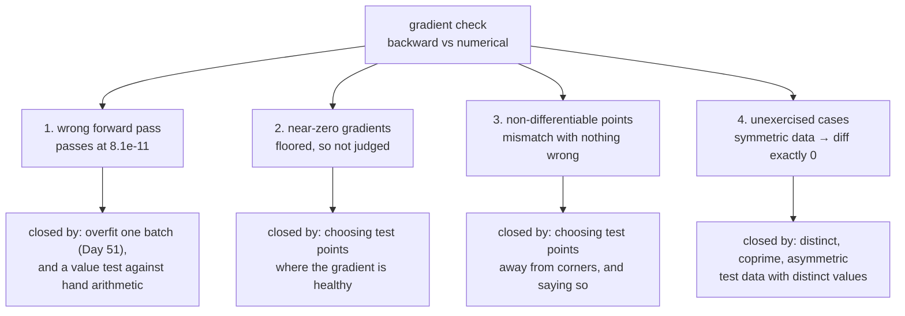

# 2.4 — What gradient checking cannot catch

## One-line answer

A gradient check proves your backward pass is **consistent with your forward pass** — so a wrong
forward pass passes it perfectly, measured here at a relative error of `8.135 × 10⁻¹¹` on a layer whose
bias has simply been left out.

---

## The story

Somebody reads you a phone number over the line, and you write it down.

To be careful, you read it back to them, digit by digit. They listen and say "yes, that is exactly
what I said". Both of you are satisfied. The check has passed.

But neither of you looked at the card the number was written on. The person reading it out had already
misread one digit before they opened their mouth. Your read-back proves that the two of you now agree
with each other. It proves nothing whatsoever about the card, because both halves of the check came
from the same place.

The read-back was a real check and it did real work — it would have caught you mishearing a digit, and
that happens. It simply has nothing to say about a digit that was already wrong before it ever reached
you.
---

## The idea in plain language

Part [2.1](2.1-finite-differences-as-an-oracle.md) argued that a numerical gradient is independent of
your derivation, and that is true — but it is worth being precise about what it is independent *of*.

The numerical gradient is computed by running **your forward pass** at perturbed inputs. So it inherits
every property of the forward pass, including its bugs. What the check compares is:

> "the gradient you derived" **against** "the true gradient of the function you actually implemented"

Those two agreeing tells you your calculus is right. It says nothing about whether the function you
implemented is the function you intended.

There are four blind spots, and each one has its own defence:

**1. A wrong forward pass.** The check is vacuous here, and it is the biggest gap. Measured below: a
layer with the bias silently dropped has a perfectly consistent backward pass and reports `8.1e-11`.

**2. Points where the gradient is zero or near zero.** The relative criterion from part
[2.2](2.2-the-relative-error-criterion.md) floors those entries, which is correct — comparing two
near-zero numbers is meaningless — but it also means those entries are **not checked at all**. A
gradient that is wrong precisely where the true gradient is small will pass. Part
[2.5](2.5-the-gradcheck-that-passed.md) is that failure, measured.

**3. Points where the function is not differentiable.** ReLU's corner at zero, an `abs`, a `max`, a
`clip` at its boundary. Day 3 part
[1.5](../../../day-003-derivatives-and-autograd/parts/01-the-derivative/1.5-the-finite-difference-that-lied.md)
measured the central difference returning `0.5` at ReLU's corner, which is a value no implementation
returns. The check reports a mismatch and **both sides are behaving correctly.**

**4. Anything the test data does not exercise.** A check runs at the points you chose. Symmetric test
data hides transpose errors — measured below at a maximum difference of **exactly 0.0000** between the
right and wrong `dW` when `X` is all ones. Test data with a size-1 axis, or all-positive values, or no
zeros, each leaves a class of bug unvisited.

Blind spots 2 and 3 make the check say "wrong" when nothing is; blind spot 1 and 4 make it say "right"
when something is. **The second kind is the dangerous one**, and it is why a gradient check is a
necessary and not a sufficient condition.

---

## Why Akshara needs it

- **Day 30** builds attention and checks it against a reference. That check will not notice if the
  scaling by `1/√d_k` is missing from *both* the forward pass and the reference derivation.
- **Day 35** introduces ReLU and GELU. ReLU's corner is blind spot 3, and every gradient check on a
  ReLU network has to steer around it deliberately.
- **Day 16** is Silent Failure #2's home — a tokenizer and a template that disagree. That is blind spot
  1 in a different part of the stack: two components each internally consistent, and wrong together.
- **Day 51's** overfit-one-batch test (Principle 12) is the complementary check. A gradient check
  verifies calculus; overfitting sixteen examples verifies that the whole pipeline can actually learn,
  which is the thing blind spot 1 breaks.

---

## The mechanism

**Blind spot 1: a wrong forward pass passes perfectly.**

```python
import numpy as np

rng = np.random.default_rng(1337)
B, C, C_out = 4, 5, 3
X = rng.standard_normal((B, C))          # (B, C)
W = rng.standard_normal((C, C_out))      # (C, C_out)
b = rng.standard_normal(C_out)           # (C_out,)


def forward_buggy(X, W, b):
    return X @ W                          # (B, C_out) — the bias was dropped


loss = lambda: float((forward_buggy(X, W, b) ** 2).sum())
Y = forward_buggy(X, W, b)                # (B, C_out)
dY = 2 * Y                                # (B, C_out)
dW_consistent = X.T @ dY                  # (C, C_out) — correct FOR THIS forward pass

err = np.max(np.abs(dW_consistent - numerical_gradient(loss, W)) /
             np.maximum(1e-8, np.abs(dW_consistent) + np.abs(numerical_gradient(loss, W))))
print(f"relative error: {err:.3e}")
```

**Line by line:**
- `forward_buggy` omits `+ b`. This is not a contrived bug: dropping a term while refactoring, or
  writing `X @ W` and forgetting to add the bias back, is ordinary.
- `dW_consistent = X.T @ dY` is the **correct** gradient of `X @ W`. The derivation is right; it is
  right about the wrong function.
- The numerical gradient calls `loss()`, which calls `forward_buggy`. **Both sides of the check are now
  measuring the same wrong function.**
- Measured on Intel Core i3-1115G4, CPython 3.12.10, numpy 2.5.2, seed 1337, 2026-08-26:
  `relative error: 8.135e-11`. That is a comfortable pass under any threshold in part
  [2.3](2.3-making-it-a-test.md).
- The layer has no bias. It will train, converge to something, and the gradient check will confirm its
  correctness every commit for as long as the project lasts.

**Blind spot 4: symmetric test data hides a transpose.**

```python
n = 4
for label, Xs in (("random X", rng.standard_normal((n, n))), ("all-ones X", np.ones((n, n)))):
    Ws = rng.standard_normal((n, n))       # (n, n)
    dY = 2 * (Xs @ Ws)                     # (n, n)
    right, wrong = Xs.T @ dY, Xs @ dY      # (n, n) each
    print(f"  {label:11s}: max|right - wrong| = {float(np.abs(right - wrong).max()):.4f}")
```

**Line by line:**
- `Xs.T @ dY` and `Xs @ dY` are the correct and the transposed-by-mistake gradients from part
  [1.5](../01-the-linear-layer/1.5-the-transpose-that-trained-anyway.md).
- With `Xs` all ones, `Xs.T` **is** `Xs`, so the two expressions are literally the same computation.
- Measured on this machine, 2026-08-26:

```text
  random X   : max|right - wrong| = 14.2291
  all-ones X : max|right - wrong| = 0.0000
```

**Exactly zero.** Not "small" — the bug is not merely hard to see with all-ones data, it is *absent*.
Any check at that test point passes, and it passes for a reason that has nothing to do with the code
being correct. Symmetric matrices, all-ones tensors and constant biases are the three test values most
likely to be typed while typing quickly, and all three have this property.

The four blind spots, and where each is closed:



**The defences, written as the checks they are:**

```python
def assert_check_is_meaningful(numeric: np.ndarray, floor: float = 1e-8) -> None:
    """Refuse to report a pass on entries the check cannot judge."""
    judged = np.abs(numeric) > floor
    fraction = judged.mean()
    assert fraction > 0.5, (
        f"only {fraction:.0%} of entries have a gradient above {floor:.0e} — "
        "this test point proves almost nothing; choose another"
    )
```

**Line by line:**
- `judged` marks the entries whose numerical gradient is large enough for the relative criterion to
  mean anything. Everything else was floored by part
  [2.2](2.2-the-relative-error-criterion.md)'s denominator and contributed nothing.
- **Reporting the fraction turns an invisible gap into a number.** A check that judged 3% of a tensor
  and passed is not a passing check, and without this line nothing says so.
- `0.5` is a defensible default and not a law: for a deliberately sparse operation it would be wrong.
  The point is to *state* a coverage expectation rather than to have none.
- This closes blind spot 2 by making it visible. It does nothing for blind spot 1, and nothing can —
  which is the honest conclusion of this document.

And the check that closes blind spot 1, which is not a gradient check at all:

```python
def test_forward_matches_hand_arithmetic():
    X = np.array([[1.0, 2.0]])              # (1, 2)
    W = np.array([[3.0], [4.0]])            # (2, 1)
    b = np.array([10.0])                    # (1,)
    # by hand: 1*3 + 2*4 + 10 = 21
    np.testing.assert_allclose(X @ W + b, [[21.0]])
```

**Line by line:**
- Values chosen so the answer is computable on paper in one line: `1×3 + 2×4 + 10 = 21`.
- **The bias is non-zero and distinct from the other numbers**, so dropping it changes the answer from
  21 to 11. A bias of `0.0`, or of `1.0` where other terms are also 1, would leave the bug invisible.
- This test says nothing about gradients and catches the bug the gradient check cannot. **The two
  together are the pair**: one checks the calculus, the other checks the function.
- Day 51's overfit-one-batch test (Principle 12) is the same idea at the whole-model level: a model that
  cannot memorise sixteen examples has a bug in the *function*, not in its hyperparameters.

---

## Shapes

| Tensor | Symbolic shape | Concrete here | What each axis means |
| --- | --- | --- | --- |
| `X` | `(B, C)` | `(4, 5)` | example · input channel |
| `W` | `(C, C_out)` | `(5, 3)` | input channel · output channel |
| `forward_buggy(...)` | `(B, C_out)` | `(4, 3)` | the wrong function — **no bias term** |
| `dW_consistent` | `(C, C_out)` | `(5, 3)` | correct gradient *of the wrong function* |
| `judged` | `(C, C_out)` | `(5, 3)` | boolean mask: which entries the check actually judged |
| `Xs` all-ones | `(n, n)` | `(4, 4)` | symmetric, so `Xs.T == Xs` and the transpose bug vanishes |

---

## When it breaks

There is no traceback in this document. The failures are all passes.

**Blind spot 1, the wrong-but-running output:**

```text
relative error: 8.135e-11
```

A pass, on a layer with no bias, reported by a check that runs on every commit.

**Blind spot 4, the wrong-but-running output:**

```text
  all-ones X : max|right - wrong| = 0.0000
```

Two different gradient formulas agreeing exactly, because the test data made them the same expression.

**Blind spot 3, which is the reverse — a failure with nothing wrong.** From Day 3 part
[1.5](../../../day-003-derivatives-and-autograd/parts/01-the-derivative/1.5-the-finite-difference-that-lied.md),
measured on this machine, 2026-08-26:

```text
x0=+0e+00  central diff of relu = 0.5
```

No framework's ReLU backward returns `0.5`; they return `0` or `1` by convention. So a gradient check
on a ReLU network, at an input that lands near zero, reports a mismatch — and the correct response is
not to change either side but to move the test point and say why in a comment.

**How to tell the three apart when a check fails**, which is the practical content of this part:

| What you see | Most likely cause | First thing to do |
| --- | --- | --- |
| error at order `1`, most entries wrong | a genuinely wrong derivation | re-derive from shapes (part 1.3) |
| error at order `1`, a few scattered entries | near-zero gradients or a corner | print the numerical values at those entries |
| error around `10⁻²` on everything | wrong dtype for the check | rerun in `float64` (part 2.2) |
| error grows as you shrink `h` | `h` past the cancellation cliff | sweep `h` and take the minimum (Day 3 part 1.5) |
| **passes, but the model underperforms** | **blind spot 1 or 4** | **a value test, and an overfit-one-batch run** |

That last row is the one this document exists for, and it is the only row whose remedy is not a
gradient check.

---

## In production

**What a research engineer writes instead of the teaching version.** They pair every gradient check
with something that tests the *function*: a value assertion against hand-computed arithmetic for a
small case, a comparison against a reference implementation, or — at the model level — an
overfit-one-batch run. The gradient check is never presented as sufficient, and the review question
that follows a new operation is two questions, not one: *is the backward consistent with the forward,
and is the forward what we meant?*

They also choose test points deliberately and say so in comments: away from corners, with a healthy
gradient magnitude, with asymmetric and distinctly-valued data, and covering the structural edge cases
(a size-1 axis, a zero input, an empty batch) as separate parametrised cases.

**What degrades at scale.** Blind spot 2 grows. In a trained model many gradients are genuinely near
zero — dead units, saturated activations, padded positions — so the fraction of entries a relative
check can judge falls, and a check that "passes" may be judging a shrinking minority of the tensor.
Reporting the judged fraction, as above, is what keeps that visible instead of silently eroding.

**The failure that only shows with real data.** Blind spot 1, at the pipeline level, and this is the
important one. A tokenizer that encodes text one way and a training loop that assumes another (Day 16,
Silent Failure #2) is exactly a "both halves consistent, both wrong" failure. No gradient check
anywhere in the model touches it. What catches it is a **round-trip assertion** — encode, decode,
compare to the original — which is the same shape of defence as the value test above: check the
function against something outside the system, not against another part of the system.

**The review comment.** *"The gradient check passes — is there a test that the forward pass is right?
This would pass with the bias term deleted."*

**The interview question.** *"Your gradient check passes and the model still underperforms. What does
the passing check actually tell you?"* The strong answer is precise: it tells you the backward pass is
consistent with the forward pass, and nothing about whether the forward pass is correct — then names
the complementary checks, a value test and an overfit-one-batch run, and ideally mentions that
near-zero and non-differentiable entries were excluded from the check's judgement anyway.

**Compute tier: T0.** Every blind spot here is demonstrated on a laptop CPU in milliseconds — the
`8.1e-11` pass on a bias-free layer, the exactly-zero difference under symmetric data, the `0.5` at
ReLU's corner. All three are structural properties of the method rather than of the machine, so they
transfer completely. What T0 cannot show is the cost of trusting a passing check for three weeks, which
is the reason to know its limits on Day 4 rather than on Day 67.

---

## Check yourself

Run this. It prints **one relative error that passes and one difference that is exactly zero** — both
of which are the failure:

```python
import numpy as np

rng = np.random.default_rng(1337)


def numerical_gradient(loss, param, h=1e-5):
    grad = np.zeros_like(param)
    it = np.nditer(param, flags=["multi_index"])
    while not it.finished:
        i = it.multi_index
        o = param[i]
        param[i] = o + h; up = loss()
        param[i] = o - h; down = loss()
        param[i] = o
        grad[i] = (up - down) / (2 * h)
        it.iternext()
    return grad


B, C, C_out = 4, 5, 3
X = rng.standard_normal((B, C))
W = rng.standard_normal((C, C_out))
b = rng.standard_normal(C_out)

loss = lambda: float(((X @ W) ** 2).sum())          # the bias is silently missing
analytic = X.T @ (2 * (X @ W))
numeric = numerical_gradient(loss, W)
print("bias-free layer, rel err:",
      f"{np.max(np.abs(analytic - numeric) / (np.abs(analytic) + np.abs(numeric))):.3e}")

ones = np.ones((4, 4))
dY = 2 * (ones @ rng.standard_normal((4, 4)))
print("all-ones X, |right - wrong|:", float(np.abs(ones.T @ dY - ones @ dY).max()))
```

**Line by line:**
- The first prints `8.135e-11` on this machine, 2026-08-26 — a clean pass on a layer that has lost its
  bias.
- The second prints `0.0`. Two different formulas, identical results, because the test data is
  symmetric.
- Now write the four-line `test_forward_matches_hand_arithmetic` from the mechanism section and confirm
  it fails on the bias-free forward pass. **That is the check the gradient check could not be.**

**Say this out loud, without scrolling up:** state exactly what a passing gradient check proves, in one
sentence, using the word *consistent* — and name the two complementary checks that cover what it does
not.
