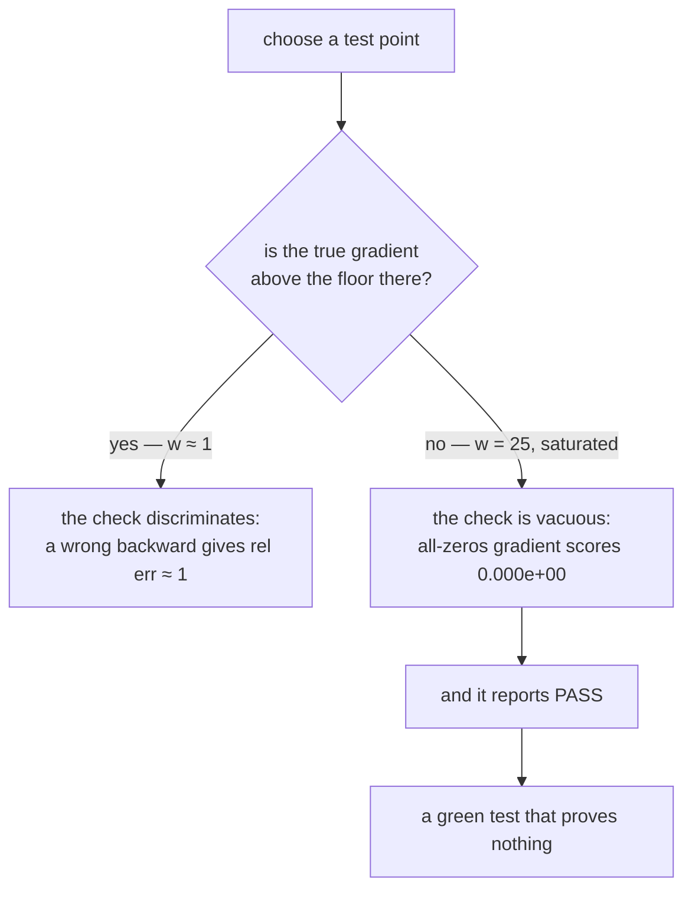

# 2.5 — 💥 The gradcheck that passed on a gradient of zeros

## One-line answer

At a saturated point the true gradient underflows to exactly `0.0`, so a backward pass that returns
all zeros agrees with the numerical gradient to a relative error of **`0.000e+00`** — a perfect score,
awarded to a gradient that is not computed at all.

---

## The story

A smoke alarm is tested once a year by holding a lighter flame directly underneath it.

It screams. Everybody files outside, the log is signed, and the alarm is certified for another year.

What nobody notices is that the sensor was swapped last month for a different model, and a bare flame
is enormously more than anything it is meant to detect. A flame that size would set off literally any
smoke alarm ever built, including a broken one with the wrong sensor in it.

The test proves the alarm reacts to a bonfire. The question everybody actually cared about was whether
it reacts to smoke.

The test was carried out correctly. It passed correctly. And it tells you nothing at all, because the
thing it was tested with was chosen so far outside the interesting range that every possible sensor,
good or bad, would have given exactly the same answer.
---

## The idea in plain language

Part [2.4](2.4-what-it-cannot-catch.md) listed near-zero gradients as a blind spot. This document is
that blind spot made concrete, because it is the one that produces a *pass* rather than a failure.

The relative criterion from part [2.2](2.2-the-relative-error-criterion.md) is

> `|analytic − numeric| / max(floor, |analytic| + |numeric|)`

If both `analytic` and `numeric` are zero, the numerator is zero and the answer is `0.0` — the best
possible score. And it is awarded regardless of what the analytic gradient *would* have been at a point
where the true gradient was not zero.

So the check discriminates nothing at such a point, and the question becomes: **how easily does a real
gradient reach exactly zero?** Far more easily than it should. `tanh` saturates: its derivative is
`1 − tanh²(x)`, and measured on this machine at `x = 20`, `tanh(x)` rounds to exactly `1.0` in
`float64`, so `1 − 1 = 0` *exactly*. Not small — zero. The same happens for a sigmoid, for a softmax
over logits with one large entry, and for any `exp`-based function far from the origin.

Real models arrive at these points constantly:

- Activations grow during training and saturate.
- A softmax over a confident distribution has near-zero gradients for every token but one.
- Padded positions produce masked activations that are exactly zero by construction.
- A ReLU unit that has died outputs zero and has zero gradient forever.

So a gradient check on random inputs at initialisation may exercise healthy gradients, and the same
check on a model an hour into training may be judging almost nothing — while continuing to report a
pass.

---

## Why Akshara needs it

- **Day 5**'s softmax and **Day 6**'s cross-entropy are `exp`-based and saturate readily. Their
  gradient checks need points chosen with this in mind.
- **Day 27**'s LSTM has gates built from sigmoids whose entire design problem is saturation — that day
  asks "how does a gate keep a gradient alive", and this is the arithmetic of the gate being dead.
- **Day 30**'s attention softmax is exactly this shape at the score level, and Day 34's attention-sink
  behaviour is a distributional version of it.
- **Day 35**'s ReLU produces dead units whose gradient is exactly zero forever, so any check that
  includes them is judging fewer entries than it appears to.
- **Day 51**'s test suite has to keep meaning something after the model has trained, which is when this
  bites.

---

## The mechanism

Reproduce it in five lines. `f(w) = tanh(w)`, whose derivative is `1 − tanh²(w)`:

```python
import numpy as np

w = np.array([25.0])                                  # (1,) — deeply saturated

def loss() -> float:
    return float(np.tanh(w).sum())

true_gradient = 1 - np.tanh(w) ** 2                    # (1,)
broken_gradient = np.array([0.0])                      # (1,) — an implementation that returns zeros
numeric = numerical_gradient(loss, w, h=1e-5)          # (1,)

print(f"true      : {true_gradient[0]:.6e}")
print(f"broken    : {broken_gradient[0]:.6e}")
print(f"numeric   : {numeric[0]:.6e}")
denom = max(1e-12, abs(broken_gradient[0]) + abs(numeric[0]))
print(f"rel err   : {abs(broken_gradient[0] - numeric[0]) / denom:.3e}")
```

**Line by line:**
- `w = 25.0` is well into saturation. `tanh(25)` is `1.0` to every bit `float64` has, so `1 − 1²` is
  **exactly** `0.0` — not `1e-22`, not denormal, zero.
- `broken_gradient` is a stand-in for any implementation that returns zeros where it should compute
  something: a backward pass that forgot to write its result, a mask applied to the wrong side, a
  gradient that was accidentally detached.
- `numeric` measures the loss at `25 ± 1e-5`. `tanh` is `1.0` at both, so the difference is `0.0` and
  the quotient is `0.0`.
- Measured on Intel Core i3-1115G4, CPython 3.12.10, numpy 2.5.2, 2026-08-26:

```text
true      : 0.000000e+00
broken    : 0.000000e+00
numeric   : 0.000000e+00
rel err   : 0.000e+00
```

**A relative error of exactly zero.** The check reports a perfect match between a gradient that returns
zeros and a numerical gradient that measured zero — and, note, the *true* gradient is also zero here, so
strictly the broken implementation is right at this point. That is precisely the problem: **the point
cannot distinguish a correct implementation from an all-zeros one**, so a test suite made of points
like it certifies nothing.

Move to a healthy point and the discrimination returns immediately:

```python
for x in (0.1, 1.0, 5.0, 10.0, 20.0, 25.0):
    w = np.array([float(x)])
    true = float(1 - np.tanh(w[0]) ** 2)
    print(f"  w={x:5.1f}  true gradient {true:.6e}  discriminating: {true > 1e-8}")
```

**Line by line:**
- The true gradient is `1 − tanh²`, which falls off extremely fast.
- Measured on this machine, 2026-08-26:

```text
  w=  0.1  true gradient 9.900663e-01  discriminating: True
  w=  1.0  true gradient 4.199743e-01  discriminating: True
  w=  5.0  true gradient 1.815832e-04  discriminating: True
  w= 10.0  true gradient 8.244615e-09  discriminating: False
  w= 20.0  true gradient 0.000000e+00  discriminating: False
  w= 25.0  true gradient 0.000000e+00  discriminating: False
```

  **The check stops discriminating at `w = 10`, not at `w = 25`.** By 10 the true gradient is
  `8.2 × 10⁻⁹`, already below the `1e-8` floor, and by 20 it is exactly zero. The usable range of this
  function is roughly `|w| < 6` — much narrower than the point at which anything *looks* wrong — and a
  test point picked anywhere outside it certifies nothing.
- `true > 1e-8` is the discrimination test: below that floor, part
  [2.2](2.2-the-relative-error-criterion.md)'s denominator floors the entry and it contributes nothing.



**The guard, and it is four lines:**

```python
def gradcheck(analytic: np.ndarray, numeric: np.ndarray, rtol: float, floor: float = 1e-8) -> float:
    judged = np.abs(numeric) > floor
    assert judged.any(), "no entry has a gradient above the floor — this point proves nothing"
    assert judged.mean() > 0.5, (
        f"only {judged.mean():.0%} of entries are judged at this point; choose another"
    )
    denom = np.maximum(floor, np.abs(analytic) + np.abs(numeric))
    err = float(np.max(np.abs(analytic - numeric)[judged] / denom[judged]))
    assert err < rtol, f"relative error {err:.3e} exceeds {rtol:.0e}"
    return err
```

**Line by line:**
- `judged` is the mask of entries whose numerical gradient is large enough to mean something. Everything
  else was going to be floored anyway; the difference is that now it is **counted** instead of silently
  passed.
- `assert judged.any()` is the fire-alarm test: if **nothing** at this point has a live gradient, the
  check has no information and should fail loudly rather than pass quietly. **This single assertion
  turns today's failure from a pass into a red test.**
- `judged.mean() > 0.5` demands that most of the tensor be exercised. The threshold is a judgement and
  should be stated per operation — for a deliberately sparse gradient it would be wrong — but *having*
  one is not optional.
- The error is computed **over the judged entries only**, so a tensor with a few dead units is still
  checkable on the rest rather than being dominated by them.
- Returning `err` rather than just asserting lets the caller log it, which is how you notice the judged
  fraction drifting down over a project's life.

---

## Shapes

| Tensor | Symbolic shape | Concrete here | What each axis means |
| --- | --- | --- | --- |
| `w` | `(1,)` | `(1,)` | one parameter, at a saturated value |
| `true_gradient` | `(1,)` | `(1,)` | `1 − tanh²(25)` = exactly `0.0` in `float64` |
| `broken_gradient` | `(1,)` | `(1,)` | an all-zeros stand-in for a broken backward pass |
| `numeric` | `(1,)` | `(1,)` | central difference at `25 ± 1e-5` = `0.0` |
| `judged` | same as `numeric` | `(1,)` | boolean mask — **all `False` here**, which is the finding |

The last row is the whole document: a mask with nothing in it, and a check that reported success
anyway.

---

## When it breaks

It passes. That is the failure, and here it is verbatim:

```text
true      : 0.000000e+00
broken    : 0.000000e+00
numeric   : 0.000000e+00
rel err   : 0.000e+00
```

`0.000e+00` against any threshold. Green.

**What this looks like in a project.** A test suite with a gradient check per operation, all green, for
months. Then a model underperforms and somebody discovers that one backward pass has been returning
zeros since it was written, because every test point for it was chosen from an activation range where
the true gradient was negligible — a large initialisation, an unnormalised input, a synthetic dataset
with a wide dynamic range.

**With the guard from the mechanism section, the same run is red:**

```console
>>> gradcheck(broken_gradient, numeric, rtol=1e-6)
Traceback (most recent call last):
  File "<stdin>", line 1, in <module>
AssertionError: no entry has a gradient above the floor — this point proves nothing
```

That message is the correct verdict: **not "your gradient is wrong" but "this test cannot tell"**, which
is a different and more useful statement. A test that reports its own inapplicability is worth several
that quietly succeed.

**The related trap, from Day 3's measurement.** The other route to both-sides-zero is an `h` below the
cancellation cliff. Day 3 part
[1.5](../../../day-003-derivatives-and-autograd/parts/01-the-derivative/1.5-the-finite-difference-that-lied.md)
measured `sin(x + h) − sin(x − h)` at `h = 1e-16` returning exactly `0.0` in `float64`. So `h = 1e-16`
makes **every** numerical gradient zero, `judged` empty everywhere, and every gradient check in the
suite vacuous at once. The `judged.any()` assertion catches that too, which is a good sign that it is
guarding the right thing.

---

## In production

**What a research engineer writes instead of the teaching version.** They choose test points
deliberately and say why in a comment — *"w near 1.0: tanh's gradient is ~0.42 here, well above the
floor"* — and they parametrise the check over several points including deliberately awkward ones. Where
a framework's checker is used, they still read what fraction of entries it judged, because a checker
that silently floors most of a tensor is reporting on a minority.

The deeper habit is one this whole day has been building towards: **a check must be able to fail for
the reason you care about.** Before trusting any new check, break the thing it checks and watch it go
red. A gradient check that has never been shown to reject a wrong gradient at the test point you chose
is a claim about your test point, not about your code.

**What degrades at scale.** The judged fraction, steadily, over a project's life. At initialisation
most gradients are healthy; after training, many are not — dead ReLUs, saturated gates, confident
softmaxes, masked padding. A suite whose checks were meaningful on day one can quietly become
meaningless by month three without a single line changing, and only the reported fraction makes that
visible.

**The failure that only shows with real data.** Padding. Real batches are padded, padded positions are
masked, and masked positions have exactly-zero gradients by construction. A gradient check run on a
realistic batch may find that a large fraction of every tensor is unjudgeable — and the fraction
depends on the *data*, so it varies between batches. This is one of several reasons gradient checks are
run on small synthetic inputs with the padding deliberately absent, and why that choice belongs in a
comment rather than being implicit.

**The review comment.** *"This gradient check passes at `w = 25`, where `tanh` is saturated and the true
gradient is exactly zero. It would pass with the backward pass deleted — please add an assertion that
some entry is actually being judged."*

**The interview question.** *"How would you write a gradient check that cannot give a false pass?"* The
strong answer names two conditions rather than one: the check must run at points where the true
gradient is above the numerical floor, and it must be *seen* to reject a deliberately wrong gradient at
those points. Mentioning that a saturated `tanh` gives exactly `0.0` in `float64`, and therefore a
relative error of exactly zero for any gradient whatsoever, is the detail that shows it has actually
happened to them.

**Compute tier: T0.** The whole failure is a single scalar on a laptop CPU, reproduced in
microseconds — `tanh(25)`, a zero, and a perfect score. It is a property of IEEE-754 arithmetic rather
than of the machine, so it reproduces identically anywhere. What T0 cannot show is the version that
costs three months: a green suite, a mysteriously underperforming model, and a backward pass nobody
suspected because the tests said it was fine.

---

## Check yourself

Run this. It prints **a relative error of exactly `0.000e+00` and then a judged count of `0`** — the
first is the failure and the second is the fix:

```python
import numpy as np


def numerical_gradient(loss, param, h=1e-5):
    grad = np.zeros_like(param)
    it = np.nditer(param, flags=["multi_index"])
    while not it.finished:
        i = it.multi_index
        o = param[i]
        param[i] = o + h; up = loss()
        param[i] = o - h; down = loss()
        param[i] = o
        grad[i] = (up - down) / (2 * h)
        it.iternext()
    return grad


for x in (1.0, 25.0):
    w = np.array([x])
    loss = lambda: float(np.tanh(w).sum())
    broken = np.array([0.0])                      # a backward pass that returns zeros
    numeric = numerical_gradient(loss, w)
    denom = max(1e-12, abs(broken[0]) + abs(numeric[0]))
    judged = int((np.abs(numeric) > 1e-8).sum())
    print(f"w={x:5.1f}  numeric {numeric[0]:.6e}  "
          f"rel err vs all-zeros {abs(broken[0] - numeric[0]) / denom:.3e}  judged {judged}")
```

**Line by line:**
- At `w = 1.0` the numerical gradient is about `4.199743e-01`, the relative error against an all-zeros
  gradient is `1.000e+00` — a clear rejection — and `judged` is `1`.
- At `w = 25.0` the numerical gradient is `0.000000e+00`, the relative error is `0.000e+00` — a perfect
  pass for the same all-zeros gradient — and `judged` is `0`.
- **`judged` is the number that tells the two apart**, and it is the one nobody prints. Add it to your
  gradient checker today.

**Say this out loud, without scrolling up:** explain how a gradient check awards a perfect score to a
backward pass that computes nothing — and name the single assertion that turns that pass into a
failure.
