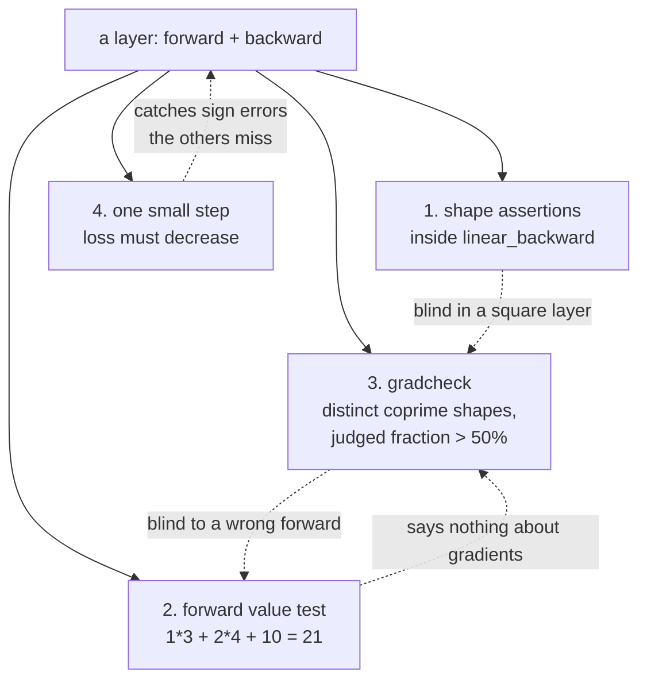

# 3.1 — Gradcheck the layer you wrote: the whole loop, end to end

## One-line answer

Put the day together — a layer, its three gradients, a value test on the forward pass, a discriminating
gradient check on the backward pass, and a one-step loss decrease — because each of those four catches
something the other three cannot.

---

## The story

Before you leave the house for a trip, you check four things, and not one of them repeats another.

Keys: can you get back in. Phone and charger: can anybody reach you. Ticket: will they let you on. Gas
off and door locked: is the house safe while you are away.

Any one of them on its own lets you walk out in a state you will regret. Your keys will not tell you
the gas is still on. The gas will not tell you your ticket is for tomorrow. The ticket will not tell
you your phone is at three per cent. And a locked door will not tell you that you left the keys inside
it.

They are not four ways of being careful about the same thing. They are four **different questions**.
And you write them on a list precisely because nobody holds all four in their head at five in the
morning.
---

## The idea in plain language

Today produced two ideas — how to derive a backward pass, and how to verify one — and four ways of
being wrong that each defeat a different check. This part assembles them into a routine you run every
time you write an operation, for the rest of the curriculum.

The four questions, and what each one is blind to:

| Check | Asks | Blind to |
| --- | --- | --- |
| **1. Shape assertions** | do the gradients have the shapes of their parameters? | anything in a square layer (part [1.5](../01-the-linear-layer/1.5-the-transpose-that-trained-anyway.md)) |
| **2. Forward value test** | is the forward pass the function I meant? | the backward pass entirely |
| **3. Gradient check** | is the backward consistent with the forward? | a wrong forward (part [2.4](../02-gradient-checking/2.4-what-it-cannot-catch.md)); saturated points (part [2.5](../02-gradient-checking/2.5-the-gradcheck-that-passed.md)) |
| **4. One-step loss decrease** | does a step in `−grad` actually reduce the loss? | small errors; it is a sign check, not a magnitude check |

Run all four and the gaps close on each other. Check 2 catches the missing bias that check 3 waves
through. Check 3 catches the transpose that check 1 waves through in a square layer. Check 4 is the
cheapest of all and catches the whole class of sign errors — including the one from Day 3 part
[1.1](../../../day-003-derivatives-and-autograd/parts/01-the-derivative/1.1-the-slope-from-the-definition.md),
where `w = w + lr * grad` performs gradient *ascent* and looks like a model that is not learning yet.

And one meta-rule that governs all four, established across today: **every check must be watched go
red before it is trusted.** A check that has never rejected anything is a claim about your test data.

---

## Why Akshara needs it

- **Day 30 and Day 37** add the two hardest backward passes in the curriculum, and this is the routine
  each of them runs.
- **Day 39** assembles Akshara v0. Its gate is a hand-computed parameter count *plus* a forward-pass
  value check, and part [1.5](../01-the-linear-layer/1.5-the-transpose-that-trained-anyway.md) is why
  the count alone is not enough.
- **Day 51** builds the training loop, whose acceptance test is overfit-one-batch (Principle 12) —
  check 4 taken to its natural conclusion: a model that cannot memorise sixteen examples has a bug,
  not a hyperparameter problem.
- **Day 67**, the first real run, costs a free GPU session. Everything in this routine is a laptop
  check, and every bug it catches is a session not wasted.

---

## The mechanism

The whole routine, as one file:

```python
"""The Day 4 routine: four checks on one layer."""

from __future__ import annotations

import numpy as np

H, RTOL, FLOOR = 1e-5, 1e-6, 1e-8       # measured in parts 2.2 and 2.3


def linear_forward(X, W, b):
    """(B, C) @ (C, C_out) + (C_out,) -> (B, C_out)."""
    return X @ W + b


def linear_backward(X, W, dY):
    """Return dX, dW, db. Shapes match X, W and (C_out,)."""
    dX = dY @ W.T                        # (B, C)
    dW = X.T @ dY                        # (C, C_out)
    db = dY.sum(axis=0)                  # (C_out,)
    assert dX.shape == X.shape, f"dX {dX.shape} != X {X.shape}"
    assert dW.shape == W.shape, f"dW {dW.shape} != W {W.shape}"
    assert db.shape == (W.shape[1],), f"db {db.shape} != {(W.shape[1],)}"
    return dX, dW, db
```

**Line by line:**
- The three assertions live **inside** `linear_backward`, so every caller inherits them and nobody has
  to remember. That is check 1, and it costs microseconds.
- `db.shape == (W.shape[1],)` derives the expected shape from `W` rather than requiring `b` to be
  passed in, which keeps the function's signature honest: the bias's *value* is irrelevant to its
  gradient.
- `dY` is a parameter, not computed inside. The layer does not know what loss it feeds, which is the
  locality property from Day 3 part
  [1.2](../../../day-003-derivatives-and-autograd/parts/01-the-derivative/1.2-the-chain-rule.md) and is
  what makes the layer testable on its own.

**Check 2 — the forward pass is the function you meant:**

```python
def test_forward_value():
    X = np.array([[1.0, 2.0]])           # (1, 2)
    W = np.array([[3.0], [4.0]])         # (2, 1)
    b = np.array([10.0])                 # (1,)
    # by hand: 1*3 + 2*4 + 10 = 21
    np.testing.assert_allclose(linear_forward(X, W, b), [[21.0]])
```

**Line by line:**
- Numbers chosen so the answer is one line of mental arithmetic. That is the entire design of a value
  test: if you cannot compute the expected value by hand, you are testing the code against itself.
- The bias is `10.0` — **large and distinct from the other terms**, so dropping it changes 21 to 11.
  A bias of `0.0` would make the test pass with the bias deleted, which is part
  [2.4](../02-gradient-checking/2.4-what-it-cannot-catch.md)'s blind spot rebuilt inside the test.
- Every number in `X` and `W` is different, so a transpose changes the answer too: `X @ W` is 11 and
  `W.T @ X.T` transposed would give the same here only by coincidence of the `1 × 1` output — which is
  why the *next* check exists rather than this one being extended.

**Check 3 — the backward is consistent with the forward, at a point that discriminates:**

```python
def numerical_gradient(loss, param, h=H):
    grad = np.zeros_like(param)
    it = np.nditer(param, flags=["multi_index"])
    while not it.finished:
        i = it.multi_index
        original = param[i]
        param[i] = original + h; up = loss()
        param[i] = original - h; down = loss()
        param[i] = original
        grad[i] = (up - down) / (2 * h)
        it.iternext()
    return grad


def gradcheck(analytic, numeric, rtol=RTOL, floor=FLOOR):
    assert analytic.shape == numeric.shape, f"{analytic.shape} vs {numeric.shape}"
    assert np.isfinite(numeric).all(), "numerical gradient is not finite"
    judged = np.abs(numeric) > floor
    assert judged.mean() > 0.5, f"only {judged.mean():.0%} of entries judged — pick another point"
    denom = np.maximum(floor, np.abs(analytic) + np.abs(numeric))
    err = float(np.max((np.abs(analytic - numeric) / denom)[judged]))
    assert err < rtol, f"relative error {err:.3e} exceeds {rtol:.0e}"
    return err


def test_gradients():
    rng = np.random.default_rng(1337)
    B, C, C_out = 2, 3, 5                          # distinct and pairwise coprime
    X = rng.standard_normal((B, C))                # (B, C)
    W = rng.standard_normal((C, C_out))            # (C, C_out)
    b = rng.standard_normal(C_out)                 # (C_out,)

    loss = lambda: float((linear_forward(X, W, b) ** 2).sum())
    dY = 2 * linear_forward(X, W, b)               # (B, C_out)
    dX, dW, db = linear_backward(X, W, dY)

    for name, analytic, param in (("dX", dX, X), ("dW", dW, W), ("db", db, b)):
        err = gradcheck(analytic, numerical_gradient(loss, param))
        print(f"  {name}: rel err {err:.3e}")
```

**Line by line:**
- `gradcheck` carries every guard the day produced: the shape check (part
  [2.2](../02-gradient-checking/2.2-the-relative-error-criterion.md)), the finiteness check, the
  judged-fraction check (part [2.5](../02-gradient-checking/2.5-the-gradcheck-that-passed.md)) and the
  relative criterion. Four assertions, each traceable to a measured failure earlier today.
- `judged.mean() > 0.5` is the one that makes this a *discriminating* check rather than a vacuous one.
  On a random-normal test point every entry has a healthy gradient and it passes trivially; the
  assertion exists for the day someone changes the test point.
- `B, C, C_out = 2, 3, 5` — distinct and coprime, for the reasons in parts
  [1.5](../01-the-linear-layer/1.5-the-transpose-that-trained-anyway.md) and
  [2.4](../02-gradient-checking/2.4-what-it-cannot-catch.md).
- Measured on Intel Core i3-1115G4, CPython 3.12.10, numpy 2.5.2, seed 1337, 2026-08-26:
  `dX: rel err 8.978e-09`, `dW: rel err 2.554e-10`, `db: rel err 1.386e-10`.

**Check 4 — a step actually reduces the loss:**

```python
def test_one_step_decreases_loss():
    rng = np.random.default_rng(1337)
    B, C, C_out = 2, 3, 5
    X = rng.standard_normal((B, C))
    W = rng.standard_normal((C, C_out))
    b = rng.standard_normal(C_out)
    target = rng.standard_normal((B, C_out))       # (B, C_out)

    Y = linear_forward(X, W, b)                    # (B, C_out)
    before = float(((Y - target) ** 2).mean())
    dY = 2 * (Y - target) / Y.size                 # (B, C_out)
    _, dW, db = linear_backward(X, W, dY)

    lr = 1e-3
    after = float(((linear_forward(X, W - lr * dW, b - lr * db) - target) ** 2).mean())
    assert after < before, f"one step did not reduce the loss: {before:.6f} -> {after:.6f}"
    print(f"  loss {before:.6f} -> {after:.6f}")
```

**Line by line:**
- `lr = 1e-3` is deliberately **small**. The claim being tested is only that the direction is downhill,
  and a large step can overshoot a valley and increase the loss even with a perfectly correct gradient.
  Making the step small removes the only innocent explanation for a failure.
- The loss is a mean squared error against a fixed target, and `dY = 2 * (Y - target) / Y.size` matches
  the `.mean()` — the scale factor Day 3 part
  [2.5](../../../day-003-derivatives-and-autograd/parts/02-the-autograd-engine/2.5-zero-grad-the-state-that-leaks.md)
  named as the most commonly forgotten line.
- `W - lr * dW` subtracts, because the gradient points uphill. **This one test catches every sign
  error**, which is the cheapest large class of bug there is.
- Measured on this machine, 2026-08-26: `loss 7.467132 -> 7.440898`. Down, as required, and by a small
  amount because the step is small. With the sign flipped — `W + lr * dW` — the same run gives
  `7.467132 -> 7.493422`, up, which is the failure this check exists for.

The four checks and what each closes:



**And the discipline that makes it real** — break each one and watch it fail:

```python
BREAKAGES = {
    "drop the bias from forward": "check 2 fails: 11.0 != 21.0",
    "dW = dY.T @ X":              "check 1 fails: dW (5, 3) != W (3, 5)",
    "dW = X @ dY at square shapes": "check 3 fails: rel err ~1e0",
    "W + lr * dW instead of -":   "check 4 fails: loss increases",
    "gradcheck at tanh(25)":      "check 3 fails: 0% of entries judged",
}
```

**Line by line:**
- Five breakages, five different checks failing, and **no breakage is caught by more than one or two of
  them**. That is the argument for running all four rather than picking a favourite.
- The third entry needs square shapes to reproduce, which is itself the lesson from part
  [1.5](../01-the-linear-layer/1.5-the-transpose-that-trained-anyway.md): with distinct shapes it is
  caught earlier and more cheaply, by check 1.
- The last entry is part [2.5](../02-gradient-checking/2.5-the-gradcheck-that-passed.md), and note that
  without the `judged.mean()` assertion it would **pass** rather than fail. That assertion is the
  difference between a check and a formality.
- Do all five once. It is the only way to know what each failure looks like, and knowing that is most of
  the value of having the checks at all.

---

## Shapes

| Tensor | Symbolic shape | Concrete here | What each axis means |
| --- | --- | --- | --- |
| `X` | `(B, C)` | `(2, 3)` | example · input channel — distinct, coprime |
| `W` | `(C, C_out)` | `(3, 5)` | input channel · output channel |
| `b` | `(C_out,)` | `(5,)` | output channel |
| `Y` | `(B, C_out)` | `(2, 5)` | example · output channel |
| `dY` | `(B, C_out)` | `(2, 5)` | handed in by the loss |
| `dX` | `(B, C)` | `(2, 3)` | matches `X` |
| `dW` | `(C, C_out)` | `(3, 5)` | matches `W` |
| `db` | `(C_out,)` | `(5,)` | matches `b` |
| check 2's `X`, `W`, `b` | `(1, 2)`, `(2, 1)`, `(1,)` | — | tiny on purpose: the answer is computable by hand |

---

## When it breaks

The four failure messages, so you recognise each on sight. All produced on this machine, 2026-08-26:

```text
check 1  AssertionError: dW (5, 3) != W (3, 5)

check 2  Not equal to tolerance rtol=1e-07, atol=0
         Mismatched elements: 1 / 1 (100%)
         Mismatch at index:
          [0, 0]: 11.0 (ACTUAL), 21.0 (DESIRED)
         Max absolute difference among violations: 10.
          ACTUAL: array([[11.]])
          DESIRED: array([[21.]])

check 3  AssertionError: relative error 1.000e+00 exceeds 1e-06

check 4  AssertionError: one step did not reduce the loss: 7.467132 -> 7.493422

check 3' AssertionError: only 0% of entries judged — pick another point
```

Read them as a lookup table. Check 1 names two shapes and means a transpose. Check 2 names two values
and means the forward pass is not what you wrote down. Check 3 at order `1` means the derivation is
wrong. Check 4 means a sign. Check 3' means the *test point* is wrong, not the code.

**The silent version — the one this whole day has been circling — is running fewer than four.** Each
individual check passing tells you something narrow, and the gaps between them are exactly where the
measured failures of today live:

- Shapes pass, gradient is 85° wrong: part
  [1.5](../01-the-linear-layer/1.5-the-transpose-that-trained-anyway.md), cosine `0.0868`, loss still
  falls.
- Gradcheck passes, the layer has no bias: part
  [2.4](../02-gradient-checking/2.4-what-it-cannot-catch.md), relative error `8.135e-11`.
- Gradcheck passes on a backward pass that returns zeros: part
  [2.5](../02-gradient-checking/2.5-the-gradcheck-that-passed.md), relative error `0.000e+00`.

**Every one of those is a green test.** That is the day's argument in three lines.

---

## In production

**What a research engineer writes instead of the teaching version.** The same four, with the framework
supplying the gradient checker, and organised so they run together: a test module per operation, each
containing a value test, a gradient check parametrised over a couple of shape triples, and — at the
model level rather than the layer level — an overfit-one-batch test. The routine is a habit rather than
a document, and the tell that someone has it is that they write the tests *before* they trust the
implementation, not after it disappoints them.

**What degrades at scale.** The routine itself does not — it is deliberately tiny and stays tiny. What
degrades is the *judged fraction* of check 3 as a model trains into saturation (part
[2.5](../02-gradient-checking/2.5-the-gradcheck-that-passed.md)), and the relevance of check 2's tiny
hand-computed case as operations get more complex. Both are handled the same way: keep the checks on
small synthetic inputs where the answer is knowable, and add a whole-model check — overfit one batch —
for everything the small checks cannot reach.

**The failure that only shows with real data.** Everything above runs on synthetic inputs, and a layer
can pass all four and still fail on a real batch — padded positions, extreme values, a dtype that
differs from the test's. That is not an argument against the routine; it is the reason Day 51 adds
overfit-one-batch on the actual data pipeline, which is check 4 applied to the whole system rather than
to one layer.

**The review comment.** *"Four checks, all green — has each one been watched fail? Which breakage does
each catch that the others don't?"*

**The interview question.** *"You've implemented a new layer. What do you do before you trust it?"* The
strong answer is the four, named with what each is blind to — not as a list of good practices but as a
set of complementary questions, and ideally with one measured number attached ("a wrong transpose in a
square layer still trains; I've seen cosine 0.09 with the loss going down"). Someone who names only
the gradient check has read about it; someone who names the value test as well has been caught by
part 2.4.

**Compute tier: T0.** All four checks are laptop CPU checks on tensors of a few dozen elements,
completing in milliseconds, CPU-only, deterministic and offline — which is exactly what this
repository requires of `tests/`. Every bug they catch would otherwise be caught on Day 67, on a free
GPU session, at the cost of the session. That trade is the whole argument for spending Day 4 on it.

---

## Check yourself

Run this. It prints **three relative errors and one loss decrease**; all four must be as stated:

```python
import numpy as np

H, RTOL, FLOOR = 1e-5, 1e-6, 1e-8


def linear_forward(X, W, b):
    return X @ W + b


def linear_backward(X, W, dY):
    dX, dW, db = dY @ W.T, X.T @ dY, dY.sum(axis=0)
    assert dX.shape == X.shape and dW.shape == W.shape and db.shape == (W.shape[1],)
    return dX, dW, db


def numerical_gradient(loss, param, h=H):
    grad = np.zeros_like(param)
    it = np.nditer(param, flags=["multi_index"])
    while not it.finished:
        i = it.multi_index
        o = param[i]
        param[i] = o + h; up = loss()
        param[i] = o - h; down = loss()
        param[i] = o
        grad[i] = (up - down) / (2 * h)
        it.iternext()
    return grad


rng = np.random.default_rng(1337)
B, C, C_out = 2, 3, 5
X, W, b = rng.standard_normal((B, C)), rng.standard_normal((C, C_out)), rng.standard_normal(C_out)
target = rng.standard_normal((B, C_out))

loss = lambda: float((linear_forward(X, W, b) ** 2).sum())
dY = 2 * linear_forward(X, W, b)
dX, dW, db = linear_backward(X, W, dY)
for name, a, p in (("dX", dX, X), ("dW", dW, W), ("db", db, b)):
    n = numerical_gradient(loss, p)
    denom = np.maximum(FLOOR, np.abs(a) + np.abs(n))
    print(f"{name}: {np.max(np.abs(a - n) / denom):.3e}")

np.testing.assert_allclose(linear_forward(np.array([[1.0, 2.0]]),
                                          np.array([[3.0], [4.0]]),
                                          np.array([10.0])), [[21.0]])

Y = linear_forward(X, W, b)
before = float(((Y - target) ** 2).mean())
_, dW2, db2 = linear_backward(X, W, 2 * (Y - target) / Y.size)
after = float(((linear_forward(X, W - 1e-3 * dW2, b - 1e-3 * db2) - target) ** 2).mean())
print(f"loss {before:.6f} -> {after:.6f}   decreased: {after < before}")
```

**Line by line:**
- The three errors print `8.978e-09`, `2.554e-10` and `1.386e-10` on this machine, 2026-08-26.
- The value test raises nothing, which means the forward pass is the function on paper.
- The last line prints `loss 7.467132 -> 7.440898   decreased: True`.
- Now apply each of the five breakages from the mechanism section, one at a time, and **write down
  which check caught it**. If any breakage passes all four, you have found a gap and it is worth a note
  in your lab.

**Say this out loud, without scrolling up:** name the four checks and, for each, one bug it catches that
none of the others does.
