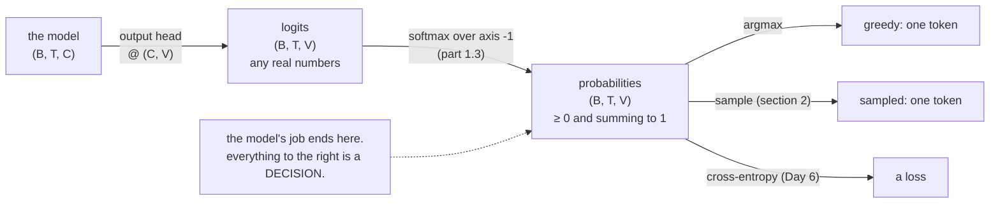

# 1.1 — A distribution over a vocabulary

## One-line answer

A language model does not output a word — it outputs one non-negative number per entry in its
vocabulary, all summing to one, and everything that happens afterwards is a decision about how to turn
that list into a choice.

---

## The story

The weather app on your phone does not say "it will rain tomorrow".

It says: rain 60%, cloud 30%, sun 10%. Three numbers, one for each thing that could happen, none of
them negative, and they add up to a hundred.

That is not the app being vague or covering itself. It is strictly more than "rain". You can always
get "rain" back out of it whenever you want, by picking the biggest number. You cannot go the other
way. If somebody just tells you "rain", you have no idea whether the app was almost certain or barely
leaning.

And different people use it in completely different ways. A farmer deciding whether to cut the crop
today wants the single most likely answer. A shop deciding how many umbrellas to put out front wants
the whole list. A family deciding whether to book a tent for a wedding wants to know whether that 10%
sun is really 10% or really 2%.

The forecast is the list. Everything anybody does with it afterwards is a separate decision — and
today is about keeping those two things apart.
---

## The idea in plain language

A **vocabulary** is the fixed, finite list of symbols a model can emit. Its size is written `V`. On
Day 12 you will build one; for now it is enough that it exists, is ordered, and never changes during a
run — so "token 4197" means exactly one thing.

A **probability distribution over the vocabulary** is a list of `V` numbers, one per entry, such that:

1. every number is **non-negative** — `p[i] ≥ 0`, and
2. they **sum to one** — `Σ p[i] = 1`.

That is the entire definition. Anything satisfying those two conditions is a distribution; anything
violating either is not, whatever it is called.

Two consequences worth having in words before any code:

**A model's output is a distribution, not a token.** Every language model in this curriculum, from the
bigram model on Day 25 to the finished thing on Day 161, has exactly this at its output: one number per
vocabulary entry. The model never chooses. Choosing is a separate step — Day 5's section 2, and Days
69–77 in earnest — and separating the two is what makes it possible to swap greedy decoding for
sampling for beam search without touching the model.

**The two conditions are what makes it usable.** Non-negativity means "probability" means something.
Summing to one means the numbers are comparable — that `p[i] = 0.3` means the same thing regardless of
`V`. And it means the whole list is one object rather than `V` independent claims, which is what lets
Day 6's cross-entropy be a single number.

A third term, because it appears throughout and is easy to misuse: the **support** of a distribution is
the set of entries with non-zero probability. A distribution can assign zero to most of the vocabulary
— and a model that assigns *exactly* zero to a token that later appears in the data produces an
infinite loss, which is Day 6's `log(0)` problem and the reason models are built so that exact zeros
cannot arise.

---

## Why Akshara needs it

- **Day 25** trains the first model, whose output layer produces `V` numbers per position. Everything
  about how those numbers are interpreted is set up today.
- **Day 6** defines cross-entropy — the loss the entire curriculum optimises — and it is a function of
  a distribution against a target. It has no meaning applied to anything that is not one.
- **Day 69–77** is the decoding phase: greedy, temperature, top-k, top-p, beam search. Every one of
  those is a different way of turning today's list into a token, and they are interchangeable precisely
  because the model's job stops at the list.
- **Day 39**'s output head has shape `(B, T, V)` — a distribution per position per batch item — and
  that `V` is the largest dimension in the model, which is why the output head is one of its two most
  expensive matmuls.

---

## The mechanism

A distribution, and the two conditions checked rather than assumed:

```python
import numpy as np

vocab = ["the", "cat", "sat", "on"]          # V = 4, ordered, fixed
p = np.array([0.5, 0.3, 0.15, 0.05])         # (V,)

print("V           :", len(vocab))
print("p           :", p)
print("non-negative:", bool((p >= 0).all()))
print("sums to one :", float(p.sum()))
print("most likely :", vocab[int(p.argmax())], "at", float(p.max()))
```

**Line by line:**
- `p` has one entry per vocabulary position, **in the same order**. The correspondence between index
  and symbol is the vocabulary's job and it is total: `p[2]` is `"sat"` and nothing else. Getting that
  correspondence wrong is Silent Failure #2's territory (plan §6) and Day 16's subject.
- `(p >= 0).all()` checks condition 1 across every entry at once. It returns a numpy boolean, wrapped
  in `bool()` so the print is unambiguous.
- `p.sum()` checks condition 2. It prints `1.0` here because these four numbers were chosen to add up
  exactly in binary — which, as part
  [1.5](1.5-the-probabilities-that-summed-to-almost-one.md) measures, is **not** what happens with real
  model outputs.
- `p.argmax()` returns the **index** of the largest entry, not the value. It is the whole of greedy
  decoding, and it is one function call — which is worth noticing, because it makes clear how little
  "choosing" the model does.
- On this machine (Intel Core i3-1115G4, CPython 3.12.10, numpy 2.5.2, 2026-08-26) it prints
  `V: 4`, `sums to one : 1.0`, `most likely : the at 0.5`.

What a distribution looks like at the shapes a real model uses:

```python
B, T, V = 2, 6, 50                            # batch, sequence position, vocabulary
logits = np.zeros((B, T, V))                  # (B, T, V) — one row per position
print("one distribution per (batch item, position):", B * T)
print("numbers in the output tensor            :", logits.size)
```

**Line by line:**
- `(B, T, V)` is the shape of every language model's output in this curriculum. Read it as: for each of
  `B` sequences, for each of `T` positions in that sequence, a list of `V` numbers.
- **The distribution lives along the last axis**, and that is a convention worth stating once because
  every softmax, every sum and every `argmax` from here on names `axis=-1`. Day 2 part
  [2.1](../../../day-002-tensors-shape-stride/parts/02-broadcasting-and-indexing/2.1-broadcasting-the-rule.md)
  is why writing `axis=-1` rather than `axis=2` matters: it stays correct when an axis is added.
- `B * T = 12` distributions in this toy example, and `logits.size = 600` numbers. At realistic sizes —
  a batch of 8, a sequence of 1024, a vocabulary of 32,000 — that is 262,144,000 numbers for one
  forward pass's output, which is why the output head dominates memory as well as compute.

The picture, once, because the two-step structure is the point:



**The check that a thing is a distribution**, which belongs at every boundary where one arrives:

```python
def assert_distribution(p: np.ndarray, axis: int = -1, atol: float = 1e-6) -> None:
    """Fail loudly if `p` is not a probability distribution along `axis`."""
    assert (p >= 0).all(), f"negative entries: min {p.min()}"
    total = p.sum(axis=axis)
    assert np.allclose(total, 1.0, atol=atol), (
        f"does not sum to 1 along axis {axis}: min {total.min()}, max {total.max()}"
    )
```

**Line by line:**
- `axis=-1` by default, matching the convention above, and a parameter so the same function works on a
  `(V,)`, a `(B, V)` or a `(B, T, V)`.
- `p.sum(axis=axis)` reduces **only** the vocabulary axis, leaving one total per distribution. Summing
  the whole tensor would give `B × T` and pass no useful check.
- `np.allclose(..., atol=1e-6)` rather than `== 1.0`. Part
  [1.5](1.5-the-probabilities-that-summed-to-almost-one.md) measures why: 1190 of 2000 real softmax
  outputs did not sum to exactly one on this machine. **Demanding exact equality here would be a test
  that fails on correct code**, which is Day 4 part
  [2.2](../../../day-004-backprop-and-gradcheck/parts/02-gradient-checking/2.2-the-relative-error-criterion.md)'s
  lesson arriving in a new place.
- Both messages print the offending values. `does not sum to 1 along axis -1: min 0.31, max 0.31` says
  "you summed the wrong axis" without anyone having to think.
- Put this at the boundary — where a distribution arrives from a model, a file or a library — and not
  inside a loop you wrote yourself.

---

## Shapes

| Tensor | Symbolic shape | Concrete here | What each axis means |
| --- | --- | --- | --- |
| `p` | `(V,)` | `(4,)` | one probability per vocabulary entry |
| `p.sum()` | `()` | `1.0` | must be 1 |
| `p.argmax()` | `()` | `0` | an **index** into the vocabulary, not a probability |
| `logits` | `(B, T, V)` | `(2, 6, 50)` | batch item · sequence position · vocabulary entry |
| `logits.sum(axis=-1)` | `(B, T)` | `(2, 6)` | one total per distribution — the axis to check |
| a real output head | `(B, T, V)` | `(8, 1024, 32000)` | 262,144,000 numbers for one forward pass |

**The distribution is always the last axis.** Every reduction in this day and in Days 6 and 69–77 uses
`axis=-1` for that reason.

---

## When it breaks

The loud one — summing the wrong axis, caught by the assertion:

```console
>>> p = np.full((2, 6, 50), 1 / 50)
>>> p.sum(axis=0).shape
(6, 50)
>>> assert_distribution(p, axis=0)
Traceback (most recent call last):
  File "<stdin>", line 1, in <module>
AssertionError: does not sum to 1 along axis 0: min 0.04, max 0.04
```

Each entry sums to `2 × (1/50) = 0.04` across the batch, which is not 1 and never will be. The message
names the axis and the value, which together are the whole diagnosis.

**The silent version, and it is the one that matters: something that is not a distribution being
treated as one.** The most common source is a tensor of **logits** — the model's raw output before the
softmax — used directly:

```console
>>> logits = np.array([2.0, 1.0, 0.1, -0.5])
>>> logits.argmax()
np.int64(0)
>>> softmax(logits).argmax()
np.int64(0)
```

`argmax` gives the same answer either way, because the softmax is monotonic — so greedy decoding on raw
logits *works*, and someone can go a long time without noticing that the numbers being passed around
are not probabilities. Then a threshold is applied ("only sample tokens above 0.05"), or the numbers
are averaged, or they are fed to something expecting a distribution, and the result is wrong with no
error anywhere. Part [1.2](1.2-logits-are-not-probabilities.md) is that failure in full.

The detection is the assertion above, applied at the boundary. It costs one line and it distinguishes
the two kinds of tensor that this day is entirely about keeping apart.

---

## In production

**What a research engineer writes instead of the teaching version.** They keep logits and probabilities
in separately-named variables and never let one be passed where the other is expected — `logits` and
`probs`, not `out` and `out2`. More than a naming convention, this is a type discipline: many of the
worst bugs in a decoding stack are one of these two arriving where the other was meant, and the
compiler cannot help.

They also **avoid materialising probabilities at all** where possible. Day 6 will show that
cross-entropy is computed directly from logits, never from probabilities, for numerical reasons; and
`argmax` needs no softmax either. In a training loop the `(B, T, V)` probability tensor is often never
built, which saves the largest allocation in the forward pass.

**What degrades at scale.** The vocabulary axis. At `V = 32,000` and a batch-times-sequence of 8192,
one probability tensor is 262 million numbers — over a gigabyte in `float32`. That is why the output
head and the loss are usually fused, why "vocabulary size" is a design decision with a memory price
(Day 17, TOK-20), and why the last axis is the one every optimisation in the decoding phase attacks.

**The failure that only shows with real data.** A vocabulary and a probability vector that disagree
about their ordering — the model's index 4197 meaning one token to the tokenizer and another to the
detokenizer. Every check in this document passes: the numbers are non-negative and sum to one. The
output is fluent-looking nonsense, or subtly wrong, and it is **Silent Failure #2** from the plan's §6.
The defence is a round-trip assertion at the boundary (Day 16), not anything about the distribution
itself.

**The review comment.** *"This function takes `p` — is that logits or probabilities? Name it, and
assert it at the top."*

**The interview question.** *"What does a language model actually output?"* The weak answer says "the
next word". The strong answer is a distribution over the whole vocabulary — `V` numbers per position —
and then, unprompted, that the model does no choosing at all: greedy, sampling, top-k and beam search
are all decisions made *after* the model, which is why they can be changed without retraining.

**Compute tier: T0.** Everything here is a four-element array on a laptop CPU. The T0 version proves the
**definition and the shape convention** exactly, and both transfer to any size. What it does not show
is the memory cost of a real `(B, T, V)` tensor, which is arithmetic rather than a measurement and is
worked in the *In production* section.

---

## Check yourself

Run this. It prints **one index, one sum, and one shape**, and the sum must be `1.0`:

```python
import numpy as np

vocab = ["the", "cat", "sat", "on"]
p = np.array([0.5, 0.3, 0.15, 0.05])

print("argmax token :", vocab[int(p.argmax())])
print("sums to      :", float(p.sum()))

B, T, V = 2, 6, 50
probs = np.full((B, T, V), 1 / V)
print("per-distribution totals shape:", probs.sum(axis=-1).shape)
print("summed the wrong axis instead:", probs.sum(axis=0).shape)
```

**Line by line:**
- The first two print `the` and `1.0`.
- The third prints `(2, 6)` — one total per distribution, which is what you want to assert against 1.
- The fourth prints `(6, 50)`, which is what summing the batch axis gives: a tensor of the wrong shape
  whose entries are all `0.04`. **Say out loud why `axis=-1` and not `axis=2`** before moving on.

**Say this out loud, without scrolling up:** state the two conditions that make a list of numbers a
distribution — and say what a language model outputs, and what it deliberately does not do.
