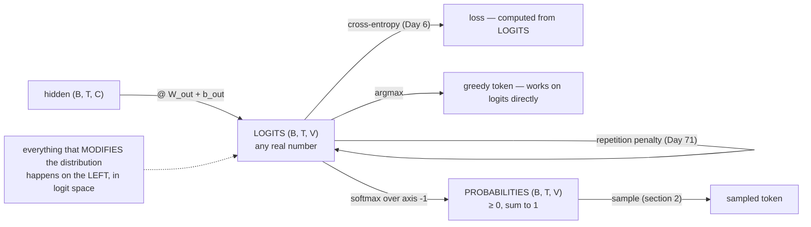

# 1.2 — Logits are not probabilities

## One-line answer

A model's output layer produces **logits** — arbitrary real numbers, positive or negative, with no
constraint at all — and the only thing they share with probabilities is their ordering, which is
exactly why treating one as the other survives so long undetected.

---

## The story

Twelve projects are entered in a school science fair, and the judges score each one.

The scores look like this: `+4`, `−1`, `+9`, `0`. They are not percentages and were never meant to be.
They are just scores. Higher is better, and the gaps between them mean something, but `+9` does not
mean ninety per cent of anything, and `−1` does not mean a negative chance of winning.

Then somebody wants to put "chance of winning" on the notice board, so parents can see how it is
going. You cannot print `−1` as a chance of winning. So there is a rule for turning any list of scores
into a list of chances that add up to 100, keeping the projects in the same order and keeping the
relative gaps between them.

Both lists rank the twelve projects identically. **The winner is the same project either way** — which
is exactly why nobody notices when the wrong list gets pinned to the board. It only comes out when
somebody tries to add two of the numbers together, or take an average of them, or read one of them out
as a percentage.
---

## The idea in plain language

Part [1.1](1.1-a-distribution-over-a-vocabulary.md) defined a distribution: non-negative, summing to
one. A model's final layer produces nothing of the kind.

The output head is a linear layer (Day 4 part
[1.1](../../../day-004-backprop-and-gradcheck/parts/01-the-linear-layer/1.1-a-layer-is-a-matmul-plus-a-vector.md)):
`logits = hidden @ W_out + b_out`. A matmul of arbitrary reals with arbitrary reals plus an arbitrary
bias. Its output is **any real number**, and typically ranges over positive and negative values of
order one to ten.

The word: a **logit** is an unconstrained real-valued score, one per vocabulary entry. Higher means
"more likely" and that is the *only* guaranteed interpretation. Specifically:

| Property | Logits | Probabilities |
| --- | --- | --- |
| Non-negative | **no** | yes |
| Sum to 1 | **no** | yes |
| Order matches likelihood | yes | yes |
| Differences meaningful | yes — a difference of `d` is a fixed likelihood ratio | not directly |
| Adding a constant to all | **changes nothing** | breaks the distribution |
| Can be averaged | not meaningfully | not meaningfully either (a different trap) |

The row that matters most is the second-to-last, and it is the deepest property of logits: **adding the
same constant to every logit produces exactly the same distribution.** Logits are only defined up to a
shift. There is no such thing as "the" logit for a token — only differences between logits mean
anything. Part [1.3](1.3-softmax-the-map-to-the-simplex.md) proves it and part
[1.5](1.5-the-probabilities-that-summed-to-almost-one.md) uses it, and it is the reason a numerically
stable softmax is allowed to subtract the maximum.

And the property that hides the confusion: the conversion is **monotonic**. The largest logit becomes
the largest probability, always. So `argmax` gives the same token either way, and greedy decoding on
raw logits is *correct*. Everything else is not.

---

## Why Akshara needs it

- **Day 6** computes cross-entropy **from logits, never from probabilities**, for numerical reasons
  measured on Day 7. A loss function whose input is misdocumented is a loss function that will
  eventually be fed the wrong thing.
- **Day 69–77** is the decoding phase, and every technique there — temperature, top-k, top-p, repetition
  penalties — is defined as an operation on **logits**, applied before the softmax. Applying a
  temperature to probabilities is a different and wrong operation, and part
  [1.4](1.4-temperature-is-a-scale-on-the-logits.md) measures the difference.
- **Day 39**'s model returns logits, deliberately, and does not soften them. That is the standard
  interface and it exists because of the two points above.
- **Day 94**'s DPO and every preference method compare **log-probabilities** between two models, which
  are logits' close relatives — and confusing the three is the most common implementation error in that
  literature.

---

## The mechanism

What an output head actually produces:

```python
import numpy as np

rng = np.random.default_rng(1337)
B, T, C, V = 2, 3, 8, 5
hidden = rng.standard_normal((B, T, C))        # (B, T, C)  the model's last hidden state
W_out = rng.standard_normal((C, V))            # (C, V)     the output head
b_out = rng.standard_normal(V)                 # (V,)

logits = hidden @ W_out + b_out                # (B, T, V)
print("logits[0, 0]      :", np.round(logits[0, 0], 4))
print("any negative?     :", bool((logits < 0).any()))
print("sum along axis -1 :", np.round(logits.sum(axis=-1)[0], 4))
print("min, max          :", round(float(logits.min()), 4), round(float(logits.max()), 4))
```

**Line by line:**
- This is Day 4's linear layer with the output channel count set to `V`. **There is nothing else in an
  output head** — no activation, no normalisation, no clamping.
- `(logits < 0).any()` prints `True`. Negative logits are not an error condition; they are the normal
  case for a token the model considers unlikely.
- `logits.sum(axis=-1)` prints numbers that are not 1 and have no reason to be. On this machine
  (Intel Core i3-1115G4, CPython 3.12.10, numpy 2.5.2, seed 1337, 2026-08-26) the three totals for
  batch item 0 are `[-23.6321, 3.9571, -9.6887]` — two of the three negative.
- The first row of logits is `[-11.0123, -7.8829, 0.7855, -2.9197, -2.6028]`, and across the whole
  tensor the min and max are `-11.0123` and `9.3813`. **This is what logits look like**: a handful to a
  few tens of units either side of zero, entirely unconstrained.

**The shift invariance, which is the property to carry forward:**

```python
def softmax(z, axis=-1):
    e = np.exp(z - z.max(axis=axis, keepdims=True))
    return e / e.sum(axis=axis, keepdims=True)


z = np.array([2.0, 1.0, 0.1, -0.5])            # (V,)
for shift in (0.0, 10.0, 100.0):
    print(f"  shift {shift:6.1f} -> {np.round(softmax(z + shift), 8)}")
print("  max |difference| between shift 0 and shift 100:",
      float(np.abs(softmax(z) - softmax(z + 100.0)).max()))
```

**Line by line:**
- `keepdims=True` on both the max and the sum, so the broadcast back works — Day 2 part
  [2.1](../../../day-002-tensors-shape-stride/parts/02-broadcasting-and-indexing/2.1-broadcasting-the-rule.md)
  measured what happens without it, and on a square tensor it does not even raise.
- Measured on this machine, 2026-08-26, all three shifts give
  `[0.62518245 0.22999177 0.09350768 0.0513181]`, and the maximum difference between shift 0 and shift
  100 is `4.857e-16` — a few units in the last place, not a real difference.
- **Adding 100 to every logit changed nothing.** So the absolute value of a logit carries no
  information; only differences do. That is why part
  [1.3](1.3-softmax-the-map-to-the-simplex.md)'s stable implementation is allowed to subtract the
  maximum — it is not an approximation, it is an identity.

**And the monotonicity that hides the confusion:**

```python
logits_1d = np.array([2.0, 1.0, 0.1, -0.5])    # (V,)
probs = softmax(logits_1d)                      # (V,)
print("logits argmax :", int(logits_1d.argmax()))
print("probs  argmax :", int(probs.argmax()))
print("orders equal  :", bool((np.argsort(logits_1d) == np.argsort(probs)).all()))
```

**Line by line:**
- Both `argmax` calls print `0`, and the full sort orders are identical.
- `np.argsort` returns the indices that would sort the array, so comparing two argsorts compares the
  *rankings* rather than the values. It prints `True`.
- **Greedy decoding therefore works on raw logits, correctly, forever.** That is genuinely useful — it
  saves a softmax per token in the decode loop — and it is exactly why a codebase can pass logits
  around as though they were probabilities for months without a single wrong output.

Where the two live, and what may be done to each:



---

## Shapes

| Tensor | Symbolic shape | Concrete here | What each axis means |
| --- | --- | --- | --- |
| `hidden` | `(B, T, C)` | `(2, 3, 8)` | batch item · position · channel |
| `W_out` | `(C, V)` | `(8, 5)` | channel · vocabulary entry |
| `b_out` | `(V,)` | `(5,)` | one bias per vocabulary entry |
| `logits` | `(B, T, V)` | `(2, 3, 5)` | **unconstrained reals**, min `-4.7259`, max `4.9002` here |
| `logits.sum(axis=-1)` | `(B, T)` | `(2, 3)` | not 1, and has no reason to be |
| `softmax(logits)` | `(B, T, V)` | `(2, 3, 5)` | non-negative, summing to 1 along the last axis |
| `logits.argmax(-1)` | `(B, T)` | `(2, 3)` | the greedy token per position — **same as `probs.argmax(-1)`** |

The last row is the whole hazard: two tensors of the same shape, one a distribution and one not, giving
the same answer to the one question people ask most often.

---

## When it breaks

The loud one, when logits reach something that genuinely requires a distribution:

```console
>>> logits = np.array([2.0, 1.0, 0.1, -0.5])
>>> rng.choice(4, p=logits)
Traceback (most recent call last):
  File "<stdin>", line 1, in <module>
ValueError: Probabilities are not non-negative
```

Verbatim on this machine, 2026-08-26. The sampler checks, and the negative logit is caught immediately.
This is the good case, and it is worth noticing that it was caught by a **library that validates its
input** rather than by anything in your code.

**The silent versions, and there are three, in increasing order of how long they survive.**

*One: greedy decoding.* Works. Forever. `argmax` on logits and `argmax` on probabilities give the same
token, measured above. A generation loop built entirely on greedy decoding will never reveal the
confusion.

*Two: a threshold.* Someone adds "only consider tokens above 0.05", with
`logits = [2.0, 1.0, 0.1, -0.5]`:

```console
>>> (softmax(logits) > 0.05).sum()
np.int64(4)
>>> (logits > 0.05).sum()
np.int64(3)
```

Measured on this machine, 2026-08-26. Applied to probabilities, four tokens qualify; applied to logits,
three do — and *which* three has nothing to do with the intended meaning, because `0.05` in logit space
is not a probability of 5%, it is a score marginally above zero. No error, a plausible number of
tokens, and a filter that does something arbitrary.

*Three: averaging.* Averaging the logits of two models and averaging their probabilities give
**different distributions** — the first is a geometric mean of the probabilities, the second an
arithmetic mean. Both are defensible ensembling methods and they are not the same method. Doing one
while believing you did the other produces a system that works, differently from the design.

The check is a naming discipline plus one assertion:

```python
def sample_from(probs: np.ndarray) -> int:
    assert (probs >= 0).all(), f"expected probabilities, got negatives (min {probs.min():.4f}) — logits?"
    assert np.isclose(probs.sum(), 1.0, atol=1e-6), f"expected probabilities, sum is {probs.sum():.6f}"
    ...
```

**Line by line:**
- The **parameter is named `probs`**, and the assertions enforce the name. A function called with the
  wrong kind of tensor fails at its first line rather than three functions later.
- The messages say what was expected and guess at the cause — `— logits?` turns a puzzle into a fix.
- `atol=1e-6` and not exact equality, for the reason part
  [1.5](1.5-the-probabilities-that-summed-to-almost-one.md) measures.
- The complementary discipline is that a function taking logits says so in its name and its docstring
  and does **not** assert non-negativity, because negative logits are correct.

---

## In production

**What a research engineer writes instead of the teaching version.** They return logits from the model
and keep them logits for as long as possible. Everything that reshapes the distribution — temperature,
top-k, top-p, repetition and presence penalties, logit biases, banned tokens — is implemented as an
operation on logits, applied in a documented order, before a single softmax at the end. That is not
only convention: masking a token by setting its logit to `-inf` gives it exactly zero probability after
the softmax, whereas zeroing a probability requires a renormalisation that someone will forget.

The other half is that the loss never sees probabilities either. Day 6 shows that cross-entropy from
logits is both more accurate and cheaper than softmax-then-log, so a well-built training step
materialises the probability tensor **never** — which, at `(8, 1024, 32000)`, is a gigabyte not
allocated.

**What degrades at scale.** Nothing about the concept — but the *cost* of confusing them grows. An
unnecessary softmax on a `(B, T, V)` tensor is a full pass over the largest tensor in the model, and in
a decode loop it happens once per generated token. Knowing that greedy decoding needs no softmax at all
is a real optimisation, and it is available only to someone who knows the two are order-equivalent.

**The failure that only shows with real data.** Logit biasing at serving time. A system that boosts or
bans specific tokens does so by adding to their logits, and the size of a sensible bias depends on the
*scale* of the logits — which varies between models, and drifts during training. A bias of `+2` is
decisive for a model whose logits span `±5` (measured range here: `-11.01` to `+9.38`) and negligible
for one whose logits span `±50`. The same configuration produces different behaviour on a different
checkpoint, with nothing in the code changed. The defence is to express the intervention in probability
terms and convert, or to measure the logit scale of the actual model and say so.

**The review comment.** *"This is called `probs` but it comes straight from the model — that's logits.
Rename it, or add the softmax."*

**The interview question.** *"What's the difference between logits and probabilities, and why do
frameworks' loss functions take logits?"* The strong answer names the constraints (unconstrained versus
non-negative-and-summing-to-one), notes that they are order-equivalent so `argmax` cannot tell them
apart, and then gives the reason for the interface: computing the loss from logits avoids materialising
the probabilities and is numerically stable, which is Day 6 and Day 7. Adding that logits are only
defined up to an additive constant is the detail that shows real familiarity.

**Compute tier: T0.** Every measurement here is a laptop CPU measurement at `V = 5`. The shift
invariance, the monotonicity and the unconstrained range are **structural** properties that hold at any
scale and on any hardware. What T0 does not show is the memory saved by never materialising
probabilities, which is arithmetic on the shapes and arrives on Day 39 and Day 66.

---

## Check yourself

Run this. It prints **one `True`, one sum that is not 1, and two counts that disagree**:

```python
import numpy as np


def softmax(z, axis=-1):
    e = np.exp(z - z.max(axis=axis, keepdims=True))
    return e / e.sum(axis=axis, keepdims=True)


logits = np.array([2.0, 1.0, 0.1, -0.5])
probs = softmax(logits)

print("argmax agrees        :", int(logits.argmax()) == int(probs.argmax()))
print("logits sum           :", float(logits.sum()))
print("probs  sum           :", float(probs.sum()))
print("above 0.05 as probs  :", int((probs > 0.05).sum()))
print("above 0.05 as logits :", int((logits > 0.05).sum()))
print("shift by 100 changes :", float(np.abs(softmax(logits) - softmax(logits + 100.0)).max()))
```

**Line by line:**
- `argmax agrees` prints `True`, which is why this confusion survives.
- The two sums print `2.6` and `1.0`. **Only one of those tensors is a distribution.**
- The two counts print `4` and `3` on this machine, 2026-08-26. The same threshold, applied to the two
  tensors, keeps different sets — and neither error nor warning appears.
- The last line prints `4.857e-16`: adding 100 to every logit changed nothing. Say out loud what that
  implies about the meaning of a single logit value.

**Say this out loud, without scrolling up:** name the two constraints logits do **not** satisfy and the
one property they share with probabilities — and say why adding a constant to every logit is harmless.
